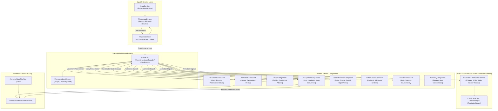
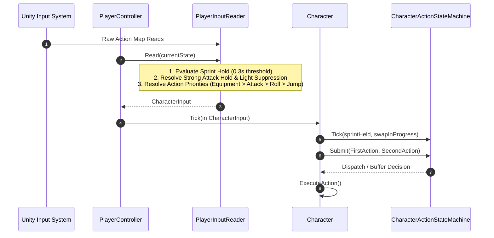
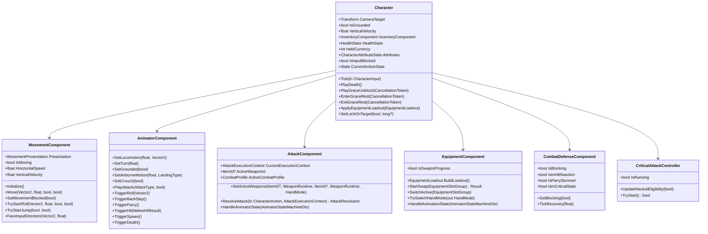

# Character System Architecture & Runtime Guide

## 1. Overview & Core Architectural Philosophy

The **Character System** in the SoulsLikeTemplate represents the player entity aggregate, its motor locomotion, combat action lifecycle, equipment management, and animation feedback loops. 

Following comprehensive refactoring, the architecture adheres to a **Pragmatic Aggregate Facade + Lean Pure C# Runtime** pattern. It eliminates redundant sink interfaces, excessive generic command boilerplate, and disparate boolean flags in favor of high internal cohesion, clear single-source-of-truth capability gating, and a deterministic action state machine.



### Core Architectural Pillars

1. **Explicit Aggregate Facade (`Character.cs`)**: `Character` is the central coordination point and external API for the player entity. It coordinates use cases across specialized components without routing through unneeded one-line sink interfaces.
2. **Lean Pure C# Runtime Assembly (`SoulsLike.Character.Runtime.asmdef`)**: Volatile per-frame action sequencing, command buffering, and queue windows are isolated into 4 concise, pure C# types (`CharacterAction`, `CharacterInput`, `CharacterActionStateMachine`, `CharacterActionId`).
3. **Reason-Aware Capability Gating (`MovementLockReason`)**: Control and movement blocking is unified under a single bitmask enum. Independent reasons (Spawn, Animation, Parry, Critical, Manual) prevent overlapping lifecycles from prematurely restoring input or movement.
4. **Deterministic Action State Machine**: 5 discrete states (`Neutral`, `Attack`, `Roll`, `EquipmentSwap`, `Critical`), a 1-slot 1.0s buffer, animation-driven queue windows, roll-to-sprint interrupts, and chained attack exit suppression.
5. **Decoupled Input Adapter (`PlayerInputReader`)**: Translates raw Unity Input System presses and camera yaw into high-level semantic structs (`CharacterInput`), isolating entity logic from hardware input devices.
6. **Snapshot Presentation Flow**: `MovementComponent` produces an immutable `MovementPresentation` struct snapshot each frame, which `Character` pushes directly to `AnimatorComponent` and `CharacterAudioComponent`.
7. **Animation Loopback via DTO Routing**: `AnimatorStateMachine` behaviours emit normalized `AnimatorStateMachineDto` events, which `Character.OnAnimationStateChanged` routes directly to the specific subsystems that own those animation lifecycles.

---

## 2. Entity Identity & Lifetime Management

### 2.1 Entity Boundary & Locator Registration

The player entity is composed of two coordinated layers:
- **`Character` (MonoBehaviour)**: The authoritative gameplay aggregate owning components, physics, combat orchestration, and public facade state.
- **`Entity` / `ViewEntity` (`IEntity`)**: The base entity system identity holding a unique generated 64-bit ID, `EntityType.Player`, and registered with `IEntityLocator`.

### 2.2 Factory & Lifetime Scope (`CharacterFactory.cs`)

When `CharacterFactory.CreateCharacter` is called:
1. Loads the `Character` prefab via Addressables (`IAssetService.LoadPrefab`).
2. Instantiates the prefab and applies the initial spawn position.
3. Retrieves or binds required components: `Character`, `ViewEntity`, `TargetLockNode`, `PlayerMeleeCombatRelay`, `CriticalAttackController`, `AnimatorComponent`, `AttackComponent`, `MovementComponent`, `EquipmentComponent`, `EquipmentPresentation`, `InventoryComponent`, `HealthComponent`, `CombatDefenseComponent`, `CharacterAudioComponent`.
4. Creates a child `LifetimeScope` beneath `RootScope` registering:
   - Entity system (`RegisterEntitySystemExt`, commands: `InteractionCommand`, `GroundItemCollectionCommand`, `ApplyDamageCommand`, `ResolveMeleeHitCommand`, `TargetingCommand`).
   - Domain models, components, ScriptableObjects, and database catalogs (`ItemCatalog`, `WeaponDatabase`, `ShieldDatabase`, `ConsumableDatabase`).
   - UI Controllers (`PlayerHudUiController`, `LockOnUiController`, `InventoryUiController`, `EquipmentUiController`, `SystemUiController`, `PauseNavigationUiController`, `InteractionUiController`).
   - Player orchestration (`PlayerInputReader`, `InteractionController`, `PlayerController`).
5. Reparents the character instance under the child `LifetimeScope` transform.
6. Disposing `CharacterFactory` disposes the entire player child scope cleanly.

---

## 3. Input Pipeline & Semantic Control Translation

Hardware input reads and gesture evaluations are completely decoupled from `Character.cs`.



### 3.1 PlayerInputReader (`Assets/Scripts/Entities/Character/Input/PlayerInputReader.cs`)

`PlayerInputReader` encapsulates all gesture timing and input prioritization:
- **Sprint/Roll Gesture**: 
  - Tracks hold duration with a `0.3s` threshold (`SPRINT_HOLD_THRESHOLD`).
  - Hold $\ge 0.3\text{s}$ with movement input $\rightarrow$ `SprintHeld = true`.
  - Release before $0.3\text{s}$ $\rightarrow$ triggers `Roll` action on release.
- **Heavy Attack Gesture**:
  - Pressing strong attack sets `_suppressLightUntilRelease = true`.
  - Prevents accidental light attack execution during heavy attack presses.
- **Action Prioritization Order**:
  1. *Equipment Slot Switches*: `SwitchRightWeapon`, `SwitchLeftWeapon`, `SwitchQuickItem`, `UseQuickItem`.
  2. *Hand Mode Toggle*: `TwoHanded` (can be submitted as a companion second action in the same frame as an equipment switch).
  3. *Heavy Attack*: If strong attack pressed and not currently rolling.
  4. *Special Ability*: If special ability pressed and not rolling.
  5. *Light Attack*: If light attack pressed and not suppressed.
  6. *Guard Press*: Dispatched as Left-Hand Light Attack.
  7. *Roll / Backstep*: Dispatched on sprint button release without hold qualification.
  8. *Jump*: Dispatched on jump press.

### 3.2 CharacterInput & CharacterAction Structs

```csharp
public readonly struct CharacterInput
{
    public Vector2 MoveInput { get; }
    public float CameraYaw { get; }
    public bool SprintHeld { get; }
    public bool CrouchHeld { get; }
    public bool GuardHeld { get; }
    public bool StrongAttackHeld { get; }
    public CharacterAction? FirstAction { get; }
    public CharacterAction? SecondAction { get; }
}

public readonly struct CharacterAction
{
    public enum Kind { Attack, Roll, Jump, Equipment }
    public enum AttackIntent { Light, Heavy, Special }
    public enum EquipmentKind { SwitchRightWeapon, SwitchLeftWeapon, SwitchQuickItem, UseQuickItem, ToggleHandMode }
    public enum Result { Executed, TemporarilyBlocked, Invalid }
    public enum State { Neutral, Attack, Roll, EquipmentSwap, Critical }

    public Kind ActionKind { get; }
    public AttackIntent Intent { get; }
    public EquipmentKind EquipmentAction { get; }
    public bool IsLeftHand { get; }
    public bool IsSprinting { get; }
    public Vector2 MoveInput { get; }
    public float CameraYaw { get; }
    public bool CanBuffer => ActionKind != Kind.Equipment;
}
```

---

## 4. Action State Machine & Action Lifecycle

The `CharacterActionStateMachine` (`Assets/Scripts/Entities/Character/Runtime/CharacterActionStateMachine.cs`) governs action admission, buffering, queue windows, and chaining.

### 4.1 State Hierarchy & Transitions

| State | Allowed Inputs | Queue Window Behavior | Exit / Transition |
|---|---|---|---|
| **`Neutral`** | All actions admitted immediately | N/A (Buffer pruned on timeout) | Transitions to `Attack`, `Roll`, `EquipmentSwap`, or `Critical` on execution |
| **`Attack`** | Non-equipment actions only when Queue Window is open; otherwise buffered | Opens at `QueueCheck` SMB signal; closes on `Enter` | Exits to `Neutral` on `Exit` SMB signal (unless chained) |
| **`Roll`** | Non-equipment actions only when Queue Window is open; otherwise buffered | Opens at `QueueCheck` SMB signal | Exits to `Neutral` on `Exit` SMB signal or early sprint interrupt |
| **`EquipmentSwap`** | One companion equipment action allowed while `_acceptEquipmentCompanion` is true | Managed by `EquipmentComponent` swap phase | Exits to `Neutral` when `equipmentActionInProgress == false` |
| **`Critical`** | All inputs blocked | N/A | Exits to `Neutral` upon `CriticalAttackController.OnCompleted` |

### 4.2 Buffering & Execution Semantics

- **Capacity**: Exactly 1 slot (`_bufferedAction`).
- **Replacement**: Latest actionable input overwrites any previously buffered action.
- **Expiration**: Fixed 1.0 second duration (`BUFFER_DURATION_SECONDS`).
- **Pruning Rule**: Buffer expiration is only pruned while in `Neutral`. A command buffered during an attack remains preserved to execute when the `QueueCheck` window opens, even if nominal duration elapsed during a long attack.
- **Queue Window Execution**: When an animation reaches `QueueCheck`, the state machine opens `_queueWindowOpen` and `Character` immediately attempts to execute the buffered action via `TryExecuteBufferedAction(now)`.
- **Chained Attack Stale-Exit Suppression**: If an attack is chained while another attack animation is active, `_ignoreNextActionExit = true`. When the first animation emits `Exit`, the state machine remains in `Attack` instead of prematurely popping to `Neutral`.
- **Roll-to-Sprint Interrupt**: During `Roll`, if `_sprintHeldDuringRoll` is true when the `QueueCheck` window opens, the state machine sets `_rollSprintInterruptRequested = true` and immediately enters `Neutral`. `Character` consumes this flag and calls `AnimatorComponent.InterruptRollForSprint()`.

---

## 5. Unified Capability Gating (`MovementLockReason`)

To eliminate conflicting boolean flags and prevent race conditions between overlapping blocking lifecycles, `Character.cs` manages movement and control locks using a single bitmask enum:

```csharp
[Flags]
private enum MovementLockReason
{
    None      = 0,
    Manual    = 1 << 0,  // External / script block
    Animation = 1 << 1,  // Root motion / animation block tag
    Spawn     = 1 << 2,  // Initial spawn sequence
    Parry     = 1 << 3,  // Active parry animation window
    Critical  = 1 << 4   // Synchronized critical attack sequence
}
```

### Derived Capability Rules

- **Movement Blocked**: `movementComponent.SetMovementBlocked(_movementLockReasons != MovementLockReason.None)`
- **Input Blocked**: `_actionStateMachine.IsInputBlocked` (synchronized with `Spawn`, `Parry`, `Critical`, or `Grace` transitions).
- **Guard Permission**:
  ```csharp
  private bool CanGuard() => 
      _movementLockReasons == MovementLockReason.None || 
      (_movementLockReasons == MovementLockReason.Animation && _actionStateMachine.CanGuardDuringAnimationBlock);
  ```
  Guard is permitted during animation movement block specifically when `_actionStateMachine.CurrentState == State.Attack && _queueWindowOpen`.

---

## 6. Component Responsibilities & Boundaries



### 6.1 `MovementComponent` (`Assets/Scripts/Components/Movement/MovementComponent.cs`)
- Owns CharacterController motion, ground probing (sphere cast + raycasts), slope alignment, gravity, vertical velocity, and jump/roll/backstep trajectory timers.
- Produces the immutable `MovementPresentation` struct containing: `Speed`, `BlendDirection`, `TurnAmount`, `VerticalVelocity`, `LandingType`, `Grounded`, `Crouching`.
- Exposes one-shot consumption checks: `TryConsumeJumpStarted()`, `TryConsumeRollStarted(out Vector2 dir)`, `TryConsumeBackStepStarted()`, `TryConsumeLanded()`.

### 6.2 `AnimatorComponent` (`Assets/Scripts/Components/Animator/AnimatorComponent.cs`)
- Owns Animator parameters, layer weights (`OneHandedLayer`, `TwoHandedLayer`, `UpperBodyActions`, `FullBodyActions`), smoothing logic, and runtime controller/profile assignment.
- Listens to `AnimatorStateMachineReceiver` and forwards all state machine DTO events to `Character.OnAnimationStateChanged`.

### 6.3 `AttackComponent` (`Assets/Scripts/Components/Attack/AttackComponent.cs`)
- Resolves contextual attacks based on movement and combo state: Light Combo (alternates `LightAttack1` / `LightAttack2`), Heavy Attack, Charged Heavy Attack, Roll Attack, Backstep Attack, Run Attack, Special Attack, and Left-Hand Attack.
- Tracks active weapon IDs, `WeaponRuntime` instances, and combat profile data.

### 6.4 `EquipmentComponent` (`Assets/Scripts/Components/Equipment/EquipmentComponent.cs`)
- Owns equipment slots (Right/Left Armaments, Quick Items, Talismans, Armor) and active slot indexing.
- Direct weapon swap sequencing: `StartSwap` triggers `SwapOut` animation $\rightarrow$ hides current weapon visual on progress $\rightarrow$ advances slot $\rightarrow$ triggers `SwapIn` animation $\rightarrow$ shows new weapon visual $\rightarrow$ completes swap.
- Builds immutable `EquipmentLoadout` snapshots.

### 6.5 `CombatDefenseComponent` & `CriticalAttackController` (`Assets/Scripts/Entities/Combat/`)
- **`CombatDefenseComponent`**: Owns poise, stance, guard angle calculations, guard break stun duration, parry window timing, hyper armor bonuses, and hit reaction states.
- **`CriticalAttackController`**: Evaluates backstab and riposte eligibility based on target distance, height difference, and rear/front angle alignment; executes synchronized victim/attacker animations and applies direct damage.

---

## 7. Frame Execution & Update Order

Each frame follows a strict execution pipeline in `Character.Tick(in CharacterInput input)`:

```text
Character.Tick()
├── 1. Set Strong Attack Held state on AttackComponent; reset charged speed if released
├── 2. Action State Machine Tick:
│      ├── Sample Sprint during Roll for early interrupt
│      └── Advance / complete EquipmentSwap state if swap finished
├── 3. Update CriticalAttackController neutral eligibility
├── 4. State Machine Action Submission:
│      ├── Submit(input.FirstAction)
│      └── Submit(input.SecondAction)
├── 5. Buffer Maintenance:
│      ├── Prune expired buffer if in Neutral
│      ├── TryExecuteBufferedAction() if window open
│      └── ApplyActionStateMachineRequests() (e.g. Roll-to-Sprint Interrupt)
├── 6. Guard & Block Evaluation:
│      ├── Classify Shield Block vs Weapon Block from EquipmentLoadout & ItemCatalog
│      └── Update AnimatorComponent & CombatDefenseComponent blocking state
├── 7. Motor & Physics Execution:
│      ├── Calculate Combat Sprint stamina drain & threshold validation
│      ├── Set MovementComponent movement blocked flag from _movementLockReasons
│      ├── MovementComponent.Move(moveInput, cameraYaw, sprintActive, crouchHeld)
│      └── Consume combat sprint stamina if moving
├── 8. Audio & Recovery:
│      ├── CharacterAudioComponent.Tick(isMoving, isSprinting)
│      ├── CombatDefenseComponent.TickRecovery(deltaTime)
│      └── HealthComponent.TickStaminaRecovery(deltaTime, isBlocking)
└── 9. ApplyMovementPresentation():
       └── Read MovementComponent.Presentation and push values to AnimatorComponent
```

---

## 8. Animation Feedback & Routing Matrix

`Character.OnAnimationStateChanged(AnimatorStateMachineDto state)` dispatches incoming animation callbacks to exact subsystem owners:

| Animator State Machine Name | Signal State | Target Owner / Action |
|---|---|---|
| `LightAttack`, `HeavyAttack`, `RollAttack`, `RunAttack`, `BackStepAttack`, `SpecialAttack`, `Parry` | `Enter` / `QueueCheck` / `Exit` | `AttackComponent.HandleAnimatorState`<br/>`CharacterActionStateMachine` (enters Attack, opens queue, exits to Neutral) |
| `Roll`, `BackStep` | `Enter` / `QueueCheck` / `Exit` | `CharacterActionStateMachine` (enters Roll, opens queue, triggers sprint interrupt or exits) |
| `EquipmentSwapOut`, `EquipmentSwapIn` | `Enter` / `Progress` / `Exit` | `EquipmentComponent.HandleAnimationState`<br/>`CharacterActionStateMachine` |
| `Spawn` | `Enter` / `Exit` | Sets/Clears `MovementLockReason.Spawn` and State Machine input block |
| `Death` | `Exit` | Clears `_isDeathAnimationPlaying`, fires `OnDeathAnimationCompleted` |
| `Parry` | `Enter` / `Exit` | Sets/Clears `MovementLockReason.Parry` and input block |
| `HitReaction` | `Enter` / `Exit` | `CombatDefenseComponent.SetHitReaction(true / false)` |
| `ParryStun` | `Enter` / `Exit` | `CombatDefenseComponent.SetParryStunned(true / false)` |
| `GraceUnblock`, `GraceRestStart`, `GraceRestEnd` | `Enter` / `Exit` | `Character.HandleGraceAnimationState` (advances `GracePhase` and resolves `UniTaskCompletionSource`) |

---

## 9. Lifecycle Systems: Spawn, Death, Grace

### 9.1 Spawn
- `Character.Initialize()` sets `SetInputBlocked(true)` (locking `MovementLockReason.Spawn`) and triggers `Spawn` animation.
- When `StateMachineName.Spawn` exits, `SetInputBlocked(false)` is invoked, enabling player control.

### 9.2 Death & Respawn
- `PlayerController` observes `HealthModel.OnDied` $\rightarrow$ calls `Character.PlayDeath()`.
- `PlayDeath()` cancels any active equipment swap, marks `_isDeathAnimationPlaying = true`, locks input, and triggers `Death` animation.
- When `StateMachineName.Death` exits, `Character` raises `OnDeathAnimationCompleted`.
- `PlayerController` receives `OnDeathAnimationCompleted` $\rightarrow$ calls `_coreGameOrchestrator.RespawnAtLastGrace().Forget()`.
- After scene/fade transitions, `CoreGameOrchestrator` calls `Character.SetPosition()` and `Character.CompleteDeathAnimation()`.

### 9.3 Grace Rest Transitions
Grace transitions are managed asynchronously using `UniTaskCompletionSource<bool>` and `GracePhase` (`None`, `Unblock`, `RestStart`, `RestIdle`, `RestEnd`):
- **`PlayGraceUnblock(token)`**: Locks input, activates invulnerability, plays unblock animation, awaits animation completion.
- **`EnterGraceRest(token)`**: Locks input, activates invulnerability, plays sit down animation, awaits transition into `RestIdle`.
- **`ExitGraceRest(token)`**: Plays stand up animation, awaits completion, clears protection and returns to normal gameplay.

---

## 10. Rules of the Character System (Durable Invariants)

All future modifications, extensions, or agents working on the character codebase MUST adhere to these design rules:

1. **Maintain Single Facade Integrity**: Do not bypass `Character.cs` to mutate internal component state directly from outside the character scope. External systems (`PlayerController`, `CoreGameOrchestrator`, UI controllers) must communicate through `Character` or read-only domain models.
2. **Keep the Runtime Assembly Lean**: Do not introduce Unity scene types, `MonoBehaviour` references, or large interface hierachies into `SoulsLike.Character.Runtime`. Keep `CharacterAction`, `CharacterInput`, and `CharacterActionStateMachine` pure C# with zero external dependencies.
3. **Never Use Unreasoned Boolean Control Locks**: Always use `MovementLockReason` bit flags when locking movement. Never overwrite or clear movement locks with a plain boolean that could clobber an active spawn, parry, critical, or animation lock.
4. **Preserve One-Slot Action Buffer Semantics**: The buffer must remain 1-slot with latest-input replacement and 1.0s timeout. Expired buffer pruning must ONLY occur during `Neutral`.
5. **Honor Animation Queue Windows**: Actions submitted during an attack or roll must never execute immediately; they must buffer and execute when the `QueueCheck` SMB signal is received.
6. **Decouple Hardware Input from Gameplay Logic**: Never read `ProjectInputActions` or `UnityEngine.Input` inside `Character.cs` or any component. All hardware input must be parsed into `CharacterInput` via `PlayerInputReader`.
7. **Use Snapshot Presentation**: Motor and physics components must expose read-only presentation structs (`MovementPresentation`). `Character` is responsible for applying these snapshots to visual/audio sinks.
8. **No Global Event Buses for Gameplay Coordination**: Do not introduce global event aggregators or static events for character internal communication. Use explicit direct method calls, state machines, and scoped observer callbacks.
9. **Single Top-Level Type Per File**: Every C# class, struct, interface, or enum must be defined in its own file matching the type name exactly.
