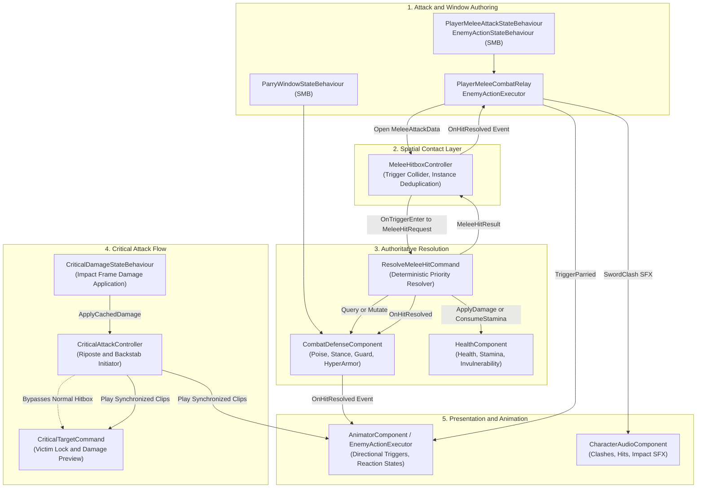
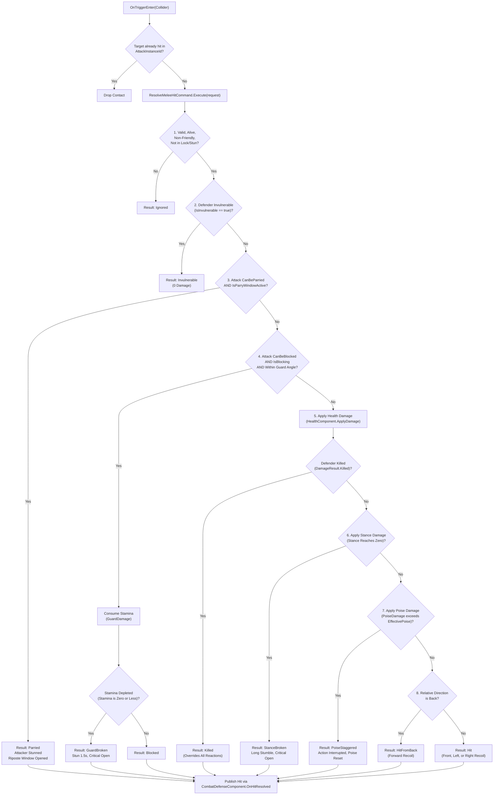
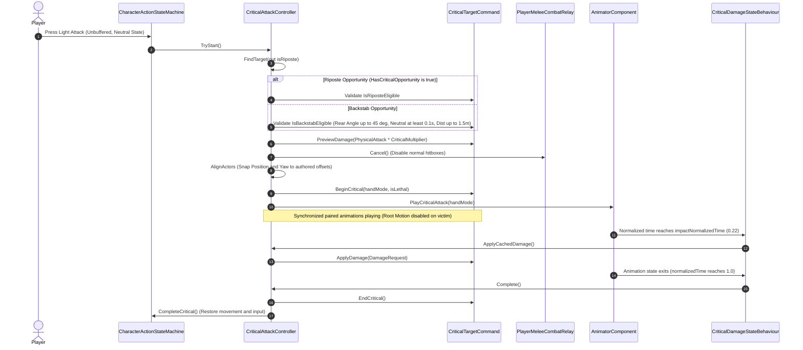

# Hitbox System Architecture & Combat Resolution Guide

## 1. Overview & Core Philosophy

The **Hitbox and Combat Resolution System** in the Souls-like template provides a deterministic, decoupled combat framework for both the player Character and AI Enemies.

The architecture is built upon a fundamental architectural separation:
> **Sword colliders only detect spatial contact.**  
> **Gameplay outcomes (damage, poise break, guard break, parry stun, stagger, criticals) are computed by a single authoritative resolution command.**



> [!TIP]
> **Obsidian Mermaid Display Tip**: To prevent diagrams from clipping or overflowing horizontally in Obsidian, add a CSS snippet (`.obsidian/snippets/mermaid.css`):
> ```css
> .mermaid svg {
>     max-width: 100%;
>     height: auto;
> }
> ```
> Enable it under **Settings > Appearance > CSS snippets**.

---

### Core Architectural Principles

1. **Strict Spatial vs. Resolution Segregation**: `MeleeHitboxController` owns physical contact detection and deduplication. It never calculates damage numbers, checks poise/stance values, inspects guard angles, or triggers animation clips.
2. **Symmetrical Resolution Engine**: Both Player attacking Enemy and Enemy attacking Player route through the exact same `ResolveMeleeHitCommand` execution pipeline.
3. **Single Hit Per Swing Invariant (`AttackInstanceId`)**: Each weapon swing increments an internal sequence ID. A target entity is resolved at most once per attack swing, regardless of how many hurtbox colliders intersect or physics frames overlap.
4. **Normalized Time Windowing via StateMachineBehaviours**: Active hitbox windows, parry frames, combo windows, and hyper armor windows are authored directly on animation states using normalized time (`0.0f - 1.0f`).
5. **No Automatic Backstab**: A normal melee strike from behind produces a directional `HitFromBack` reaction; it **never** automatically becomes a backstab. Critical attacks must be explicitly initiated through `CriticalAttackController`.
6. **Root Motion Exclusivity**: Combat and reaction animations use root motion for displacement. In-place animation clips (`inPlace`) are strictly excluded to avoid double-movement and sliding artifacts.

---

## 2. Core Concepts & Terminology

### 2.1 Combat Terms
- **Poise**: Controls short hit interruption. When incoming poise damage is less than current effective poise, the character absorbs the blow without interrupting their active action. When poise is depleted, a short directional stagger is triggered.
- **Hyper Armor**: Temporarily increases effective poise during designated attack animation frames. It allows heavy or charged attacks to power through incoming lighter hits without being staggered.
- **Stance**: A separate resilience meter that accumulates posture damage from heavy/charged attacks. When stance is broken (reaches zero), the character collapses into a long vulnerable state and exposes a critical **Riposte** opportunity.
- **Guard & Guard Break**: When blocking within the frontal guard angle, incoming damage is mitigated at the cost of stamina (`GuardDamage`). If stamina is depleted by a block, the guard is shattered (`GuardBroken`), inducing a 1.5-second stagger and opening a critical riposte window.
- **Parry**: An active defensive deflection maneuver. If timed so that an incoming parryable attack hits during the defender's active parry window, the incoming damage is nullified, the attacker's attack is cancelled, and the attacker enters a parry-stun state open to a riposte.

---

## 3. System Architecture & Component Taxonomy

### 3.1 Class & Component Map

| Component / Type | Namespace | File Location | Responsibility |
|---|---|---|---|
| `MeleeHitboxController` | `SoulsLike.Entities.Combat` | `Assets/Scripts/Entities/Combat/MeleeHitboxController.cs` | Trigger collider contact layer, debug visualizer, entity deduplication per attack instance. |
| `ResolveMeleeHitCommand` | `SoulsLike.Entities.BaseEntity.EntityCommands` | `Assets/Scripts/Entities/BaseEntity/EntityCommands/ResolveMeleeHitCommand.cs` | Target-owned command executing the 8-step hit resolution cascade and calculating relative hit direction. |
| `CombatDefenseComponent` | `SoulsLike.Entities.Combat` | `Assets/Scripts/Entities/Combat/CombatDefenseComponent.cs` | Actor-lifetime state holding poise, stance, guard angles, parry windows, hyper armor, and critical eligibility. |
| `PlayerMeleeCombatRelay` | `SoulsLike.Entities.Combat` | `Assets/Scripts/Entities/Combat/PlayerMeleeCombatRelay.cs` | Player combat facade resolving equipped weapon runtime, assembling `MeleeAttackData`, opening/closing hitboxes, and handling attacker recoil. |
| `PlayerMeleeAttackStateBehaviour` | `SoulsLike.Entities.Combat` | `Assets/Scripts/Entities/Combat/PlayerMeleeAttackStateBehaviour.cs` | Animator SMB driving player active hitbox windows, attack SFX timings, and hyper-armor poise bonuses. |
| `EnemyActionExecutor` | `SoulsLike.Entities.Enemy` | `Assets/Scripts/Entities/Enemy/EnemyActionExecutor.cs` | Enemy combat controller driving action phases (Windup, Active, Recovery), combos, hitbox lifecycle, and hit reactions. |
| `EnemyActionStateBehaviour` | `SoulsLike.Entities.Enemy` | `Assets/Scripts/Entities/Enemy/EnemyActionStateBehaviour.cs` | Animator SMB driving enemy active hitbox windows, combo queue windows, recovery timings, and hyper armor. |
| `ParryWindowStateBehaviour` | `SoulsLike.Entities.Combat` | `Assets/Scripts/Entities/Combat/ParryWindowStateBehaviour.cs` | Animator SMB setting `CombatDefenseComponent.IsParryWindowActive` during authored parry frames. |
| `CriticalAttackController` | `SoulsLike.Entities.Combat` | `Assets/Scripts/Entities/Combat/CriticalAttackController.cs` | Evaluates riposte and backstab criteria, aligns attacker/victim transforms, caches lethal preview, and orchestrates synchronized criticals. |
| `CriticalTargetCommand` | `SoulsLike.Entities.BaseEntity.EntityCommands` | `Assets/Scripts/Entities/BaseEntity/EntityCommands/CriticalTargetCommand.cs` | Victim entity command exposing critical eligibility, damage preview/apply, and victim animation binding. |
| `CriticalDamageStateBehaviour` | `SoulsLike.Entities.Combat` | `Assets/Scripts/Entities/Combat/CriticalDamageStateBehaviour.cs` | Animator SMB applying cached critical damage at the authored impact progress (`impactNormalizedTime = 0.22f`). |

---

## 4. Data Layer & Contracts

### 4.1 `MeleeAttackData` (Attack Payload)
Attack values belong to the specific attack action (e.g. Light vs. Heavy vs. Running), not solely to the weapon base stats. A charged attack from a straight sword has different poise damage, impact level, and parryability than a standard light slash.

```csharp
[Serializable]
public struct MeleeAttackData
{
    public CharacterActionId ActionId;    // Action identifier (LightAttack, HeavyAttack, etc.)
    public float HealthDamage;            // Base physical attack * action damage multiplier
    public float GuardDamage;             // Stamina damage inflicted on a blocking defender
    public float PoiseDamage;             // Poise damage toward short hit stagger
    public float StanceDamage;            // Stance damage toward large posture break
    public ImpactLevel ImpactLevel;       // Light, Medium, Heavy impact strength
    public bool CanBeBlocked;             // Whether defender guard can mitigate this attack
    public bool CanBeParried;             // Whether defender parry can deflect this attack
}
```

### 4.2 `MeleeHitRequest` (Contact Snapshot)
Constructed by `MeleeHitboxController.OnTriggerEnter()` and passed to `ResolveMeleeHitCommand.Execute()`:
```csharp
public readonly struct MeleeHitRequest
{
    public long AttackerEntityId { get; }
    public ItemId WeaponId { get; }
    public int AttackInstanceId { get; }
    public Vector3 AttackerPosition { get; }
    public Vector3 ContactPoint { get; }
    public int HitZone { get; }
    public MeleeAttackData Attack { get; }
}
```

### 4.3 `MeleeHitResult` & `MeleeHitResultType` (Outcome)
```csharp
public readonly struct MeleeHitResult
{
    public long AttackerEntityId { get; }
    public long DefenderEntityId { get; }
    public int AttackInstanceId { get; }
    public MeleeHitResultType Type { get; }
    public HitDirection Direction { get; }
    public ImpactLevel ImpactLevel { get; }
    public DamageResult Damage { get; }
}

public enum MeleeHitResultType
{
    Ignored,         // Invalid target, friendly, dead, or uninterruptible state
    Invulnerable,    // Defender is currently i-framed (rolling, resting)
    Parried,         // Defender parried the attack; attacker stunned, riposte open
    Blocked,         // Defender guarded; stamina consumed
    GuardBroken,     // Defender guarded with insufficient stamina; guard broken, critical open
    Hit,             // Normal front/side hit applied to health
    HitFromBack,     // Normal rear hit applied to health (non-critical)
    PoiseStaggered,  // Poise broken; action interrupted, directional stagger played
    StanceBroken,    // Stance broken (reaches 0); long collapse, riposte open
    Killed           // Lethal damage applied; death animation overrides all
}
```

---

## 5. Authoritative Hit Resolution Pipeline

When a weapon trigger enters an entity's collider, resolution proceeds through an explicit 8-tier priority cascade inside `ResolveMeleeHitCommand.Execute()`:



### 5.1 Resolution Cascade Breakdown

1. **Ignored / Invalid Filter**:
   - Rejects missing attacker, self-contact (`attacker.Id == target.Id`), friendly fire (`attacker.EntityType == target.EntityType`), dead actors (`!IsAlive`), or defender currently in critical lock (`IsInCriticalState`), active hit reaction (`IsInHitReaction`), or parry stun (`IsParryStunned`).
2. **Invulnerability Check**:
   - `IHealthComponent.IsInvulnerable` returns `MeleeHitResultType.Invulnerable` with zero health or stamina loss.
3. **Parry Evaluation**:
   - Condition: `request.Attack.CanBeParried == true` AND `_defense.IsParryWindowActive == true`.
   - Effect: Defender receives zero damage. Attacker's `CombatDefenseComponent` receives `SetParryStunned(true)` and `SetCriticalOpportunity(true)`. Attacker hitbox is closed immediately and attacker plays parried recoil.
4. **Guard Evaluation**:
   - Condition: `request.Attack.CanBeBlocked == true` AND `_defense.IsBlocking == true` AND `_defense.IsWithinGuardAngle(request.AttackerPosition) == true`.
   - Guard angle is checked as a cone centered on defender forward: `Vector3.Angle(transform.forward, toAttacker) <= guardAngle * 0.5f` (default 120° cone).
   - Effect: Consumes stamina equal to `GuardDamage`. If stamina reaches `<= 0`, triggers `BeginGuardBreak()` (1.5s stun, critical opportunity) and returns `GuardBroken`; otherwise returns `Blocked`.
5. **Health Damage & Kill Check**:
   - Forwards `DamageRequest` to `HealthComponent.ApplyDamage`. If `Killed == true`, returns `Killed`, suppressing stagger/stance reactions in favor of death.
6. **Stance Break Evaluation**:
   - Subtracts `StanceDamage` from `_currentStance`. If stance reaches zero, sets `HasCriticalOpportunity = true` and returns `StanceBroken`.
7. **Poise Stagger Evaluation**:
   - Effective Poise = `_currentPoise + (_isHyperArmorActive ? _hyperArmorPoiseBonus : 0f)`.
   - If `PoiseDamage >= EffectivePoise` (and `_canBeInterrupted == true`), returns `PoiseStaggered`, interrupts defender action, and resets poise to `maxPoise`.
   - If `PoiseDamage < EffectivePoise`, decreases `_currentPoise`, sets recovery delay timer (`poiseRecoveryDelaySeconds = 1.0s`), and continues without stagger.
8. **Normal Directional Hit**:
   - If relative direction is `HitDirection.Back`, returns `HitFromBack`; otherwise returns `Hit`.

---

## 6. Hit Direction & Spatial Calculation

Direction is calculated relative to the defender's local coordinate space in `ResolveMeleeHitCommand.ResolveDirection`:

```csharp
Vector3 localAttackerPosition = _defense.transform.InverseTransformPoint(attackerPosition);

if (Mathf.Abs(localAttackerPosition.z) >= Mathf.Abs(localAttackerPosition.x))
{
    return localAttackerPosition.z >= 0f ? HitDirection.Front : HitDirection.Back;
}
else
{
    return localAttackerPosition.x >= 0f ? HitDirection.Right : HitDirection.Left;
}
```

### 6.1 Directional Reaction & Movement Mapping

Reaction names describe **where the attack originated**, while root-motion displacement naturally moves the defender **opposite** to the strike:

| Attack Source | Reaction Trigger | Defender Relative Displacement |
|---|---|---|
| **Front** | `HitFront` | Backward |
| **Back** | `HitBack` | Forward |
| **Left** | `HitLeft` | Rightward |
| **Right** | `HitRight` | Leftward |

---

## 7. Combat Defense Meters & Recovery Rules

All defensive meters and runtime combat states are centralized in `CombatDefenseComponent`:

```
+-----------------------------------------------------------------------------+
|                          CombatDefenseComponent                             |
+-----------------------------------------------------------------------------+
| [Guard]      guardAngle: 120 deg | guardBreakDuration: 1.5s                 |
| [Poise]      maxPoise: 100       | recoveryRate: 25/s | delay: 1.0s         |
| [Stance]     maxStance: 100      | recoveryRate: 10/s                       |
| [Critical]   opportunityDuration: 2.0s                                      |
+-----------------------------------------------------------------------------+
```

### 7.1 Meter Lifecycle

- **Poise**:
  - Absorbs incoming `PoiseDamage`.
  - Taking poise damage starts the `poiseRecoveryDelayRemaining` countdown (1.0s).
  - When the delay expires, poise recovers linearly at `poiseRecoveryPerSecond` (25/s) up to `maxPoise`.
  - When broken, poise resets immediately to `maxPoise` after triggering stagger.
- **Hyper Armor**:
  - Activated during designated animation frames via `PlayerMeleeAttackStateBehaviour` or `EnemyActionStateBehaviour`.
  - Adds `_hyperArmorPoiseBonus` to effective poise and can set `_canBeInterrupted = false` for uninterruptible boss/heavy attacks.
- **Stance**:
  - Depleted by `StanceDamage`.
  - Does not suffer a delay timer; recovers linearly at `stanceRecoveryPerSecond` (10/s) when not in critical opportunity.
  - Reaching 0 triggers `StanceBroken` and starts the 2.0s `criticalOpportunityRemaining` window.
- **Critical Opportunity**:
  - Opened by: **Parry Success** (on attacker), **Guard Break** (on defender), or **Stance Break** (on defender).
  - Lasts for `criticalOpportunityDurationSeconds` (2.0s).
  - Automatically resets stance to `maxStance` when the opportunity window expires or when a critical completes.

---

## 8. Synchronized Critical System (Riposte & Backstab)

Critical attacks are orchestrated by `CriticalAttackController` (Player) interacting with `CriticalTargetCommand` (Enemy).



### 8.1 Gating Rules for Criticals

#### Riposte Requirements:
1. Target within horizontal distance `<= 1.5m` and vertical delta `<= 0.5m`.
2. Target `HasCriticalOpportunity == true` (from Parry, Guard Break, or Stance Break).
3. Target is alive, not invulnerable, and not already in critical lock.

#### Backstab Requirements:
1. Target within horizontal distance `<= 1.5m` and vertical delta `<= 0.5m`.
2. Attacker within target's rear cone: `Vector3.Angle(-target.Forward, targetToAttacker) <= 45°` (90° total rear cone).
3. Attacker neutral time: Player must have been in neutral state for `>= 0.1s` (`requiredNeutralSeconds`).
4. **Input Gating**: Must be a **fresh light attack press**. Buffered attack inputs from previous actions are strictly rejected.
5. Target state: Target must **not** be blocking, parrying, in hit reaction, parry stunned, in critical state, or executing an action (`!target.IsExecutingAction`).

### 8.2 Animation & Alignment Protocol

- **Alignment**:
  - Attacker is snapped to target-relative local offset: `(0, 0, -0.9m)` for backstab, `(0, 0, +0.9m)` for riposte.
  - Attacker yaw is rotated to match target yaw (or face target on riposte).
- **Damage Timing**:
  - Damage is **not** applied on start. It is cached during preview and applied exactly once by `CriticalDamageStateBehaviour.OnStateUpdate` at `impactNormalizedTime = 0.22f`.
- **Lethality Branching**:
  - If preview indicates lethal damage, victim plays `CriticalHitOneHandDie` / `CriticalHitTwoHandDie`, seamlessly blending into the death state without a jarring pose reset.

---

## 9. Presentation Layer & Audio/VFX Feedback

Presentation reacts to the resolved outcome; it never decides gameplay:

| Outcome | Visual & Animation Feedback | Audio / SFX Feedback | Action Interruption |
|---|---|---|---|
| **Hit without Stagger** | Blood splatter, subtle hit-stop | Flesh hit sound (`NotifyHit`) | **No interruption**; active attack/motion continues |
| **Poise Stagger** | Directional stagger clip (`HitFront`/`HitBack`/etc.) | Heavy hit impact | **Yes**; active action cancelled |
| **Stance Break** | Collapse / kneeling vulnerability clip | Metallic posture break chime | **Yes**; long collapse, riposte open |
| **Block** | Shield spark VFX, block recoil | Sword clash sound (`NotifySwordClash`) | **No** (if stamina remains); stays in guard pose |
| **Guard Break** | Extended stumble, shield knocked away | Heavy shield shatter / guard break sound | **Yes**; guard broken, riposte open |
| **Parry** | Distinct golden parry spark, strong hit-stop | High-pitch parry deflection ping | **Yes**; attacker deflected into parry stun |
| **Critical (Riposte / Backstab)** | Synced fatal execution animation pair | Critical pierce & impact sound | **Yes**; full actor lock until clip completes |

---

## 10. Authoring Workflows & Inspector Configurations

### 10.1 Weapon Hitbox Prefab Setup
1. Ensure the weapon prefab contains a `Collider` set to `isTrigger = true` (e.g. `CapsuleCollider` or `BoxCollider` along the blade).
2. Attach `MeleeHitboxController`:
   - Assign `hitbox` reference.
   - Assign `hitZone` integer (default `0`).
   - (Optional) Assign `debugRenderer` for visual red-flash feedback during active frames.
3. Reference `MeleeHitboxController` in `WeaponRuntime.meleeHitbox`.

### 10.2 Attack Animation States (Player)
On each attack state inside `CharacterGreatSwordAnimator.controller`:
1. Attach `PlayerMeleeAttackStateBehaviour`:
   - `actionId`: Select the matching `CharacterActionId` (e.g. `LightAttack`, `HeavyAttack`).
   - `activeStart`: Normalized start time for hitbox trigger (e.g. `0.15`).
   - `activeEnd`: Normalized end time to close hitbox (e.g. `0.55`).
   - `hasHyperArmorWindow`: True if attack grants hyper armor.
   - `hyperArmorStart` / `hyperArmorEnd`: Normalized bounds for hyper armor.
   - `hyperArmorPoiseBonus`: Additional poise added during window (e.g. `50.0`).
   - `canBeInterruptedDuringHyperArmor`: False for unbreakable attacks.

### 10.3 Attack Animation States (Enemy)
On each enemy action state inside `ErikaLongSwordEnemy.controller`:
1. Attach `EnemyActionStateBehaviour`:
   - `actionId`: Matching `CharacterActionId`.
   - `hasHitboxWindow`: True if the action swings a weapon.
   - `activeStart` / `activeEnd`: Normalized hitbox active frames.
   - `hasComboWindow`, `comboStart`, `comboEnd`: Normalized window where queued combo transitions are accepted.
   - `recoveryStart`: Point where windup/active turn speeds transition to recovery turn speed.
   - `hasHyperArmorWindow`, `hyperArmorPoiseBonus`: Enemy hyper armor settings.

### 10.4 Parry Animation State Setup
On the Shield Parry animation state:
1. Attach `ParryWindowStateBehaviour`:
   - `activeStart`: Normalized start time for active deflection (e.g. `0.20`).
   - `activeEnd`: Normalized end time for active deflection (e.g. `0.45`).

---

## 11. Architectural Invariants & Hard Rules

```
+-----------------------------------------------------------------------------------+
|                            CRITICAL COMBAT INVARIANTS                             |
+-----------------------------------------------------------------------------------+
| 1. Sword colliders detect contact ONLY. They NEVER compute damage or choose anims. |
| 2. ResolveMeleeHitCommand is the SOLE authority for hit resolution priority.       |
| 3. AttackInstanceId guarantees exactly ONE resolution per target per swing.       |
| 4. Rear normal attacks produce HitFromBack, NEVER an automatic backstab.          |
| 5. Parry succeeds ONLY during the authored ParryWindowStateBehaviour window.      |
| 6. Critical damage is calculated once, cached, and applied at normalized frame.   |
| 7. Death (Killed) SUPPRESSES all other hit, poise, stance, and block reactions.    |
| 8. Root motion is REQUIRED; animations containing "inPlace" are STRICTLY banned.  |
| 9. VContainer dependencies fail fast; do not add null checks around required refs.|
+-----------------------------------------------------------------------------------+
```

---

## 12. Troubleshooting Guide

| Symptom | Probable Cause | Verification Step |
|---|---|---|
| Weapon hits same enemy multiple times in one swing | Missing `_hitEntityIds.Contains` check or `_attackInstanceId` not incremented on open | Verify `MeleeHitboxController.Open()` increments `_attackInstanceId` and clears `_hitEntityIds`. |
| Block does not trigger; damage penetrates shield | Attacker outside guard angle cone, or `CanBeBlocked == false` in `MeleeAttackData` | Check `guardAngle` on `CombatDefenseComponent` (default 120°) and verify `CombatProfile.LightCanBeBlocked`. |
| Parry fails during active shield animation | Contact occurred outside `activeStart` - `activeEnd` normalized range | Inspect `ParryWindowStateBehaviour` normalized values on the Parry state. |
| Backstab does not trigger when standing behind enemy | Attacker was moving/attacking (neutral timer < 0.1s), buffered attack used, or target in action/reaction | Check `CriticalAttackController.IsBackstabEligible` and ensure attack is a fresh light attack press from Neutral. |
| Enemy slides / teleports during hit reaction | Animator using `inPlace` clip instead of root-motion clip, or dual procedural displacement | Ensure all reaction clips in the Animator Controller are from non-`inPlace` FBX assets. |
| Critical damage not applied to victim | `CriticalDamageStateBehaviour` missing from attacker Critical animation state | Ensure `CriticalDamageStateBehaviour` is attached to `OneHandedLayer.Combat.CriticalAttack`. |
