# Interaction System Architecture & Audit Report

## 1. Executive Summary & Design Intent

In the Souls-like template codebase, high-level game operations (combat hitboxes, damage resolution, poise/stamina degradation, critical attacks, lock-on targeting) follow a strict **Entity–Locator–Command** architectural pattern:

1. **Entity Identity (`IEntity` / `ViewEntity`):** Every interactive actor or world object is assigned a unique 64-bit identifier (`Id`) and registered in the centralized [`EntityLocator`](file:///Users/golinsky/Projects/souls-like-template/Assets/Scripts/Entities/BaseEntity/EntityLocator.cs).
2. **Spatial Discovery (`IEntityLocator`):** Physics queries (colliders, triggers, raycasts) resolve the target entity through [`IEntityLocator.TryGetEntity(Collider, out IEntity)`](file:///Users/golinsky/Projects/souls-like-template/Assets/Scripts/Entities/BaseEntity/IEntityLocator.cs) via the [`IViewEntity`](file:///Users/golinsky/Projects/souls-like-template/Assets/Scripts/Entities/BaseEntity/ViewEntity.cs) hierarchy search.
3. **Behavioral Dispatch (`EntityCommand`):** Entities do not expose random public API methods or allow external callers to directly mutate their internal components. Instead, capabilities are encapsulated inside [`EntityCommand`](file:///Users/golinsky/Projects/souls-like-template/Assets/Scripts/Entities/BaseEntity/EntityCommands/EntityCommand.cs) instances registered on the entity (`IEntity.TryGetComponent<TCommand>`).

### The Architectural Problem Statement

The user requirement states:
> **"all interactables must work via entity command; entity command belong to ientity; ientity can be get via ientity locator; ground items, ladders must work via entity commands."**

An audit of the interaction subsystem reveals a major **architectural disconnect**:
- **Bypass of `IEntityLocator`:** [`InteractionController`](file:///Users/golinsky/Projects/souls-like-template/Assets/Scripts/Interactions/InteractionController.cs) runs `Physics.OverlapSphereNonAlloc`, but resolves candidates using Unity's `collider.GetComponentInParent<IInteractable>()`. It never consults [`IEntityLocator`](file:///Users/golinsky/Projects/souls-like-template/Assets/Scripts/Entities/BaseEntity/IEntityLocator.cs).
- **Interactables are not Entities:** [`GroundItem`](file:///Users/golinsky/Projects/souls-like-template/Assets/Scripts/Items/GroundItem.cs) and [`GraceView`](file:///Users/golinsky/Projects/souls-like-template/Assets/Scripts/Interactions/GraceView.cs) are standalone `MonoBehaviour` scripts without [`ViewEntity`](file:///Users/golinsky/Projects/souls-like-template/Assets/Scripts/Entities/BaseEntity/ViewEntity.cs), are not in [`EntityType`](file:///Users/golinsky/Projects/souls-like-template/Assets/Scripts/Entities/BaseEntity/EntityType.cs), and are never registered in [`IEntityLocator`](file:///Users/golinsky/Projects/souls-like-template/Assets/Scripts/Entities/BaseEntity/IEntityLocator.cs).
- **Interactables lack Entity Commands:** 
  - [`GroundItem`](file:///Users/golinsky/Projects/souls-like-template/Assets/Scripts/Items/GroundItem.cs) has no entity command; it reaches into the *actor's* components to invoke [`GroundItemCollectionCommand`](file:///Users/golinsky/Projects/souls-like-template/Assets/Scripts/Entities/BaseEntity/EntityCommands/GroundItemCollectionCommand.cs), directly inverting responsibility.
  - [`LadderView`](file:///Users/golinsky/Projects/souls-like-template/Assets/Scripts/Entities/Ladder/LadderView.cs) is registered as an `Entity` in [`LadderSystem`](file:///Users/golinsky/Projects/souls-like-template/Assets/Scripts/Entities/Ladder/LadderSystem.cs), but has **zero** entity commands registered. Its interaction bypasses the ladder entity to manipulate the actor's [`LadderClimber`](file:///Users/golinsky/Projects/souls-like-template/Assets/Scripts/Entities/Ladder/LadderClimber.cs) directly.
  - [`InteractionCommand`](file:///Users/golinsky/Projects/souls-like-template/Assets/Scripts/Entities/BaseEntity/EntityCommands/InteractionCommand.cs) on the player is merely a pass-through wrapper delegating directly to `interactable.InteractAsync(actor)`.

```mermaid
flowchart TD
    subgraph Combat_Architecture_Standard["Combat Reference Standard (Intended Entity-Command Pattern)"]
        HBox["MeleeHitboxController\n(OnTriggerEnter)"] --> |"1. TryGetEntity(Collider)"| Loc1["IEntityLocator"]
        Loc1 --> |"2. Returns Target IEntity"| TgtEnt["Target IEntity"]
        HBox --> |"3. TryGetComponent<ResolveMeleeHitCommand>()"| HitCmd["ResolveMeleeHitCommand\n(EntityCommand on Target)"]
        HitCmd --> |"4. Execute(request)"| Res["Damage, Poise & Stance Resolution"]
    end

    subgraph Current_Interaction_Reality["Current Interaction Reality (Bypassed Architecture)"]
        IC["InteractionController\n(OverlapSphere)"] --> |"Bypasses IEntityLocator\nGetComponentInParent<IInteractable>()"| InterMono["MonoBehaviour IInteractable\n(GroundItem / LadderEndpoint / GraceView)"]
        IC --> |"Delegates to Player Command"| ActCmd["InteractionCommand\n(On Player Entity)"]
        ActCmd --> |"Calls direct on MonoBehaviour"| InterMono
        InterMono -.-> |"GroundItem reaches INTO Player"| GICmd["GroundItemCollectionCommand\n(On Player)"]
        InterMono -.-> |"Ladder reaches INTO Player"| Climber["LadderClimber\n(Component on Player)"]
    end

    subgraph Target_Interaction_Architecture["Target Architecture (Strict Entity-Command Pattern)"]
        TIC["InteractionController\n(OverlapSphere)"] --> |"1. TryGetEntity(Collider)"| Loc2["IEntityLocator"]
        Loc2 --> |"2. Returns Interactable IEntity"| IntEnt["Interactable IEntity\n(GroundItem / Ladder / Grace)"]
        TIC --> |"3. TryGetComponent<IInteractableEntityCommand>()"| IECmd["Interactable EntityCommand\n(On Target Entity)"]
        TIC --> |"4. Player InteractionCommand\nExecutes with Target Command"| IntAct["Unified Execution Flow\nPrompt / CanInteract / InteractAsync"]
    end
```



---

## 2. Deep Dive: Current Architecture Audit

### 2.1 Discovery & Spatial Lookup: `InteractionController`

[`InteractionController`](file:///Users/golinsky/Projects/souls-like-template/Assets/Scripts/Interactions/InteractionController.cs) handles candidate detection and interaction lifecycle for the player:

```csharp
// Current code in InteractionController.RefreshCandidates():
int colliderCount = Physics.OverlapSphereNonAlloc(
    actorTransform.position,
    INTERACTION_RADIUS,
    _colliderBuffer,
    _interactionMask,
    QueryTriggerInteraction.Collide);

for (int index = 0; index < colliderCount; index++)
{
    Collider collider = _colliderBuffer[index];
    IInteractable interactable = collider.GetComponentInParent<IInteractable>();
    if (interactable == null || !_candidateInteractables.Add(interactable))
        continue;
    ...
}
```

#### Deficiencies:
1. **Direct Unity Component Query:** It uses `collider.GetComponentInParent<IInteractable>()` rather than `_entityLocator.TryGetEntity(collider, out IEntity entity)`.
2. **Unbound to Entities:** The candidate model [`InteractionCandidate`](file:///Users/golinsky/Projects/souls-like-template/Assets/Scripts/Interactions/InteractionController.cs#L243-L258) stores an `IInteractable` reference, completely unaware of whether the target has an `IEntity` identity.
3. **Actor Identity Asymmetry:** While [`InteractionController`](file:///Users/golinsky/Projects/souls-like-template/Assets/Scripts/Interactions/InteractionController.cs#L60) verifies that the *actor* is an `IEntity` with [`InteractionCommand`](file:///Users/golinsky/Projects/souls-like-template/Assets/Scripts/Entities/BaseEntity/EntityCommands/InteractionCommand.cs), it treats the *target* as a raw MonoBehaviour.

---

### 2.2 Ground Items: `GroundItem` & `GroundItemCollectionCommand`

#### Current Implementation ([`GroundItem.cs`](file:///Users/golinsky/Projects/souls-like-template/Assets/Scripts/Items/GroundItem.cs))
- Inherits from `MonoBehaviour, IInteractable`.
- Does **not** have [`ViewEntity`](file:///Users/golinsky/Projects/souls-like-template/Assets/Scripts/Entities/BaseEntity/ViewEntity.cs).
- Is **not** registered in [`EntityLocator`](file:///Users/golinsky/Projects/souls-like-template/Assets/Scripts/Entities/BaseEntity/EntityLocator.cs).
- Does not exist in [`EntityType`](file:///Users/golinsky/Projects/souls-like-template/Assets/Scripts/Entities/BaseEntity/EntityType.cs) (which currently only lists `Player = 0`, `Enemy = 1`, `Ladder = 2`).
- In `InteractAsync`:
  ```csharp
  // GroundItem reaches into the actor's components:
  if (!actor.TryGetComponent(out GroundItemCollectionCommand collectionCommand))
  {
      throw new System.InvalidOperationException(
          $"{nameof(GroundItemCollectionCommand)} is not registered on entity {actor.Id}.");
  }

  collectionCommand.Collect(this);
  State = GroundItemState.Collected;
  await pickupVfx.PlayPickupAsync(CancellationToken.None);
  Destroy(gameObject);
  ```

#### Architectural Issues:
1. **Inversion of Control & Responsibility Leakage:** The target MonoBehaviour reaches inside the actor to find a specific command ([`GroundItemCollectionCommand`](file:///Users/golinsky/Projects/souls-like-template/Assets/Scripts/Entities/BaseEntity/EntityCommands/GroundItemCollectionCommand.cs)).
2. **Missing Entity Representation:** Because `GroundItem` is not an `IEntity`, it cannot be queried via `_entityLocator.TryGetEntity(collider, out IEntity)`.
3. **Target has no EntityCommand:** The command (`GroundItemCollectionCommand`) lives on the *Player*, while the *GroundItem* itself has zero entity commands.
4. **Non-Standard Lifecycle:** Spawning, pooling, or persistence cannot leverage the entity lifecycle (`IInitializable`, `IDisposable`, `IEntityLocator.RemoveEntity`).

---

### 2.3 Ladders: `LadderView`, `LadderEndpoint`, & `LadderClimber`

#### Current Implementation ([`LadderView.cs`](file:///Users/golinsky/Projects/souls-like-template/Assets/Scripts/Entities/Ladder/LadderView.cs), [`LadderEndpoint.cs`](file:///Users/golinsky/Projects/souls-like-template/Assets/Scripts/Entities/Ladder/LadderEndpoint.cs))
- [`LadderView`](file:///Users/golinsky/Projects/souls-like-template/Assets/Scripts/Entities/Ladder/LadderView.cs) **is** registered as an `Entity` of [`EntityType.Ladder`](file:///Users/golinsky/Projects/souls-like-template/Assets/Scripts/Entities/BaseEntity/EntityType.cs) in [`LadderSystem`](file:///Users/golinsky/Projects/souls-like-template/Assets/Scripts/Entities/Ladder/LadderSystem.cs#L96-L100).
- The root GameObject possesses a [`ViewEntity`](file:///Users/golinsky/Projects/souls-like-template/Assets/Scripts/Entities/BaseEntity/ViewEntity.cs).
- However, the trigger colliders for interaction are placed on child GameObjects containing [`LadderEndpoint`](file:///Users/golinsky/Projects/souls-like-template/Assets/Scripts/Entities/Ladder/LadderEndpoint.cs) (Top and Bottom mounts).
- [`LadderEndpoint`](file:///Users/golinsky/Projects/souls-like-template/Assets/Scripts/Entities/Ladder/LadderEndpoint.cs) implements `IInteractable`, delegating calls directly to `LadderView`:
  ```csharp
  public UniTask InteractAsync(IEntity actor, CancellationToken token) =>
      _ladder.InteractAsync(actor, end, token);
  ```
- In [`LadderView.InteractAsync`](file:///Users/golinsky/Projects/souls-like-template/Assets/Scripts/Entities/Ladder/LadderView.cs#L107-L138):
  ```csharp
  if (!actor.TryGetComponent(out LadderClimber climber))
  {
      throw new InvalidOperationException(
          $"Entity {actor.Id} requires {nameof(LadderClimber)} to use a ladder.");
  }
  ...
  await climber.AttachAsync(this, end, token);
  ```

#### Architectural Issues:
1. **Entity Command Void on Ladder Entity:** Even though `Ladder` is registered in `EntityLocator`, **no `EntityCommand` is ever registered on the Ladder's `Entity`**. The entity only holds `LadderView` as an `IEntityComponent`.
2. **Endpoint Bypasses Entity Architecture:** [`InteractionController`](file:///Users/golinsky/Projects/souls-like-template/Assets/Scripts/Interactions/InteractionController.cs) detects `LadderEndpoint` via `GetComponentInParent<IInteractable>()`. It never resolves the ladder through `IEntityLocator`.
3. **Actor Traversal without Command Abstraction:** Ladder traversal mounting is initiated by grabbing `LadderClimber` directly off the actor. `LadderClimber` is an `IEntityComponent`, but **not** an `EntityCommand`.
4. **Sub-object / Endpoint Disambiguation:** An interaction at the top of the ladder needs different logic from an interaction at the bottom (e.g. `LadderEnd.Top` kicking down vs `LadderEnd.Bottom` locked message). If the root is the entity, the endpoint sub-object context must be conveyed through the command parameters.

---

### 2.4 Grace: `GraceView` & `GraceSystem`

#### Current Implementation ([`GraceView.cs`](file:///Users/golinsky/Projects/souls-like-template/Assets/Scripts/Interactions/GraceView.cs))
- Implements `IInteractable`.
- Possesses a `SphereCollider` on layer `Default`.
- Holds no `ViewEntity` and has no `Entity` in `EntityLocator`.
- All interactions delegate to [`IGracePresenter`](file:///Users/golinsky/Projects/souls-like-template/Assets/Scripts/Interactions/IGracePresenter.cs) ([`GraceSystem`](file:///Users/golinsky/Projects/souls-like-template/Assets/Scripts/Interactions/GraceSystem.cs)).
- Has zero entity commands.

---

## 3. Comparison Matrix: Current vs. Required Standard

| Architectural Requirement | Combat Reference Standard ([`MeleeHitboxController`](file:///Users/golinsky/Projects/souls-like-template/Assets/Scripts/Entities/Combat/MeleeHitboxController.cs)) | Ground Items ([`GroundItem`](file:///Users/golinsky/Projects/souls-like-template/Assets/Scripts/Items/GroundItem.cs)) | Ladders ([`LadderEndpoint`](file:///Users/golinsky/Projects/souls-like-template/Assets/Scripts/Entities/Ladder/LadderEndpoint.cs)) | Grace ([`GraceView`](file:///Users/golinsky/Projects/souls-like-template/Assets/Scripts/Interactions/GraceView.cs)) | Required Interaction Standard |
| :--- | :--- | :--- | :--- | :--- | :--- |
| **Object has `ViewEntity`?** | Yes (`Character`, `EnemyActor`) | **No** | Yes (on root `LadderView`) | **No** | **Yes, required on all interactables** |
| **Registered in `IEntityLocator`?** | Yes | **No** | Yes | **No** | **Yes, required for all interactables** |
| **Spatial Discovery via Locator?** | Yes (`TryGetEntity(collider)`) | **No** (`GetComponentInParent`) | **No** (`GetComponentInParent`) | **No** (`GetComponentInParent`) | **Yes (`_entityLocator.TryGetEntity`)** |
| **Has Target `EntityCommand`?** | Yes ([`ResolveMeleeHitCommand`](file:///Users/golinsky/Projects/souls-like-template/Assets/Scripts/Entities/BaseEntity/EntityCommands/ResolveMeleeHitCommand.cs)) | **No** | **No** | **No** | **Yes (`target.TryGetComponent<IInteractableCommand>`)** |
| **Has Actor `EntityCommand`?** | Yes ([`TargetingCommand`](file:///Users/golinsky/Projects/souls-like-template/Assets/Scripts/Entities/BaseEntity/EntityCommands/TargetingCommand.cs)) | Yes ([`GroundItemCollectionCommand`](file:///Users/golinsky/Projects/souls-like-template/Assets/Scripts/Entities/BaseEntity/EntityCommands/GroundItemCollectionCommand.cs)) | No ([`LadderClimber`](file:///Users/golinsky/Projects/souls-like-template/Assets/Scripts/Entities/Ladder/LadderClimber.cs) is only component) | No | **Yes ([`InteractionCommand`](file:///Users/golinsky/Projects/souls-like-template/Assets/Scripts/Entities/BaseEntity/EntityCommands/InteractionCommand.cs))** |
| **Separation of Concerns** | Target handles hit/defense; attacker supplies request | Target reaches into actor to mutate inventory & HUD | Target reaches into actor to call climber methods | Target delegates to presenter | **Target command executes interaction; actor command provides actor context** |

---

## 4. Architectural Target Design

To satisfy:
> *"all interactables must work via entity command; entity command belong to ientity; ientity can be get via ientity locator; ground items, ladders must work via entity commands"*

We specify a unified **Interactable Entity Command Pattern**.

### 4.1 Core Abstraction: `IInteractableCommand`

All interactable entities register an `EntityCommand` that implements a shared interface, e.g. [`IInteractableCommand`](file:///Users/golinsky/Projects/souls-like-template/Assets/Scripts/Interactions/IInteractable.cs):

```csharp
namespace SoulsLike.Entities.BaseEntity.EntityCommands
{
    public interface IInteractableCommand : IEntityComponent
    {
        int Priority { get; }
        Transform InteractionAnchor { get; }
        bool CanInteract(IEntity actor);
        InteractionPrompt GetPrompt(IEntity actor);
        InteractionPrompt GetFailurePrompt(IEntity actor);
        UniTask InteractAsync(IEntity actor, CancellationToken token);
    }
}
```

By having domain commands derive from `EntityCommand` and implement `IInteractableCommand`, any interactable entity can register its own command:
- Ground Item: [`GroundItemInteractCommand : EntityCommand, IInteractableCommand`](file:///Users/golinsky/Projects/souls-like-template/Assets/Scripts/Entities/BaseEntity/EntityCommands/GroundItemCollectionCommand.cs)
- Ladder: [`LadderInteractCommand : EntityCommand, IInteractableCommand`](file:///Users/golinsky/Projects/souls-like-template/Assets/Scripts/Entities/Ladder/LadderView.cs)
- Grace: [`GraceInteractCommand : EntityCommand, IInteractableCommand`](file:///Users/golinsky/Projects/souls-like-template/Assets/Scripts/Interactions/GraceView.cs)

---

### 4.2 Spatial Discovery Refactoring in `InteractionController`

Instead of querying `GetComponentInParent<IInteractable>()`, [`InteractionController`](file:///Users/golinsky/Projects/souls-like-template/Assets/Scripts/Interactions/InteractionController.cs) queries [`_entityLocator.TryGetEntity(collider, out IEntity targetEntity)`](file:///Users/golinsky/Projects/souls-like-template/Assets/Scripts/Entities/BaseEntity/IEntityLocator.cs):

```csharp
for (int index = 0; index < colliderCount; index++)
{
    Collider collider = _colliderBuffer[index];
    if (!_entityLocator.TryGetEntity(collider, out IEntity targetEntity))
    {
        continue;
    }

    if (!targetEntity.TryGetComponent(out IInteractableCommand interactableCommand))
    {
        continue;
    }

    if (interactableCommand is Behaviour behaviour && !behaviour.isActiveAndEnabled)
    {
        continue;
    }

    // Alignment and distance calculations using interactableCommand.InteractionAnchor...
    _candidates.Add(new InteractionCandidate(targetEntity, interactableCommand, alignment, distanceSqr));
}
```

```mermaid
sequenceDiagram
    autonumber
    participant Probe as InteractionController
    participant Loc as IEntityLocator
    participant Target as Interactable Entity
    participant Cmd as IInteractableCommand (Target)
    participant Actor as Player Entity
    participant ActCmd as InteractionCommand (Actor)

    Probe->>Loc: TryGetEntity(hitCollider, out targetEntity)
    Loc-->>Probe: true, targetEntity
    Probe->>Target: TryGetComponent(out IInteractableCommand command)
    Target-->>Probe: true, command
    Probe->>Cmd: GetPrompt(actorEntity)
    Cmd-->>Probe: InteractionPrompt("Pick up item")
    Note over Probe: Player presses Interact key
    Probe->>ActCmd: InteractAsync(targetEntity, command, token)
    ActCmd->>Cmd: CanInteract(actorEntity)
    Cmd-->>ActCmd: true
    ActCmd->>Cmd: InteractAsync(actorEntity, token)
    Cmd->>Actor: TryGetComponent(out GroundItemCollectionCommand / LadderClimber)
    Cmd-->>ActCmd: Complete
    ActCmd-->>Probe: Complete
```

---

### 4.3 Ground Items Modernization

1. **Entity Representation:**
   - Add `GroundItem = 3` to [`EntityType`](file:///Users/golinsky/Projects/souls-like-template/Assets/Scripts/Entities/BaseEntity/EntityType.cs).
   - Attach [`ViewEntity`](file:///Users/golinsky/Projects/souls-like-template/Assets/Scripts/Entities/BaseEntity/ViewEntity.cs) to the [`GroundItem.prefab`](file:///Users/golinsky/Projects/souls-like-template/Assets/Prefabs/Models/Item/GroundItem.prefab) root.
2. **Ground Item Entity Command:**
   - Create `GroundItemInteractCommand : EntityCommand, IInteractableCommand`.
   - The command handles state validation (`Available`, `Busy`, `Collected`), prompt generation, and dispatches collection to the actor's `GroundItemCollectionCommand`.
   - The command coordinates pickup VFX and despawn/destruction through the item view.
3. **Lifecycle & Registration (`GroundItemSystem`):**
   - Create a `GroundItemSystem` (or integrate with existing scene registration) that generates a unique ID, constructs the `Entity`, registers `GroundItemInteractCommand`, and initializes the entity into [`IEntityLocator`](file:///Users/golinsky/Projects/souls-like-template/Assets/Scripts/Entities/BaseEntity/IEntityLocator.cs).

---

### 4.4 Ladder Modernization

1. **Ladder Entity Command:**
   - Create `LadderInteractCommand : EntityCommand, IInteractableCommand`.
   - Register it on `Ladder.Entity` in [`LadderSystem.Register(LadderView ladder)`](file:///Users/golinsky/Projects/souls-like-template/Assets/Scripts/Entities/Ladder/LadderSystem.cs#L97-L104).
2. **Endpoint Context Disambiguation:**
   - Because a ladder has two distinct interactive endpoints (Top and Bottom), the command must know which end the player approached.
   - The single `LadderInteractCommand` on the ladder entity determines the closest endpoint (`Top` vs `Bottom`) relative to the actor's position or the specific collider struck.
   - The `LadderInteractCommand.GetPrompt(actor)` evaluates distance to `topMount` vs `bottomMount` and returns either `Kick down ladder` / `Climb ladder` / `Locked`.
3. **Traversal Dispatch:**
   - `LadderInteractCommand.InteractAsync(actor, token)` retrieves `actor.TryGetComponent<LadderClimber>(out var climber)` and executes `climber.AttachAsync` or `climber.UnlockAsync`.

---

### 4.5 C# Code Architecture & File Rule Compliance

During the audit, a violation of repository instructions was noted:
- **Rule:** *"Define one top-level type per C# script and name the file exactly after that type. Do not group multiple classes or interfaces in a differently named `*Contracts.cs` file."*
- **Violation:** In [`Assets/Scripts/Entities/BaseEntity/Entity.cs`](file:///Users/golinsky/Projects/souls-like-template/Assets/Scripts/Entities/BaseEntity/Entity.cs#L8-L13), `public interface IEntity` is declared inside `Entity.cs` along with `public class Entity`.
- **Fix:** Split `IEntity` into its own file `Assets/Scripts/Entities/BaseEntity/IEntity.cs`.

---

## 5. Phased Remediation Plan

```mermaid
gantt
    title Interaction System Remediation Roadmap
    dateFormat  X
    axisFormat  Day %d

    section Phase 1: Core Framework Contracts
    Split IEntity into IEntity.cs               :p1_1, 0, 1
    Define IInteractableCommand contract        :p1_2, 0, 1
    Expand EntityType enum (GroundItem, Grace)  :p1_3, 0, 1

    section Phase 2: InteractionController Refactor
    Replace GetComponentInParent with TryGetEntity:p2_1, 1, 2
    Update InteractionCandidate to store Entity :p2_2, 1, 2
    Update InteractionCommand to target command :p2_3, 1, 2

    section Phase 3: Ground Items Modernization
    Add ViewEntity to GroundItem prefab         :p3_1, 2, 3
    Create GroundItemInteractCommand            :p3_2, 2, 3
    Create GroundItemSystem (scene entity reg)  :p3_3, 2, 3

    section Phase 4: Ladder Modernization
    Create LadderInteractCommand                :p4_1, 3, 4
    Register LadderInteractCommand in LadderSystem:p4_2, 3, 4
    Update LadderEndpoint delegation            :p4_3, 3, 4

    section Phase 5: Grace Modernization
    Add ViewEntity to GraceView prefab          :p5_1, 4, 5
    Create GraceInteractCommand & reg in GraceSystem:p5_2, 4, 5

    section Phase 6: Asset Persistence & Validation
    ForceReserializeAssets & Refresh            :p6_1, 5, 6
    Run LayerConfigurationValidator             :p6_2, 5, 6
```



### Phase 1: Core Framework Contracts
1. Extract `IEntity` out of [`Entity.cs`](file:///Users/golinsky/Projects/souls-like-template/Assets/Scripts/Entities/BaseEntity/Entity.cs) into [`IEntity.cs`](file:///Users/golinsky/Projects/souls-like-template/Assets/Scripts/Entities/BaseEntity/IEntity.cs).
2. Create `IInteractableCommand.cs` under `Assets/Scripts/Entities/BaseEntity/EntityCommands/`.
3. Add `GroundItem = 3` and `Grace = 4` (or unified `Interactable = 3`) to [`EntityType.cs`](file:///Users/golinsky/Projects/souls-like-template/Assets/Scripts/Entities/BaseEntity/EntityType.cs).

### Phase 2: Refactor `InteractionController`
1. Change `InteractionController.RefreshCandidates()` to call `_entityLocator.TryGetEntity(collider, out IEntity entity)`.
2. Retrieve `entity.TryGetComponent<IInteractableCommand>(out var command)`.
3. Update candidate evaluation and prompt updates to use `IInteractableCommand`.
4. Update [`InteractionCommand`](file:///Users/golinsky/Projects/souls-like-template/Assets/Scripts/Entities/BaseEntity/EntityCommands/InteractionCommand.cs) on Player to accept `IEntity targetEntity, IInteractableCommand command`.

### Phase 3: Ground Items Modernization
1. Update [`Assets/Prefabs/Models/Item/GroundItem.prefab`](file:///Users/golinsky/Projects/souls-like-template/Assets/Prefabs/Models/Item/GroundItem.prefab) to include [`ViewEntity`](file:///Users/golinsky/Projects/souls-like-template/Assets/Scripts/Entities/BaseEntity/ViewEntity.cs).
2. Implement `GroundItemInteractCommand : EntityCommand, IInteractableCommand`.
3. Implement `GroundItemSystem` (similar to [`LadderSystem`](file:///Users/golinsky/Projects/souls-like-template/Assets/Scripts/Entities/Ladder/LadderSystem.cs)) to register all ground item entities in loaded scenes into [`EntityLocator`](file:///Users/golinsky/Projects/souls-like-template/Assets/Scripts/Entities/BaseEntity/EntityLocator.cs).

### Phase 4: Ladder Modernization
1. Implement `LadderInteractCommand : EntityCommand, IInteractableCommand`.
2. In [`LadderSystem.Register()`](file:///Users/golinsky/Projects/souls-like-template/Assets/Scripts/Entities/Ladder/LadderSystem.cs#L97-L104), construct and register `LadderInteractCommand` onto the ladder entity.
3. Remove direct `IInteractable` dependency from [`LadderEndpoint`](file:///Users/golinsky/Projects/souls-like-template/Assets/Scripts/Entities/Ladder/LadderEndpoint.cs) or make it a metadata tag pointing to the parent entity.

### Phase 5: Grace Modernization
1. Add [`ViewEntity`](file:///Users/golinsky/Projects/souls-like-template/Assets/Scripts/Entities/BaseEntity/ViewEntity.cs) to [`GraceView.prefab`](file:///Users/golinsky/Projects/souls-like-template/Assets/Prefabs/Models/Grace/GraceView.prefab).
2. Create `GraceInteractCommand : EntityCommand, IInteractableCommand`.
3. In [`GraceSystem`](file:///Users/golinsky/Projects/souls-like-template/Assets/Scripts/Interactions/GraceSystem.cs), create and register an `Entity` for each `GraceView`.

### Phase 6: Asset Persistence and Verification
1. Follow `AGENTS.md` asset persistence rules:
   `unity command eval --code 'UnityEditor.AssetDatabase.Refresh();'`
   `unity command eval --code 'UnityEditor.AssetDatabase.ForceReserializeAssets(new[] { "Assets/Prefabs/Models/Item/GroundItem.prefab", "Assets/Prefabs/Models/Ladder/Ladder.prefab", "Assets/Prefabs/Models/Grace/GraceView.prefab" }); UnityEditor.AssetDatabase.SaveAssets();'`
2. Verify with [`LayerConfigurationValidator`](file:///Users/golinsky/Projects/souls-like-template/Assets/Scripts/Editor/LayerConfigurationValidator.cs) and Unity console check.
