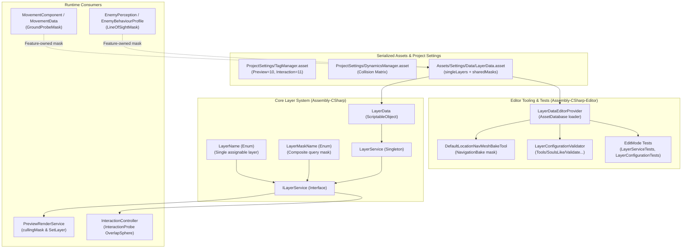

# Layer Service System Architecture Guide

## 1. Overview & Architectural Philosophy

The **SoulsLikeTemplate** project adopts a centralized, fail-fast layer management architecture for GameObject layer assignments and project-wide query masks, while keeping feature-specific physics rules strictly with the feature that owns them.

### Core Principles

1. **Separation of Layer Identity and Query Concepts:**
   - **`LayerName`** represents an assignable Unity layer identity (`GameObject.layer`). A GameObject can only reside on exactly one layer.
   - **`LayerMaskName`** represents a shared, project-wide composite mask used for queries (raycasts, overlap checks, camera culling, NavMesh surface baking).
   - Query concepts (e.g., "Ground") are not GameObject layers and must never be exposed as assignable single layers.
2. **Fail-Fast Configuration:**
   - Missing or invalid layer configuration is treated as a fatal authoring bug, never a recoverable runtime condition.
   - `LayerService` throws clear, actionable `InvalidOperationException` instances on missing keys, zero single-layer masks, or multi-bit single-layer masks. It **never** silently falls back to layer `0` (`Default`).
3. **Decentralized Feature Masks:**
   - Feature-specific query rules (such as movement ground probing or enemy perception line-of-sight) stay encapsulated within their owning domain ScriptableObjects (`MovementData`, `EnemyBehaviourProfile`). They are not centralized globally merely for the sake of grouping.
4. **Zero Magic Masks:**
   - Hardcoded integer literals (such as `55` or `119`) must not be used in code for queries or baking.

---

## 2. System Architecture Diagram



---

## 3. Layer Registry & Mask Specifications

### 3.1 Unity Layers (`TagManager.asset`)

The project uses the following layer configuration:

| Layer Index | Name | Bit Mask | Purpose |
|---:|---|---:|---|
| `0` | `Default` | `1` (`1 << 0`) | General static world geometry, unclassified scenery |
| `1` | `TransparentFX` | `2` (`1 << 1`) | Transparent effects |
| `2` | `Ignore Raycast`| `4` (`1 << 2`) | Built-in Unity raycast ignore |
| `4` | `Water` | `16` (`1 << 4`) | Water bodies |
| `5` | `UI` | `32` (`1 << 5`) | Canvas rendering and UI elements |
| `6` | `Player` | `64` (`1 << 6`) | Player root and physics / hitbox nodes |
| `7` | `Enemy` | `128` (`1 << 7`) | Enemy roots and physics / hurtbox nodes |
| `8` | `Walkable` | `256` (`1 << 8`) | Explicitly walkable terrain and floors |
| `9` | `Stairs` | `512` (`1 << 9`) | Staircase geometry with specific step locomotion rules |
| `10` | `Preview` | `1024` (`1 << 10`) | Inventory and equipment 3D model render previews |
| `11` | `Interaction` | `2048` (`1 << 11`) | Dedicated interactable trigger volumes and probe colliders |

### 3.2 Shared Composite Masks (`LayerMaskName`)

Composite masks used across subsystems are registered under `LayerMaskName`:

| Mask Name | Value | Components | Purpose |
|---|---:|---|---|
| `PreviewCamera` | `1024` | `Preview` | Culling mask for the isolated preview camera in `PreviewRenderService` |
| `InteractionProbe` | `2049` | `Default \| Interaction` | Probe sphere query mask in `InteractionController` (includes `Default` for backward compatibility with existing interactable prefabs) |
| `NavigationBake` | `769` | `Default \| Walkable \| Stairs` | Surface collection mask for `DefaultLocationNavMeshBakeTool` |

### 3.3 Feature-Owned Masks

Masks unique to individual features remain on their feature data assets:
- **Movement Ground Probing (`MovementData.GroundProbeMask`):** Owned by `MovementData` and consumed by `MovementComponent`. Serialized as `4294966783` (`~Stairs`).
- **Enemy Line of Sight (`EnemyBehaviourProfile.LineOfSightMask`):** Owned per enemy behavior profile and consumed by `EnemyPerception`.

---

## 4. Physics Collision Matrix (`DynamicsManager.asset`)

To prevent preview models and interaction triggers from interfering with physics:

1. **`Preview` (Layer 10):**
   - Must not participate in any gameplay collisions.
   - Configured in `DynamicsManager.asset` to ignore collision with **all** layers (0 through 31).
2. **`Interaction` (Layer 11):**
   - Query-oriented trigger volumes for interactable detection.
   - Configured in `DynamicsManager.asset` to ignore physical contacts with **all** layers (0 through 31).
   - Physics queries (e.g. `Physics.OverlapSphereNonAlloc` with `QueryTriggerInteraction.Collide`) detect these colliders via `LayerMask`, unaffected by the collision contact matrix.

---

## 5. Core Contracts & API

### 5.1 `ILayerService` Interface

```csharp
namespace SoulsLike.Services.Layer
{
    public interface ILayerService
    {
        LayerMask GetLayerMask(LayerName name);
        int GetLayer(LayerName name);
        LayerMask GetMask(LayerMaskName name);
        void SetLayer(GameObject gameObject, LayerName name, bool recursive = true);
    }
}
```

#### Contract Guarantees:
- `GetLayerMask(LayerName)`: Always returns a bitmask with exactly one bit set. Throws `InvalidOperationException` if missing, zero, or multi-bit.
- `GetLayer(LayerName)`: Returns the integer layer index (0–31).
- `GetMask(LayerMaskName)`: Always returns a non-zero composite bitmask. Throws `InvalidOperationException` if missing or zero.
- `SetLayer(GameObject, LayerName, bool)`: Resolves the layer index once, rejects null GameObject with `ArgumentNullException`, and applies the integer layer recursively (or non-recursively) without repetitive dictionary lookups.

### 5.2 `LayerData` ScriptableObject

Located at canonical path `Assets/Settings/Data/LayerData.asset`:

```csharp
public class LayerData : Model.Data
{
    [SerializeField] private SerializedDictionary<LayerName, LayerMask> singleLayers;
    [SerializeField] private SerializedDictionary<LayerMaskName, LayerMask> sharedMasks;

    public bool TryGetLayerMask(LayerName name, out LayerMask mask);
    public bool TryGetMask(LayerMaskName name, out LayerMask mask);

    public IReadOnlyDictionary<LayerName, LayerMask> SingleLayers => singleLayers?.Dictionary;
    public IReadOnlyDictionary<LayerMaskName, LayerMask> SharedMasks => sharedMasks?.Dictionary;
}
```

- Private serialized dictionaries ensure immutability at runtime.
- Built-in `OnValidate()` ensures invalid or missing keys surface directly inside the Unity Inspector.

### 5.3 VContainer Registration

Registered in `ProjectScope.cs`:

```csharp
builder.RegisterScriptableObject<LayerData>();
builder.Register<LayerService>(Lifetime.Singleton).As<ILayerService>();
```

---

## 6. Editor Utilities & Tooling

### 6.1 `LayerDataEditorProvider`

Editor code outside VContainer (tools, bake menus, inspectors) must not instantiate `LayerService` or duplicate file paths. Use `LayerDataEditorProvider`:

```csharp
// Load canonical LayerData
LayerData data = LayerDataEditorProvider.LoadLayerData();

// Get shared mask or single layer
LayerMask navMask = LayerDataEditorProvider.GetMask(LayerMaskName.NavigationBake);
int playerLayer = LayerDataEditorProvider.GetLayer(LayerName.Player);
```

### 6.2 `DefaultLocationNavMeshBakeTool`

Replaced legacy constant `55` with:

```csharp
LayerMask navigationLayerMask = LayerDataEditorProvider.GetMask(LayerMaskName.NavigationBake);
```

Ensures NavMesh surface baking always uses `Default | Walkable | Stairs` and excludes UI, water, preview objects, and interaction triggers.

### 6.3 `LayerConfigurationValidator`

Available via **`Tools/SoulsLike/Validate Layer Configuration`**:
- Validates `TagManager.asset` user layers (`Preview` = 10, `Interaction` = 11).
- Validates all `LayerName` keys in `LayerData.asset` are one-hot and match Unity layer names.
- Validates all `LayerMaskName` keys in `LayerData.asset` are non-zero.
- Verifies Character prefabs have roots on layer `Player`.
- Verifies Enemy prefabs have roots on layer `Enemy`.
- Verifies interactable prefabs have their colliders covered by `InteractionProbe`.

---

## 7. Authoring Guidelines & Rules of Thumb

1. **Never use magic integers:** Use `_layerService.GetMask(...)` or `_layerService.GetLayer(...)`.
2. **Never add query concepts to `LayerName`:** If a concept combines multiple layers (e.g., `Ground`, `Obstacles`, `HitTargets`), it is a `LayerMaskName` or a feature-owned `LayerMask`, not a `LayerName`.
3. **Do not modify child object layers individually during instantiations:** Use `_layerService.SetLayer(go, LayerName.X, recursive: true)` to ensure full hierarchies match the intended layer.
4. **Never silently fall back to `Default`:** A missing layer configuration must throw immediately to prevent subtle physics bugs from hiding in production builds.
