# Project Organization Guide - SoulsLikeTemplate

This document outlines the asset organization rules for the **SoulsLikeTemplate** Unity project. The project follows a **type-first** structure, where the root folder defines the asset type, and subfolders define the domain or category.

## Structure Overview

```mermaid
graph TD
    A["Assets/"] --> Art["Art/ - Visual assets"]
    A --> Audio["Audio/ - Sound effects and ambience/music"]
    A --> Plugins["Plugins/ - Core external packages"]
    A --> Prefabs["Prefabs/ - Reusable objects"]
    A --> Scripts["Scripts/ - C# source code"]
    A --> Settings["Settings/ - Configuration assets"]
    A --> Scenes["Scenes/ - Game levels"]
    A --> Sandbox["Sandbox/ - Technical tests"]
    A --> ThirdParty["ThirdParty/ - External tools & documentation"]
    A --> Addressables["AddressableAssetsData/ - Addressables config"]
    A --> Resources["Resources/ - Minimal bootstrap"]

    Art --> Art1["Models/ - Meshes & character models"]
    Art --> Art2["Animation/ - Controllers & avatar masks"]
    Art --> Art3["Materials/ - Visual surface definitions"]
    Art --> Art4["Shaders/ - Custom shaders"]
    Art --> Art5["Textures/ - Sprites & textures"]
    Art --> Art6["Fonts/ - Typography & TMP font assets"]

    Audio --> Aud1["AmbienceMusic/ - Ambient loops & score"]
    Audio --> Aud2["Sfx/ - Sound effects"]

    Prefabs --> P1["Models/ - Characters, items, equipment, environment"]
    Prefabs --> P2["Ui/ - Canvas and menu elements"]
    Prefabs --> P3["View/ - Camera, services, and VContainer scopes"]

    Scripts --> S1["Components/ - Reusable logic operations"]
    Scripts --> S2["Entities/ - State models and data holders"]
    Scripts --> S3["Services/ - Global systems and VContainer scopes"]
    Scripts --> S4["Ui/ - Feature UI presenters, views, controllers"]
    Scripts --> S5["Orchestrators/ - Game flow and state machine orchestration"]
    Scripts --> S6["Utilities/ - Shared helpers, extensions, serialization"]
    Scripts --> S7["Editor/ - Editor tooling"]
    Scripts --> S8["Tests/ - Automated unit & integration tests"]

    Settings --> Set1["Input/ - Input system actions"]
    Settings --> Set2["Player/ - Movement and player settings"]
    Settings --> Set3["Build Profiles/ - Project build configs"]
    Settings --> Set4["Data/ - Game databases and settings data"]
    Settings --> Set5["RenderPipelines/ - HDRP/URP quality profiles"]
```

## Root Folder Definitions

### 1. Art (`Assets/Art`)
Contains all visual assets.
- **Models/**: 3D meshes, FBX files, and their imported materials.
- **Animation/**: Animator Controllers, Animation Clips, and Avatar Masks.
- **Textures/**: Image assets and sprites.
- **Materials/**: Shared material definitions.
- **Shaders/**: Project-owned custom shaders (e.g., `GroundItemAdditive.shader`).
- **Fonts/**: Font definitions and TextMesh Pro font assets.

### 2. Audio (`Assets/Audio`)
Contains all acoustic assets.
- **AmbienceMusic/**: Ambient loops, background music, and score tracks.
- **Sfx/**: Sound effect audio clips.

### 3. Prefabs (`Assets/Prefabs`)
Contains reusable GameObject configurations.
- **Models/**: Prefabs representing physical entities (Player, Equipment, Items, Skins, Environment interactables).
- **Ui/**: Menu screens, HUD elements, and UI widgets.
- **View/**: Non-physical orchestration prefabs (Camera, Services, VContainer Scopes).

### 4. Scripts (`Assets/Scripts`)
Contains all project-owned C# source code.
- **Components/**: Logic components that drive behavior (e.g., Movement, Interaction).
- **Entities/**: Data-focused models and shared entity logic.
- **Services/**: Global systems, manager logic, and dependency injection (VContainer).
- **Ui/**: Decoupled Controller-Presenter-View UI architecture per `UI_Code_Build_Guide.md`.
- **Orchestrators/**: Game state transitions, scene flow orchestration, and high-level coordinators.
- **Utilities/**: General extension methods, serialization helpers, and utility factories.
- **Editor/**: Editor-only scripts and custom inspectors (no root `Assets/Editor/`).
- **Tests/**: Automated test suites (EditMode and PlayMode; no root `Assets/Tests/`).

### 5. Settings (`Assets/Settings`)
Contains configuration and scriptable object data.
- **Data/**: Game settings and databases (e.g., ScriptableObjects inheriting from the `Data` class, like `HealthData`, `InventoryData`, and the global `AssetMappingData`).
- **Input System Actions**: The `.inputactions` and `.inputsettings` assets.
- **Player Data**: ScriptableObjects like `MovementData`.
- **RenderPipelines/**: HDRP/URP profiles, volume profiles, and quality settings.

### 6. Plugins (`Assets/Plugins`)
Reserved for major, project-wide external packages.
- **Mirror**: Networking library.
- **TextMesh Pro**: Text rendering.
- **DOTween**: Animation engine.

### 7. Sandbox (`Assets/Sandbox`)
A boundary for temporary development.
- **Scenes/**: Blocking, technical testing, and prototyping levels.
- **Prefabs/Debug/**: Debug-only objects and technical integration tests.

## Placement Rules

1. **Type-First**: Always place assets in the root folder that matches their type (e.g., a weapon model goes in `Art/Models`, not `Prefabs`).
2. **Graphics vs Art**: The folder for visual assets must always be named `Art`. Shaders belong under `Art/Shaders`.
3. **Addressables**: **Do not modify the `AddressableAssetsData` folder structure.** Assets referenced by Addressables can be moved through the Unity Editor, but the data folder itself must remain intact.
4. **Resources**: Keep `Assets/Resources` minimal. Only use it for bootstrapping assets (e.g., initial VContainer configuration).
5. **Third-Party**: External assets from the Asset Store that are not core plugins belong in `Assets/ThirdParty`.
6. **Scripts**: Maintain decoupled architectural layers (`Components`, `Entities`, `Services`, `Ui`, `Orchestrators`, `Utilities`). Tooling and tests must be contained within `Scripts/Editor` and `Scripts/Tests`.
7. **Prefabs**: Adhere to the strict 3-tier division: `Prefabs/Models/` (physical), `Prefabs/Ui/` (interface), and `Prefabs/View/` (orchestration/services).
