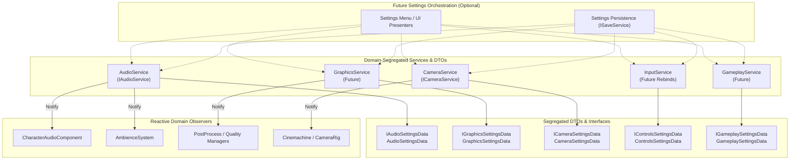
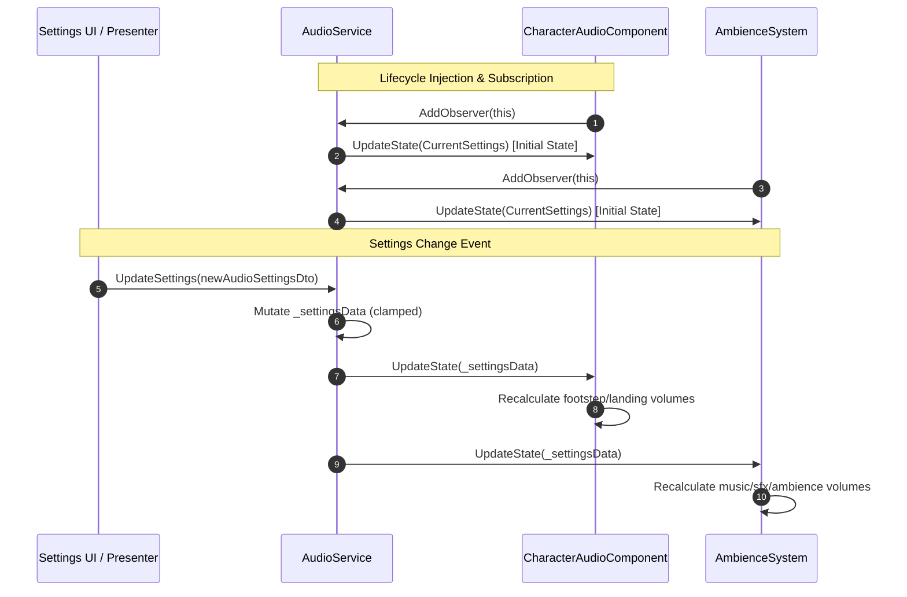
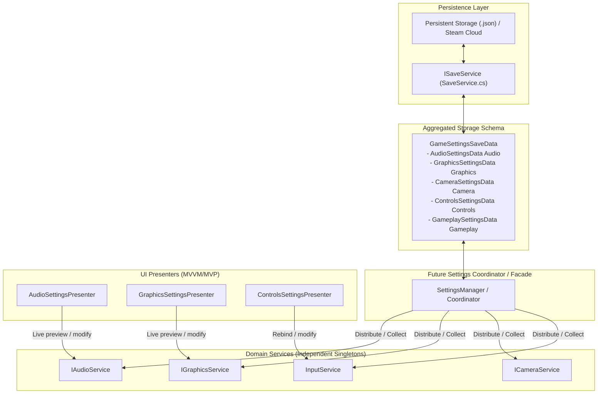

# Settings System Architecture & Segregation Guide

## 1. Overview & Architectural Philosophy

The **SoulsLikeTemplate** project adopts a **Decentralized, Domain-Segregated Settings Architecture** adhering strictly to the **Single Responsibility Principle (SRP)** and **Interface Segregation Principle (ISP)**.

### Current Status
> [!NOTE]
> **No explicit, monolithic `SettingsService` or global "God" settings manager exists in the codebase.**
> Instead, settings are decoupled and distributed across individual domain services and data transfer objects (DTOs), with the **Audio System** serving as the canonical reference archetype.



### Why Domain Segregation?
1. **Zero Monolithic Coupling**: Subsystems (Audio, Rendering, Camera, Input) only depend on their own settings data. Audio never needs to know about screen resolutions, and camera smoothing never needs to know about master volume.
2. **Independent Testability & Lifetime**: Domain services can be unit-tested or instantiated in isolation without mocking a giant global settings object.
3. **Reactive Updates**: Systems react immediately to domain-specific changes through the generic `IObserver<T>` pattern.
4. **Clean Serialization Boundaries**: Settings can be serialized, deserialized, validated, and migrated per-domain or composited together for persistence.

---

## 2. Reference Archetype: Audio Settings System

The Audio subsystem exemplifies how domain-segregated settings are defined, owned, updated, and observed.

### 2.1 Interface & DTO Contracts

Settings contracts are split into a read-only interface and a mutable, serializable DTO:

#### Interface: `IAudioSettingsData`
Defined in `SoulsLike.Services.Audio.Data`:
```csharp
namespace SoulsLike.Services.Audio.Data
{
    public interface IAudioSettingsData
    {
        float MasterVolume { get; }
        float MusicVolume { get; }
        float SfxVolume { get; }
        bool MuteAll { get; }
    }
}
```

#### Concrete DTO: `AudioSettingsData`
Defined in `SoulsLike.Services.Audio.Data`:
```csharp
namespace SoulsLike.Services.Audio.Data
{
    [Serializable]
    public class AudioSettingsData : IAudioSettingsData
    {
        [SerializeField, Range(0f, 1f)] private float masterVolume = 1f;
        [SerializeField, Range(0f, 1f)] private float musicVolume = 1f;
        [SerializeField, Range(0f, 1f)] private float sfxVolume = 1f;
        [SerializeField] private bool muteAll;

        public float MasterVolume
        {
            get => masterVolume;
            set => masterVolume = Mathf.Clamp01(value);
        }

        public float MusicVolume
        {
            get => musicVolume;
            set => musicVolume = Mathf.Clamp01(value);
        }

        public float SfxVolume
        {
            get => sfxVolume;
            set => sfxVolume = Mathf.Clamp01(value);
        }

        public bool MuteAll
        {
            get => muteAll;
            set => muteAll = value;
        }
    }
}
```

### 2.2 Domain Publisher / Subject: `IAudioService` & `AudioService`

`IAudioService` acts as the domain-specific subject:
- Holds the current settings snapshot (`CurrentSettings`).
- Exposes `UpdateSettings(IAudioSettingsData newSettings)`.
- Maintains an observer list `IObserver<IAudioSettingsData>`.
- Immediately notifies new observers upon registration (`AddObserver`) with the current settings snapshot.

```csharp
public class AudioService : IAudioService, IInitializable, IDisposable
{
    private readonly AudioData _audioData;
    private readonly List<IObserver<IAudioSettingsData>> _observers = new();
    private AudioSettingsData _settingsData = new();

    public float BaseVolume => _audioData != null ? _audioData.BaseVolume : 1f;
    public IAudioSettingsData CurrentSettings => _settingsData;

    public void AddObserver(IObserver<IAudioSettingsData> observer)
    {
        if (_observers.Contains(observer))
        {
            Debug.LogError("[AudioService] Observer is already added to audio observer list");
            return;
        }
        _observers.Add(observer);
        observer.UpdateState(_settingsData);
    }

    public void RemoveObserver(IObserver<IAudioSettingsData> observer)
    {
        _observers.Remove(observer);
    }

    public void UpdateSettings(IAudioSettingsData newSettings)
    {
        if (newSettings == null) return;
        _settingsData.MasterVolume = newSettings.MasterVolume;
        _settingsData.MusicVolume = newSettings.MusicVolume;
        _settingsData.SfxVolume = newSettings.SfxVolume;
        _settingsData.MuteAll = newSettings.MuteAll;
        NotifyObservers();
    }

    private void NotifyObservers()
    {
        for (var i = 0; i < _observers.Count; i++)
        {
            _observers[i].UpdateState(_settingsData);
        }
    }
}
```

### 2.3 Reactive Observers: `CharacterAudioComponent` & `AmbienceSystem`

Consumers implement `SoulsLike.Services.IObserver<IAudioSettingsData>`:

```csharp
public sealed class CharacterAudioComponent : BaseComponent, IObserver<IAudioSettingsData>
{
    private IAudioService _audioService;
    private bool _isObserving;

    [Inject]
    public void Configure(IAudioService audioService, CharacterAudioData data)
    {
        _audioService = audioService;
        _audioService.AddObserver(this);
        _isObserving = true;
    }

    private void OnDestroy()
    {
        if (!_isObserving) return;
        _audioService.RemoveObserver(this);
        _isObserving = false;
    }

    public void UpdateState(IAudioSettingsData settings)
    {
        float volume = settings.MuteAll
            ? 0f
            : _audioService.BaseVolume * settings.MasterVolume * settings.SfxVolume;

        footstepSource.volume = volume;
        landingSource.volume = volume;
        hitSource.volume = volume;
        swordClashSource.volume = volume;
    }
}
```



---

## 3. Domain Segregation Blueprint for Other Subsystems

All future settings in the project should follow this exact pattern:

| Domain | Interface | Concrete DTO | Domain Service / Subject | Primary Consumers / Observers |
|---|---|---|---|---|
| **Audio** | `IAudioSettingsData` | `AudioSettingsData` | `IAudioService` / `AudioService` | `CharacterAudioComponent`, `AmbienceSystem`, UI Sound Emitters |
| **Graphics / Video** | `IGraphicsSettingsData` | `GraphicsSettingsData` | `IGraphicsService` / `GraphicsService` | Render Pipeline Assets, Quality Settings, Post-Process Volume Managers |
| **Camera / View** | `ICameraSettingsData` | `CameraSettingsData` | `ICameraService` / `CameraService` | Cinemachine Virtual Cameras, Lock-On Vectoring, Free-Look Controller |
| **Controls / Input** | `IControlsSettingsData` | `ControlsSettingsData` | `InputService` | Input Action Maps, Rebind Overrides, Gamepad Vibration Handlers |
| **Gameplay & Access.** | `IGameplaySettingsData` | `GameplaySettingsData` | `GameplaySettingsService` | Subtitle Presenter, HUD Controller, Target Lock Assist, Localization |

### Example: Blueprint for Graphics Settings

```csharp
namespace SoulsLike.Services.Graphics.Data
{
    public interface IGraphicsSettingsData
    {
        int ResolutionWidth { get; }
        int ResolutionHeight { get; }
        int RefreshRate { get; }
        FullScreenMode WindowMode { get; }
        int TargetFrameRate { get; }
        int VSyncCount { get; }
        int QualityPresetIndex { get; }
        bool MotionBlur { get; }
        float RenderScale { get; }
    }

    [Serializable]
    public class GraphicsSettingsData : IGraphicsSettingsData
    {
        [SerializeField] private int resolutionWidth = 1920;
        [SerializeField] private int resolutionHeight = 1080;
        [SerializeField] private int refreshRate = 60;
        [SerializeField] private FullScreenMode windowMode = FullScreenMode.FullScreenWindow;
        [SerializeField] private int targetFrameRate = 60;
        [SerializeField] private int vSyncCount = 1;
        [SerializeField] private int qualityPresetIndex = 2;
        [SerializeField] private bool motionBlur = true;
        [SerializeField, Range(0.5f, 2f)] private float renderScale = 1f;

        // Public properties with validation / clamping...
    }
}
```

---

## 4. Future Settings Persistence & UI Coordination

When a dedicated Settings UI and persistent storage system are built, the architecture remains modular and decoupled.



### 4.1 Persistence Workflow
1. **Aggregated DTO**: `GameSettingsSaveData` holds typed instances of each domain's DTO (`AudioSettingsData`, `GraphicsSettingsData`, etc.).
2. **Save**: The coordinator queries `IAudioService.CurrentSettings`, `IGraphicsService.CurrentSettings`, etc., populates `GameSettingsSaveData`, and passes it to `ISaveService.Save("settings", saveData)`.
3. **Load**: On startup, `ISaveService.Load<GameSettingsSaveData>("settings")` deserializes the file. The coordinator delegates `audioService.UpdateSettings(saveData.Audio)`, `graphicsService.UpdateSettings(saveData.Graphics)`, etc.

### 4.2 UI Workflow
- Each settings tab (Audio, Graphics, Gameplay) has its own **Presenter** bound directly to the respective domain service (or via a settings facade).
- Real-time previews (e.g. dragging a volume slider) immediately call `audioService.UpdateSettings(...)`, causing observers to update live without requiring a save.
- "Apply / Cancel" workflows can keep a temporary working copy of the domain DTO and only commit it upon confirmation.

---

## 5. Summary of Architecture Rules & Best Practices

1. **Keep DTOs Pure**: Settings DTOs and interfaces must contain only serializable data and validation clamps. Do not put engine or hardware manipulation logic inside DTOs.
2. **Domain Service Ownership**: The domain service is the authoritative source of truth for its domain settings during runtime.
3. **Use Generic Observers**: Use `SoulsLike.Services.IObserver<T>` for change propagation. Avoid creating redundant custom event delegates for settings updates.
4. **Lifecycle Cleanliness**: Any component registering as an observer must unregister in `OnDestroy()` or `Dispose()`.
5. **VContainer Scoping**: Domain services are registered in `ProjectScope` as singletons (`Lifetime.Singleton`), making them accessible across scene transitions.
6. **No Defensive Null Boilerplate**: Injected dependencies are mandatory and fail-fast via VContainer; do not add redundant null-guard clauses or try-catch boilerplate around DI.
