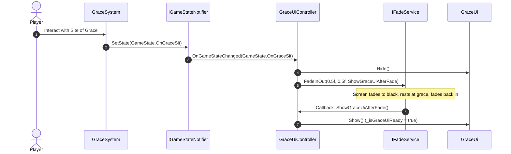
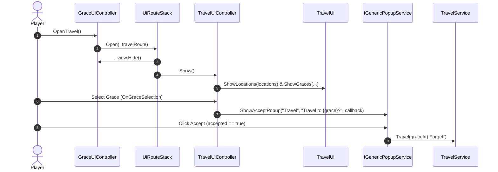
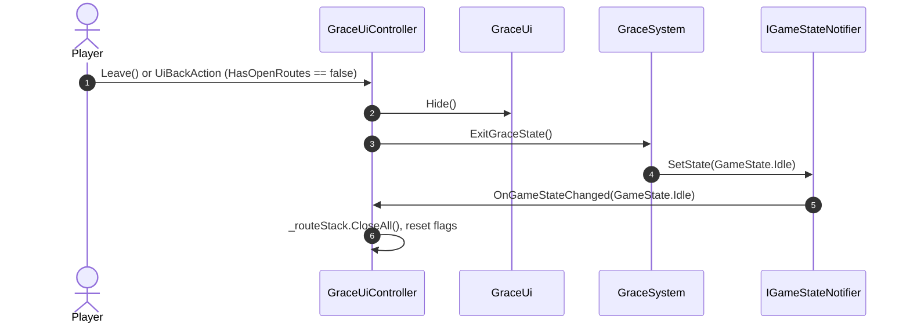

# Grace Route Navigation Architecture

> [!warning] Validation status — needs review
> Checked against live source on 2026-09-07 at `fcaf410d`. `GraceUiController`, route stack, travel route, fade callbacks, and `GraceSystem` exist. `GraceSystem` now ensures a `ViewEntity` at runtime, so older interaction-representation claims must be reviewed.

This document details the architecture, state transitions, fading coordination, and sub-route flows for the **Site of Grace Navigation System** (`Assets/Scripts/Ui/Grace/`).

---

## 1. Overview

The Grace Navigation System manages the UI and interactive choices available to the player while resting at a **Site of Grace** (bonfire checkpoint). It coordinates:
1. **Grace Rest State & Cinematic Fading**: Synchronizes UI reveal with screen fade effects via `IFadeService`, declared in `Assets/Scripts/Services/Fade/FadeService.cs`.
2. **Sub-Route Navigation**: Manages transitions to sub-screens such as **Fast Travel** ([`ITravelRoute`](../../../Assets/Scripts/Ui/Travel/ITravelRoute.cs)) via [`UiRouteStack`](../../../Assets/Scripts/Ui/Navigation/UiRouteStack.cs).
3. **Grace Exit**: Coordinates with [`GraceSystem`](../../../Assets/Scripts/Interactions/GraceSystem.cs) to return character control to gameplay.

---

## 2. Core Components & Structure

```
Assets/Scripts/Ui/Grace/
 ├── IGraceRoute.cs            (Domain base route interface extending IUiRoute)
 ├── IGraceUiPresenter.cs      (Presenter contract for Grace root UI)
 ├── IGraceRouteNavigation.cs  (Router contract for opening Grace sub-routes)
 ├── GraceUi.cs                (BaseUi view with Travel and Leave buttons)
 └── GraceUiController.cs      (Host router controller managing state, fade, and UiRouteStack)
```

### A. Domain Route Base: `IGraceRoute`
Defined in [`Assets/Scripts/Ui/Grace/IGraceRoute.cs`](../../../Assets/Scripts/Ui/Grace/IGraceRoute.cs):
```csharp
using System;
using SoulsLike.Ui.Navigation;

namespace SoulsLike.Ui.Grace
{
    public interface IGraceRoute : IUiRoute
    {
        event Action CloseRequested;
    }
}
```
All sub-routes under the Grace hub (e.g. [`ITravelRoute`](../../../Assets/Scripts/Ui/Travel/ITravelRoute.cs)) implement `IGraceRoute`.

### B. Router Interface: `IGraceRouteNavigation`
Defined in [`Assets/Scripts/Ui/Grace/IGraceRouteNavigation.cs`](../../../Assets/Scripts/Ui/Grace/IGraceRouteNavigation.cs):
```csharp
namespace SoulsLike.Ui.Grace
{
    public interface IGraceRouteNavigation
    {
        void OpenTravel();
    }
}
```
Defines navigation operations accessible from the Grace menu (expandable for Level Up, Spell Attunement, or Flask Allocation).

### C. Presenter Interface: `IGraceUiPresenter`
Defined in [`Assets/Scripts/Ui/Grace/IGraceUiPresenter.cs`](../../../Assets/Scripts/Ui/Grace/IGraceUiPresenter.cs):
```csharp
namespace SoulsLike.Ui.Grace
{
    public interface IGraceUiPresenter
    {
        void OpenTravel();
        void Leave();
    }
}
```

### D. View: `GraceUi`
Defined in [`Assets/Scripts/Ui/Grace/GraceUi.cs`](../../../Assets/Scripts/Ui/Grace/GraceUi.cs):
- Inherits from [`BaseUi`](../../../Assets/Scripts/Ui/Base/BaseUi.cs).
- Binds buttons (`travelButton`, `leaveButton`) to presenter methods.

### E. Host Controller & Router: `GraceUiController`
Defined in [`Assets/Scripts/Ui/Grace/GraceUiController.cs`](../../../Assets/Scripts/Ui/Grace/GraceUiController.cs):
- Implements `IInitializable`, `ITickable`, `IDisposable`, `IGameStateObserver`, `IGraceUiPresenter`, `IGraceRouteNavigation`.
- Injected dependencies:
  - `IUiService` — UI instantiation.
  - `GraceSystem` — Gameplay grace rest and exit management.
  - `IGameStateNotifier` — Subscribes to global game state changes (`GameState.OnGraceSit`).
  - `IFadeService` — Full-screen fade in/out during grace sit.
  - `ITravelRoute` — Fast travel sub-route.
  - `IInputService` — Handles `UiBackAction`.
- Manages an internal [`UiRouteStack`](../../../Assets/Scripts/Ui/Navigation/UiRouteStack.cs).

---

## 3. Grace Rest & Fading Sequence

When the player interacts with a Site of Grace, the game transitions to `GameState.OnGraceSit`. The UI does not appear instantly; instead, it coordinates with a screen fade:



### Key Safety Checks During Fade:
- If the player leaves grace before the fade completes (`!_isOnGraceSit` or `_isLeaving`), the UI remains hidden.
- If a sub-route was somehow opened, `_routeStack.HasOpenRoutes` prevents root view overlap.

---

## 4. Sub-Route Navigation: Fast Travel Flow

The primary sub-route currently connected to Grace navigation is the **Travel System** (`Assets/Scripts/Ui/Travel/`):



### Back / Cancel from Travel Screen:
1. If the player presses Cancel/Back while browsing travel destinations:
2. [`TravelUiController`](../../../Assets/Scripts/Ui/Travel/TravelUiController.cs) fires `CloseRequested`.
3. `GraceUiController.HandleTravelCloseRequested()` calls `_routeStack.CloseTop()`.
4. `UiRouteStack` hides `TravelUi` and restores `GraceUi`.

---

## 5. Exit Grace Navigation Flow

When the player chooses "Leave" or presses `UiBackAction` from the root Grace menu:



---

## 6. VContainer DI Registration

Registered in [`CoreScope.cs`](../../../Assets/Scripts/Services/VContainer/CoreScope.cs):

```csharp
builder.Register<TravelUiController>(Lifetime.Singleton).AsSelf().AsImplementedInterfaces();
builder.Register<GraceUiController>(Lifetime.Singleton).AsSelf().AsImplementedInterfaces();
```

---

## 7. Related Documentation

- [[Architecture/UI/UI Route Navigation|UI Route Navigation]] — Foundational Route Stack and navigation system architecture.
- [[Architecture/UI/Pause Navigation|Pause Navigation]] — Pause menu navigation system architecture.
- [[Guides/UI/UI Code Build Guide|UI Code Build Guide]] — Step-by-step guide for creating UI Views, Presenters, and Controllers.
