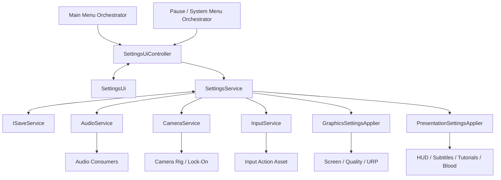
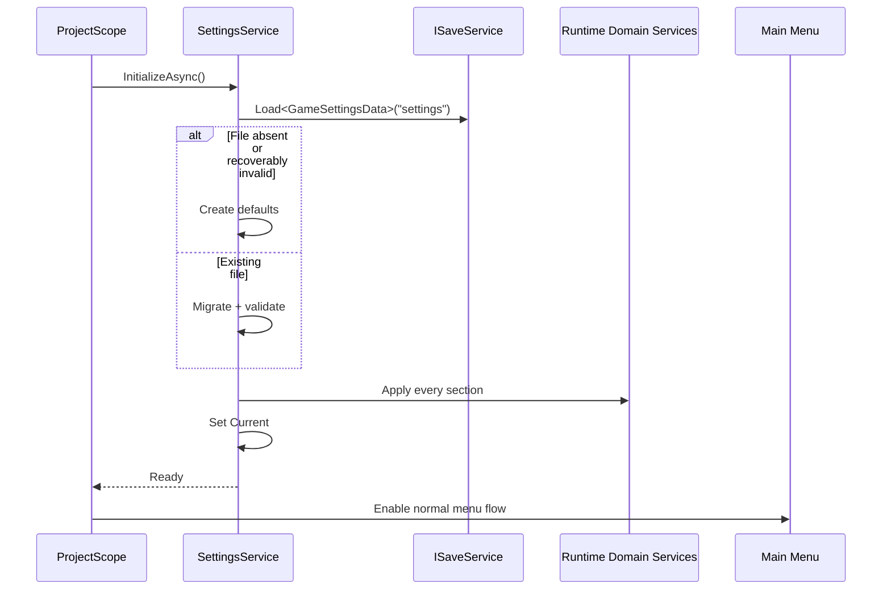
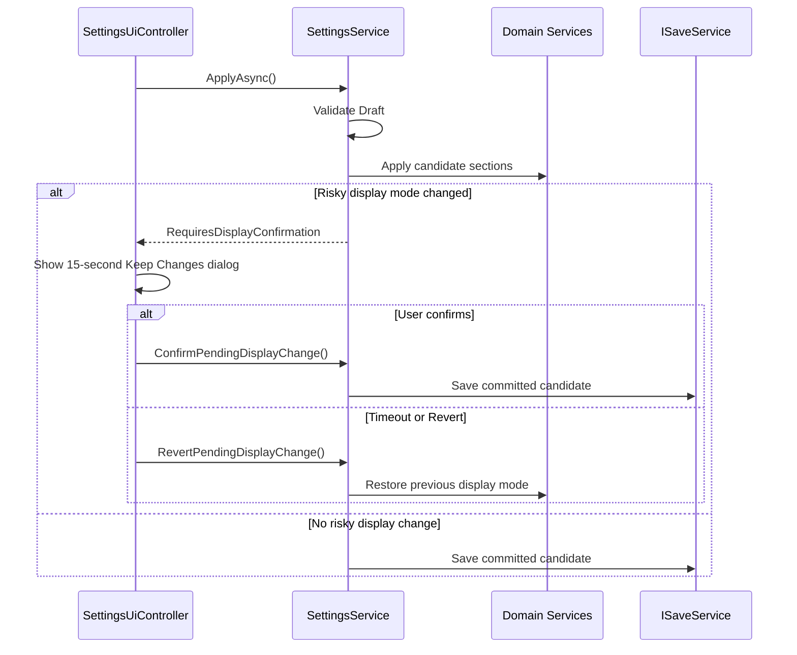

# Elden Ring–Style Settings System — Detailed Architecture and Implementation Plan

> **Project:** SoulsLikeTemplate  
> **Target:** Unity 6.x, VContainer, Addressables, Input System, project MVP UI conventions  
> **Research snapshot:** 2026-09-02  
> **Purpose:** Define the settings data, runtime behavior, persistence, and UI architecture before implementation.

---

## 0. Executive Decision

Build the settings feature around **one cohesive `SettingsService` that owns the saved settings document and edit transaction**, while existing domain systems remain responsible for applying their own runtime behavior.

Do **not** create:

- one independent settings repository/service for every domain;
- a large settings “God object” that directly manipulates every Unity API;
- an interface for every settings DTO only to make fields read-only;
- a generic observer network copied into graphics, camera, gameplay, controls, and UI;
- a reflection-driven universal form builder for the first version;
- separate presenter/controller classes for every settings tab.

Use this split instead:

```text
Settings UI
    ↓ edits a draft through
SettingsUiController
    ↓
SettingsService
    ├── owns Current / Draft / Baseline
    ├── loads, validates, migrates, saves
    ├── performs Apply / Cancel / Defaults
    └── delegates runtime application to:
         ├── AudioService
         ├── CameraService
         ├── InputService
         ├── GraphicsSettingsApplier
         └── PresentationSettingsApplier
```

### Source of truth

- `SettingsService.Current` is the **single committed settings source of truth**.
- `SettingsService.Draft` exists only while the settings menu is being edited.
- Domain services may keep an **applied runtime cache**, but they do not independently load or save the same settings.
- The UI never calls `Screen`, `QualitySettings`, `AudioMixer`, `InputAction`, camera components, or HUD objects directly.

This keeps the system readable and cohesive without forcing unrelated game systems into one implementation class.

---

# 1. Elden Ring Settings Reference

## 1.1 Research boundary

The settings list below combines:

- launch-version menu documentation and screenshots;
- later official additions such as camera auto-rotation and ray tracing;
- current official patch evidence that graphics and keyboard/mouse settings remain accessible from the System menu.

Some rows differ by:

- PC versus console;
- platform capabilities;
- game version;
- connected input device.

The exact internal save architecture of Elden Ring is not public. Therefore:

- **menu organization, exposed options, navigation, and visible behavior** are reference material;
- **the project architecture below is an independent recommendation**.

---

## 1.2 Data exposed by Elden Ring

### Game Options

| Setting | Data shape | Project meaning |
|---|---:|---|
| Toggle Aim Lock-On | `bool` | Whether attack input can automatically acquire/retain a target according to combat rules |
| Auto-Target | `bool` | Whether target selection automatically chooses a nearby valid enemy |
| Manual Attack Aiming | `bool` | Allows attack direction adjustment where the combat implementation supports it |
| Vibration Function | normalized `float` | Global controller vibration strength |
| Motion Sensor Functions | platform-specific bindings | Defer unless motion-capable devices are supported |
| Performance Mode / Quality Mode | enum on consoles | For this PC-first project, represent through graphics presets instead |

### Camera Options

| Setting | Data shape | Project meaning |
|---|---:|---|
| Camera X-Axis | enum / inversion bool | Horizontal camera direction |
| Camera Y-Axis | enum / inversion bool | Vertical camera direction |
| Reset Camera Y-Axis | toggle | Whether reset/lock action also recenters pitch |
| Camera Speed | normalized `float` or UI integer | Free-look and/or lock-on camera sensitivity |
| Camera Auto-Wall Recovery | `bool` | Enables camera correction when geometry blocks the preferred camera pose |
| Cinematic Effects | `bool` | Enables nonessential camera shake, impulses, and dramatic camera effects |
| Camera Auto Rotate | `bool` | Enables movement-driven camera rotation assistance |

### Sound and Display

| Setting | Data shape | Project meaning |
|---|---:|---|
| Display Blood | `bool` | Enables blood presentation only; gameplay remains unchanged |
| Subtitles | `bool` | Enables subtitle presenter |
| HUD | enum | `Auto`, `Always`, `Off` |
| Show Tutorials | `bool` | Enables tutorial pop-ups/instructions |
| HDR | `bool` plus calibration | Only expose when the active platform/pipeline supports it |
| Adjust Brightness | calibrated `float` | Opens a dedicated calibration panel |
| Device for On-Screen Prompts | enum | `Auto`, `KeyboardMouse`, `Gamepad` |
| Master Volume | normalized `float` | Global audio multiplier |
| Music Volume | normalized `float` | Music bus multiplier |
| Sound Effects Volume | normalized `float` | SFX bus multiplier |
| Voice Volume | normalized `float` | Dialogue/voice bus multiplier |

### Network

| Setting | Data shape | Recommendation |
|---|---:|---|
| Cross-Region Play | enum/bool | Defer until the multiplayer architecture defines region behavior |
| Send Summon Sign | enum | Defer |
| Voice Chat | `bool` | Defer until voice chat exists |
| Display Player Names | enum | Defer until online identity display exists |
| Launch Setting | enum | Defer until offline/online startup is implemented |

Do not add a Network tab containing nonfunctional settings.

### Controls

Elden Ring exposes controller and keyboard/mouse binding screens. The project should support:

- controller bindings;
- keyboard/mouse bindings;
- reset one binding;
- reset all bindings;
- current-device glyphs;
- conflict feedback;
- canceling an active rebind.

### PC Graphics

#### Basic graphics page

- Screen Mode
- Resolution
- Auto-Detect Best Rendering Settings
- Ray Tracing Quality
- Quality Settings / preset
- Advanced Settings

#### Advanced graphics page

- Texture Quality
- Antialiasing Quality
- SSAO
- Depth of Field
- Motion Blur
- Shadow Quality
- Lighting Quality
- Effects Quality
- Volumetric Quality
- Reflection Quality
- Water Surface Quality
- Shader Quality
- Global Illumination Quality
- Grass Quality

The project does not need every row immediately. Only expose a row when there is a real Unity/URP implementation behind it.

---

## 1.3 Elden Ring behavior and logic

### Menu access

The System/settings pages are accessible from both:

- the title/main-menu flow;
- the in-game menu.

The same settings data is therefore global and must survive scene transitions.

### Category navigation

The menu uses:

- a horizontal category/tab strip;
- shoulder-button or keyboard tab switching;
- a vertical list inside the selected category;
- contextual `Back`, `Defaults`, and `Help` commands;
- nested pages for controls and advanced graphics.

### Value editing

Rows use a small number of interaction types:

- toggle;
- left/right choice;
- slider;
- action button opening a nested page;
- binding row.

This is a useful model for the project: a small reusable row set, not a unique prefab and script for every option.

### Input prompts

The selected prompt-device setting changes the glyphs and labels shown in menus and gameplay. Rebound inputs should be reflected by the displayed prompt.

### Platform/version capability

Rows are not universally available. Examples include:

- motion controls on supported consoles;
- HDR only when supported;
- ray tracing only on supported platforms/rendering paths;
- PC-only resolution and advanced graphics controls.

The project must build option visibility from a capability query rather than showing disabled placeholders for permanently unsupported features.

### Pause ownership

The settings panel must not decide whether gameplay pauses. It can be opened from:

- a main-menu owner where no gameplay exists;
- a pause-menu owner that chooses to pause;
- a Souls-like in-game menu owner that may intentionally leave the world running.

`SettingsUiController` manages settings, not `Time.timeScale`.

### Apply behavior: project decision

The visible Elden Ring layout emphasizes immediate editing and does not present a large permanent “Apply” button in the screenshots reviewed. Exact save timing is not officially documented.

For this project:

- safe values preview immediately;
- committed persistence remains transactional;
- leaving with unsaved changes asks the user to apply or discard;
- risky display changes receive a temporary confirmation countdown.

This preserves the responsive Elden Ring feel while making resolution and window-mode changes safe.

---

## 1.4 Elden Ring presentation

Use the following presentation principles without copying copyrighted assets:

- dark, translucent full-screen overlay;
- muted background scene visible behind the menu;
- title in the upper-left;
- horizontal icon tabs near the top;
- sparse vertical option list;
- label on the left, current value on the right;
- subtle full-width highlight for the selected row;
- left/right arrows for enumerable values;
- thin sliders with numeric feedback where useful;
- bottom contextual description for the selected row;
- bottom input legend for Back, Defaults, Help, Apply, or related actions;
- nested subpages that preserve the same visual language.

Use project-created icons, frames, textures, and fonts.

---

# 2. Existing Project Constraints

The attached architecture document is used only to identify existing implementation conventions and integration points.

## Existing runtime facts to preserve

- `AudioService` already holds audio settings and notifies audio consumers.
- Existing consumers subscribe through the project’s `IObserver<T>` pattern.
- Services are registered through VContainer and survive as project-level services.
- `ISaveService` is the expected persistence integration point.
- Future domains named in the document include graphics, camera, controls, and gameplay.

## Existing UI rules to preserve

The UI guide defines:

- scripts under `Assets/Scripts/Ui/<FeatureName>/`;
- a presenter interface;
- a `BaseUi` view;
- a `UiController` implementation that creates the view through `IUiService`;
- VContainer registration in the relevant scope;
- prefab location under `Assets/Prefabs/Ui/<FeatureName>/`;
- Addressable group `Ui`;
- registration in `AssetMappingData.uiMappings`.

The plan below follows these project rules but avoids multiplying controllers/presenters by tab.

---

# 3. Recommended Architecture

## 3.1 Architecture diagram



## 3.2 Responsibility table

| Component | Owns | Must not own |
|---|---|---|
| `SettingsService` | committed settings, edit draft, baseline, validation, migration, save/load, apply/cancel/defaults transaction | UI widgets, direct scene-object manipulation |
| `SettingsUiController` | UI flow, row callbacks, tab state, binding draft values, dirty dialog, display confirmation flow | persistence format, Unity graphics/audio APIs |
| `SettingsUi` | serialized view references, event subscription, visual state, selection/navigation | settings data authority, save/load, domain behavior |
| `AudioService` | applying audio values to the existing audio runtime and notifying current consumers | loading/saving the global settings file |
| `CameraService` | applying camera options to free/lock-on camera behavior | settings persistence |
| `InputService` | action maps, rebind capture, override application, current input device | settings menu presentation |
| `GraphicsSettingsApplier` | supported modes, quality/URP changes, display apply/revert | settings transaction or UI |
| `PresentationSettingsApplier` | HUD, subtitles, tutorials, blood, brightness integration | persistence or graphics mode handling |
| `ISaveService` | reading/writing serialized data | interpreting or applying settings |

## 3.3 Why one settings service

A single settings document is inherently one user preference set. Splitting every category into an independent repository produces:

- duplicated load/save lifecycle;
- ordering problems at startup;
- a coordinator that must reconstruct the aggregate;
- multiple competing runtime sources of truth;
- more interfaces and observer boilerplate than actual behavior.

A single `SettingsService` is not a God object when it delegates actual domain application. Its cohesive responsibility is:

> Maintain one valid, persistent, editable game-settings document and coordinate its application.

## 3.4 Why not make every domain observe the aggregate

A global `GameSettingsData` notification would make unrelated consumers depend on the entire document.

Instead:

- `SettingsService` sends the relevant section to the owning domain service/applier;
- the domain service decides how its internal consumers receive changes;
- the existing audio observer pattern can remain inside audio;
- other domains do not need an observer list unless they already have multiple real consumers.

---

# 4. Data Design

## 4.1 Top-level save document

```csharp
[Serializable]
public sealed class GameSettingsData
{
    public int SchemaVersion = SettingsSchema.CurrentVersion;

    public GameplaySettingsData Gameplay = new();
    public CameraSettingsData Camera = new();
    public AudioSettingsData Audio = new();
    public DisplaySettingsData Display = new();
    public GraphicsSettingsData Graphics = new();
    public ControlsSettingsData Controls = new();
}
```

Keep concrete serializable data classes. Do not create `IGameplaySettingsData`, `ICameraSettingsData`, and similar interfaces unless a real read-only polymorphic boundary appears later.

## 4.2 Gameplay data

```csharp
[Serializable]
public sealed class GameplaySettingsData
{
    public bool ToggleAimLockOn = true;
    public bool AutoTarget = true;
    public bool ManualAttackAiming = false;
}
```

Only include settings whose behavior exists or is part of the same implementation task.

## 4.3 Camera data

```csharp
[Serializable]
public sealed class CameraSettingsData
{
    public bool InvertHorizontal;
    public bool InvertVertical;
    public bool ResetVerticalOnCameraReset = true;
    public float Sensitivity = 0.5f;
    public bool AutoWallRecovery = true;
    public bool CinematicEffects = true;
    public bool AutoRotate = true;
}
```

`Sensitivity` is stored normalized from `0..1`. The UI may display `1..10`. `CameraService` maps it to real speed ranges.

## 4.4 Audio data

Reuse or migrate the existing type, adding voice volume if voice/dialogue has a separate bus.

```csharp
[Serializable]
public sealed class AudioSettingsData
{
    public float MasterVolume = 1f;
    public float MusicVolume = 1f;
    public float SfxVolume = 1f;
    public float VoiceVolume = 1f;
    public bool MuteAll;
}
```

Rules:

- serialized values are normalized `0..1`;
- clamp after loading;
- the view can display `0..10`;
- keep `MuteAll` only if the project already uses it or needs a global mute command;
- do not create separate values for every sound source.

## 4.5 Display/presentation data

```csharp
public enum HudMode
{
    Auto,
    Always,
    Off
}

public enum PromptDeviceMode
{
    Auto,
    KeyboardMouse,
    Gamepad
}

[Serializable]
public sealed class DisplaySettingsData
{
    public bool DisplayBlood = true;
    public bool Subtitles = true;
    public HudMode Hud = HudMode.Auto;
    public bool ShowTutorials = true;
    public float Brightness = 0.5f;
    public PromptDeviceMode PromptDevice = PromptDeviceMode.Auto;
}
```

Do not store direct scene-object references in settings data.

## 4.6 Graphics data

```csharp
public enum GraphicsPreset
{
    Low,
    Medium,
    High,
    Maximum,
    Custom
}

[Serializable]
public struct DisplayModeData
{
    public int Width;
    public int Height;
    public uint RefreshRateNumerator;
    public uint RefreshRateDenominator;
}

[Serializable]
public sealed class GraphicsSettingsData
{
    public FullScreenMode WindowMode = FullScreenMode.FullScreenWindow;
    public DisplayModeData DisplayMode;
    public GraphicsPreset Preset = GraphicsPreset.High;

    public bool RayTracing;
    public int TextureQuality;
    public int AntialiasingQuality;
    public int AmbientOcclusionQuality;
    public bool DepthOfField = true;
    public bool MotionBlur = true;
    public int ShadowQuality;
    public int LightingQuality;
    public int EffectsQuality;
    public int VolumetricQuality;
    public int ReflectionQuality;
    public int WaterQuality;
    public int ShaderQuality;
    public int GlobalIlluminationQuality;
    public int GrassQuality;
}
```

Rules:

- persist the actual width, height, and refresh ratio;
- never persist an index into `Screen.resolutions`;
- filter and deduplicate the runtime resolution list for presentation;
- `AutoDetectBestRenderingSettings` is an action, not persisted state;
- an advanced option change sets `Preset = Custom`;
- unsupported values are normalized to the nearest valid runtime value.

A simpler first milestone may contain only:

- window mode;
- resolution;
- VSync;
- frame-rate cap;
- quality preset;
- motion blur;
- render scale.

Add the full Elden Ring-like advanced list only when each option has a real URP mapping.

## 4.7 Controls data

```csharp
[Serializable]
public sealed class ControlsSettingsData
{
    public float VibrationStrength = 1f;
    public string BindingOverridesJson = string.Empty;
}
```

The Input System already provides a compact binding-overrides JSON representation. Do not serialize an independently invented list of every key unless the project has a concrete need that the override format cannot satisfy.

## 4.8 Defaults asset

Create:

```text
Assets/Settings/Data/SettingsDefaultsData.asset
```

with:

```csharp
[CreateAssetMenu(...)]
public sealed class SettingsDefaultsData : ScriptableObject
{
    [SerializeField] private GameSettingsData defaults;
    public GameSettingsData CreateCopy();
}
```

Rules:

- the asset defines hardware-independent defaults;
- first-run resolution can be replaced with the current desktop/native mode;
- do not mutate the ScriptableObject instance at runtime;
- use deep copies;
- keep graphics presets in the same asset or one explicit `GraphicsPresetsData` asset;
- avoid one ScriptableObject per setting.

## 4.9 Schema version and migration

`SchemaVersion` is required from the first release.

Migration flow:

```text
Load JSON
  → deserialize
  → migrate old schema versions sequentially
  → validate/clamp
  → fill absent sections from defaults
  → apply
```

Examples of future migrations:

- add `VoiceVolume` using the old master volume as the initial value;
- replace a boolean HUD setting with `HudMode`;
- rename an input action while retaining compatible override data;
- replace a refresh-rate integer with numerator/denominator data.

Unknown/newer schema versions should not be overwritten silently. Log a clear error and use safe defaults for the current run.

---

# 5. SettingsService Contract and State

## 5.1 Interface

Keep the public API small.

```csharp
public interface ISettingsService
{
    GameSettingsData Current { get; }
    GameSettingsData Draft { get; }

    bool IsEditing { get; }
    bool HasUnsavedChanges { get; }

    UniTask InitializeAsync();

    void BeginEdit();
    void Preview(SettingsSection section);
    void ResetSection(SettingsSection section);

    UniTask<SettingsApplyResult> ApplyAsync();
    void CancelEdit();
}
```

Optional display-confirmation methods may be added directly:

```csharp
void ConfirmPendingDisplayChange();
void RevertPendingDisplayChange();
```

Do not expose generic event buses or dozens of setting-specific methods.

## 5.2 Internal state

```text
_current   = last committed and successfully loaded/applied settings
_baseline  = copy of _current when BeginEdit starts
_draft     = mutable copy edited by the UI
```

State rules:

- no edit session: `_draft` and `_baseline` are null or inactive;
- `BeginEdit()` deep-copies `_current` twice;
- UI mutates only `_draft`;
- `Preview(section)` applies the relevant draft section;
- `ApplyAsync()` validates, applies, commits, then saves;
- `CancelEdit()` reapplies `_baseline` to previewed sections and discards the session.

## 5.3 Equality and dirty state

Avoid updating a manual “dirty” flag in every UI callback.

Use either:

- explicit value equality per settings section; or
- one deterministic serialized/hash comparison acceptable for a small settings document.

Prefer explicit `Equals`/comparison helpers because they also support:

- section-level dirty markers;
- deciding whether a risky display change occurred;
- avoiding unnecessary runtime reapplication.

---

# 6. Runtime Behavior

## 6.1 Startup workflow



Settings must be applied before:

- the player can enter gameplay;
- the first HUD renders with wrong visibility;
- initial camera sensitivity is used;
- the first audio frame plays at default levels;
- input prompts are shown.

## 6.2 Opening the menu

```text
Parent orchestrator requests SettingsUiController.Open()
  → controller creates/shows SettingsUi
  → settingsService.BeginEdit()
  → controller binds Draft into all visible rows
  → controller selects the last in-session tab or Game Options
```

Do not auto-show settings from `IInitializable.Initialize()`.

## 6.3 Safe live preview

Preview immediately:

- master/music/SFX/voice volume;
- camera sensitivity and axis inversion;
- camera auto-rotate/wall recovery/cinematic effects;
- HUD mode;
- subtitles;
- tutorial visibility;
- blood presentation;
- brightness/post-process calibration;
- gameplay targeting toggles;
- vibration;
- input rebind overrides.

Live preview does not mean immediate disk writes.

## 6.4 Deferred settings

Apply only when the user confirms Apply:

- resolution;
- refresh rate;
- window/fullscreen mode;
- quality preset;
- advanced URP quality values;
- ray tracing or renderer changes;
- render scale if it can cause a noticeable frame hitch.

## 6.5 Apply workflow



Save only after the candidate has been applied successfully.

## 6.6 Leaving with unsaved changes

On Back:

```text
No changes
  → close immediately

Changes exist
  → modal:
       Apply
       Discard
       Continue Editing
```

`Discard`:

- reapplies baseline values for every previewed section;
- restores baseline binding overrides;
- restores baseline UI prompt mode;
- closes only after restoration succeeds.

## 6.7 Defaults

Defaults operate on the **current category**, matching the contextual menu action.

Flow:

```text
Defaults command
  → optional confirmation
  → copy default section into Draft
  → preview safe values
  → update all rows
  → mark section dirty
```

The Controls page should separately support:

- reset selected binding;
- reset all bindings;
- restore default vibration.

## 6.8 Persistence

Use `ISaveService` and a dedicated settings key/file independent of character progression.

Required behavior:

- load missing file → defaults;
- load corrupt file → log and use defaults without crashing;
- save only validated data;
- retain the last committed file while the menu contains an uncommitted draft;
- use an atomic temp-file/replace strategy if the current `ISaveService` supports extension;
- do not use `PlayerPrefs` as the main settings document.

Suggested key:

```text
settings
```

Suggested data location is whatever `ISaveService` already uses under Unity’s persistent data path.

---

# 7. Domain Integration

## 7.1 Audio

### Existing system

Retain the current audio service and observer flow to avoid unrelated rewrites.

### Change

Make `AudioService` accept one applied audio section:

```csharp
void ApplySettings(AudioSettingsData settings);
```

It should:

- clamp values;
- update its runtime cache;
- update AudioMixer buses when present;
- notify existing audio consumers;
- avoid writing persistence.

### Volume mapping

If mixer parameters use decibels:

```text
0       → minimum/mute dB
0..1    → logarithmic dB conversion
```

Do not use a purely linear dB mapping.

### UI

Display `0..10`, store `0..1`.

---

## 7.2 Camera

Add one cohesive method:

```csharp
void ApplySettings(CameraSettingsData settings);
```

Map settings to existing camera behavior:

- horizontal/vertical inversion → input direction multipliers;
- sensitivity → camera input speed;
- reset Y → reset-camera behavior;
- auto-wall recovery → collision correction policy;
- cinematic effects → impulse/shake permission;
- auto-rotate → movement-driven recenter/rotation assistance.

Do not create settings that merely change stored values while camera code ignores them.

---

## 7.3 Gameplay targeting

The owning lock-on/combat system reads applied values through its existing service/mediator boundary.

Expected behavior:

- `ToggleAimLockOn` changes whether attack behavior can enter/retain targeting;
- `AutoTarget` controls automatic acquisition rules;
- `ManualAttackAiming` enables manual attack direction only for attacks that support it.

These settings must not alter animation data or weapon data directly.

---

## 7.4 Display and presentation

`PresentationSettingsApplier` applies:

- `DisplayBlood` to blood VFX spawning/presentation;
- `Subtitles` to subtitle presenter visibility;
- `HudMode` to HUD visibility policy;
- `ShowTutorials` to tutorial presenter eligibility;
- `Brightness` to a dedicated global volume/color-adjustment parameter;
- `PromptDevice` to the prompt/glyph resolver.

### HUD Auto

Recommended rule:

```text
Always → HUD visible whenever gameplay HUD is allowed
Off    → HUD hidden except mandatory critical prompts
Auto   → HUD hides while idle and reappears on relevant events/input
```

Define the exact “Auto” wake conditions in the HUD feature, not in `SettingsService`.

---

## 7.5 Graphics

Create one `GraphicsSettingsApplier`, not a broad `GraphicsService` unless graphics already has ongoing runtime responsibilities beyond settings.

Responsibilities:

- report supported capabilities;
- enumerate display modes;
- validate requested mode;
- apply quality preset;
- apply advanced URP settings;
- apply/revert display mode;
- report apply failures.

### Display mode list

At runtime:

1. read supported full-screen resolutions;
2. keep width, height, and refresh ratio;
3. deduplicate exact duplicates;
4. optionally group the UI first by dimensions, then refresh rate;
5. guarantee the current desktop/window mode is representable;
6. do not store list indices.

### Risky display confirmation

When resolution/window mode/refresh changes:

1. remember the applied baseline mode;
2. apply candidate mode;
3. wait at least until Unity has processed the change;
4. show `Keep these display settings? 15`;
5. confirm → commit/save;
6. timeout/back → restore baseline mode.

### Presets

A preset is an explicit map to:

- Unity quality level;
- selected URP asset;
- render scale;
- shadow settings;
- post-process settings;
- any project-specific quality managers.

Changing one advanced value switches the displayed preset to `Custom`.

### Capabilities

Example:

```csharp
public readonly struct SettingsCapabilities
{
    public bool SupportsHdr;
    public bool SupportsRayTracing;
    public bool SupportsExclusiveFullscreen;
    public bool SupportsRefreshRateSelection;
    public bool SupportsMotionControls;
    public bool SupportsVibration;
}
```

The controller uses this to omit unsupported rows.

---

## 7.6 Controls and rebinding

### Storage

Store Input System binding overrides as JSON in `ControlsSettingsData.BindingOverridesJson`.

### Rebind flow

```text
Select binding row
  → disable normal settings navigation for that row
  → disable relevant gameplay action map
  → show "Press a key/button"
  → start interactive rebind
  → ignore invalid controls
  → detect conflicts
  → accept, replace, swap, or cancel
  → save override JSON into Draft
  → apply override for preview
  → update glyph/text
```

### Required cancellation paths

- dedicated cancel button;
- Escape/Back;
- timeout;
- UI closure;
- device disconnect;
- controller destruction.

### Conflicts

For V1, use an explicit and readable policy:

- same control in the same action map/control scheme → show conflict modal;
- choices: replace existing binding or cancel;
- do not silently create ambiguous duplicates.

### Prompt device

`Auto` follows the last meaningful input device. Ignore:

- mouse jitter;
- noisy analog controls below a threshold;
- virtual devices not intended for UI prompts.

A forced prompt mode overrides auto-detection.

---

# 8. UI Architecture

## 8.1 Folder structure

```text
Assets/Scripts/Ui/Settings/
├── ISettingsPresenter.cs
├── SettingsUiController.cs
├── SettingsUi.cs
├── SettingsTab.cs
├── SettingsOptionId.cs
├── SettingsOptionViewData.cs
└── Options/
    ├── SettingsOptionUi.cs
    ├── ToggleSettingsOptionUi.cs
    ├── SliderSettingsOptionUi.cs
    ├── ChoiceSettingsOptionUi.cs
    ├── ActionSettingsOptionUi.cs
    └── BindingSettingsOptionUi.cs
```

This is the maximum useful split for the feature. Do not create separate domain presenters/controllers for each tab unless the single controller becomes genuinely difficult to maintain after implementation.

## 8.2 Presenter interface

Use a small generic UI-action interface:

```csharp
public interface ISettingsPresenter
{
    void SelectTab(SettingsTab tab);
    void SelectOption(SettingsOptionId option);

    void SetToggle(SettingsOptionId option, bool value);
    void SetSlider(SettingsOptionId option, float normalizedValue);
    void StepChoice(SettingsOptionId option, int direction);
    void ActivateOption(SettingsOptionId option);

    void RestoreCurrentTabDefaults();
    void Apply();
    void Back();
    void ShowHelp();
}
```

A central switch from `SettingsOptionId` to typed draft fields is acceptable here. It is easier to trace than:

- reflection;
- expression trees;
- dozens of one-method adapter classes;
- one presenter method per option.

## 8.3 `SettingsUi`

Responsibilities:

- inherit `BaseUi`;
- contain root panels, tab buttons, option row references, help text, command legend;
- subscribe/unsubscribe serialized UI events;
- forward actions to `ISettingsPresenter`;
- render row values and enabled/visible state;
- preserve current selection while open;
- display nested pages and dialogs.

It must not:

- load or save data;
- call domain services;
- modify `Time.timeScale`;
- determine platform capabilities;
- perform rebind logic;
- call Unity rendering APIs.

## 8.4 `SettingsUiController`

Responsibilities:

- inherit `UiController`;
- implement `ISettingsPresenter`;
- create `SettingsUi` through `CreateUi<SettingsUi>()`;
- assign itself as presenter;
- begin/end edit sessions;
- translate row actions into typed draft changes;
- call preview for safe sections;
- query capabilities;
- build visible rows;
- refresh selected-row help text;
- coordinate dirty-exit and display-confirmation dialogs;
- report save/apply failures through the project UI message pattern.

Do not make it auto-show during initialization.

## 8.5 Tabs

Recommended order:

```text
Game
Camera
Sound & Display
Graphics
Controls
Network (only when implemented)
```

Alternative: split Sound and Display into separate tabs when the option count grows. Do not split only to mimic service boundaries.

## 8.6 Option row types

### Toggle row

```text
[Display Blood]                              On
```

### Choice row

```text
[HUD]                              <  Auto  >
```

### Slider row

```text
[Master Volume]                     ───●──  7
```

### Action row

```text
[Advanced Graphics]                         >
```

### Binding row

```text
[Light Attack]                            R1
```

Every row exposes:

- option ID;
- label localization key;
- help localization key;
- current visual value;
- selectable/interactable state.

## 8.7 Explicit row composition

For V1, compose rows explicitly in the prefab or controller setup. Avoid a metadata/reflection system that discovers fields from settings DTOs.

A lightweight `SettingsOptionViewData` is acceptable for presentation:

```csharp
public readonly struct SettingsOptionViewData
{
    public SettingsOptionId Id;
    public string Label;
    public string Value;
    public string Help;
    public bool IsEnabled;
}
```

It is UI data, not persistent data.

## 8.8 Navigation rules

- Up/Down: move through visible rows.
- Left/Right: change toggle/choice/slider.
- Confirm: activate action or binding row.
- Shoulder buttons / assigned keyboard keys: change tab.
- Back: exit nested page, then settings root.
- Defaults: reset current tab.
- Help: show expanded explanation.
- Mouse hover updates selection and contextual help.
- Hidden rows are removed from navigation order.
- Disabled rows remain only when the reason is temporary and can be explained.
- Slider hold repeats smoothly without saving every tick.

## 8.9 UI state

Persist only genuine preferences. Do not persist incidental menu state such as:

- selected row;
- current scroll position;
- last tab;
- whether the help overlay was open.

Retaining the last tab while the same menu instance remains open is fine.

## 8.10 Nested panels

Use the same root feature/presenter for:

- Advanced Graphics;
- Button Settings;
- Keyboard/Mouse Settings;
- Brightness Calibration.

Do not create separate addressable full-screen UIs unless a panel becomes independently reusable elsewhere.

---

# 9. Prefab and Addressables Plan

## 9.1 Prefab

```text
Assets/Prefabs/Ui/Settings/SettingsUi.prefab
```

Required root setup:

- `SettingsUi` component;
- `CanvasGroup` required by `BaseUi`;
- full-screen anchors;
- safe-area-aware content root if console support is planned;
- serialized tab, row, help, and legend references.

Suggested hierarchy:

```text
SettingsUi
├── BackgroundDim
├── Header
│   ├── Title
│   └── Tabs
├── Body
│   ├── OptionList
│   └── Scrollbar
├── Footer
│   ├── ContextHelp
│   └── CommandLegend
├── AdvancedGraphicsPanel
├── ControlsPanel
├── BrightnessPanel
├── UnsavedChangesDialog
└── DisplayConfirmationDialog
```

## 9.2 Addressables

- mark `SettingsUi.prefab` Addressable;
- group: `Ui`;
- address: `SettingsUi`;
- add `SettingsUi` → prefab reference to `AssetMappingData.uiMappings`.

## 9.3 Scope registration

### Project scope

```text
SettingsService
GraphicsSettingsApplier
PresentationSettingsApplier
SettingsDefaultsData
```

Register service interfaces/self according to existing project conventions.

### UI owner scopes

Register `SettingsUiController` in every scope that can open the settings feature:

- main-menu scope;
- gameplay/system-menu scope.

The controller is scene/UI-flow scoped. `SettingsService` is project scoped.

Avoid a project-singleton UI controller holding destroyed scene UI references.

---

# 10. Planned Files

## New runtime files

```text
Assets/Scripts/Services/Settings/
├── ISettingsService.cs
├── SettingsService.cs
├── GameSettingsData.cs
├── SettingsEnums.cs
├── SettingsSchema.cs
├── SettingsValidator.cs
├── SettingsMigration.cs
├── SettingsApplyResult.cs
├── SettingsCapabilities.cs
├── GraphicsSettingsApplier.cs
└── PresentationSettingsApplier.cs
```

`SettingsValidator` and `SettingsMigration` may initially be private/static code inside `SettingsService` if they remain small. Extract only when there are multiple migrations or meaningful independent tests.

## New UI files

```text
Assets/Scripts/Ui/Settings/
├── ISettingsPresenter.cs
├── SettingsUiController.cs
├── SettingsUi.cs
├── SettingsTab.cs
├── SettingsOptionId.cs
├── SettingsOptionViewData.cs
└── Options/
    ├── SettingsOptionUi.cs
    ├── ToggleSettingsOptionUi.cs
    ├── SliderSettingsOptionUi.cs
    ├── ChoiceSettingsOptionUi.cs
    ├── ActionSettingsOptionUi.cs
    └── BindingSettingsOptionUi.cs
```

## New assets

```text
Assets/Prefabs/Ui/Settings/SettingsUi.prefab
Assets/Settings/Data/SettingsDefaultsData.asset
Assets/Settings/Data/GraphicsPresetsData.asset   # only if needed
```

## Existing files likely modified

```text
AudioService / IAudioService
CameraService / ICameraService
InputService
ProjectScope
MainMenuScope
Gameplay or SystemMenu scope
AssetMappingData.asset
Input Actions asset / generated wrapper integration
HUD presenter or controller
Subtitle presenter
Tutorial service/presenter
Blood VFX presentation entry point
Global Volume / post-process integration
```

Do not modify all of these speculatively. Phase 0 must identify the actual owner for each option first.

---

# 11. Implementation Phases

## Phase 0 — Audit and integration map

### Goal

Verify what already exists before writing the settings architecture into code.

### Tasks

1. Inspect:
   - `AudioService` and all current settings observers;
   - `CameraService` and free/lock-on camera dependencies;
   - input action assets and `InputService`;
   - HUD, subtitle, tutorial, blood, and prompt systems;
   - URP assets, quality levels, render scale, volumes, and post-processing;
   - `ISaveService` load/save API and corruption behavior;
   - existing modal/dialog UI;
   - main-menu and in-game system-menu entry points.

2. Produce a matrix:

| Option | Runtime owner | Behavior exists? | Preview/deferred | Platform capability | V1? |
|---|---|---:|---|---|---:|

3. Mark every proposed option:
   - implement now;
   - hide until behavior exists;
   - explicitly defer.

4. Confirm whether the existing audio settings type can be reused without breaking serialized data.

### Exit criteria

- every V1 row has a real runtime owner;
- no visible row is a no-op;
- exact existing files to modify are known.

---

## Phase 1 — Core settings data and persistence

### Tasks

1. Add `GameSettingsData` and initial schema version.
2. Add section DTOs and enums.
3. Add `SettingsDefaultsData`.
4. Implement deep-copy and equality helpers.
5. Implement validation/clamping.
6. Implement missing/corrupt-file fallback.
7. Implement load/save through `ISaveService`.
8. Register `SettingsService` in `ProjectScope`.
9. Apply loaded settings before normal menu/game startup.
10. Add logging only for actionable failures.

### Tests

- first launch creates defaults;
- restart loads saved values;
- null/missing sections receive defaults;
- out-of-range values clamp;
- corrupt JSON does not prevent startup;
- current settings are not mutated through defaults asset references.

---

## Phase 2 — Edit transaction and runtime integration

### Tasks

1. Implement `BeginEdit`, `Preview`, `ApplyAsync`, `CancelEdit`, and section defaults.
2. Integrate existing `AudioService`.
3. Integrate `CameraService`.
4. Integrate gameplay targeting owner.
5. Add `PresentationSettingsApplier`.
6. Add basic `GraphicsSettingsApplier`.
7. Integrate Input System binding override load/apply.
8. Ensure cancel restores every live-previewed section.
9. Ensure save occurs once per committed Apply, not per slider tick.

### Tests

- preview changes runtime but not `Current`;
- cancel restores exact baseline;
- apply updates `Current` and persists;
- reopening begins from committed values;
- no duplicate audio observers or domain subscriptions are created.

---

## Phase 3 — Settings UI shell

### Tasks

1. Add presenter, controller, view, enums, and row components.
2. Build tabs and option list.
3. Implement contextual help and command legend.
4. Implement keyboard, gamepad, and mouse navigation.
5. Implement hidden/disabled capability behavior.
6. Add unsaved-changes dialog.
7. Register controller in main-menu and gameplay UI scopes.
8. Create prefab, Addressable entry, and `AssetMappingData` mapping.

### Tests

- open/close repeatedly without duplicate listeners;
- same UI opens from title and in-game menu;
- parent owns pause behavior;
- selection cannot land on hidden rows;
- input legend follows prompt-device mode.

---

## Phase 4 — First complete functional categories

Recommended first delivery:

### Game

- Toggle Aim Lock-On
- Auto-Target
- Manual Attack Aiming only if implemented

### Camera

- horizontal inversion;
- vertical inversion;
- sensitivity;
- reset Y;
- auto wall recovery;
- cinematic effects;
- auto rotate.

### Sound and Display

- master/music/SFX/voice;
- subtitles;
- HUD mode;
- tutorials;
- blood;
- brightness;
- prompt device.

### Graphics basic

- window mode;
- resolution;
- VSync;
- frame-rate cap;
- quality preset;
- motion blur;
- render scale if already supported.

### Controls basic

- vibration;
- open controller bindings;
- open keyboard/mouse bindings.

---

## Phase 5 — Safe graphics transaction

### Tasks

1. Enumerate and normalize display modes.
2. Detect changes to mode/resolution/refresh.
3. Apply at Unity’s supported timing.
4. Add 15-second display confirmation dialog.
5. Revert on timeout, Back, focus loss where appropriate, or apply failure.
6. Save only after confirmation.
7. Add graphics capabilities.
8. Add preset-to-URP/quality mapping.
9. Set preset to Custom after advanced edits.

### Tests

- supported mode list is stable;
- duplicate modes are not shown;
- invalid saved mode falls back safely;
- timeout restores previous mode;
- restart uses confirmed mode only;
- unsupported ray tracing/HDR rows are absent.

---

## Phase 6 — Full input rebinding

### Tasks

1. Build binding list from explicit supported gameplay actions.
2. Start/cancel interactive rebind.
3. Show current binding and control-scheme glyph.
4. Detect conflicts.
5. Support reset selected and reset all.
6. Serialize override JSON into draft.
7. Restore baseline overrides on settings cancel.
8. Load overrides before gameplay actions become active.
9. Test hot-switching input devices.

### Tests

- bindings survive restart;
- cancel during capture leaves old binding intact;
- duplicate conflict is never silent;
- menu navigation is not rebound out from under the active capture flow;
- device disconnect does not leave actions disabled.

---

## Phase 7 — Advanced graphics and polish

### Tasks

1. Add only advanced options with verified URP implementation.
2. Add auto-detect as a one-shot command if a real heuristic exists.
3. Add localization keys for labels, values, and help.
4. Add hold-repeat for sliders/choices.
5. Add menu sounds.
6. Add accessibility improvements:
   - readable selected state;
   - sufficient contrast;
   - scalable text where feasible;
   - no information communicated only by color;
   - clear rebind prompts and timeout.
7. Profile allocations while sliding and changing tabs.

---

# 12. Test Plan

## Data tests

- deep copies do not share nested references;
- equality detects one changed field;
- every float is clamped;
- invalid enum values normalize;
- defaults asset remains unchanged;
- schema migration is deterministic.

## Service tests

- initialization order;
- one load and one initial apply;
- preview does not save;
- apply saves once;
- cancel never saves;
- applying identical settings performs no expensive work;
- domain apply failure leaves committed data intact.

## Graphics tests

- fullscreen/windowed/borderless;
- multiple resolutions and refresh rates;
- monitor change where supported;
- invalid saved resolution;
- display confirmation;
- focus lost during countdown;
- unsupported exclusive fullscreen on non-Windows platforms;
- quality preset and custom state;
- scene transitions do not reset graphics.

## Audio tests

- zero volume;
- mute all;
- master × bus level;
- live preview;
- cancel restoration;
- no clicks or invalid logarithm at zero.

## Camera/gameplay tests

- free camera and lock-on both use applied sensitivity;
- X/Y inversion;
- reset vertical option;
- wall recovery toggle;
- cinematic impulse toggle;
- targeting toggles affect real acquisition behavior.

## Presentation tests

- HUD Auto/Always/Off;
- subtitles;
- tutorial gating;
- blood presentation only;
- brightness calibration;
- prompt device Auto/forced modes.

## Input tests

- controller and keyboard/mouse rebind;
- composite bindings;
- conflict handling;
- reset selected/all;
- cancellation;
- override persistence;
- device hot swap;
- UI still navigable after binding changes.

## UI lifecycle tests

- open/close 20 times;
- scene transition with settings closed/open;
- no duplicate listeners;
- no references to destroyed UI;
- parent pause state restored correctly;
- dirty exit paths;
- defaults on each tab;
- nested page Back behavior.

---

# 13. Acceptance Criteria

The feature is complete only when all of the following are true:

1. `SettingsService.Current` is the sole committed settings source.
2. Opening the menu creates an isolated draft.
3. Safe values preview immediately.
4. Preview never writes the settings file.
5. Apply validates, applies, commits, and saves once.
6. Discard restores all previewed runtime values exactly.
7. Risky display changes require confirmation and revert on timeout.
8. Missing/corrupt settings never block startup.
9. Settings survive scene transitions and application restart.
10. The same feature opens from main menu and in-game system menu.
11. The settings controller does not own pause behavior.
12. The view does not call services or Unity settings APIs.
13. Every visible option has implemented behavior.
14. Unsupported platform options are absent from navigation.
15. Rebound inputs persist and update displayed prompts.
16. Prefab location, Addressables group/address, and `AssetMappingData` follow project UI rules.
17. Existing audio behavior remains functional during the migration.
18. No new generic observer layer is introduced across all settings domains.
19. No separate settings repository is created per tab/domain.
20. No reflection-based automatic form architecture is required for V1.

---

# 14. Explicitly Rejected Approaches

## A. Independent service per settings domain

Rejected because it creates multiple persistence authorities and requires another coordinator to implement one settings menu transaction.

Domain services should apply behavior; they should not each become separate settings repositories.

## B. One class directly controlling every engine subsystem

Rejected because it makes `SettingsService` a God object and makes graphics/audio/input behavior difficult to test independently.

## C. Generic `IObserver<GameSettingsData>` everywhere

Rejected because every consumer receives unrelated changes and becomes coupled to the aggregate.

## D. Interface plus mutable DTO for every section

Rejected for V1 because there is no demonstrated polymorphic need. Concrete serialized data plus controlled ownership is simpler.

## E. One presenter/controller per tab

Rejected initially because all tabs share the same transaction, navigation, dirty state, defaults, and exit behavior.

## F. Save on every UI event

Rejected because sliders can generate many writes and an interrupted edit would overwrite the last known-good configuration.

## G. Persist resolution list index

Rejected because resolution order and availability can change across monitors and devices.

## H. Display nonfunctional Elden Ring options

Rejected. Visual parity is less important than every setting having real behavior.

## I. Settings UI changes `Time.timeScale`

Rejected because pause behavior belongs to the parent menu/game flow.

---

# 15. Recommended First Deliverable

To keep the first implementation controlled, deliver this vertical slice:

1. `GameSettingsData`, defaults, version, load/save, edit transaction.
2. Existing audio settings integrated into the aggregate.
3. Camera inversion and sensitivity.
4. HUD mode and subtitles if their owners already exist.
5. Basic graphics: window mode, resolution, quality preset, motion blur.
6. Vibration and binding-overrides persistence.
7. One complete Settings UI with tabs, reusable rows, help, defaults, Apply/Discard.
8. Display confirmation/revert.
9. Main-menu and in-game entry points.
10. Tests for load, preview, apply, cancel, display revert, and restart persistence.

Defer until the vertical slice is stable:

- full advanced graphics;
- HDR;
- ray tracing;
- motion sensor bindings;
- network tab;
- auto-detect rendering heuristic;
- settings search;
- reflection-generated UI;
- cloud/device split.

This delivers a clean foundation with visible value and without locking the project into unnecessary abstraction.
