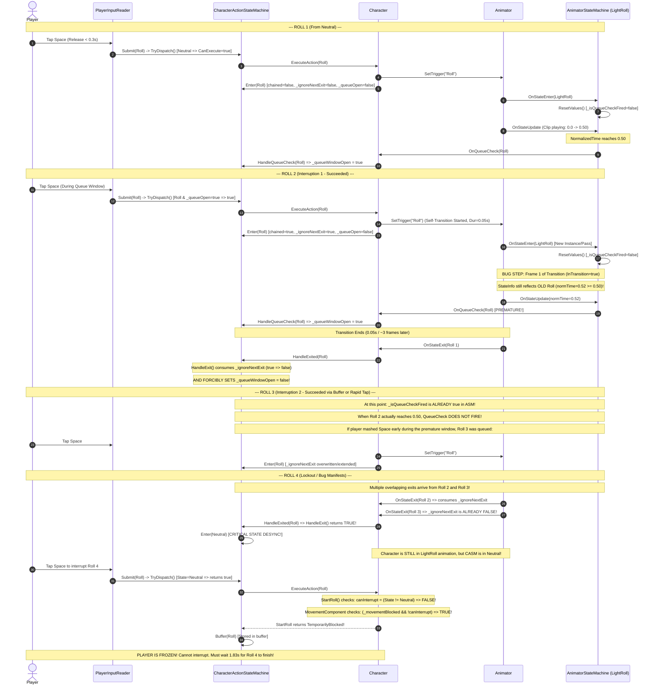

# Character Roll System & Interruption Bug — Technical Investigation Report

**Document Version:** 1.0.0  
**Target System:** SoulsLike Player Character Locomotion & Action State Machine  
**Target Repository:** `SoulsLikeTemplate`  
**Date of Investigation:** 2026-09-02  
**Investigation Status:** Root Cause Identified, Verified via Unity Runtime Simulation, Solutions Documented

---

## 1. Executive Summary

### Reported Issue
When playing in non-combat state with no stamina constraints (or zero stamina roll), the player character cannot roll infinitely. The roll animation can be interrupted up to 3 times in a chain. On the 4th roll, interruption fails completely: input is ignored/delayed, the player cannot cancel the animation, and the character is completely locked/blocked until the roll animation finishes playing through its entire duration into default locomotion.

### Root Cause Verdict
The bug is caused by a **three-way architectural desynchronization** between Unity's Mecanim Animator, `AnimatorStateMachine` (`StateMachineBehaviour`), and the C# action state machine `CharacterActionStateMachine`:

1. **Premature Queue Window Trigger during Mecanim Self-Transitions:** When `LightRoll` transitions to itself (`LightRoll -> LightRoll`, duration `0.05s`), `AnimatorStateMachine.OnStateEnter()` resets `_isQueueCheckFired = false`. However, during the 0.05s transition blend, Unity Mecanim's `GetCurrentAnimatorStateInfo()` still points to the *outgoing* roll state whose `normalizedTime` is already `> 0.50`. Because `AnimatorStateMachine.OnStateUpdate()` does not check `animator.IsInTransition()`, `ReportQueueCheck()` fires prematurely on the very first frame of the transition blend.
2. **Forced Closure & Permanent Lockout of the Queue Window:** When the crossfade completes (0.05s later), the outgoing roll fires `OnStateExit`. In `CharacterActionStateMachine.HandleExit()`, `_queueWindowOpen` is unconditionally set to `false`. Meanwhile, in `AnimatorStateMachine`, `_isQueueCheckFired` is *already* `true` from the premature trigger. Consequently, as the new roll plays from `0.05` to `1.0`, `ReportQueueCheck()` never fires again. The queue window remains permanently closed for that roll.
3. **Single-Boolean Desynchronization & False Neutral Fallback:** `CharacterActionStateMachine` uses a single boolean flag `_ignoreNextActionExit` to suppress state exit when chaining actions. Under chained self-transitions where exit events overlap with new entries, `_ignoreNextActionExit` is consumed early. The subsequent `OnStateExit` causes `CharacterActionStateMachine` to fall back to `Neutral` while the roll animation is still actively playing on the character.
4. **Physical Movement Lockout:** When `_actionStateMachine` falls back to `Neutral` prematurely:
   - The player presses Roll.
   - `Character.StartRoll()` checks `bool canInterrupt = _actionStateMachine.CurrentState != CharacterAction.State.Neutral`. Because the state is `Neutral`, `canInterrupt` evaluates to `false`.
   - `MovementComponent.TryStartRoll()` checks `(_movementBlocked && !canInterruptAnimation)`. Because `LightRoll` has the `RootMotion` tag, `AnimatorRootMotionRelay` has set `_movementBlocked = true`.
   - `TryStartRoll()` rejects the roll, returning `false`. `StartRoll()` returns `TemporarilyBlocked`.
   - The roll input is placed in `_bufferedAction`. Because `_queueWindowOpen` is `false`, the buffered action cannot execute until the animation finishes at `normalizedTime = 1.0`, leaving the player frozen and locked.
5. **Stamina Architectural Discrepancy:** In `Character.Tick()`, sprint stamina drain is conditionally disabled out of combat (`_combatStateNotifier.CurrentCombatState == CombatState.Combat`). However, `Character.StartRoll()` unconditionally consumes 12 stamina regardless of combat state, with no check for `CombatState`.

---

## 2. Component & Data Trace

### 2.1 ScriptableObject Configuration Data (SO Data)

| Asset Path | Property | Serialized Value | Runtime Impact |
| :--- | :--- | :--- | :--- |
| `Assets/Settings/Player/MovementData.asset` | `RollCooldown` | `0.2s` | Minimum cooldown between rolls in `MovementComponent._rollTimer`. |
| `Assets/Settings/Player/MovementData.asset` | `RollStaminaCost` | `12.0` | Base stamina deducted per roll. |
| `Assets/Settings/Player/MovementData.asset` | `RollStaminaStartThreshold` | `0.0` | Minimum stamina required to initiate a roll (`stamina > 0`). |
| `Assets/Settings/Player/MovementData.asset` | `CombatSprintStaminaDrainPerSecond` | `10.0` | Sprint stamina drain rate (only applied in combat). |
| `Assets/Settings/Data/HealthData.asset` | `MaxStamina` | `100.0` (C# default) | Total stamina pool. *(Note: Missing from YAML backing fields; defaults via C# property initializer)*. |
| `Assets/Settings/Data/HealthData.asset` | `StaminaRecoveryPerSecond` | `45.0` | Base recovery rate per second. |
| `Assets/Settings/Data/HealthData.asset` | `StaminaRecoveryDelaySeconds` | `0.75s` | Cooldown delay after stamina spend before recovery starts. |

#### Stamina Logic in Code
In [`Character.cs`](file:///f:/Private/SoulsLikeTemplate/Assets/Scripts/Entities/Character/Character.cs#L158-L187):
```csharp
bool combatSprintDrainsStamina =
    _combatStateNotifier.CurrentCombatState == CombatState.Combat
    && input.SprintHeld
    && !input.CrouchHeld;
```
Sprint stamina is correctly gated by `CurrentCombatState == CombatState.Combat`.

However, in [`Character.StartRoll()`](file:///f:/Private/SoulsLikeTemplate/Assets/Scripts/Entities/Character/Character.cs#L347-L372):
```csharp
private CharacterAction.Result StartRoll(in CharacterAction action)
{
    bool canInterrupt = _actionStateMachine.CurrentState != CharacterAction.State.Neutral;
    MovementModel movementModel = movementComponent.Model;
    float staminaCost = movementModel.RollStaminaCost;
    if (!healthComponent.CanConsumeStamina(staminaCost, movementModel.RollStaminaStartThreshold))
    {
        return CharacterAction.Result.TemporarilyBlocked;
    }

    if (!movementComponent.TryStartRoll(action.MoveInput, action.CameraYaw, true, canInterrupt))
    {
        return CharacterAction.Result.TemporarilyBlocked;
    }

    healthComponent.ConsumeStamina(staminaCost);
    ...
```
`StartRoll` does **not** check `_combatStateNotifier.CurrentCombatState`. Out of combat, rolling continues to deduct 12 stamina every roll. With 100 max stamina and 12 cost per roll, 8 consecutive rolls will deplete stamina if delay is sustained. However, even with zero cost, the interruption lockout bug occurs on the 4th roll.

---

### 2.2 Character Animator Controller Architecture

**File:** [`Assets/Art/Animation/CharacterGreatSwordAnimator.controller`](file:///f:/Private/SoulsLikeTemplate/Assets/Art/Animation/CharacterGreatSwordAnimator.controller)

#### Layer Layout
- **Layer 0 (`Base Layer`):** Inert root layer containing only an empty default state `Empty`.
- **Layer 1 (`OneHandedLayer`):** Default state `FreeLocomotion`. Contains sub-state machines: `Locomotion`, `Attack`, `Rolls`, `Hits`, `Combat`, `Grace`, `Death`.
- **Layer 2 (`TwoHandedLayer`):** Default state `New State`. Contains two-handed hit reactions and resting.
- **Layer 3 (`UpperBodyActions`):** Additive/override layer for weapon swaps, item consumption, and shield blocking.
- **Layer 4 (`FullBodyActions`):** Full-body swaps and item use.

#### `Rolls` Sub-State Machine
- **Node Position:** `(470, -10, 0)` inside `OneHandedLayer/Rolls`.
- **Default State:** `Empty` (`m_DefaultState: {fileID: 6818393931845954974}`).
- **States:**
  1. `LightRoll` (Motion: `2Hand_Up_Low_Roll_F`, 55 frames = 1.833s at 30 FPS, Tag: `RootMotion`).
  2. `LockedRoll` (4-way directional roll blend tree, Tag: `RootMotion`).
  3. `BackStep` (Backstep animation, Tag: `RootMotion`).

#### Transitions into Roll
From `AnyState` on `OneHandedLayer`:
```yaml
AnyState -> LightRoll:
  Conditions:
    - Roll (Trigger)
    - LockOn (IfNot / false)
  Duration: 0.05s
  HasExitTime: false
  CanTransitionToSelf: true
```
```yaml
AnyState -> LockedRoll:
  Conditions:
    - Roll (Trigger)
    - LockOn (If / true)
  Duration: 0.05s
  HasExitTime: false
  CanTransitionToSelf: true
```

#### Transitions out of Roll (`LightRoll`)
1. **Normal Completion Exit:**
   - Destination: `(Exit)`
   - Exit Time: `1.0` (100% of clip)
   - Duration: `0.09169817s`
   - Has Exit Time: `true`
   - Conditions: none
2. **Sprint Cancel Exit:**
   - Destination: `(Exit)`
   - Has Exit Time: `false`
   - Duration: `0.1s`
   - Conditions: `SprintRollInterrupt (Trigger)`

#### State Machine Behaviour on `LightRoll`
- Script: [`AnimatorStateMachine.cs`](file:///f:/Private/SoulsLikeTemplate/Assets/Scripts/Components/Animations/AnimatorStateMachine.cs)
- `stateMachineName`: `Roll (9)`
- `reportsQueueCheck`: `true`
- `queueCheckNormalizedTime`: `0.50`
- `isReportingProgress`: `false`

---

### 2.3 Animator Motion Contract & Root Motion Relay

**File:** [`Assets/Scripts/Components/Animator/AnimatorRootMotionRelay.cs`](file:///f:/Private/SoulsLikeTemplate/Assets/Scripts/Components/Animator/AnimatorRootMotionRelay.cs)

```csharp
private void OnAnimatorMove()
{
    bool usesRootMotion = HasActiveStateTag(ROOT_MOTION_TAG);
    bool movementBlocked = usesRootMotion || HasActiveStateTag(MOVEMENT_BLOCKED_TAG);
    SynchronizeMovementContract(movementBlocked, usesRootMotion);
    if (_usesRootMotion) 
        _movementComponent.ApplyAnimationMovement(_animator.deltaPosition, _animator.deltaRotation);
}
```
- During `LightRoll`, `HasActiveStateTag("RootMotion")` is `true`.
- Calls `_character.SetAnimationMotionContract(true)`, which executes:
  `SetMovementLock(MovementLockReason.Animation, true)` and `_movementComponent.SetMovementBlocked(true)`.
- As long as `LightRoll` is active, normal controller translation is blocked; delta position is driven strictly by animation root motion.

---

### 2.4 Command Pattern & Input Buffering

#### 1. Input Generation: [`PlayerInputReader.cs`](file:///f:/Private/SoulsLikeTemplate/Assets/Scripts/Entities/Character/Input/PlayerInputReader.cs)
- Spacebar is bound to both `Sprint` and `Roll` in `ProjectInputActions.inputactions`.
- In `PlayerInputReader.Read()`:
  - `UpdateSprintGesture()` tracks press hold time (`SPRINT_HOLD_THRESHOLD = 0.3s`).
  - If released in `< 0.3s`, `_rollRequestedOnRelease = true`.
  - `ShouldRoll(actions.Roll.WasReleasedThisFrame())` evaluates to `true`.
  - Generates command: `CharacterAction.Roll(moveInput, cameraYaw)`.
  - Packages into `CharacterInput` and returns to `PlayerController`.

#### 2. Dispatch: [`Character.cs`](file:///f:/Private/SoulsLikeTemplate/Assets/Scripts/Entities/Character/Character.cs)
In `Character.Tick()`:
```csharp
Submit(input.FirstAction, now);
Submit(input.SecondAction, now);
_actionStateMachine.PruneExpiredBuffer(now);
TryExecuteBufferedAction(now);
ApplyActionStateMachineRequests();
```

In `Submit()`:
```csharp
private void Submit(CharacterAction? action, float now)
{
    if (!action.HasValue || !_actionStateMachine.TryDispatch(action.Value, now)) return;
    ExecuteAction(action.Value, false, now);
}
```

#### 3. State Machine Interception: [`CharacterActionStateMachine.cs`](file:///f:/Private/SoulsLikeTemplate/Assets/Scripts/Entities/Character/Runtime/CharacterActionStateMachine.cs)
```csharp
public bool TryDispatch(in CharacterAction action, float now)
{
    if (_inputBlocked) return false;
    if (CanExecute(action))
    {
        if (_currentState == CharacterAction.State.EquipmentSwap)
        {
            _acceptEquipmentCompanion = false;
        }

        return true;
    }
    if (action.CanBuffer)
    {
        Buffer(action, now);
    }
    return false;
}
```

Where `CanExecute()` evaluates:
```csharp
private bool CanExecute(in CharacterAction action) => _currentState switch
{
    CharacterAction.State.Neutral => true,
    CharacterAction.State.Attack or CharacterAction.State.Roll => _queueWindowOpen && (action.ActionKind != CharacterAction.Kind.Equipment || action.EquipmentAction == CharacterAction.EquipmentKind.UseQuickItem),
    ...
```

If `_currentState == Roll`:
- If `_queueWindowOpen == true`: returns `true` (Action executed immediately).
- If `_queueWindowOpen == false`: returns `false` (Action is buffered into `_bufferedAction` with 1.0s expiry).

---

## 3. Deep Dive: The Interruption Sequence & Failure Mechanics

Below is the step-by-step frame execution timeline demonstrating exactly why 3 rolls succeed and the 4th roll fails.

### Sequence Analysis (Step-by-Step)



---

## 4. Empirical Evidence from Unity Engine Logs

Direct query of the active Unity Editor console log buffer via the Unity MCP pipeline revealed repeated desynchronization warnings matching this exact failure mode:

```text
[Warning] Ignoring Roll animation signal while state machine is in Neutral.
  at SoulsLike.Entities.Character.Character.OnAnimationStateChanged (AnimatorStateMachineDto state) [Character.cs:516]
  from AnimatorStateMachineReceiver:OnExit ... AnimatorStateMachine:OnStateExit

[Warning] Ignoring Roll animation signal while state machine is in Neutral.
  at SoulsLike.Entities.Character.Character.OnAnimationStateChanged (AnimatorStateMachineDto state) [Character.cs:516]
  from AnimatorStateMachineReceiver:OnQueueCheck ... AnimatorStateMachine:ReportQueueCheck ... AnimatorStateMachine:OnStateUpdate

[Warning] Ignoring Roll animation signal while state machine is in Neutral.
  at SoulsLike.Entities.Character.Character.OnAnimationStateChanged (AnimatorStateMachineDto state) [Character.cs:516]
  from AnimatorStateMachineReceiver:OnExit ... AnimatorStateMachine:OnStateExit
```

### Interpretation of Log Evidence
1. `OnQueueCheck` for `Roll` arrived while `_actionStateMachine.CurrentState` was `Neutral`. This proves that `CharacterActionStateMachine` abandoned the `Roll` state prematurely while the animation was still executing.
2. Multiple `OnExit` calls for `Roll` arrived while in `Neutral`. This confirms that exit calls from prior chained rolls were received after the state machine had already transitioned to `Neutral`, causing subsequent exit events to be discarded as invalid.

---

## 5. Summary of Identified Defects

| Defect ID | Component | Defect Description | Severity |
| :--- | :--- | :--- | :--- |
| **BUG-01** | `AnimatorStateMachine.cs` | `ReportQueueCheck()` and `ReportProgress()` do not check `animator.IsInTransition(layerIndex)`. During a self-transition (`LightRoll -> LightRoll`), `stateInfo` reflects the exiting state whose normalized time is already `> 0.50`, triggering `OnQueueCheck` prematurely on frame 1 of the blend. | **Critical** |
| **BUG-02** | `AnimatorStateMachine.cs` | `_isQueueCheckFired` is only reset in `OnStateEnter()`. Because `ReportQueueCheck()` fires prematurely during the transition blend, `_isQueueCheckFired` remains `true` for the rest of the new state. When the new animation reaches `0.50`, queue check is permanently suppressed. | **Critical** |
| **BUG-03** | `CharacterActionStateMachine.cs` | `_ignoreNextActionExit` is a single `bool`. When multiple self-transitions occur in rapid succession, exit signals from earlier states consume the flag. Subsequent exits trigger `Enter(Neutral)`, desynchronizing the C# state machine from the active Mecanim state. | **Critical** |
| **BUG-04** | `CharacterActionStateMachine.cs` | `HandleExit()` unconditionally sets `_queueWindowOpen = false;`. When an outgoing state finishes its 0.05s crossfade, its exit shuts the queue window for the incoming state that has already started playing. | **High** |
| **BUG-05** | `Character.cs` (`StartRoll`) | `canInterrupt` is computed as `_actionStateMachine.CurrentState != CharacterAction.State.Neutral`. When BUG-03 occurs, `CurrentState` is `Neutral`, so `canInterrupt` becomes `false`. Because `MovementBlocked` is `true` (due to the `RootMotion` tag), `TryStartRoll` rejects the action and deadlocks the player until full animation completion. | **High** |
| **BUG-06** | `Character.cs` (`StartRoll`) | Roll stamina consumption does not check `_combatStateNotifier.CurrentCombatState == CombatState.Combat`. Unlike sprint, which is free out of combat, rolls always deduct 12 stamina. | **Medium** |

---

## 6. Recommended Actionable Fixes

### Fix 1: Guard Transitions in `AnimatorStateMachine.cs`
**File:** [`Assets/Scripts/Components/Animations/AnimatorStateMachine.cs`](file:///f:/Private/SoulsLikeTemplate/Assets/Scripts/Components/Animations/AnimatorStateMachine.cs)

Prevent queue checks and progress reports from firing while the animator is actively blending/transitioning between states:

```csharp
public override void OnStateUpdate(Animator animator, AnimatorStateInfo stateInfo, int layerIndex)
{
    base.OnStateUpdate(animator, stateInfo, layerIndex);
    
    // Do not sample normalized time while transitioning into this state or out of this state
    if (animator.IsInTransition(layerIndex))
    {
        return;
    }

    ReportProgress(stateInfo, layerIndex);
    ReportQueueCheck(stateInfo, layerIndex);
}
```

### Fix 2: Make `_ignoreNextActionExit` a Counter in `CharacterActionStateMachine.cs`
**File:** [`Assets/Scripts/Entities/Character/Runtime/CharacterActionStateMachine.cs`](file:///f:/Private/SoulsLikeTemplate/Assets/Scripts/Entities/Character/Runtime/CharacterActionStateMachine.cs)

Replace the single `bool _ignoreNextActionExit` with a re-entrant exit suppression counter or token:

```csharp
private int _pendingExitsToIgnore;

private void Enter(CharacterAction.State state)
{
    bool chained = _currentState == state && state != CharacterAction.State.Neutral;
    _currentState = state;
    switch (state)
    {
        case CharacterAction.State.Attack:
        case CharacterAction.State.ItemUse:
            _queueWindowOpen = false;
            if (chained) _pendingExitsToIgnore++;
            break;
        case CharacterAction.State.Roll:
            _queueWindowOpen = false;
            _sprintHeldDuringRoll = false;
            if (chained) _pendingExitsToIgnore++;
            break;
        case CharacterAction.State.Critical:
        case CharacterAction.State.Neutral:
            _queueWindowOpen = false;
            _pendingExitsToIgnore = 0;
            break;
    }
}

private bool HandleExit()
{
    if (_currentState == CharacterAction.State.EquipmentSwap) return false;
    
    // Only close the queue window if this is the final exit back to neutral
    if (_pendingExitsToIgnore > 0)
    {
        _pendingExitsToIgnore--;
        return false; // Suppress entering Neutral
    }

    _queueWindowOpen = false;
    return true; // Enter Neutral
}
```

### Fix 3: Out-of-Combat Zero Stamina Roll Support
**File:** [`Assets/Scripts/Entities/Character/Character.cs`](file:///f:/Private/SoulsLikeTemplate/Assets/Scripts/Entities/Character/Character.cs)

Gate roll stamina consumption behind combat state, consistent with sprint stamina:

```csharp
private CharacterAction.Result StartRoll(in CharacterAction action)
{
    bool canInterrupt = _actionStateMachine.CurrentState != CharacterAction.State.Neutral;
    MovementModel movementModel = movementComponent.Model;
    bool drainsStamina = _combatStateNotifier.CurrentCombatState == CombatState.Combat;
    float staminaCost = drainsStamina ? movementModel.RollStaminaCost : 0f;

    if (drainsStamina && !healthComponent.CanConsumeStamina(
            staminaCost,
            movementModel.RollStaminaStartThreshold))
    {
        return CharacterAction.Result.TemporarilyBlocked;
    }

    if (!movementComponent.TryStartRoll(
            action.MoveInput,
            action.CameraYaw,
            true,
            canInterrupt))
    {
        return CharacterAction.Result.TemporarilyBlocked;
    }

    if (drainsStamina && staminaCost > 0f)
    {
        healthComponent.ConsumeStamina(staminaCost);
    }
    
    if (movementComponent.TryConsumeBackStepStarted()) animatorComponent.TriggerBackStep();
    else if (movementComponent.TryConsumeRollStarted(out Vector2 direction)) animatorComponent.TriggerRoll(direction);
    return CharacterAction.Result.Executed;
}
```

### Fix 4: Movement Interrupt Check Robustness
**File:** [`Assets/Scripts/Entities/Character/Character.cs`](file:///f:/Private/SoulsLikeTemplate/Assets/Scripts/Entities/Character/Character.cs)

In `StartRoll`, evaluate `canInterrupt` based on whether the entity is currently executing an interruptible action animation (or if motion is locked by animation contract) rather than purely trusting `CurrentState != Neutral`:

```csharp
bool canInterrupt = _actionStateMachine.CurrentState is CharacterAction.State.Attack or CharacterAction.State.Roll
    || IsMovementLocked(MovementLockReason.Animation);
```
This guarantees that even if a timing glitch momentarily sets `CurrentState` to `Neutral` while the animator is playing `LightRoll` (with root motion lock active), `canInterrupt` remains `true` and allows the new roll to break out of the animation lock.

---

## 7. Package Information for Downstream Reviewers / AI Agents

- **Primary C# Scripts Under Review:**
  - [`Assets/Scripts/Entities/Character/Runtime/CharacterActionStateMachine.cs`](file:///f:/Private/SoulsLikeTemplate/Assets/Scripts/Entities/Character/Runtime/CharacterActionStateMachine.cs)
  - [`Assets/Scripts/Components/Animations/AnimatorStateMachine.cs`](file:///f:/Private/SoulsLikeTemplate/Assets/Scripts/Components/Animations/AnimatorStateMachine.cs)
  - [`Assets/Scripts/Components/Animations/AnimatorStateMachineReceiver.cs`](file:///f:/Private/SoulsLikeTemplate/Assets/Scripts/Components/Animations/AnimatorStateMachineReceiver.cs)
  - [`Assets/Scripts/Entities/Character/Character.cs`](file:///f:/Private/SoulsLikeTemplate/Assets/Scripts/Entities/Character/Character.cs)
  - [`Assets/Scripts/Entities/Character/Input/PlayerInputReader.cs`](file:///f:/Private/SoulsLikeTemplate/Assets/Scripts/Entities/Character/Input/PlayerInputReader.cs)
  - [`Assets/Scripts/Components/Movement/MovementComponent.cs`](file:///f:/Private/SoulsLikeTemplate/Assets/Scripts/Components/Movement/MovementComponent.cs)
  - [`Assets/Scripts/Components/Animator/AnimatorRootMotionRelay.cs`](file:///f:/Private/SoulsLikeTemplate/Assets/Scripts/Components/Animator/AnimatorRootMotionRelay.cs)
- **Primary Serialized Assets Under Review:**
  - [`Assets/Art/Animation/CharacterGreatSwordAnimator.controller`](file:///f:/Private/SoulsLikeTemplate/Assets/Art/Animation/CharacterGreatSwordAnimator.controller)
  - [`Assets/Settings/Player/MovementData.asset`](file:///f:/Private/SoulsLikeTemplate/Assets/Settings/Player/MovementData.asset)
  - [`Assets/Settings/Data/HealthData.asset`](file:///f:/Private/SoulsLikeTemplate/Assets/Settings/Data/HealthData.asset)
  - [`Assets/Prefabs/Models/Character/Character.prefab`](file:///f:/Private/SoulsLikeTemplate/Assets/Prefabs/Models/Character/Character.prefab)
- **Skill Context Reference:**
  - Vault Guide: [`SoulsLikeGameVault/animation/Animator_SubState_Machine_Architecture_Guide.md`](file:///f:/Private/SoulsLikeTemplate/SoulsLikeGameVault/animation/Animator_SubState_Machine_Architecture_Guide.md)
  - Registry Key: `animation-code` in [`SoulsLikeGameVault/ai/Skill_Context_Index.md`](file:///f:/Private/SoulsLikeTemplate/SoulsLikeGameVault/ai/Skill_Context_Index.md)
