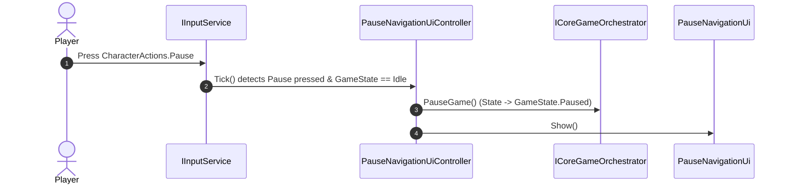
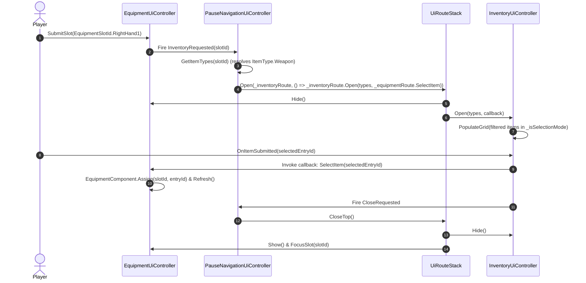

# Pause Navigation Route Architecture

> [!success] Validation status — mostly verified
> Checked against live source on 2026-09-07 at `fcaf410d`. The route stack, injected routes, game-state gating, and current `IPauseNavigationRoute` naming resolve.

This document details the architecture, component interaction, navigation flows, and implementation rules for the **Pause Navigation System** (`Assets/Scripts/Ui/PauseNavigation/`).

---

## 1. Overview

The Pause Navigation System is the central routing hub for character management and game configuration during active gameplay. It manages modal transitions between the Pause Menu root and three primary sub-screens:
1. **Equipment** ([`IEquipmentRoute`](../../../../Assets/Scripts/Ui/Equipment/IEquipmentRoute.cs)) — Weapon, armor, and talisman loadouts.
2. **Inventory** ([`IInventoryRoute`](../../../../Assets/Scripts/Ui/Inventory/IInventoryRoute.cs)) — Item bag browsing and nested item selection for equipment slots.
3. **System** ([`ISystemRoute`](../../../../Assets/Scripts/Ui/System/ISystemRoute.cs)) — Game options, controls, and game quitting.

---

## 2. Core Components & Structure

```
Assets/Scripts/Ui/PauseNavigation/
 ├── IPauseNavigationRoute.cs            (Domain base route interface extending IUiRoute)
 ├── IPauseNavigationPresenter.cs        (Presenter contract for the root Pause UI)
 ├── IPauseMenuRouter.cs                 (Router contract for opening Pause sub-routes)
 ├── PauseNavigationUi.cs               (BaseUi view with root navigation buttons)
 └── PauseNavigationUiController.cs     (Host router controller managing state and UiRouteStack)
```

### A. Domain Route Base: `IPauseNavigationRoute`
Defined in [`Assets/Scripts/Ui/PauseNavigation/IPauseNavigationRoute.cs`](../../../../Assets/Scripts/Ui/PauseNavigation/IPauseNavigationRoute.cs):
```csharp
using System;
using SoulsLike.Ui.Navigation;

namespace SoulsLike.Ui.PauseNavigation
{
    public interface IPauseNavigationRoute : IUiRoute
    {
        event Action CloseRequested;
    }
}
```
All Pause sub-routes (`IEquipmentRoute`, `IInventoryRoute`, `IStatusRoute`, `ISystemRoute`) inherit from this interface, ensuring they provide a standardized `CloseRequested` event.

### B. Presenter Interface: `IPauseNavigationPresenter`
Defined in [`Assets/Scripts/Ui/PauseNavigation/IPauseNavigationPresenter.cs`](../../../../Assets/Scripts/Ui/PauseNavigation/IPauseNavigationPresenter.cs):
```csharp
namespace SoulsLike.Ui.PauseNavigation
{
    public interface IPauseNavigationPresenter
    {
        void OpenEquipment();
        void OpenInventory();
        void OpenStatus();
        void OpenSystem();
    }
}
```
Exposes root menu button actions to the view (`PauseNavigationUi`).

### C. Router Interface: `IPauseMenuRouter`
Defined in [`Assets/Scripts/Ui/PauseNavigation/IPauseMenuRouter.cs`](../../../../Assets/Scripts/Ui/PauseNavigation/IPauseMenuRouter.cs):
```csharp
namespace SoulsLike.Ui.PauseNavigation
{
    public interface IPauseMenuRouter
    {
        void OpenEquipment();
        void OpenInventory();
        void OpenStatus();
        void OpenSystem();
    }
}
```

### D. View: `PauseNavigationUi`
Defined in [`Assets/Scripts/Ui/PauseNavigation/PauseNavigationUi.cs`](../../../../Assets/Scripts/Ui/PauseNavigation/PauseNavigationUi.cs):
- Inherits from [`BaseUi`](../../../../Assets/Scripts/Ui/Base/BaseUi.cs).
- Binds buttons (`openEquipmentButton`, `openInventoryButton`, `openStatusButton`, `openSystemButton`) to presenter methods.
- The Status entry uses `CustomButton.onClick`, matching the pre-existing button wiring.

### E. Controller & Host Router: `PauseNavigationUiController`
Defined in [`Assets/Scripts/Ui/PauseNavigation/PauseNavigationUiController.cs`](../../../../Assets/Scripts/Ui/PauseNavigation/PauseNavigationUiController.cs):
- Implements `IInitializable`, `ITickable`, `IDisposable`, `IPauseNavigationPresenter`, `IPauseMenuRouter`.
- Injected dependencies:
  - `IUiService` — UI factory and view instantiation.
  - `ICoreGameOrchestrator` — Game state control (`PauseGame()`, `ResumeGame()`, `GameState`).
  - `IInputService` — Input action queries (`UiBackAction`, `Pause`, `OpenEquipmentAction`, `OpenInventoryAction`).
  - `IEquipmentRoute` — Sub-route for equipment management.
  - `IInventoryRoute` — Sub-route for inventory and item picking.
  - `IStatusRoute` — Character status overview; exposes `CloseRequested`.
  - `ISystemRoute` — Sub-route for system settings and quit.
- Manages an internal [`UiRouteStack`](../../../../Assets/Scripts/Ui/Navigation/UiRouteStack.cs).

---

## 3. Navigation Flows & Sequence

### A. Opening Pause Menu from Gameplay


### B. Nested Sub-Route Flow: Equipment to Inventory Item Picker
When selecting a weapon or armor slot in the Equipment screen:



### C. Direct Gameplay Hotkeys
Players can open Equipment or Inventory directly from gameplay without clicking through the Pause root menu:
1. `_inputService.OpenEquipmentAction.WasPressedThisFrame()` or `OpenInventoryAction` triggers in `Tick()`.
2. Controller verifies `_gameOrchestrator.CurrentGameState == GameState.Idle`.
3. Controller pauses gameplay: `_gameOrchestrator.PauseGame()`.
4. Controller opens the route directly on `UiRouteStack` (`_routeStack.Open(_equipmentRoute)`).
5. When the player backs out, `CloseTop()` pops the route and restores the root pause menu, or closing the pause menu resumes gameplay.

### D. Back & Stack Unwinding Logic
```csharp
private void HandleUiBack()
{
    if (_routeStack.HasOpenRoutes)
    {
        _routeStack.CloseTop();
        return;
    }

    _view.Hide();
    _gameOrchestrator.ResumeGame();
}
```

---

### E. Status Overview

The pause root opens `IStatusRoute`, implemented by `StatusUiController` in `Assets/Scripts/Ui/Status/`. The controller creates `StatusUi` through the existing UI factory and binds its `IStatusPresenter`. `StatusUi` is Addressable under its class name and saved at `Assets/Prefabs/Ui/Status/StatusUi.prefab`.

Back uses the existing pause route stack. Help is inline and nonmodal. F uses the existing `ToggleSimpleViewAction`; Help is accessible through the footer controls without adding input actions.

The overview reads character attributes, held currency, current/max vitals, equipment weight, existing UI capacity convention, current poise, and the sum of the five base attack channels for each armament slot. Empty armament slots display zero. Player name, level, next-level cost, load class, discovery, spells/memory, player defense/negation, and resistances display `—` until domain data exists. Item guard values are not used as player defense. The poise label explicitly says **Current poise**.

The view fits a centered 1920 × 1080 reference composition uniformly inside the existing UI canvas, with separate fullscreen atmosphere. The prefab reuses inventory/equipment art and fonts and one exported soft-panel sprite. Footer navigation uses `CustomButton` with explicit navigation and hidden/disabled action suppression.

## 4. Slot-to-ItemType Mapping Rules

When opening the inventory picker for an equipment slot, `PauseNavigationUiController` applies slot filter rules:

```csharp
private static IReadOnlyCollection<ItemType> GetItemTypes(EquipmentSlotId slotId)
{
    if (slotId is >= EquipmentSlotId.RightHand1 and <= EquipmentSlotId.RightHand3)
    {
        return _rightHandItemTypes; // Weapon
    }

    if (slotId is >= EquipmentSlotId.LeftHand1 and <= EquipmentSlotId.LeftHand3)
    {
        return _leftHandItemTypes;  // Weapon, Shield
    }

    if (slotId is >= EquipmentSlotId.Arrow1 and <= EquipmentSlotId.Bolt2)
    {
        return _ammunitionItemTypes; // Ammunition
    }

    if (slotId is >= EquipmentSlotId.Head and <= EquipmentSlotId.Legs)
    {
        return _armorItemTypes;      // Armor
    }

    if (slotId is >= EquipmentSlotId.Talisman1 and <= EquipmentSlotId.Talisman4)
    {
        return _talismanItemTypes;   // Talisman
    }

    return _consumableItemTypes;     // Consumable (Quick Item slots)
}
```

---

## 5. VContainer DI Registration

Registered in [`CharacterFactory.cs`](../../../../Assets/Scripts/Entities/Character/CharacterFactory.cs):

```csharp
builder.Register<EquipmentUiController>(Lifetime.Singleton).AsSelf().AsImplementedInterfaces();
builder.Register<InventoryUiController>(Lifetime.Singleton).AsSelf().AsImplementedInterfaces();
builder.Register<StatusUiController>(Lifetime.Singleton).AsSelf().AsImplementedInterfaces();
builder.Register<PauseNavigationUiController>(Lifetime.Singleton).AsSelf().AsImplementedInterfaces();
```

---

## 6. Refactored `IPauseMenuRouter` Naming

The interface previously named `IPauseNavigationRouteNavigation` was refactored to **`IPauseMenuRouter`** to eliminate word stutter ("Navigation" repeated twice) and adhere to standard C# UI routing conventions.

### Completed Action Items
- [x] Rename interface file to [`IPauseMenuRouter.cs`](../../../../Assets/Scripts/Ui/PauseNavigation/IPauseMenuRouter.cs).
- [x] Update definition: `public interface IPauseMenuRouter { void OpenEquipment(); void OpenInventory(); void OpenSystem(); }`.
- [x] Update [`PauseNavigationUiController.cs`](../../../../Assets/Scripts/Ui/PauseNavigation/PauseNavigationUiController.cs) implementation list.
- [x] Update DI bindings and consumers.
- [x] Tracking note: [[History/Records/Pause Navigation Naming Refactor|Pause Navigation Naming Refactor]].
