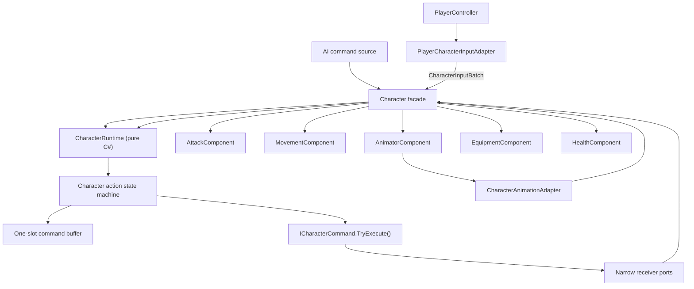

# Character Command/HSM Runtime Refactor Plan

## Facade/Mediator + Pure C# Action Runtime + GoF Commands

> **Status:** Authoritative refactor plan  
> **Primary implementation target:** `Assets/Scripts/Entities/Character/Character.cs`  
> **Supporting targets:** `CharacterActionBuffer`, `PlayerController`, `AttackComponent`, `AnimatorComponent`, `MovementComponent`, `EquipmentComponent`, `HealthComponent`, `IComponentMediator`, and `CharacterFactory`  
> **Scope:** Architecture and behavior-preserving migration instructions; this document does not itself change gameplay behavior.

---

## 1. Final decision

Use a pragmatic hybrid of the attached Plan B and Plan C:

- Keep `Character` as the Unity GameObject identity and public Facade.
- Keep `Character` as the player-specific Mediator for short, explicit, linear use cases.
- Move volatile per-frame decisions into a pure C# `CharacterRuntime`.
- Replace the passive buffered-action union with self-executing GoF Command objects.
- Replace action booleans and procedural eligibility checks with an action state machine designed to grow hierarchically.
- Keep continuous locomotion and grounded physics inside `MovementComponent`.
- Replace broad component access with narrow, caller-specific ports.
- Do not introduce an Event Aggregator, Message Bus, global signals container, static gameplay events, or peer-component subscription graph.

The central design rule is:

```text
Character remains the explicit place for readable, player-specific coordination.
CharacterRuntime becomes the explicit place for action state, command policy,
buffering, and per-frame behavior decisions.
```

This deliberately does **not** pursue the attachment's thinnest possible facade. A `Character` method that performs one understandable use case by calling several components in order is valid and desirable.

---

## 2. Source-of-truth diagnosis

The implementation must be based on the current source, not on stale line numbers or earlier architectural notes.

### 2.1 Current responsibilities in `Character`

`Character` currently owns all of these concerns:

| Concern | Current symbol |
|---|---|
| Unity identity, serialized references, initialization | `Character.Initialize` |
| Raw Unity input interpretation | `Character.UpdateBehaviour` |
| Sprint-versus-roll gesture state | `_sprintHoldTimer`, `_sprintHoldQualified`, `_rollPressedDuringRoll` |
| Simultaneous input priority | conditional ordering in `UpdateBehaviour` |
| Action eligibility | `canStartAttack`, `canBufferAttack`, and related expressions |
| Passive action buffering | `CharacterActionBuffer` |
| Central action-type execution | `Character.TryExecuteBufferedAction` |
| Animation queue window | `_actionTransitionOpen` |
| Movement-block merging | `_manualMovementBlocked`, `_animationMovementBlocked` |
| Root-motion permission | `_animationRootMotionEnabled` |
| Equipment swap transaction | `_pendingEquipmentSwapGroup`, `_equipmentSwapPhase`, and swap methods |
| Loadout presentation and combat synchronization | `NotifyEquipmentLoadoutChanged` |
| Quick-item effects | `TryUseActiveQuickItem` |
| Animation callback routing | `NotifyAnimatorStateChanged` |
| Broad component mediator | `IComponentMediator` implementation |
| Health use cases | `ApplyDamage`, `Heal`, `Revive` |
| Lock-on coordination | `SetLockOnTarget` |

The refactor must remove the stateful update, buffer, and transaction responsibilities without removing the useful entity boundary.

### 2.2 Current buffer behavior that must be preserved first

`CharacterActionBuffer` currently has behavior that is easy to change accidentally:

- Capacity is one action.
- Buffering a new action overwrites the old action.
- The nominal lifetime is one second.
- The timer is not checked while `AttackComponent.IsActionActive` is true.
- An apparently expired action can therefore still execute at `QueueCheck` while an action remains active.
- The action is consumed exactly once after successful execution.

The new design must make these rules explicit before any gameplay tuning is attempted.

### 2.3 Current attack coupling

`AttackComponent` currently:

- Reads `ProjectInputActions.CharacterActions`.
- Produces `BufferedCharacterAction` values.
- Tracks global action activity through animator state names.
- Calls the broad mediator to play animations and change charged-attack speed.

The target attack component receives semantic requests, resolves attack-domain results, and returns those results to its caller. It must not read player input or coordinate the animator.

### 2.4 Existing notes that are no longer authoritative

`Character_Mediator_Architectural_Analysis.md` is useful historical context but contains stale conclusions:

- `EquipmentComponent` now calls `IComponentMediator.NotifyEquipmentLoadoutChanged`.
- `InventoryComponent` is no longer an empty placeholder.

Do not edit or delete that note during this task. This document supersedes it for the Character refactor.

---

## 3. Non-negotiable constraints

### 3.1 Preserve explicit control flow

The runtime path must remain traceable in Rider and the Unity debugger:

```text
Player input adapter or AI
    -> semantic control frame and commands
    -> Character facade
    -> CharacterRuntime
    -> active action state
    -> command.TryExecute()
    -> narrow receiver implemented by Character
    -> explicit component calls
```

Animation callbacks follow the reverse boundary:

```text
Unity animator callback
    -> animation adapter
    -> normalized CharacterAnimationSignal
    -> Character
    -> CharacterRuntime / action state machine
```

There must be no hidden broadcast step.

### 3.2 No gameplay event bus

Do not add:

- `EventBus`, `MessageBus`, `SignalBus`, or equivalent global service.
- Static gameplay events.
- String-based messages.
- Runtime subscriber discovery.
- Attack/animation/movement/equipment components subscribing to one another.

Existing local model-to-UI notifications may remain:

- `HealthModel.OnStatsChanged`
- `HealthModel.OnDamageApplied`
- `EquipmentComponent.SlotChanged`
- `EquipmentComponent.LoadoutChanged`
- `InventoryModel.Changed`

Those events are presentation refresh mechanisms. They must not become the way gameplay components coordinate.

### 3.3 Do not move the god object

The following outcomes are rejected:

- Renaming all `Character` logic to `CharacterRuntime` without separating ownership.
- A `CharacterContext` bag containing every component.
- A single command receiver containing every operation.
- One state class per animator clip.
- Partial classes that only redistribute the same responsibilities.
- Adapter wrappers that only forward identical signatures and add no translation.

### 3.4 Preserve gameplay before improving gameplay

Do not change these values or semantics during the refactor:

- Sprint hold threshold.
- One-second buffer duration.
- Latest-input replacement behavior.
- Input priority.
- Queue-window timing.
- Combo alternation.
- Roll/backstep contextual attacks.
- Equipment swap ordering.
- Root-motion or movement speeds.
- Damage, stamina, focus, or item values.

Any desired gameplay change must be implemented after parity tests pass and in a separate change.

---

## 4. Pattern glossary and ownership

### 4.1 Facade

`Character` is a Facade because callers such as `PlayerController`, targeting, UI, and gameplay systems use it as the stable entry point for the player entity.

Examples:

```csharp
character.ApplyDamage(request);
character.Revive(health);
character.SetLockOnTarget(isLockedOn, target);
character.Tick(inputBatch);
character.Submit(command);
```

The Facade hides the internal object graph from external callers.

### 4.2 Mediator

`Character` is also a Mediator when it coordinates several player components in one explicit use case.

This is valid:

```csharp
public void Revive(float health)
{
    HealthStats stats = healthComponent.CalculateRevive(
        healthComponent.Stats,
        health);

    healthComponent.ApplyAuthoritativeStats(stats);

    // Future explicit consequences remain here:
    // animatorComponent.PlayRevive();
    // movementComponent.SetMovementBlocked(...);
}
```

The method is readable, ordered, debuggable, and has one reason to change: the player revive use case.

The problem is not that `Character` coordinates components. The problem is that it currently also interprets raw input, simulates action state with booleans, owns timers, buffers commands, and manages long-running transactions.

### 4.3 Runtime

`CharacterRuntime` is a plain C# object responsible for:

- Processing one semantic character frame.
- Owning the action state machine.
- Submitting commands to the active state.
- Owning buffer and queue-window policy.
- Computing the effective movement policy.
- Exposing read-only action context to the mediator.

It is not a `MonoBehaviour` and does not read Unity scene state.

### 4.4 Adapter

An adapter translates between two APIs or data models. It is not another gameplay manager.

Required adapters:

| Adapter | Translation |
|---|---|
| `PlayerCharacterInputAdapter` | Unity `InputAction` values and camera yaw to semantic control data and commands |
| `CharacterAnimationAdapter` | `AnimatorStateMachineDto` to `CharacterAnimationSignal` |
| `UnityCharacterClock` | `Time.time` to the testable `ICharacterClock` port |

`MovementComponent` already adapts gameplay calls to `CharacterController`. `AnimatorComponent` already adapts gameplay presentation calls to `Animator`. They may implement matching ports directly. Do not create `MovementComponentAdapter` or `AnimatorComponentAdapter` merely to forward identical arguments.

### 4.5 Port

A port is a small interface describing one direction of communication. It prevents a reusable component from seeing every capability of `Character`.

### 4.6 Command

A command is an object that captures immutable semantic intent and knows how to execute itself through one narrow receiver.

The action state machine decides **when** a command may execute. The command decides **how to invoke** its receiver. The receiver coordinates the concrete player components.

---

## 5. Target architecture



Dependency direction:

```text
Player/AI adapters depend on commands and semantic input types.
Runtime and states depend on commands, policies, and narrow ports.
Commands depend on one capability-specific receiver.
Character implements receiver and callback ports.
Unity components do not depend on runtime states or peer components.
CharacterFactory is the only object that knows the complete composition graph.
```

---

## 6. Final `Character` boundary

### 6.1 Responsibilities that remain

`Character` retains:

- Serialized component references that belong to the player prefab.
- VContainer injection and entity initialization.
- Public identity and read-only player properties.
- `Tick` and `Submit` delegation to `CharacterRuntime`.
- Short, linear player use cases.
- Narrow command receiver implementations.
- Narrow component callback implementations.
- Explicit mapping between runtime/domain results and Unity component calls.

### 6.2 Responsibilities that leave

Remove from `Character`:

- `ProjectInputActions.CharacterActions` reads.
- Sprint/roll and heavy-attack gesture state.
- `CharacterActionBuffer` ownership.
- `BufferedCharacterAction` type inspection.
- `TryExecuteBufferedAction`.
- `_actionTransitionOpen`.
- `_pendingEquipmentSwapGroup` and `_equipmentSwapPhase`.
- Action-state checks based on `AttackComponent.IsActionActive`.
- Movement-block boolean merging.
- Root-motion contract state.
- The large `UpdateBehaviour` decision tree.

### 6.3 Size target

Aim for approximately 200–300 lines. Do not distort the design merely to hit a line count.

The important acceptance conditions are:

- No raw input parsing.
- No state-machine simulation through unrelated booleans.
- No command-type execution branching.
- No long-running transaction state.
- Linear use-case methods remain easy to read.

### 6.4 Target public shape

The exact serialized fields stay aligned with the prefab, but the public shape should converge on:

```csharp
public sealed class Character : MonoBehaviour, IInitializable,
    IAttackCommandReceiver,
    IMovementCommandReceiver,
    IEquipmentCommandReceiver,
    IMovementPresentationSink,
    IAnimationStateSink,
    IRootMotionSink,
    IEquipmentLoadoutSink
{
    public Transform CameraTarget => cameraTarget;
    public InventoryComponent InventoryComponent => inventoryComponent;
    public HealthStats HealthStats => healthComponent.Stats;
    public CharacterAttributeStats Attributes => attributes;
    public bool IsInputBlocked => _runtime.IsInputBlocked;

    public void Tick(in CharacterInputBatch input)
    {
        _runtime.Tick(input);
    }

    public CharacterCommandDisposition Submit(ICharacterCommand command)
    {
        return _runtime.Submit(command);
    }

    public void Revive(float health)
    {
        HealthStats stats = healthComponent.CalculateRevive(
            healthComponent.Stats,
            health);

        healthComponent.ApplyAuthoritativeStats(stats);

        // Future presentation/control consequences stay explicit here.
    }
}
```

Do not inject the concrete `Character` into the runtime, states, or commands. Register it as the narrow receiver interfaces they require.

---

## 7. Semantic frame and input adapter

### 7.1 Continuous input is not a command

Held values belong to the current frame and are not buffered:

```csharp
public readonly struct CharacterControlFrame
{
    public Vector2 MoveInput { get; }
    public float CameraYaw { get; }
    public bool SprintHeld { get; }
    public bool CrouchHeld { get; }
    public bool GuardHeld { get; }
    public bool StrongAttackHeld { get; }
}
```

Keeping `Vector2 + cameraYaw` in the first migration preserves the existing `MovementComponent` API. Converting to world-space intent is a later optional improvement, not a prerequisite for this refactor.

### 7.2 Discrete input becomes commands

Commands are created only on input edges:

- Attack press.
- Strong attack press.
- Roll resolved from sprint-button release.
- Jump press.
- Equipment group switch.
- Hand-mode toggle.
- Quick-item use.

### 7.3 Gesture ownership

`SprintRollGestureResolver` owns:

- The `0.3f` hold threshold.
- Press, hold qualification, and release.
- The existing press-during-roll behavior.

`HeavyAttackGestureResolver` owns:

- Strong attack press/hold/release.
- Suppression of light attack until release.
- Production of a heavy-attack command on the valid press edge.

Neither resolver knows about movement, animator, attack, or equipment components.

### 7.4 Fixed-capacity input batch

Do not allocate a command list every frame. Use a fixed-capacity value that can preserve the current rare same-frame combination of an equipment input plus a hand-mode input:

```csharp
public readonly struct CharacterInputBatch
{
    public CharacterControlFrame ControlFrame { get; }
    public ICharacterCommand FirstCommand { get; }
    public ICharacterCommand SecondCommand { get; }
    public int CommandCount { get; }
}
```

Capacity is two unless characterization tests prove current behavior requires more.

### 7.5 Input priority

The input adapter preserves the current order:

| Priority | Candidate |
|---:|---|
| 100 | Advance an already-running equipment transaction; this is state work, not new input |
| 90 | Switch weapon, shield, quick item, or use quick item |
| 80 | Toggle hand mode |
| 70 | Attack, strong attack, special attack, or left-hand action |
| 60 | Roll resolved on sprint release |
| 50 | Jump |

Input priority chooses the command candidates. The active action state independently decides whether each command executes, buffers, or rejects.

### 7.6 Runtime tick order

One character tick executes in this order to preserve current behavior:

1. Tick the current action state so pending internal transitions can advance.
2. Submit batch commands in stored priority order.
3. Resolve the current action state's movement policy.
4. Apply continuous movement, crouch, guard, sprint, and charged-input values.
5. Prune expired commands only when the active state policy allows expiry.

Discrete actions therefore start before movement is applied, matching the current `UpdateBehaviour` ordering.

`PlayerController` continues to own lock-on input and camera rotation. It replaces the call to `Character.UpdateBehaviour` with:

```text
inputAdapter.Read(...)
    -> CharacterInputBatch
    -> Character.Tick(batch)
```

---

## 8. Command pattern

### 8.1 Core interface

```csharp
public interface ICharacterCommand
{
    CharacterCommandKind Kind { get; }
    CharacterCommandBufferPolicy BufferPolicy { get; }

    CharacterCommandExecutionResult TryExecute();
}
```

`TryExecute` is atomic. Do not add a separate `CanExecute` followed by `Execute`, because component state could change between the two calls.

### 8.2 Execution result

```csharp
public enum CharacterCommandExecutionStatus
{
    Executed,
    TemporarilyBlocked,
    Invalid
}

public readonly struct CharacterCommandExecutionResult
{
    public CharacterCommandExecutionStatus Status { get; }
    public CharacterActionStateId StartedState { get; }
}
```

Semantics:

- `Executed`: consume the command and transition to `StartedState` when required.
- `TemporarilyBlocked`: retain only if the active state and command buffer policy permit it.
- `Invalid`: consume or drop; retrying the same captured request is not useful.

### 8.3 State disposition

```csharp
public enum CharacterCommandDisposition
{
    Executed,
    Buffered,
    Rejected,
    Ignored
}
```

The state machine returns this result to input or AI callers. Do not encode disposition with combinations of booleans.

### 8.4 Narrow receivers

Use capability interfaces rather than one universal command receiver:

```csharp
public interface IAttackCommandReceiver
{
    CharacterCommandExecutionStatus TryStartAttack(in AttackRequest request);
    void SetStrongAttackHeld(bool held);
}

public interface IMovementCommandReceiver
{
    CharacterCommandExecutionStatus TryStartRoll(in RollRequest request);
    CharacterCommandExecutionStatus TryStartJump(in JumpRequest request);
}

public interface IEquipmentCommandReceiver
{
    CharacterCommandExecutionStatus TryStartEquipmentAction(
        in EquipmentActionRequest request);
}
```

`Character` implements these interfaces and keeps the concrete component orchestration visible.

### 8.5 Example command

```csharp
public sealed class RollCommand : ICharacterCommand
{
    private readonly IMovementCommandReceiver _receiver;
    private readonly RollRequest _request;

    public CharacterCommandKind Kind => CharacterCommandKind.Roll;
    public CharacterCommandBufferPolicy BufferPolicy { get; }

    public RollCommand(
        IMovementCommandReceiver receiver,
        in RollRequest request,
        CharacterCommandBufferPolicy bufferPolicy)
    {
        _receiver = receiver;
        _request = request;
        BufferPolicy = bufferPolicy;
    }

    public CharacterCommandExecutionResult TryExecute()
    {
        CharacterCommandExecutionStatus status = _receiver.TryStartRoll(_request);
        return new CharacterCommandExecutionResult(
            status,
            status == CharacterCommandExecutionStatus.Executed
                ? CharacterActionStateId.Roll
                : CharacterActionStateId.None);
    }
}
```

Commands must not hold:

- A concrete `Character`.
- A `MovementComponent`, `AttackComponent`, or `AnimatorComponent`.
- Raw `InputAction` objects.
- Mutable HSM state.
- A service-locator context.

### 8.6 Command family

Create only these initial command classes:

- `AttackCommand`, with `AttackRequest` describing light/heavy/special/hand intent.
- `RollCommand`.
- `JumpCommand`.
- `EquipmentActionCommand`, with group/action data.
- `ToggleHandModeCommand` if its execution behavior is distinct from other equipment actions.
- `UseQuickItemCommand` if it is not represented by `EquipmentActionCommand`.

Do not create separate command classes for light-attack animation variants or left/right trigger variants.

### 8.7 Execution-time action context

Commands capture semantic intent, not the current HSM state. When an attack command executes, the `Character` receiver reads the runtime's current action context and passes the required narrow context to `AttackComponent`.

This preserves current behavior where a buffered attack can resolve differently depending on whether it executes during a roll, backstep context window, sprint, or previous combo action.

---

## 9. Command buffer

### 9.1 Exact initial policy

The replacement `CharacterCommandBuffer` is a pure C# one-slot store:

| Rule | Required value |
|---|---|
| Capacity | 1 |
| Replacement | Latest command replaces existing command |
| Lifetime | 1 second |
| Consumption | Exactly once after successful execution |
| Time source | Injected `ICharacterClock` |
| State knowledge | None |

### 9.2 Clock

```csharp
public interface ICharacterClock
{
    float Now { get; }
}

public sealed class UnityCharacterClock : ICharacterClock
{
    public float Now => Time.time;
}
```

Only the Unity adapter references `Time`. Tests use a fake clock.

### 9.3 Entry

```csharp
internal readonly struct BufferedCharacterCommand
{
    public ICharacterCommand Command { get; }
    public float CapturedAt { get; }
    public float ExpiresAt { get; }
}
```

### 9.4 Buffer responsibilities

The buffer owns only:

- Storage.
- Latest-wins replacement.
- Timestamp calculation.
- Peek/take/clear operations.
- Expiry calculation when asked.

The buffer must not ask whether an attack or roll is active.

### 9.5 State-owned retention

Retention reproduces the current implementation without a `retainWhileActionActive` argument:

- `NeutralState` prunes expired commands before attempting them.
- `AttackState` does not prune the current entry while the attack remains active.
- When `QueueWindowOpened` arrives, `AttackState` may execute the retained command even if its nominal timestamp passed.
- If the attack exits without consuming the command, the next state applies its own expiry rule.
- `RollState` defines its retention policy explicitly and is covered by characterization tests.

This keeps action knowledge in states and storage knowledge in the buffer.

### 9.6 API

```csharp
public sealed class CharacterCommandBuffer
{
    public bool HasCommand { get; }

    public void Store(ICharacterCommand command);
    public bool TryPeek(out ICharacterCommand command);
    public bool TryTake(out ICharacterCommand command);
    public bool IsExpired();
    public void Clear();
}
```

Delete `BufferedCharacterAction`, `CharacterActionType`, and the old `CharacterActionBuffer` after all call sites migrate.

---

## 10. Action state machine

### 10.1 First implementation scope

Implement the action layer first:

```text
Action Root
└── Controllable
    ├── Neutral
    ├── Attack
    ├── Roll / Backstep
    └── Equipment Swap
```

The logical hierarchy is important, but do not create an empty parent class solely to reproduce the diagram. Introduce a shared parent implementation only when it owns real common behavior.

Future extensions:

- `StaggeredState` when stagger gameplay exists.
- `ItemUseState` if item use gains an animation transaction.
- Spawn/death lifecycle hierarchy when those behaviors need runtime state.
- Grounded/airborne hierarchy only if action legality can no longer be expressed through movement results and policies.

Do not add empty speculative states in the initial refactor.

### 10.2 Why locomotion is not a flat sibling

An attack can allow reduced movement, rotation, guard, or root motion. Therefore `LocomotionState` cannot be treated as mutually exclusive with `AttackState`.

`MovementComponent` continues to own:

- CharacterController motion.
- Ground checks.
- Vertical velocity.
- Jump mechanics.
- Roll mechanics and collision handling.
- Lock-on facing.
- Locomotion blending data.

The action HSM owns whether those capabilities may be requested in the current action.

### 10.3 State interface

```csharp
public interface ICharacterActionState
{
    CharacterActionStateId Id { get; }
    CharacterMovementPolicy MovementPolicy { get; }

    void Enter();
    void Exit();
    void Tick(in CharacterControlFrame controlFrame);

    CharacterCommandDisposition Handle(ICharacterCommand command);
    void HandleAnimationSignal(in CharacterAnimationSignal signal);
}
```

Inject exact dependencies through constructors. Do not pass a context containing every runtime service or component.

### 10.4 State authority

The action HSM becomes the only authority for the global player action state.

Remove `AttackComponent.IsActionActive` and `AttackComponent.IsRollActive` as global decision inputs after migration.

`AttackComponent` may retain local attack sequence data, such as combo alternation and contextual attack history, but it must not decide whether the character as a whole is neutral, rolling, swapping equipment, or staggered.

### 10.5 State responsibilities

`NeutralState`:

- Prunes expired buffered commands.
- Executes legal commands immediately.
- Allows normal movement, crouch, sprint, and guard.
- Transitions based on successful command results.

`AttackState`:

- Owns `ActionTransitionWindow`.
- Buffers allowed commands while the queue window is closed.
- Executes retained or newly submitted commands while the queue window is open.
- Routes strong-input held/released state to the attack receiver.
- Exits after the expected animation exits when no chained action started.

`RollState`:

- Owns roll/backstep action policy.
- Defines which attack, roll, or jump commands buffer.
- Exposes the correct manual-movement and root-motion policy.
- Provides roll/backstep origin to attack resolution through runtime context.

`EquipmentSwapState`:

- Owns the active equipment transaction.
- Moves through swap-out, switch, and swap-in phases.
- Defines command rejection/buffering during the transaction.
- Exits immediately when no actual visual swap is required.

### 10.6 Queue-window state

```csharp
public enum ActionTransitionWindow
{
    Closed,
    Open,
    Consumed
}
```

Required flow:

1. A successful action command moves the HSM to the action state immediately.
2. The animator trigger is issued by the `Character` receiver.
3. Animator `Enter` confirms the expected action.
4. `QueueCheck` maps to `QueueWindowOpened`.
5. The active state attempts the buffered command immediately.
6. Successful execution consumes the window and command.
7. Animator `Exit` returns to neutral only if no chained action replaced the current action.

Gameplay state is authoritative. Animator callbacks confirm and advance the lifecycle; they do not create the gameplay action several frames late.

### 10.7 Movement policy

```csharp
public readonly struct CharacterMovementPolicy
{
    public bool AllowManualMovement { get; }
    public bool AllowRotation { get; }
    public bool AllowGuard { get; }
    public bool UseRootMotion { get; }
}
```

Effective permission is calculated in one runtime location from:

```text
active state movement policy
AND external movement-block reasons
AND animation motion contract
```

---

## 11. Animation adapter and root motion

### 11.1 Normalize callbacks

States must not depend directly on animator layer indexes, `AnimatorStateInfo`, or raw `StateMachineName` values.

```csharp
public readonly struct CharacterAnimationSignal
{
    public CharacterAnimationAction Action { get; }
    public CharacterAnimationSignalType Type { get; }
}

public enum CharacterAnimationSignalType
{
    Entered,
    Progressed,
    QueueWindowOpened,
    Exited
}
```

`CharacterAnimationAdapter` performs the mapping once. Unknown or contradictory signals should fail visibly in development rather than silently corrupting HSM state.

### 11.2 Direct sink

Replace broad animator callbacks with:

```csharp
public interface IAnimationStateSink
{
    void OnAnimationStateChanged(in AnimatorStateMachineDto state);
}
```

There is exactly one logical target. Do not add an event or subscriber list for gameplay routing.

The existing `AnimatorStateMachineReceiver` may remain as an internal Unity animation mechanism during migration, but the final gameplay boundary must expose one direct sink.

### 11.3 Root-motion sink

```csharp
public interface IRootMotionSink
{
    void SetAnimationMotionContract(bool movementBlocked, bool useRootMotion);
    void ApplyRootMotion(Vector3 deltaPosition, Quaternion deltaRotation);
}
```

The root-motion relay reports data through this narrow port. `Character` forwards the data only when the runtime's effective motion policy allows it.

Do not make `AnimatorComponent` call `MovementComponent` directly.

### 11.4 Movement block reasons

Replace independent booleans with one focused runtime value:

```csharp
[Flags]
public enum MovementBlockReason
{
    None = 0,
    Manual = 1 << 0,
    Animation = 1 << 1,
    EquipmentSwap = 1 << 2,
    Spawn = 1 << 3,
    Stagger = 1 << 4
}
```

A small `MovementGate` owns reason merging. Use token/lease ownership only if tests prove that more than one caller can concurrently own the same reason.

---

## 12. Component boundary changes

### 12.1 `AttackComponent`

Remove:

- `ProjectInputActions.CharacterActions` parameters.
- `TryCaptureAction`.
- `ExecuteAction(BufferedCharacterAction)`.
- `IComponentMediator` field.
- Global action-state authority.

Add a semantic resolver:

```csharp
public readonly struct AttackRequest
{
    public AttackIntent Intent { get; }
    public AttackHand Hand { get; }
    public bool IsSprinting { get; }
}

public readonly struct AttackExecutionContext
{
    public CharacterActionOrigin Origin { get; }
    public bool StrongInputHeld { get; }
}

public readonly struct AttackResolution
{
    public bool IsValid { get; }
    public AttackType AttackType { get; }
    public bool IsLeftHandAttack { get; }
    public float InitialAnimationSpeed { get; }
}
```

Target call path:

```text
AttackCommand.TryExecute
    -> Character.TryStartAttack
    -> Character reads narrow action context from CharacterRuntime
    -> AttackComponent.ResolveAttack(request, context)
    -> Character calls AnimatorComponent.PlayAttack
    -> command reports Attack state on success
```

Combo and contextual attack history may remain in `AttackComponent` or a focused `AttackSequence` helper. It receives semantic lifecycle information rather than the full action HSM.

### 12.2 `MovementComponent`

Keep physics and motor mechanics in place.

Replace its broad mediator dependency with `IMovementPresentationSink`:

```csharp
public interface IMovementPresentationSink
{
    void SetLocomotion(float speed, Vector2 blendDirection);
    void SetTurn(float turnAmount);
    void SetGrounded(bool grounded);
    void SetAirborneMotion(float verticalVelocity, LandingType landingType);
    void PlayJump();
    void PlayRoll(Vector2 direction);
    void PlayBackStep();
    void SetCrouch(bool crouching);
}
```

`Character` implements the sink and forwards to `AnimatorComponent`. This preserves explicit mediation without exposing unrelated health, equipment, or attack operations to movement.

### 12.3 `AnimatorComponent`

Keep:

- Parameter hashes.
- Layer transitions.
- Animation profile application.
- Trigger validation.
- Smooth parameter updates.
- Direct Unity `Animator` calls.

Replace `IComponentMediator` with the exact animation and root-motion sinks it calls. Do not refactor unrelated animator internals as part of this Character migration.

### 12.4 `HealthComponent`

Remove the bounce-back path where `HealthComponent` calls `Character`, which calls back into `HealthComponent.Model`.

`HealthComponent.ApplyAuthoritativeStats` must update its own model directly:

```text
normalize stats
    -> determine transition
    -> HealthModel.ApplyStats
    -> return transition/result when the caller needs consequences
```

`HealthComponent.NotifyDamageApplied` similarly updates its model directly.

`Character.ApplyDamage`, `Heal`, and `Revive` remain explicit use cases and coordinate future animation or movement consequences in a readable order.

### 12.5 `EquipmentComponent`

UI-facing `SlotChanged` and `LoadoutChanged` events may remain.

Gameplay synchronization uses one required direct sink:

```csharp
public interface IEquipmentLoadoutSink
{
    void ApplyEquipmentLoadout(in EquipmentLoadout loadout);
}
```

`Character.ApplyEquipmentLoadout` performs this linear sequence:

1. Apply the presentation loadout.
2. Resolve right and left weapon definitions.
3. Apply or reset the animation profile.
4. Transition hand mode.
5. Update `AttackComponent` weapon context.

This sequence may remain in `Character`; it is one coherent player use case.

Move the long-running swap phase itself to `EquipmentSwapState` or a focused `EquipmentSwapFlow` owned by that state.

### 12.6 Quick-item use

Keep quick-item orchestration in `Character` only if the final method remains short and linear. If its switch and effect branches remain substantial, extract `QuickItemUseCase` and let `Character` delegate once.

Do not redesign inventory, consumable definitions, or weapon infusion during this refactor.

---

## 13. Broad mediator migration

The final design deletes `IComponentMediator` but retains the Mediator role in `Character` through narrow interfaces.

Use a strangler migration:

1. Inventory every current `IComponentMediator` caller.
2. Introduce the narrow replacement required by one caller.
3. Make `Character` implement that narrow port.
4. Change only that component and its composition wiring.
5. Compile and run characterization tests.
6. Remove migrated methods from `IComponentMediator`.
7. Delete `SetMediator` calls as each component moves to required VContainer injection.
8. Delete `IComponentMediator` when it has no callers.

Replacement map:

| Current capability | Target |
|---|---|
| Movement presentation notifications | `IMovementPresentationSink` |
| Attack animation and charged speed | `AttackResolution` returned to `Character` |
| Animator state callback | `IAnimationStateSink` |
| Root-motion data and contract | `IRootMotionSink` |
| Health stats/damage/death bounce | Direct `HealthModel` update plus `Character` use case |
| Equipment loadout update | `IEquipmentLoadoutSink` |
| Speed multiplier calls | Direct, narrow movement capability used by the owning use case |

Do not introduce a temporary adapter unless migration cannot compile safely without it. Any temporary adapter must have a named deletion stage.

---

## 14. VContainer composition

`CharacterFactory` remains the per-character composition root.

Register the minimum objects as they are introduced:

```text
CharacterRuntime
CharacterActionStateMachine
CharacterCommandBuffer
ICharacterClock -> UnityCharacterClock
PlayerCharacterInputAdapter
SprintRollGestureResolver
HeavyAttackGestureResolver
CharacterCommandFactory
NeutralState
AttackState
RollState
EquipmentSwapState
CharacterAnimationAdapter
MovementGate
```

Register `Character` as the narrow interfaces it implements:

```text
IAttackCommandReceiver
IMovementCommandReceiver
IEquipmentCommandReceiver
IMovementPresentationSink
IAnimationStateSink
IRootMotionSink
IEquipmentLoadoutSink
```

Rules:

- Runtime, states, buffer, and gesture resolvers use the character child scope.
- State objects are created once and reused across transitions.
- Commands are created on input edges, not registered as services.
- Required dependencies are assigned directly; do not add routine null-guard boilerplate.
- Do not resolve dependencies from VContainer during gameplay.
- Preserve the `Character` Addressables key and child `LifetimeScope` creation flow.
- Preserve serialized prefab fields and use `FormerlySerializedAs` if a required rename occurs.
- Do not add gameplay-time `GetComponent` calls.

### 14.1 Pure runtime assembly

When the pure runtime types are extracted, place them in a dedicated runtime assembly so EditMode tests can reference them without loading player MonoBehaviours.

The pure assembly contains:

- Commands and request/result types.
- Buffer and clock abstraction.
- HSM and state policies.
- Control frame and input batch value types.
- Animation signal value types.

It must not reference VContainer, Input System, `Animator`, `MonoBehaviour`, or concrete game components. Unity math value types are allowed.

---

## 15. Suggested folder layout

Add files only when their migration stage uses them.

```text
Assets/Scripts/Entities/Character/
├── Character.cs
├── CharacterFactory.cs
├── PlayerController.cs
├── Input/
│   ├── PlayerCharacterInputAdapter.cs
│   ├── SprintRollGestureResolver.cs
│   └── HeavyAttackGestureResolver.cs
├── Runtime/
│   ├── CharacterRuntime.cs
│   ├── CharacterControlFrame.cs
│   ├── CharacterInputBatch.cs
│   ├── Time/
│   │   └── ICharacterClock.cs
│   ├── Commands/
│   │   ├── ICharacterCommand.cs
│   │   ├── CharacterCommandFactory.cs
│   │   ├── CharacterCommandBuffer.cs
│   │   ├── AttackCommand.cs
│   │   ├── RollCommand.cs
│   │   ├── JumpCommand.cs
│   │   └── EquipmentActionCommand.cs
│   └── StateMachine/
│       ├── CharacterActionStateMachine.cs
│       ├── ICharacterActionState.cs
│       ├── NeutralState.cs
│       ├── AttackState.cs
│       ├── RollState.cs
│       └── EquipmentSwapState.cs
├── Adapters/
│   ├── CharacterAnimationAdapter.cs
│   └── UnityCharacterClock.cs
└── Ports/
    ├── IAttackCommandReceiver.cs
    ├── IMovementCommandReceiver.cs
    ├── IEquipmentCommandReceiver.cs
    ├── IMovementPresentationSink.cs
    ├── IAnimationStateSink.cs
    ├── IRootMotionSink.cs
    └── IEquipmentLoadoutSink.cs
```

Do not create a file per enum if related value types remain cohesive in one file.

---

## 16. Staged migration

Implement in compile-safe, behavior-preserving stages. Do not perform a big-bang rewrite.

### Stage 0 — Characterization tests

Before moving behavior:

1. Add tests for current input priority and gesture outcomes.
2. Add tests for current buffer replacement, expiry, retention, and queue behavior.
3. Add tests for attack combo and contextual resolution.
4. Add tests for equipment swap branches.
5. Add tests for root-motion and movement-block behavior.
6. Add a baseline compile check using Unity's official CLI.

Exit criteria:

- Strange current behavior is recorded rather than silently fixed.
- Tests identify every timing or ordering rule used by later stages.

### Stage 1 — Semantic input adapter

1. Add `CharacterControlFrame` and `CharacterInputBatch`.
2. Add `SprintRollGestureResolver`.
3. Add `HeavyAttackGestureResolver`.
4. Add `PlayerCharacterInputAdapter`.
5. Preserve the current input priority and maximum same-frame command count.
6. Temporarily adapt semantic output back into the legacy `UpdateBehaviour` path.

Exit criteria:

- `Character` no longer reads individual `InputAction` values.
- Sprint/roll booleans are removed from `Character`.
- `AttackComponent` input removal may wait until Stage 5, but all new input semantics originate in the adapter.

### Stage 2 — GoF commands and narrow receivers

1. Add command request/result types.
2. Add capability-specific receiver interfaces.
3. Make `Character` implement the receivers.
4. Add the scoped command factory.
5. Create attack, roll, jump, and equipment commands.
6. Use a temporary legacy receiver path to call current component APIs.

Exit criteria:

- Every new discrete input becomes an `ICharacterCommand`.
- Commands call `TryExecute` on narrow receivers.
- No command references concrete Unity components.
- No central switch is needed to select attack versus movement execution.

### Stage 3 — Pure command buffer

1. Add `ICharacterClock` and `UnityCharacterClock`.
2. Add the one-slot `CharacterCommandBuffer`.
3. Preserve latest-wins replacement and one-second timestamps.
4. Move expiry decisions to the calling state/legacy policy.
5. Replace all new buffer production with command storage.
6. Delete `BufferedCharacterAction` after the last caller migrates.

Exit criteria:

- Buffer tests use a fake clock.
- The buffer has no component or action-state dependency.
- A consumed command cannot execute twice.

### Stage 4 — Runtime and action HSM

1. Add `CharacterRuntime`.
2. Add `CharacterActionStateMachine` and the first four action states.
3. Route command submission through the active state.
4. Move queue-window ownership into `AttackState`.
5. Move equipment swap phase ownership into `EquipmentSwapState`.
6. Make runtime state the source of global action context.
7. Move continuous action-policy decisions out of `Character`.
8. Delete `Character.TryExecuteBufferedAction`.
9. Delete the action eligibility portion of `UpdateBehaviour`, then delete `UpdateBehaviour` when no caller remains.

Exit criteria:

- `Character` delegates `Tick` and `Submit`.
- HSM states decide execute/buffer/reject.
- No `_actionTransitionOpen` remains in `Character`.
- No action-type branch remains in `Character`.

### Stage 5 — Attack component

1. Replace `TryCaptureAction` with semantic input production already owned by the input adapter.
2. Replace `ExecuteAction` with `ResolveAttack`.
3. Return `AttackResolution` rather than calling the animator through a mediator.
4. Have `Character.TryStartAttack` call the resolver and animator in order.
5. Move global action-state authority to the HSM.
6. Retain or extract only focused combo/context history.
7. Route strong-input held/released behavior through `AttackState`.

Exit criteria:

- `AttackComponent` has no `ProjectInputActions` reference.
- `AttackComponent` has no `IComponentMediator` reference.
- A fake AI can execute the same `AttackCommand`.

### Stage 6 — Equipment, movement gate, and root motion

1. Complete `EquipmentSwapState` migration.
2. Keep loadout application as a linear `Character` method.
3. Add `MovementGate` with explicit reasons.
4. Add state movement policies.
5. Add the animation and root-motion adapters/ports.
6. Remove manual, animation, and root-motion booleans from `Character`.

Exit criteria:

- No equipment transaction fields remain in `Character`.
- Effective movement blocking is calculated in one place.
- Root motion reaches movement only through the narrow mediator path and only when permitted.

### Stage 7 — Health bounce and remaining mediator split

1. Make `HealthComponent` update `HealthModel` directly.
2. Keep damage, heal, and revive orchestration in `Character`.
3. Replace movement, animator, root-motion, and equipment mediator dependencies one caller at a time.
4. Remove migrated methods from `IComponentMediator`.
5. Delete `IComponentMediator` and all `SetMediator` APIs when empty.

Exit criteria:

- `Character` no longer implements a broad interface.
- Components see only the capabilities they invoke.
- `Character.Revive` and similar use cases remain linear and inspectable.

### Stage 8 — Composition and cleanup

1. Register all runtime objects and ports in the character child scope.
2. Remove obsolete registrations and fields.
3. Verify initialization order.
4. Verify Addressables prefab creation.
5. Remove temporary legacy adapters.
6. Confirm the final `Character` responsibility and size targets.

Exit criteria:

- Character prefab creation works unchanged from external callers.
- All characterization, pure runtime, and integration tests pass.
- No temporary migration path remains.

---

## 17. Behavior-parity test matrix

### 17.1 Input and gestures

- Sprint tapped before `0.3f` requests roll.
- Sprint held beyond `0.3f` produces sprint and no release roll.
- Sprint pressed during an active roll preserves current special behavior.
- Heavy attack press creates one command.
- Heavy attack hold changes charged animation behavior.
- Heavy attack release restores normal speed.
- Light attack remains suppressed until the required release.
- Equipment, hand-mode, attack, roll, and jump same-frame ordering matches current behavior.

### 17.2 Buffer

- The newest command replaces the old command.
- A command expires after one second in a state that applies real-time expiry.
- `AttackState` retains the command while the action remains active.
- `QueueWindowOpened` attempts the retained command immediately.
- A command arriving while the queue window is open may execute immediately.
- Successful execution consumes the command exactly once.
- Invalid commands are dropped.
- Temporarily blocked commands remain only when state policy allows.

### 17.3 State machine

- Successful attack execution enters `AttackState` immediately.
- Successful roll execution enters `RollState` immediately.
- Expected animation enter confirms the current state.
- Queue window opens and becomes consumed correctly.
- Animation exit returns to neutral only when no chain started.
- Contradictory animation signals produce a visible development diagnostic.
- Locomotion can continue only according to the active movement policy.

### 17.4 Attack

- Light attacks alternate as they do now.
- Heavy attacks alternate as they do now.
- Sprinting attack resolution is preserved.
- Rolling and backstep attacks are preserved.
- Left-hand attack resolution is preserved.
- Special attacks preserve existing grounded and window rules.

### 17.5 Equipment and movement

- Swap-out, slot switch, and swap-in occur in the current order.
- No-weapon and unchanged-slot paths complete without a stuck state.
- Presentation, animation profile, hand mode, and attack weapon context update exactly once per loadout.
- Manual and animation movement blockers combine correctly.
- Removing one blocker does not remove another active blocker.
- Root motion is forwarded only while enabled.

### 17.6 Health and mediator workflows

- `ApplyDamage` calculates, applies, and publishes damage in order.
- Death consequences occur only on an alive-to-dead transition.
- `Heal` preserves current alive-only behavior.
- `Revive` calculates and applies stats before future animator or movement consequences.
- Health model UI events still fire once.
- No health call bounces through `Character` merely to return to the same model.

### 17.7 Reuse proof

Add a fake AI source that:

1. Builds an `AttackCommand` without `ProjectInputActions`.
2. Submits it through `Character.Submit` or directly to a runtime fixture.
3. Executes through a fake `IAttackCommandReceiver`.

This proves semantic command reuse without requiring enemy movement or equipment to share the full player architecture.

---

## 18. Test infrastructure and verification

### 18.1 Pure EditMode tests

Create a pure runtime assembly and a matching EditMode test assembly when Stage 3 or Stage 4 begins.

Use fakes for:

- `ICharacterClock`.
- Attack, movement, and equipment receivers.
- Animation signals.
- Movement policies and gates.

Pure tests must not instantiate prefabs, animators, or `CharacterController`.

### 18.2 Unity integration tests

Add integration coverage for:

- Input adapter to command factory.
- Character command receiver to attack and animator.
- Animator callback to normalized signal and HSM.
- Root-motion relay to movement.
- CharacterFactory registrations and initialization.
- Character prefab creation through the existing Addressables key.

### 18.3 Verification after each stage

Run, in order:

1. Relevant EditMode tests.
2. Relevant PlayMode/integration tests.
3. Unity script compilation using the official `unity` CLI.
4. A focused manual smoke test for input, attack chaining, roll, equipment swap, and spawn input blocking.

Do not use legacy `unity-cli` or `unity-mcp-cli` commands.

---

## 19. Performance constraints

- Do not allocate states during transitions.
- Do not allocate a command collection every frame.
- Creating sealed command objects on discrete input edges is acceptable initially.
- Do not pool commands until profiling proves allocation is material.
- Avoid boxing structs behind command interfaces; commands should be sealed classes.
- Avoid LINQ in input, runtime, buffer, and state paths.
- Keep control frames, signals, requests, and results as readonly structs where practical.
- Do not call `GetComponent` during tick processing.
- Do not query VContainer during gameplay.

---

## 20. Comparison with the attached plan

| Approach | Decision |
|---|---|
| Plan A — incremental extraction | Use only for temporary migration seams. It lowers immediate risk but can move boolean hell into a new scheduler. |
| Attached Plan B — thin facade + commands + HSM | Adopt its semantic input, Command, buffer, and action-HSM direction. Reject its requirement that all multi-component orchestration leave `Character`. |
| Attached Plan C — pure runtime and Unity adapters | Adopt a pragmatic version for state, buffering, and input decisions. Do not wrap every component or require strict engine-independent math. |
| Selected plan | Pure C# action runtime plus a player-specific `Character` Facade/Mediator with explicit linear workflows. |

### 20.1 What this plan keeps from Plan B

- Semantic input rather than raw actions in reusable logic.
- Self-contained commands and a one-slot buffer.
- HSM ownership of action eligibility and queue windows.
- Animation as presentation and lifecycle signal source.
- State-specific execute/buffer/reject policy.

### 20.2 What this plan keeps from Plan C

- Plain C# runtime and states.
- Testable time.
- Unity callback and input adapters.
- Player or AI command sources using the same runtime surface.
- Concrete Unity types kept outside the decision core where practical.

### 20.3 What this plan changes

- `Character` is not reduced to delegation-only methods.
- Clear health, lock-on, loadout, and action receiver workflows remain in `Character`.
- The target is approximately 200–300 lines, not 80–150.
- Existing components implement matching ports directly when an extra wrapper would add no translation.
- Reuse is demonstrated for semantic commands and attack logic without forcing player-only movement or equipment into a universal entity architecture.

---

## 21. Final acceptance criteria

The refactor is complete only when all conditions are true:

- [ ] `Character.UpdateBehaviour(ProjectInputActions.CharacterActions)` is deleted.
- [ ] `Character.TryExecuteBufferedAction` is deleted.
- [ ] `Character` does not read raw `InputAction` values.
- [ ] Sprint/roll and heavy-attack gesture state is outside `Character`.
- [ ] `BufferedCharacterAction` and `CharacterActionType` are deleted.
- [ ] The buffer stores `ICharacterCommand` and uses an injected clock.
- [ ] Buffer capacity, replacement, lifetime, retention, and consumption are tested explicitly.
- [ ] Commands execute through `TryExecute` and narrow receivers.
- [ ] No central action-type switch chooses an execution component.
- [ ] The action HSM is the authority for global action state.
- [ ] Queue-window state is not a free-floating boolean in `Character`.
- [ ] Equipment swap phase data is outside `Character`.
- [ ] Movement block reasons and root-motion policy are owned in one runtime location.
- [ ] `AttackComponent` does not read `ProjectInputActions`.
- [ ] `AttackComponent` does not call the animator through a mediator.
- [ ] `HealthComponent` updates its own model without a mediator bounce.
- [ ] `IComponentMediator` is deleted.
- [ ] `Character` implements only narrow, caller-specific ports.
- [ ] No Event Aggregator, Message Bus, global signals system, or peer-component subscription graph exists.
- [ ] Existing model-to-UI notifications remain presentation-only.
- [ ] `Character.Revive` and similar use cases remain clear and linear.
- [ ] A fake AI can submit a semantic attack command without `ProjectInputActions`.
- [ ] Character prefab creation and Addressables behavior remain intact.
- [ ] Characterization, EditMode, and integration tests pass.
- [ ] `Character.cs` is approximately 200–300 lines unless a documented reason justifies otherwise.

---

## 22. Implementation guardrails

For every migration stage:

1. Read all callers before changing an interface.
2. Touch only files required by that stage.
3. Preserve serialized references and prefab compatibility.
4. Use required VContainer dependencies directly; do not add defensive null boilerplate.
5. Fail visibly for contradictory mandatory state rather than swallowing it.
6. Keep component coordination direct and synchronous.
7. Do not add generic infrastructure for a single use case.
8. Do not create empty future states or adapters.
9. Do not leave both legacy and new action authorities active after a stage's exit criteria.
10. Compile and run focused tests before starting the next stage.

The intended end state is not “no mediator.” It is a small, explicit player mediator backed by a stateful runtime whose responsibilities are narrow, testable, and independent from Unity input and frame callbacks.
