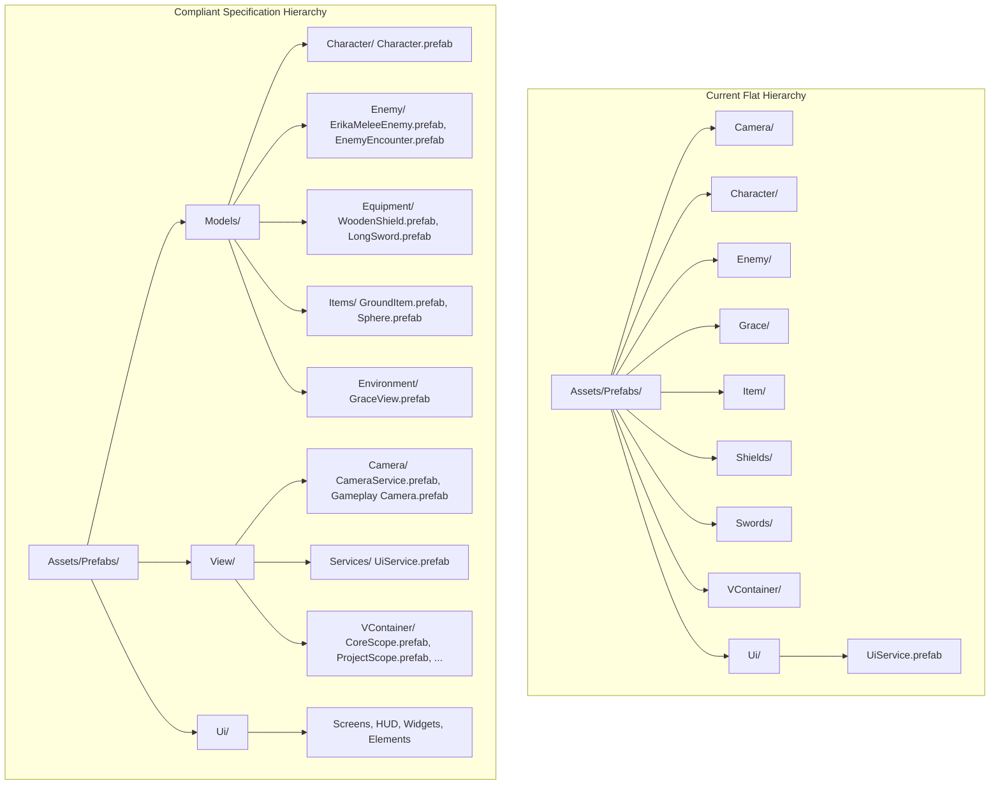
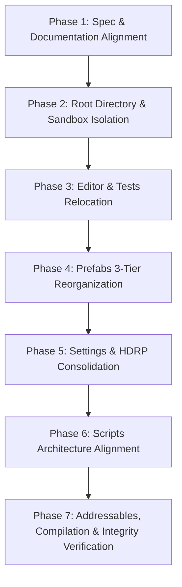

# Project Organization Analysis & Remediation Plan

**Status**: Ready for Review / Staged  
**Domain**: Project Architecture / Asset Pipeline  
**Source Specification**: [`PROJECT_ORGANIZATION.md`](../Architecture/PROJECT_ORGANIZATION.md)  
**Related Guides**: [`UI_Code_Build_Guide.md`](../ui/UI_Code_Build_Guide.md), [`Skill_Context_Index.md`](../ai/Skill_Context_Index.md)  

---

## 1. Executive Summary

A comprehensive audit was performed comparing the current repository state of `Assets/` against the type-first organization rules defined in [`PROJECT_ORGANIZATION.md`](../Architecture/PROJECT_ORGANIZATION.md).

### Overall Assessment
- **Conforming Areas**: Addressables structure (`AddressableAssetsData/`), Plugin isolation (`Plugins/`), minimal Resources bootstrap (`Resources/DOTweenSettings.asset`), visual asset root name (`Art/`), and UI prefab feature groupings (`Prefabs/Ui/`).
- **Major Deviations**:
  1. **Unauthorized Root Directories**: Standalone `Assets/Editor`, `Assets/Tests`, `Assets/Shaders`, and `Assets/Temp` exist at the root level instead of within their designated type trees.
  2. **Flat / Unstructured `Prefabs/` Hierarchy**: Root subfolders (`Prefabs/Character/`, `Prefabs/Enemy/`, `Prefabs/Item/`, `Prefabs/Shields/`, `Prefabs/Swords/`, `Prefabs/Camera/`, `Prefabs/VContainer/`) bypass the required 3-tier division (`Prefabs/Models/`, `Prefabs/Ui/`, `Prefabs/View/`).
  3. **Scripts Subsystem Gaps & Misplaced Folders**: `Assets/Scripts` contains non-standard root folders (`Controllers/`, `Interactions/`, `Items/`, `Model/`, `Orchestrators/`, `Utilities/`). Additionally, the extensive `Scripts/Ui/` tree (governed by [`UI_Code_Build_Guide.md`](../ui/UI_Code_Build_Guide.md)) is omitted from `PROJECT_ORGANIZATION.md`.
  4. **Settings Domain Organization**: Root-level HDRP profile assets and unnested configuration folders (`Settings/Enemy/`, `Settings/Items/`) deviate from the documented `Settings/Data/` and `Settings/Render Pipelines/` hierarchy.
  5. **Missing / Undocumented Root Types**: `Assets/Audio/` exists as a clean type-first root but is missing from `PROJECT_ORGANIZATION.md`. Conversely, `Assets/Sandbox/` is documented in the specification but has not yet been established on disk (with prototype scenes residing in `Assets/Scenes/WorkShop/`).

---

## 2. Detailed Gap Analysis by Domain

```
+---------------------------------------------------------------------------------------------------+
|                                      PROJECT ASSET ROOT COMPARISON                                |
+------------------------------------+------------------------------------+-------------------------+
| Specification (PROJECT_ORGANIZATION)| Current Disk State (Assets/)       | Status / Action         |
+------------------------------------+------------------------------------+-------------------------+
| Assets/Art/                        | Assets/Art/                        | Conforming              |
| Assets/Prefabs/ (Models/Ui/View)   | Assets/Prefabs/ (Flat structure)   | Structural Deviation    |
| Assets/Scripts/ (Comp/Ent/Serv/Ed/T)| Assets/Scripts/ (Extra roots)      | Structural Deviation    |
| Assets/Settings/                   | Assets/Settings/ (Loose HDRP/roots)| Minor Deviation         |
| Assets/Plugins/                    | Assets/Plugins/                    | Conforming              |
| Assets/Scenes/                     | Assets/Scenes/ (Includes WorkShop) | Minor Deviation         |
| Assets/Sandbox/                    | [Missing on disk]                  | Missing Directory       |
| Assets/ThirdParty/                 | Assets/ThirdParty/                 | Conforming              |
| Assets/AddressableAssetsData/      | Assets/AddressableAssetsData/      | Conforming              |
| Assets/Resources/                  | Assets/Resources/                  | Conforming (Minimal)    |
| [Not in spec]                      | Assets/Audio/                      | Spec Gap (Add to spec)  |
| [Prohibited at root]               | Assets/Editor/                     | Rogue Root Folder       |
| [Prohibited at root]               | Assets/Tests/                      | Rogue Root Folder       |
| [Prohibited at root]               | Assets/Shaders/                    | Rogue Root Folder       |
| [Prohibited at root]               | Assets/Temp/                       | Rogue Root Folder       |
+------------------------------------+------------------------------------+-------------------------+
```

---

### 2.1. Root Directory Violations

| Path | Current Contents | Expected Location per Rule | Issue Description |
|---|---|---|---|
| `Assets/Editor/` | `LocationBakeTool.cs` | `Assets/Scripts/Editor/` | Editor C# tools must live inside `Assets/Scripts/Editor/` or sub-feature `Editor/` assemblies, not in a standalone root `Assets/Editor/`. |
| `Assets/Tests/` | `CharacterRuntime/`, `EnemyRuntime/` (`.cs` + `.asmdef`) | `Assets/Scripts/Tests/` | Rule 3 specifies `Scripts/Tests/ - Automated test suites (EditMode and PlayMode)`. Root `Assets/Tests/` violates type-first containment. |
| `Assets/Shaders/` | `GroundItemAdditive.shader` | `Assets/Art/Shaders/` or `Assets/Art/Materials/` | Visual shading assets belong under `Assets/Art/`. A standalone `Assets/Shaders/` root creates fragmented asset tracking. |
| `Assets/Temp/` | `GraceVfxScenePreview.png`, `GraceVfxScenePreviewPlaying.png` | Scratch / Sandbox / External Docs | Temporary visual previews and debug dumps violate production root hygiene. |
| `Assets/Audio/` | `AmbienceMusic/*.wav` | `Assets/Audio/` (Spec update required) | Audio is a distinct asset type. Its root presence is clean, but `PROJECT_ORGANIZATION.md` omitted it from the specification. |
| `Assets/Sandbox/` | *Does not exist* | `Assets/Sandbox/Scenes/`, `Assets/Sandbox/Prefabs/Debug/` | Testing environments (like `Assets/Scenes/WorkShop/`) currently pollute production scene folders instead of using `Sandbox/`. |

---

### 2.2. `Assets/Prefabs/` Violations

The specification mandates a strict 3-way taxonomy:
- **`Prefabs/Models/`**: Physical entities (Player, Enemies, Equipment, Items, Interactive world props).
- **`Prefabs/Ui/`**: UI screens, HUD, menus, and widgets.
- **`Prefabs/View/`**: Non-physical orchestration prefabs (VContainer Scopes, Managers, Services, Cameras).

#### Current vs Expected Hierarchy:


#### Specific Misplacements:
1. `Assets/Prefabs/Character/Character.prefab` -> Must be `Assets/Prefabs/Models/Character/Character.prefab`.
2. `Assets/Prefabs/Enemy/` (`EnemyEncounter.prefab`, `ErikaMeleeEnemy.prefab`) -> Must be `Assets/Prefabs/Models/Enemy/`.
3. `Assets/Prefabs/Grace/GraceView.prefab` -> Must be `Assets/Prefabs/Models/Environment/Grace/GraceView.prefab` (or `Models/Grace/`).
4. `Assets/Prefabs/Item/` (`GroundItem.prefab`, `Sphere.prefab`) -> Must be `Assets/Prefabs/Models/Items/`.
5. `Assets/Prefabs/Shields/WoodenShield.prefab` & `Assets/Prefabs/Swords/LongSword.prefab` -> Must be `Assets/Prefabs/Models/Equipment/`.
6. `Assets/Prefabs/Camera/` (`CameraService.prefab`, `Gameplay Camera.prefab`) -> Must be `Assets/Prefabs/View/Camera/`.
7. `Assets/Prefabs/Ui/UiService.prefab` -> Orchestration service mistakenly located under `Prefabs/Ui/` instead of `Assets/Prefabs/View/UiService.prefab`.
8. `Assets/Prefabs/VContainer/` (`CoreScope.prefab`, `LoadingScope.prefab`, `MainMenuScope.prefab`, `ProjectScope.prefab`, `SharedScope.prefab`) -> Must be `Assets/Prefabs/View/VContainer/`.

---

### 2.3. `Assets/Scripts/` Structural Deviations

The specification dictates: `Components/`, `Entities/`, `Services/`, `Editor/`, `Tests/`.

#### Deviations and Architectural Inconsistencies:
1. **`Assets/Scripts/Controllers/UiController.cs`**:
   - `UiController` is the base abstract class for all UI feature controllers.
   - It is isolated in a loose `Controllers/` root folder while all other UI scripts reside in `Assets/Scripts/Ui/Base/` or feature folders.
   - *Target Location*: `Assets/Scripts/Ui/Base/UiController.cs`.
2. **`Assets/Scripts/Interactions/`**:
   - Mixes multiple architectural responsibilities:
     - `GraceView.cs`, `IGracePresenter.cs` -> UI/Presentation logic.
     - `IInteractable.cs`, `InteractionPrompt.cs` -> Component interaction abstractions.
     - `GraceSystem.cs`, `InteractionController.cs` -> Services / Entity management.
   - *Target Location*: Distribute into `Scripts/Components/Interaction/`, `Scripts/Services/Interaction/`, and `Scripts/Ui/Grace/`.
3. **`Assets/Scripts/Items/`**:
   - Contains item definitions, databases, and combat profiles (`ItemDefinition.cs`, `WeaponDatabase.cs`, `CombatProfile.cs`, `GroundItem.cs`).
   - *Target Location*: Consolidate into `Assets/Scripts/Entities/Items/` (for definitions/models) and `Assets/Scripts/Components/Items/` (for scene components like `GroundItem.cs`).
4. **`Assets/Scripts/Model/` (`Data.cs`, `Model.cs`)**:
   - Core framework abstractions. `Data` is the base class for ScriptableObjects; `Model` is the base class for state models.
   - *Target Location*: Move to `Assets/Scripts/Entities/BaseEntity/` or `Assets/Scripts/Entities/Model/`.
5. **`Assets/Scripts/Orchestrators/` (`Core/`, `Game/`, `MainMenu/`)**:
   - High-level game flow managers and state machine orchestrators (`CoreGameOrchestrator.cs`, `GameState.cs`, `MainMenuOrchestrator.cs`).
   - According to Rule 3, all manager/lifecycle logic belongs under `Services/`.
   - *Target Location*: `Assets/Scripts/Services/Orchestrators/` (or update spec to recognize `Orchestrators` as a formal top-level architecture layer alongside Services).
6. **`Assets/Scripts/Utilities/` (`EditorSerialization/`, `Extensions/`, `Timer/`)**:
   - Contains generic utility helpers. Standard in C# projects, but absent from the `PROJECT_ORGANIZATION.md` specification.
7. **Specification Gap for `Assets/Scripts/Ui/`**:
   - `Assets/Scripts/Ui/` contains 18 modular feature subfolders (`Base`, `Equipment`, `Inventory`, `MainMenu`, `PauseNavigation`, `PlayerHud`, `Travel`, etc.) adhering strictly to [`UI_Code_Build_Guide.md`](../ui/UI_Code_Build_Guide.md).
   - `PROJECT_ORGANIZATION.md` currently does not list `Scripts/Ui/` in its directory breakdown.
8. **Decentralized `Editor/` Folders**:
   - `Assets/Scripts/Ui/Base/Editor/` (`CustomButtonEditor.cs`, `CustomButtonHierarchyMenu.cs`, `CustomButtonToggleEditor.cs`).
   - `Assets/Scripts/Utilities/EditorSerialization/` (`UnityDictionaryFactory.cs`).
   - Decision needed: Standardize whether sub-namespace `Editor/` directories are permitted (colocated Editor scripts) or if all Editor tooling must strictly reside in `Assets/Scripts/Editor/`.

---

### 2.4. `Assets/Settings/` Organization

The specification states:
- `Settings/Data/`: Game databases and settings data (`HealthData`, `InventoryData`, `AssetMappingData`).
- `Settings/Input/`: `.inputactions` and `.inputsettings`.
- `Settings/Player/`: Player data (`MovementData`).
- `Settings/Build Profiles/`: Build configurations.
- `Settings/Render Pipelines`: HDRP/URP profiles.

#### Deviations:
1. **Uncontained HDRP Profiles**:
   - `HDRP Balanced.asset`, `HDRP High Fidelity.asset`, `HDRP Performant.asset`, `SkyandFogSettingsProfile.asset` reside loosely at the root of `Assets/Settings/`.
   - *Target Location*: `Assets/Settings/RenderPipelines/` or `Assets/Settings/HDRPDefaultResources/`.
2. **Unnested Data Folders (`Settings/Enemy/`, `Settings/Items/`)**:
   - `Settings/Enemy/` (`ErikaLongSwordMoveset.asset`, `ErikaMeleeBehaviour.asset`, `Actions/Combo1.asset`, etc.) and `Settings/Items/` (`ConsumableDatabase.asset`, `WeaponDatabase.asset`, `StraightSwordCombatProfile.asset`) sit outside `Settings/Data/`.
   - *Target Location*: Consolidate under `Assets/Settings/Data/Enemy/` and `Assets/Settings/Data/Items/` (or formally document `Settings/Enemy/` and `Settings/Items/` as first-class `Settings` subfolders).

---

### 2.5. `Assets/Art/` & `Assets/Scenes/` Observations

1. **`Assets/Art/Fonts/`**:
   - Contains font assets (`Cinzel/`, `Presets/`). Valid visual asset, but omitted from `PROJECT_ORGANIZATION.md`.
2. **`Assets/Art/Reference/`**:
   - Contains 15 UI mockup PNGs (`EquipmentRef.png`, `InventoryRef_1.png`, etc.). These are reference/design artifacts, not runtime game textures.
   - *Recommendation*: Relocate to `SoulsLikeGameVault/ui/` or `Assets/Sandbox/Art/Reference/`.
3. **`Assets/Scenes/WorkShop/`**:
   - `WorkShop.unity` is a technical testing/prototyping scene.
   - *Target Location*: `Assets/Sandbox/Scenes/WorkShop.unity`.
4. **`Assets/Scenes/DefaultLocation/` Loose Reports**:
   - `bake_progress.txt`, `occlusion_report.txt`, `zone_split_report.txt` reside in the scene asset folder.
   - *Recommendation*: Clean up or relocate generated reports to build/diagnostic output folders.

---

## 3. Asset Dependency & Migration Risk Analysis

Moving Unity assets on disk carries risks of breaking serialized object references, Addressables configurations, and assembly definition bindings.

```
+---------------------------------------------------------------------------------------------------+
|                                     DEPENDENCY IMPACT MATRIX                                      |
+--------------------------+-----------------------+---------------------+--------------------------+
| Asset Category           | Risk Factors          | Direct Dependencies | Mitigation Requirement   |
+--------------------------+-----------------------+---------------------+--------------------------+
| Prefabs                  | Broken Scene Refs,    | AssetMappingData,   | Move ONLY via Unity API  |
| (Character, Enemy, UI)   | Addressable GUID Loss | Scenes, VContainer  | (AssetDatabase.MoveAsset)|
+--------------------------+-----------------------+---------------------+--------------------------+
| Tests & Asmdefs          | Compilation Failures, | CharacterRuntime,   | Update asmdef include    |
| (Assets/Tests -> Scripts)| Test Runner Missing   | EnemyRuntime asmdefs| paths synchronously      |
+--------------------------+-----------------------+---------------------+--------------------------+
| Addressables Config      | Group Schema desync,  | Addressables Group  | Re-verify Addressable    |
| (GroundItemAdditive, UI) | Build failure         | Assets, Schemas     | Group entries after move |
+--------------------------+-----------------------+---------------------+--------------------------+
| C# Scripts               | Namespace / Type      | VContainer DI,      | Update namespaces where  |
| (UiController, Orchestr) | Resolution errors     | Serialized Objects  | folder changes apply     |
+--------------------------+-----------------------+---------------------+--------------------------+
```

### Critical Rules for Execution:
1. **Never Move Serialized Assets with File System Commands**: All `.prefab`, `.unity`, `.asset`, `.mat`, `.shader`, and `.cs` moves MUST be executed through Unity Editor APIs (`UnityEditor.AssetDatabase.MoveAsset`) or Unity MCP tools to ensure `.meta` GUIDs are updated atomically.
2. **Preserve Addressables Bindings**: `AssetMappingData.asset` relies on `m_AssetGUID`. Preserving `.meta` files guarantees zero broken mappings in `AssetMappingData`.
3. **Force Reserialization & Save**: Follow the mandatory `AGENTS.md` asset persistence protocol:
   `UnityEditor.AssetDatabase.ForceReserializeAssets(...)` and `UnityEditor.AssetDatabase.SaveAssets()`.

---

## 4. Phased Remediation Plan



---

### Phase 1: Specification & Documentation Alignment
**Goal**: Update [`PROJECT_ORGANIZATION.md`](../Architecture/PROJECT_ORGANIZATION.md) so that valid domain structures are properly documented before making destructive filesystem changes.

- [ ] Add `Audio/` (`Assets/Audio/AmbienceMusic/`, `Sfx/`) as a standard type-first root folder.
- [ ] Add `Scripts/Ui/` (`Assets/Scripts/Ui/<FeatureName>/`) to the `Scripts/` specification hierarchy, cross-referencing [`UI_Code_Build_Guide.md`](../ui/UI_Code_Build_Guide.md).
- [ ] Add `Scripts/Utilities/` (`EditorSerialization/`, `Extensions/`, `Timer/`) to the `Scripts/` specification hierarchy.
- [ ] Clarify sub-domain `Editor/` folder rules (allow colocated `Scripts/Ui/.../Editor/` or mandate central `Scripts/Editor/`).
- [ ] Document `Art/Fonts/` and `Settings/Enemy/`, `Settings/Items/` (or standardize their sub-paths).

---

### Phase 2: Root Directory & Sandbox Isolation
**Goal**: Remove unauthorized root directories and set up the sandbox structure.

- [ ] Create `Assets/Sandbox/Scenes/` and `Assets/Sandbox/Prefabs/Debug/`.
- [ ] Move `Assets/Scenes/WorkShop/` -> `Assets/Sandbox/Scenes/WorkShop/`.
- [ ] Move `Assets/Shaders/GroundItemAdditive.shader` -> `Assets/Art/Shaders/GroundItemAdditive.shader`.
  - Update `AddressableAssetsData/AssetGroups/Scene Dependencies - Shaders.asset` if needed.
- [ ] Delete or relocate `Assets/Temp/` images (`GraceVfxScenePreview*.png`) to documentation or vault scratch.
- [ ] Remove clean-up text files (`bake_progress.txt`, etc.) from `Assets/Scenes/DefaultLocation/`.

---

### Phase 3: Editor & Test Suite Relocation
**Goal**: Bring all tooling and automated test code under `Assets/Scripts/`.

- [ ] Move `Assets/Editor/LocationBakeTool.cs` -> `Assets/Scripts/Editor/LocationBakeTool.cs`.
- [ ] Delete the empty `Assets/Editor/` root folder.
- [ ] Move `Assets/Tests/` -> `Assets/Scripts/Tests/`:
  - `Assets/Tests/CharacterRuntime/` -> `Assets/Scripts/Tests/CharacterRuntime/`
  - `Assets/Tests/EnemyRuntime/` -> `Assets/Scripts/Tests/EnemyRuntime/`
- [ ] Update `CharacterRuntimeTests.asmdef` and `EnemyRuntimeTests.asmdef` assembly definitions to ensure project test runner discovers them properly.
- [ ] Delete the empty `Assets/Tests/` root directory.

---

### Phase 4: `Assets/Prefabs/` 3-Tier Reorganization
**Goal**: Enforce `Models/`, `Ui/`, and `View/` taxonomy in `Assets/Prefabs/`.

- [ ] Create destination directories:
  - `Assets/Prefabs/Models/Character/`
  - `Assets/Prefabs/Models/Enemy/`
  - `Assets/Prefabs/Models/Equipment/`
  - `Assets/Prefabs/Models/Items/`
  - `Assets/Prefabs/Models/Environment/Grace/`
  - `Assets/Prefabs/View/Camera/`
  - `Assets/Prefabs/View/Services/`
  - `Assets/Prefabs/View/VContainer/`
- [ ] Move physical model prefabs:
  - `Assets/Prefabs/Character/Character.prefab` -> `Assets/Prefabs/Models/Character/Character.prefab`
  - `Assets/Prefabs/Enemy/*` -> `Assets/Prefabs/Models/Enemy/`
  - `Assets/Prefabs/Shields/WoodenShield.prefab` -> `Assets/Prefabs/Models/Equipment/WoodenShield.prefab`
  - `Assets/Prefabs/Swords/LongSword.prefab` -> `Assets/Prefabs/Models/Equipment/LongSword.prefab`
  - `Assets/Prefabs/Item/*` -> `Assets/Prefabs/Models/Items/`
  - `Assets/Prefabs/Grace/GraceView.prefab` -> `Assets/Prefabs/Models/Environment/Grace/GraceView.prefab`
- [ ] Move orchestration view prefabs:
  - `Assets/Prefabs/Camera/*` -> `Assets/Prefabs/View/Camera/`
  - `Assets/Prefabs/Ui/UiService.prefab` -> `Assets/Prefabs/View/Services/UiService.prefab`
  - `Assets/Prefabs/VContainer/*` -> `Assets/Prefabs/View/VContainer/`
- [ ] Remove empty legacy folders under `Assets/Prefabs/`.

---

### Phase 5: `Assets/Settings/` & HDRP Consolidation
**Goal**: Consolidate render profiles and data databases.

- [ ] Create `Assets/Settings/RenderPipelines/` (or use `Settings/HDRPDefaultResources/`).
- [ ] Move root HDRP profiles (`HDRP Balanced.asset`, `HDRP High Fidelity.asset`, `HDRP Performant.asset`, `SkyandFogSettingsProfile.asset`) into `Assets/Settings/RenderPipelines/`.
- [ ] Standardize `Settings/Enemy/` and `Settings/Items/`:
  - Either move under `Assets/Settings/Data/Enemy/` and `Assets/Settings/Data/Items/`, or keep as distinct top-level `Settings/` subfolders as documented in Phase 1.

---

### Phase 6: `Assets/Scripts/` Architecture Consolidation
**Goal**: Resolve misplaced root scripts and decouple interactions.

- [ ] Move `Assets/Scripts/Controllers/UiController.cs` -> `Assets/Scripts/Ui/Base/UiController.cs` and delete `Scripts/Controllers/`.
- [ ] Move `Assets/Scripts/Model/` (`Data.cs`, `Model.cs`) -> `Assets/Scripts/Entities/BaseEntity/` (or `Entities/Model/`) and delete `Scripts/Model/`.
- [ ] Move `Assets/Scripts/Orchestrators/` -> `Assets/Scripts/Services/Orchestrators/` (or retain as top-level architectural layer if updated in Phase 1).
- [ ] Restructure `Assets/Scripts/Interactions/`:
  - Move UI-related files (`GraceView.cs`, `IGracePresenter.cs`) -> `Assets/Scripts/Ui/Grace/` (or `Scripts/Ui/Interaction/`).
  - Move Component interaction logic (`IInteractable.cs`, `InteractionPrompt.cs`) -> `Assets/Scripts/Components/Interaction/`.
  - Move System service logic (`GraceSystem.cs`, `InteractionController.cs`) -> `Assets/Scripts/Services/Interaction/`.
- [ ] Move `Assets/Scripts/Items/` -> `Assets/Scripts/Entities/Items/` (for definitions/databases) and `Assets/Scripts/Components/Items/` (for `GroundItem.cs`, `GroundItemVfx.cs`).

---

### Phase 7: Addressables, Compilation & Integrity Verification
**Goal**: Ensure zero regressions across DI, Addressables, scenes, and serialized assets.

- [ ] Run `AssetDatabase.Refresh()` in Unity.
- [ ] Verify Addressables groups in Addressables Groups window:
  - Check `Ui`, `Data`, `Services`, `Scene Dependencies - Prefabs`, `Scene Dependencies - Shaders`.
- [ ] Inspect [`AssetMappingData.asset`](../../Assets/Settings/Data/AssetMappingData.asset) to ensure all GUIDs resolve to their new paths.
- [ ] Check Unity console for missing script references or broken prefab links.
- [ ] Open and verify main scenes:
  - `Assets/Scenes/Bootstrap/Bootstrap.unity`
  - `Assets/Scenes/MainMenu/MainMenu.unity`
  - `Assets/Scenes/DefaultLocation/DefaultLocation.unity`
  - `Assets/Scenes/Loading/Loading.unity`
- [ ] Force reserialize and save modified assets per `AGENTS.md` policy.

---

## 5. Acceptance Criteria

- [ ] All root directories in `Assets/` match the approved specification list.
- [ ] No `.cs` files exist in root `Assets/Editor/` or `Assets/Tests/`.
- [ ] `Assets/Prefabs/` contains strictly `Models/`, `Ui/`, and `View/`.
- [ ] All Addressables addresses, group schemas, and `AssetMappingData` links resolve without errors.
- [ ] `PROJECT_ORGANIZATION.md` is updated to accurately reflect the production architecture.
- [ ] No compilation errors or broken references in Unity.
