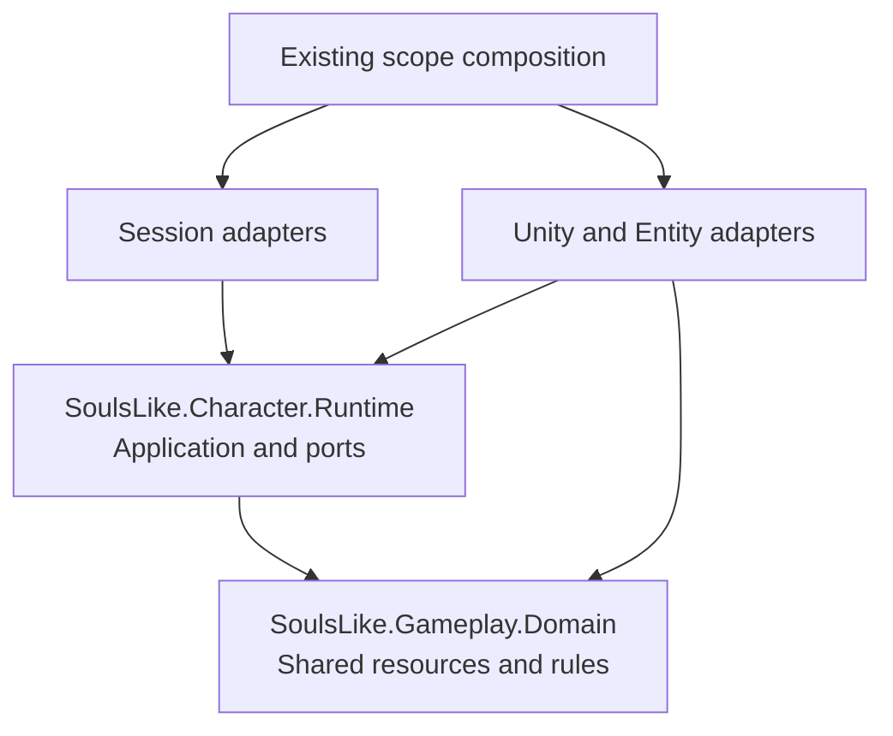

# Character Clean Architecture with Separate Domain and Application

> [!summary] Draft — Option B
> Stronger compile-time separation, with a larger **shared health migration**. [[Work/Plans/Character Clean Architecture|Option A]] is the smaller first step.

## Plan Contract

### Goal

Separate pure domain rules/resource state from application action orchestration and Unity mechanisms.

### Source Research and Decisions

Inherit A's source assessment, session/camera contracts, animation contract and **all six issue acceptance rows**. Both options address [[Work/Issues/Character Aggregate Architecture and Readability]] and extend [[Work/Plans/Character Architecture and Readability Improvement]]; the issue stays open.

Apply Martin's physical dependency boundaries ([book, chapters 14–26](https://www.informit.com/store/clean-architecture-a-craftsmans-guide-to-software-structure-9780134494272)). HealthComponent/Model and entity damage commands also serve enemies: this option explicitly includes shared health compatibility.

### Assumptions and Non-Goals

All A invariants apply: **Entity/EntityLocator unchanged**, strict PlayerController isolation, preserved gameplay/animation decisions, no networking implementation. Keep Character's MonoBehaviour identity, serialized wiring and factory topology.

### Success Criteria

Domain cannot depend on Application; both are engine-independent. Resource state has one owner per actor; Application retains the sole action state/buffer. Player and enemy health behavior remains equivalent.

## Target Design

Arrows show source dependencies. The shared domain prevents enemy health from depending on player orchestration. Assembly boundaries enforce direction; ownership still requires review.

| Decision | A | B |
|---|---|---|
| Core | One pure runtime assembly | Separate Gameplay.Domain and Character.Runtime |
| Resource authority | Existing HealthComponent/Model | Pure state, shared by player/enemy adapters |
| Action authority | Existing state machine | Same, in Application |
| Cost | Smaller extraction | Shared health/event/DI migration |

Domain contains resource invariants/state and reusable constraints. Application owns action eligibility/orchestration, its single state machine/buffer, rest and progression workflows. Application owns ports and request/result models. Adapters own Unity physics, animation observations, authoring-data translation and notifications. Organize by Actions, Resources and Progression; no class per attack or project-wide framework.

## Execution Plan

- [ ] **1. Adopt A's baseline/session separation.** Verify scripted actor control without local input/UI/camera and no controller Character getters.
- [ ] **2. Split pure modules.** Add `Assets/Scripts/Gameplay/Domain/SoulsLike.Gameplay.Domain.asmdef`; existing Character Runtime references it. Both disable engine references. Convert Unity-facing data at adapters; retain serialized DTOs. Verify inward, acyclic dependencies.
- [ ] **3. Cut over shared resources.** Create one pure resource state per actor from authored data. Migrate damage, spending/recovery, invulnerability and rest writes together. HealthComponent becomes the compatibility adapter; HealthModel exposes that owner without a second mutable stats store. Verify player/enemy events, death/revive, combat commands and save-facing values.
- [ ] **4. Complete use cases and issue cleanup.** Extract action/progression orchestration; resolve A's equipment/access/API rows. Preserve physical substates, animation correlation/root motion and Entity command routes. Verify single ownership and behavior parity.
- [ ] **5. Review/validate.** Finish A's checks plus shared-resource and enemy compatibility checks before issue closure.

## Risks and Rollback

Resource state, all writers and notification adapters switch or revert together. Shared health expands review beyond Character: include enemy composition/controller and shared combat consumers, without changing Entity/EntityLocator implementations.

Keep Unity adapters in the existing outer assembly: custom asmdefs cannot reference `Assembly-CSharp` ([Unity rules](https://docs.unity3d.com/6000.3/Documentation/Manual/assembly-definitions-referencing.html)). Preserve serialized authoring/save types, fields and GUIDs.

## Validation

Planning only; no Unity execution. Use A's bounded Edit Mode workflow. Add meaningful spending/rejection, recovery, invulnerability, death/revive and rest/progression parity coverage for both actor types. Verify DI/serialization separately; defer gameplay Play Mode checks to the assigned follow-up.

## Execution Handoff

A's files/context/one-writer sequence, plus `Components/Health/HealthModel.cs`, `HealthStats.cs`, verified `ApplyAuthoritativeStats` callers, `EnemyScopeInstaller`, `EnemyController`, `ApplyDamageCommand` and `ResolveMeleeHitCommand` compatibility. Add `enemy-architecture` and `hitbox-architecture` context. Shared consumers change only where the resource-owner cutover requires it.

**Review decision:** B accepts the broader shared-health scope; otherwise choose A. Coordinate the factory-plan registration seam. Status stays `draft`; no execution authorized.
