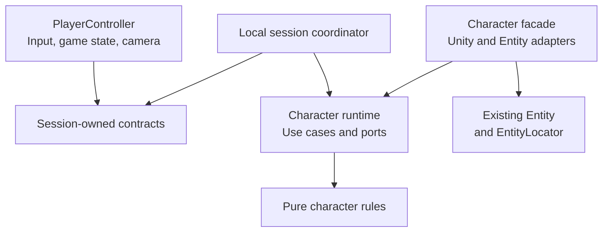
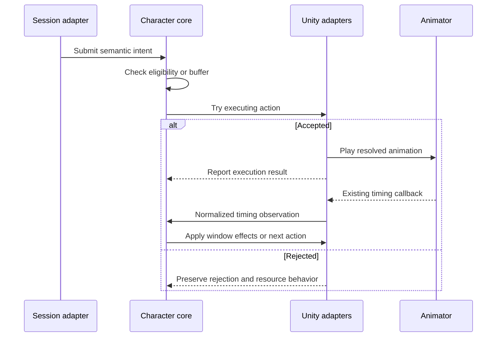

# Character Clean Architecture

> [!summary] In progress — Option A selected
> Execution authorized by the user on 2026-09-22. Extract a small, engine-independent rule core; retain the existing Unity components and entity integration. Use VContainer for composition, keep responsibility names and classes simple, and add short class summaries. Initial validation is compilation, error checks, and focused existing Edit Mode coverage; gameplay review follows separately.

## Plan Contract

### Goal

Make the third-person Character reusable with local or future network control. Keep animation-driven attacks, rolls, movement and health understandable, with one owner for every rule and state.

### Source Research and Decisions

Based on [[Work/Plans/Character Architecture and Readability Improvement]] and all six concerns in [[Work/Issues/Character Aggregate Architecture and Readability]]; the issue stays open. Replace the earlier controller-to-Character restoration call with a session boundary.

Source checked at `509f9d27`, 2026-09-22: Character is a MonoBehaviour facade, Entity a separate scoped service. The current runtime assembly and action/input DTOs still depend on Unity.

Apply Martin's inward dependencies, policy/use-case separation, humble adapters, partial boundaries and outer composition root ([author](https://blog.cleancoder.com/uncle-bob/2012/08/13/the-clean-architecture.html); [book, chapters 15–26, 32](https://www.informit.com/store/clean-architecture-a-craftsmans-guide-to-software-structure-9780134494272)). These are project-specific design choices.

### Assumptions and Non-Goals

- Preserve gameplay, action priority, one-slot/one-second buffering, animation timing, serialized fields and asset GUIDs.
- Keep `Entity`, `EntityLocator`, scoped identity, registration and target-owned commands unchanged. “Domain entities” in Martin's terminology do not mean replacing this project's `Entity`.
- Prepare a control seam; do not implement networking, prediction, replication or multiplayer spawning. Reuse alone does not guarantee deterministic networking.
- Preserve the user-closed animation correlation/recovery decisions recorded in [[Work/Plans/Architecture Lifecycle Remediation and Local Validation]]. No new tokens, watchdogs or recovery framework.
- Coordinate registration changes with [[Work/Plans/Character Factory DI Refactor]]; preserve its existing scope topology and outstanding runtime validation.

### Success Criteria

`PlayerController` and its input reader have no Character, component, action-state or character-command dependencies. The same actor can receive scripted intents without local input/UI/camera. Core rules compile without Unity. Existing behavior and all six issue acceptance checks below are preserved.

## Target Design

### Dependencies and ownership

Arrows show **source dependencies**, not execution order. Application ports belong to the core; Unity adapters implement them. Domain rules never reference application orchestration.

| Owner | Responsibility |
|---|---|
| PlayerController + PlayerInputReader | Input/gestures, `IGameStateNotifier`, camera. Submit session-owned axes/button edges/holds. Receive Character-agnostic camera pose/locomotion and control-enabled snapshots; no Character getters/types. |
| PlayerSessionCoordinator — outside Character | Bind actor; translate transport data, supply camera/control snapshots; coordinate existing targeting, interaction, death/respawn and grace use cases. Clear stale input on disable/unbind. No action eligibility or priority rules. |
| Character action core | Existing state machine exclusively owns current action, state-based admission, queue and buffer. New `CharacterActionCoordinator` owns semantic priority/resource policy and consumes physical acceptance/effect results; no duplicate state/timer or class per attack. Rest/progression rules use plain values. |
| Character facade + Unity components | Preserve entity-facing workflows/wiring. Movement owns physics; Animator owns playback/timing observations. HealthComponent keeps sole mutable resource/invulnerability ownership; apply calculated results once through existing mutations/events. |
| Scope/runtime adapters | Actor ticking/subscriptions/disposal independent of PlayerController. Preserve pause/death gates and frame order. Separate reusable registrations from local input/UI/camera binding. |

**A extracts health rules, not full health ownership.** Shared HealthComponent storage/recovery remains outside the core. No parallel state store or global bus. Add ports only for real action/timing/resource/effect boundaries; keep private same-entity collaboration direct.

**Execution simplification (2026-09-22):** full rest remains one Character-owned use case that restores existing health state and refills flasks. Do not create an identity-only restoration rules class or a second resource snapshot solely to move assignments between files. Extract actual resource eligibility and progression calculations; retain HealthComponent as the sole mutable resource owner. This follows the user's explicit request to avoid artificial classes.

### Animation-driven execution

Animation owns observed timing; gameplay owns what that timing permits. Preserve the current `Enter / QueueCheck / Exit / Progress / Loop` mapping and correlation. Do not replace it with a second timer or assume every action has identical phases.

This diagram shows **runtime flow** for an attack or roll.

Preserve physical rejection, resource-charge timing and interruption cleanup. Root-motion tags/deltas stay in relay/motor; core supplies gameplay restrictions. Preserve short-name/hash CrossFade, grouped sub-state machines and inert `Empty` defaults.

Cross-entity combat/interaction still uses **IEntityLocator → resolved IEntity → target-owned command**. Boundary adapters translate requests/results; neither colliders nor Entity services enter the pure core.

### Current issue coverage

| Existing concern | Planned resolution and acceptance check |
|---|---|
| Too many Character workflows | Extract action orchestration and resource/progression rules by use case; keep a short facade. Trace input → action → animation without scanning leveling/grace/platform code. |
| Equipment ↔ Character cycle | Consume the existing `LoadoutChanged` event; remove Equipment's concrete callback. Initial application, swaps and disposal produce one correctly ordered update. |
| Restoration in controller; costs in formatter | Session coordinator invokes the rest use case; preview and commit share one progression calculation. Values and notifications remain identical. |
| Inconsistent aggregate access | External writes use the owning operation; reads use snapshots/query contracts. Multi-component workflows stay coordinated; no wrapper for every method. |
| State-aware input; local/gameplay scope mix | Move action-sensitive input arbitration to the core. Separate registration groups and local binding; actor construction/ticking must work without local UI/input. |
| Public Model setter; attack context round trip | Check actual injection/callers, restrict Model replacement where supported, and let Attack consume its own resolved context. If either cleanup is unsafe, record its explicit owner/contract instead of forcing a new layer. |

## Execution Plan

- [x] **1. Baseline.** Source and dependency mapping at `509f9d27` confirmed Character owns action dispatch, the existing state machine owns buffering, PlayerController owns the current local tick, and EquipmentComponent calls Character after its loadout event. Serialized Character fields and existing factory/scope topology remain compatibility constraints.
- [x] **2. Session separation.** Session input/snapshot contracts, coordinator, and CharacterActorTick separate local binding from actor execution. VContainer phases preserve input, actor, then camera order. Controller/reader have no Character/component/action-state dependencies.
- [x] **3. Core extraction.** Reused `SoulsLike.Character.Runtime` with `noEngineReferences: true`, System.Numerics vectors, semantic action orchestration, a real execution-result port, and shared progression calculations. Rest remains the existing-state use case described above.
- [x] **4. Issue cleanup.** Equipment reports loadout changes without injecting Character; Attack consumes its own context; formatter contains presentation only; VContainer registration groups separate actor and local services. Model's public setter is retained explicitly for existing isolated component fixtures.
- [x] **5. Initial validation.** Unity compiles successfully; 19 character runtime tests and 6 progression/formatter tests pass. Independent review addressed the camera update regression and found no remaining material defect. Runtime dependency and serialized-field checks pass. Architecture and issue notes are updated. Gameplay review remains separate, as requested by the user.

## Risks and Rollback

One writer; separate phase commits. Preserve public/serialized facades until checks pass; revert a failing phase. Main risks: input priority, double ticks, event order and scope binding.

## Validation

Planning only: source/dependency inspection and diagram rendering; no Unity execution.

Execution baseline (2026-09-22): Unity 6000.3.11f1 connected through the official CLI/Pipeline bridge; Play Mode stopped; compilation successful; zero console errors/warnings; all ten loaded scenes clean. The initial review requested by the user is limited to compilation/error checks and focused existing Edit Mode tests. Animation, root-motion, and gameplay parity require the separate review phase.

Initial execution result: 19/19 `CharacterActionStateMachineTests` and 6/6 `LevelUpUiFormatterTests` passed asynchronously in Edit Mode (0.03s and 0.01s test durations). No failures, skipped, or inconclusive results. Current console errors: zero. All ten scenes remain clean, Play Mode stopped, and no test run active. New source metadata is imported. No serialized field declarations or existing asset GUIDs changed. Full local container spawning, animation/root-motion, and end-to-end gameplay were not exercised. Implementation is ready for the user's requested review; this plan remains in progress for that review rather than asserting untested gameplay parity.

See [[History/Records/Character Clean Architecture Implementation]] for the implementation and validation summary.

After authorization: existing `CharacterActionStateMachineTests`, input/rejection parity, equipment notifications, rest/level preview-versus-commit and unbinding. Follow [[Knowledge/Guides/Testing/Unity Test Framework Test Flow]]: clean-scene preflight, bounded discovered Edit Mode selection, async run with caller timeout, verify counts/failures/cancellation and no active run. Separate deferred Play Mode checks cover animation/root-motion/gameplay; pure tests cannot establish those results.

## Execution Handoff

Existing scope, relative to `Assets/Scripts/`:

- `Entities/Character/Character.cs`, `PlayerController.cs`, `Input/PlayerInputReader.cs`, `Runtime/CharacterActionStateMachine.cs`, `CharacterAction.cs`, `CharacterInput.cs` and the runtime asmdef.
- `Components/Equipment/EquipmentComponent.cs`, `Components/Attack/AttackComponent.cs`, `Components/Health/HealthComponent.cs`, `Components/BaseComponent.cs`; `Ui/LevelUp/LevelUpUiController.cs` and `LevelUpUiFormatter.cs`.
- Coordinate `Services/VContainer/CharacterScopeInstaller.cs`; compare `CharacterFactory.cs`, movement/animator/root-motion and Entity command registrations without redesigning their infrastructure.
- Proposed additions: `Services/PlayerSession/` contracts/coordinator/tick binding and `Entities/Character/Runtime/` action coordinator/rules. One top-level type per matching file.

Context: `entity-locator`, `character-architecture`, `locomotion-current`, `animation-code`, `unity-testing`; UI workflow for controller changes. One `csharp_worker`; any asset work follows `unity_operator` import/save verification. Independent review/validation afterward.

**Execution decision (2026-09-22):** the user explicitly selected and requested execution of this plan. Preserve the live factory/scope topology; separate gameplay and local-session registrations within that composition. The separate-domain-and-application alternative is not selected.
