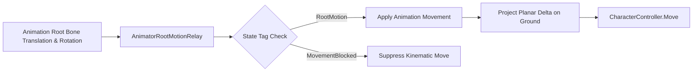
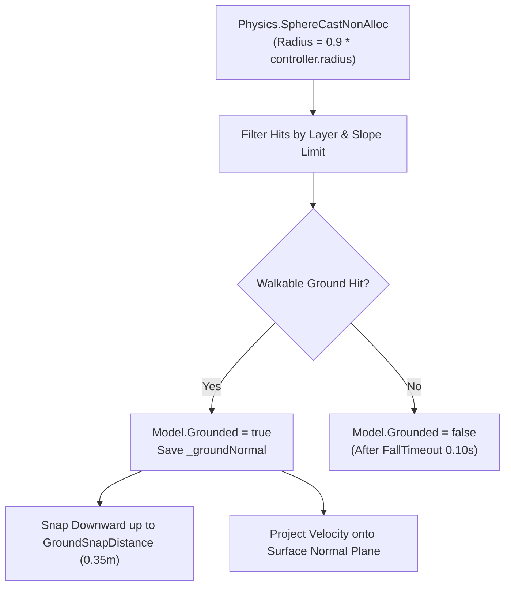

# Advanced Locomotion Architecture Prompt Specification

> **SYSTEM PROMPT & TECHNICAL REFERENCE**: Game Physics & Animation Systems for FromSoftware-style Action RPG Locomotion.

This document serves as both a high-fidelity system prompt specification for AI reasoning and an architectural reference comparing theoretical FromSoftware mechanics with the live C# implementation in **SoulsLikeTemplate**.

---

## 1. Input Engine & Buffer Management

### 1.1 Key-Release Action Mapping (Sprint vs. Roll)
- **Key-Down Event**: Starts an internal timer ($t_{\text{hold}}$).
- **Key-Up Event ($t_{\text{hold}} < T_{\text{threshold}}$)**: Triggers the `Roll` state transition on key release.
  - Threshold: $T_{\text{threshold}} = 0.30\text{ s}$ ($18\text{ frames}$ at $60\text{ FPS}$).
- **Hold Event ($t_{\text{hold}} \ge T_{\text{threshold}}$)**: Suppresses the Roll registration and transitions locomotion directly into `Sprint`.

### 1.2 Input Buffer Model
- **Buffer Architecture**: Deterministic 1-slot action buffer holding the latest user intent.
- **Buffer Retention**: $1.0\text{ s}$ lifetime (`BUFFER_DURATION_SECONDS`).
- **Behavior**: Any action command (`Attack`, `Roll`, `Jump`, `Equipment`) received during non-cancelable action states is cached.
- **Cancel Evaluation**: The queued action executes on frame 1 of the earliest cancel window (when the `StateMachineState.QueueCheck` signal is received from an active StateMachineBehaviour).
- **Roll-to-Sprint Interrupt**: Holding Sprint during a Roll breaks out of the roll animation on the first frame of `QueueCheck`.

---

## 2. Root-Motion Centric Locomotion Architecture

### 2.1 Motion Extraction & Blending
- **Root Motion Primacy**: Velocity ($\vec{V}$) and yaw rotation ($\Delta \theta$) are extracted directly from the root bone's translation vector ($\vec{\Delta P}_{\text{root}}$) and rotation quaternion ($\mathbf{Q}_{\text{root}}$) frame-by-frame:
  $$\vec{V}_{\text{frame}} = \frac{\vec{\Delta P}_{\text{root}}}{\Delta t}, \quad \Delta \theta_{\text{frame}} = \text{Yaw}(\mathbf{Q}_{\text{root}})$$
- **Velocity Decoupling**: Kinematic controller acceleration is zeroed out during root-motion driven actions (attacks, rolls, staggers). The capsule translation is governed strictly by the keyframed delta in the animation asset.
- **Planar Isolation**: Vertical root-motion translation is filtered during grounded locomotion and rolls to prevent false airborne detachment:
  $$\vec{\Delta P}_{\text{planar}} = (\Delta P_x, 0, \Delta P_z)$$

---

## 3. Movement Blocking & Action Locking System

The movement system exposes an Action State Locking API driven by bitwise flags in [`Character.cs`](file:///f:/Private/SoulsLikeTemplate/Assets/Scripts/Entities/Character/Character.cs):

### 3.1 Movement Lock State Flags (`MovementLockReason`)
- `0x01` (`Manual`): External script pause or explicit movement freeze.
- `0x02` (`Animation`): Root motion active or `"MovementBlocked"` tag active on current animator state.
- `0x04` (`Spawn`): Initial character spawn sequence lock.
- `0x08` (`Parry`): Active parry deflection window lock.
- `0x10` (`Critical`): Synchronized riposte / backstab execution lock.

### 3.2 Action State Behaviors
- **Attacks & Weapon Skills**: Sets `MovementLockReason.Animation`. Player cannot steer manually; positional lunge or step-forward is governed strictly by the attack clip's root displacement.
- **Hit Reactions & Stagger**: Hard lock on user inputs. Velocity is driven by the stagger recoil root motion animation curve corresponding to the impact direction.
- **Roll / Backstep**: Direction vector is locked at Frame 0 based on input angle. Transitions to cancelable recovery window when `QueueCheck` is reached.
- **Landing Recovery**:
  - *Normal Fall* ($|v_y| < 12.0\text{ m/s}$): Smooth blending into grounded locomotion without movement lock.
  - *Hard Landing* ($|v_y| \ge 12.0\text{ m/s}$): Selects `LandingType.Hard`, playing heavy landing recovery stumble.

---

## 4. Ground Alignment & Stairs Logic

Handling uneven geometry and stairways without capsule snagging relies on non-allocating SphereCast probing and surface normal projection.

### 4.1 Probing & Downward Snapping
- **SphereCast NonAlloc**: Probes ground geometry using `Physics.SphereCastNonAlloc` with a preallocated 8-hit buffer.
- **Slope Angle Limits**: Slopes exceeding `CharacterController.slopeLimit` are rejected as non-walkable.
- **Ground Snapping**: When moving downward over slopes or stair treads, [`MaintainGroundContact()`](file:///f:/Private/SoulsLikeTemplate/Assets/Scripts/Components/Movement/MovementComponent.cs) pulls the capsule down up to `GroundSnapDistance = 0.35m` to prevent bouncing or false airborne detachment.
- **Surface Normal Projection**:
  $$\vec{V}_{\text{surface}} = \text{Normalize}\left(\vec{V} - (\vec{V} \cdot \vec{N})\vec{N}\right) \cdot \|\vec{V}\|$$

---

## 5. Locomotion Modes: Free-Aim vs. Target Lock-On

### 5.1 Unlocked Locomotion (Free-Aim)
- **Coordinate System**: World-Space relative to Camera View Vector $\vec{V}_{\text{cam}}$.
- **Facing Vector ($\vec{F}$)**: Rotates smoothly to match the 2D movement vector using `Mathf.SmoothDampAngle` (`RotationSmoothTime = 0.12s`).
- **Velocity Vector ($\vec{V}$)**: Uniform $100\%$ speed scalar in all $360^\circ$ directions.

### 5.2 Target Lock-On Locomotion
- **Coordinate System**: Target-relative local axes.
- **Facing Vector ($\vec{F}$)**: Fixed directly toward the locked target transform $\vec{T}$.
- **Velocity Scaling**:
  - Forward ($0^\circ$): $100\%$ base velocity ($1.00\times$).
  - Lateral Arc ($\pm 90^\circ$): $85\%$ base velocity ($0.85\times$).
  - Backward ($180^\circ$): $72\%$ base velocity ($0.72\times$).
- **Orbital Rolls**: Locked lateral rolls orbit circularly around the locked target:
  $$\Delta \theta = -\text{dir}_x \cdot \frac{\Delta d}{r} \cdot \frac{180}{\pi}$$

---

## 6. Movement Tiers & Velocity Metrics

Authoritative values from [`Assets/Settings/Player/MovementData.asset`](file:///f:/Private/SoulsLikeTemplate/Assets/Settings/Player/MovementData.asset):

- **Crouch Walk**: $2.0\text{ m/s}$ | Stamina: $0.0\text{ pts/s}$ | Capsule Height: $1.0\text{ m}$
- **Run (Default Stick)**: $2.0\text{ m/s}$ | Stamina: $0.0\text{ pts/s}$ | Standard locomotion
- **Sprint (Hold Space)**: $6.0\text{ m/s}$ | Stamina: Combat $10.0\text{ pts/s}$ / Non-Combat $0.0\text{ pts/s}$
- **Slide**: $8.0\text{ m/s}$ | Duration: $0.80\text{ s}$

---

## 7. Roll / Dodge Engine & Contextual Combat

### 7.1 Roll Mechanics
- **Stamina Cost**: `RollStaminaCost = 12.0 pts`.
- **Cooldown**: `RollCooldown = 0.20 s`.
- **Directional Modes**:
  - *Free-Aim*: Rotates character to `worldDirection`, triggering forward roll animation.
  - *Target Lock-On*: Direction quantized into 4 cardinal bins (`Left`, `Right`, `Forward`, `Backward`) with lateral orbital displacement.
- **Backstep**: Triggered when Space is released with stick magnitude $\|\vec{I}\| \le 0.01$.

### 7.2 Contextual Attack Follow-ups
In [`AttackComponent.cs`](file:///f:/Private/SoulsLikeTemplate/Assets/Scripts/Components/Attack/AttackComponent.cs):
- Roll completion sets a $1.0\text{ s}$ contextual attack timer (`CONTEXTUAL_ATTACK_WINDOW`).
- Light attack during or immediately after roll $\rightarrow$ `AttackType.RollingLightAttack`.
- Light attack during or immediately after backstep $\rightarrow$ `AttackType.BackStepAttack`.
- Light attack while sprinting $\rightarrow$ `AttackType.SprintingAttack`.

---

## 8. Jump Logic & Aerial Physics

### 8.1 Aerial Physics
- **Takeoff Impulse**: $v_y = \sqrt{2 \cdot \text{JumpHeight} \cdot |\text{Gravity}|} = \sqrt{2 \cdot 1.2 \cdot 15} \approx 6.0\text{ m/s}$.
- **Horizontal Preservation**: Preserves ground velocity vector at takeoff.
- **Air Steering Authority**: Directional steering accelerated at $\text{AirAcceleration} \cdot \text{AirControl} = 8.0 \cdot 0.25 = 2.0\text{ m/s}^2$.
- **Apex Transition**: Vertical velocity dropping below `JumpApexThreshold = 0.35 m/s` transitions state from `JumpStart` to `Airborne`.

---

## 9. Template Realization & Architecture Mapping

| Theoretical FromSoftware Concept | SoulsLikeTemplate C# Implementation | File Location |
|---|---|---|
| Sliding Input Buffer (15–30 frames) | 1-slot buffer with 1.0s retention & `QueueCheck` SMB evaluation | [`CharacterActionStateMachine.cs`](file:///f:/Private/SoulsLikeTemplate/Assets/Scripts/Entities/Character/Runtime/CharacterActionStateMachine.cs) |
| Bitwise Movement Lock Flags | `MovementLockReason` enum bitmask (Manual, Animation, Spawn, Parry, Critical) | [`Character.cs`](file:///f:/Private/SoulsLikeTemplate/Assets/Scripts/Entities/Character/Character.cs) |
| Root Motion Interception | `OnAnimatorMove` relay filtering `"RootMotion"` and `"MovementBlocked"` tags | [`AnimatorRootMotionRelay.cs`](file:///f:/Private/SoulsLikeTemplate/Assets/Scripts/Components/Animator/AnimatorRootMotionRelay.cs) |
| Foot Placement IK & Pelvis Adaptation | Kinematic SphereCast non-alloc ground probing and downward snap ($0.35\text{m}$) | [`MovementComponent.cs`](file:///f:/Private/SoulsLikeTemplate/Assets/Scripts/Components/Movement/MovementComponent.cs) |
| Lock-On Orbit Trajectory | `CalculateLockedRollDelta` computing circular angular displacement | [`MovementComponent.cs`](file:///f:/Private/SoulsLikeTemplate/Assets/Scripts/Components/Movement/MovementComponent.cs) |
| Contextual Roll/Backstep Attacks | `AttackComponent` observing `StateMachineName` exit events with 1.0s window | [`AttackComponent.cs`](file:///f:/Private/SoulsLikeTemplate/Assets/Scripts/Components/Attack/AttackComponent.cs) |
| Combat Sprint Stamina Drain | `ICombatStateNotifier` checking `CombatState.Combat` draining $10.0\text{ pts/s}$ | [`Character.cs`](file:///f:/Private/SoulsLikeTemplate/Assets/Scripts/Entities/Character/Character.cs) |
| Invulnerability / i-Frames | `CombatDefenseComponent` and `ResolveMeleeHitCommand` checking `IsInvulnerable` | [`CombatDefenseComponent.cs`](file:///f:/Private/SoulsLikeTemplate/Assets/Scripts/Entities/Combat/CombatDefenseComponent.cs) |
