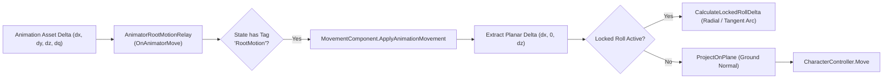
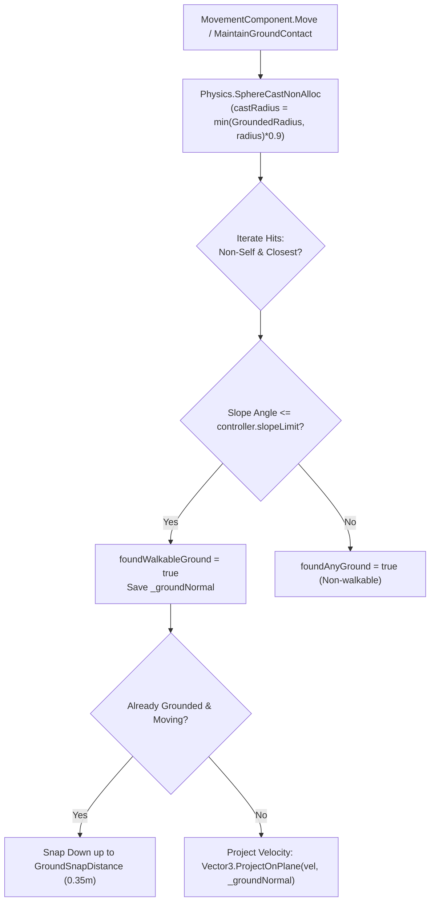

# SYSTEM SPECIFICATION: Locomotion Architecture

> Authoritative technical specification for the Souls-like character locomotion engine, movement physics, root-motion integration, input disambiguation, and capability gating in SoulsLikeTemplate.

---

## 1. Input Engine & Buffer Management

```mermaid
flowchart TD
    Raw["ProjectInputActions (Sprint/Move/Jump/Attack)"] --> PIR["PlayerInputReader"]
    PIR --> HoldCheck{"Sprint Press Duration<br/>>= 0.30s?"}
    HoldCheck -->|Yes| Sprint["SprintHeld = true"]
    HoldCheck -->|No (on Release)| Roll["Dispatch CharacterAction.Roll"]
    
    PIR --> Struct["Build CharacterInput"]
    Struct --> CASM["CharacterActionStateMachine"]
    
    CASM --> StateCheck{"Current State == Neutral?"}
    StateCheck -->|Yes| Exec["Execute Action Immediately"]
    StateCheck -->|No| QueueCheck{"Queue Window Open<br/>(QueueCheck Signal)?"}
    QueueCheck -->|Yes| Exec
    QueueCheck -->|No| Buf["Store in 1-Slot Buffer<br/>(1.0s Retention)"]
```

### 1.1 Key-Release Action Mapping (Sprint vs. Roll)
- **Input Sharing**: Sprint and Roll share the primary dodge keybinding in [`PlayerInputReader.cs`](file:///f:/Private/SoulsLikeTemplate/Assets/Scripts/Entities/Character/Input/PlayerInputReader.cs).
- **Key-Down Event**: Starts an internal hold timer (`_sprintHoldTime = 0.0s`).
- **Hold Qualification ($t_{\text{hold}} \ge 0.30\text{ s}$)**: Qualifies the gesture as `SprintHeld = true` when directional movement input exists.
- **Key-Release Event ($t_{\text{hold}} < 0.30\text{ s}$)**: Dispatches [`CharacterAction.Roll(moveInput, cameraYaw)`](file:///f:/Private/SoulsLikeTemplate/Assets/Scripts/Entities/Character/Runtime/CharacterAction.cs).

### 1.2 Action State Machine & 1-Slot Buffer
- **Buffer Model**: [`CharacterActionStateMachine`](file:///f:/Private/SoulsLikeTemplate/Assets/Scripts/Entities/Character/Runtime/CharacterActionStateMachine.cs) implements a deterministic 1-slot buffer (`_bufferedAction`).
- **Buffer Lifetime**: `1.0s` (`BUFFER_DURATION_SECONDS`).
- **Replacement Policy**: The newest actionable command overwrites any previous entry.
- **Pruning Rule**: Buffer expiration is evaluated and pruned only when in `CharacterAction.State.Neutral`.
- **Cancel Windows**: Animation states emit `StateMachineState.QueueCheck` via `AnimatorStateMachine` StateMachineBehaviours. When received, `Character` consumes the buffered action via `TryExecuteBufferedAction(now)`.
- **Roll-to-Sprint Interrupt**: If `Sprint` is held while rolling, the state machine triggers `InterruptRollForSprint()` on the very first frame of the `QueueCheck` window, seamlessly breaking into sprint.

---

## 2. Root-Motion Centric Architecture



### 2.1 Motion Extraction & Tag Contracts
- **Root Motion Relay**: [`AnimatorRootMotionRelay.cs`](file:///f:/Private/SoulsLikeTemplate/Assets/Scripts/Components/Animator/AnimatorRootMotionRelay.cs) intercepts `OnAnimatorMove()`.
- **Tags**:
  - `RootMotion`: Engages root motion evaluation and passes $\Delta \vec{P}_{\text{root}}$ and $\mathbf{Q}_{\text{root}}$ to `MovementComponent`.
  - `MovementBlocked`: Blocks standard kinematic stick movement during non-root-motion recovery animations.
- **Planar Isolation**: To prevent animations from lifting the character controller and triggering false airborne falls, vertical animation displacement is zeroed during rolls and grounded states:
  $$\Delta \vec{P}_{\text{planar}} = (\Delta P_x, 0, \Delta P_z)$$
- **Velocity Decoupling**: Standard kinematic velocity integration is zeroed when `_movementBlocked` is active.

---

## 3. Movement Blocking & Capability Gating

Capability locks are unified under a bitmask enum in [`Character.cs`](file:///f:/Private/SoulsLikeTemplate/Assets/Scripts/Entities/Character/Character.cs):

```csharp
[Flags]
private enum MovementLockReason
{
    None      = 0,
    Manual    = 1 << 0,  // Script / external pause
    Animation = 1 << 1,  // Root motion or MovementBlocked tag
    Spawn     = 1 << 2,  // Initial spawn sequence
    Parry     = 1 << 3,  // Active parry animation window
    Critical  = 1 << 4   // Synchronized critical execution
}
```

### Capability Matrix

| Reason | Movement Blocked | Input Blocked | Can Guard? | Trigger / Clearing Event |
|---|---|---|---|---|
| **Manual** | `true` | `false` | `false` | External gameplay scripts |
| **Animation** | `true` | `false` | Only during `QueueCheck` in `Attack` | `AnimatorRootMotionRelay` tags |
| **Spawn** | `true` | `true` | `false` | `StateMachineName.Spawn` Exit |
| **Parry** | `true` | `true` | `false` | `StateMachineName.Parry` Exit |
| **Critical** | `true` | `true` | `false` | `CriticalAttackController.OnCompleted` |

---

## 4. Ground Alignment, Slopes & Stairs Physics



### 4.1 Ground Probing & Slope Physics
- **SphereCast Probing**: [`MovementComponent.TryProbeGround`](file:///f:/Private/SoulsLikeTemplate/Assets/Scripts/Components/Movement/MovementComponent.cs) uses `Physics.SphereCastNonAlloc` with a preallocated array (`GROUND_PROBE_HIT_CAPACITY = 8`) to detect ground geometry without allocations.
- **Cast Geometry**:
  - Origin: Transform center minus lower hemisphere offset ($y_{\text{center}} - \frac{h}{2} + r$).
  - Radius: $\min(\text{GroundedRadius}, \text{controller.radius}) \times 0.9$.
  - Layers: `Model.GroundLayers` (ignores triggers).
- **Walkable Threshold**: Tested against `Vector3.Angle(hit.normal, Vector3.up) <= controller.slopeLimit`.
- **Slope Projection**: Grounded velocity is projected onto the surface tangent:
  $$\vec{V}_{\text{projected}} = \text{Normalize}\left(\vec{V} - (\vec{V} \cdot \vec{N})\vec{N}\right) \cdot \|\vec{V}\|$$

### 4.2 Downward Ground Snapping & Stairs Traversal
- **Snap Distance**: `GroundSnapDistance = 0.35m`.
- **Stair Stepping**: When moving down stairs or slopes, `MaintainGroundContact()` performs downward correction up to $0.35\text{m}$ if the character is already grounded, preventing false airborne transitions.
- **Fall Grace Timer**: `FallTimeout = 0.10s`. If ground support is temporarily lost while descending geometry, the character remains grounded until the timer expires.
- **Note on Foot IK**: The current template uses pure kinematic capsule snapping; 2-bone Foot IK is not active in the project.

---

## 5. Locomotion Modes: Free-Aim vs. Target Lock-On

### 5.1 Free-Aim Mode (Unlocked)
- **Coordinate Space**: World space relative to Camera Yaw:
  $$\vec{D}_{\text{world}} = \text{Quaternion.Euler}(0, \theta_{\text{cam}}, 0) \cdot (I_x, 0, I_y)$$
- **Facing Alignment**: Character yaw rotates smoothly toward movement travel direction using `Mathf.SmoothDampAngle`:
  - Grounded Smooth Time: `RotationSmoothTime = 0.12s`
  - Airborne Smooth Time: `AirRotationSmoothTime = 0.25s`
- **Speed Multiplier**: Uniform $100\%$ speed in all $360^\circ$ directions.

### 5.2 Target Lock-On Mode
- **Coordinate Space**: Target-relative local axes (Forward $\rightarrow$ Target, Right $\rightarrow \text{Vector3.Cross}(\text{Up}, \text{Forward})$).
- **Facing Vector**: Character forward is clamped directly to face the locked target:
  $$\vec{F} = \text{Normalize}(\vec{P}_{\text{target}} - \vec{P}_{\text{character}})$$
- **Directional Speed Modifiers**:
  $$\text{TargetSpeed} = \text{BaseSpeed} \cdot \left(I_x^2 \cdot 0.85 + I_y^2 \cdot (I_y \ge 0 ? 1.0 : 0.72)\right)$$
  - Forward ($0^\circ$): $100\%$ speed ($1.00\times$)
  - Lateral Arc ($\pm 90^\circ$): $85\%$ speed ($0.85\times$)
  - Backward ($180^\circ$): $72\%$ speed ($0.72\times$)

---

## 6. Movement Tiers & Tuning Values

Values authored in [`Assets/Settings/Player/MovementData.asset`](file:///f:/Private/SoulsLikeTemplate/Assets/Settings/Player/MovementData.asset):

| Movement Tier | Speed (m/s) | Stamina Cost / Drain | Stealth Context |
|---|---:|---|---|
| **Crouch Walk** | `2.0 m/s` | `0.0 pts/s` | Reduced collider height (`1.0m`), low profile |
| **Jog / Run (Default Stick)** | `2.0 m/s` | `0.0 pts/s` | Standard locomotion |
| **Sprint (Hold Space)** | `6.0 m/s` | In Combat: `10.0 pts/s`<br/>Out of Combat: `0.0 pts/s` | Highest speed; suppressed while crouched |
| **Slide** | `8.0 m/s` | `0.0 pts` | Fixed duration `0.80s` |

---

## 7. Roll, Dodge & Backstep Engine

### 7.1 Roll Mechanics
- **Stamina Cost**: `RollStaminaCost = 12.0 pts` (Requires `Stamina > RollStaminaStartThreshold = 0.0`).
- **Cooldown**: `RollCooldown = 0.20s`.
- **Direction Resolution**:
  - **Free-Aim**: Faces travel direction immediately; triggers forward roll animation clip.
  - **Locked-On**: Clamps input to 4 cardinal directions (`Left`, `Right`, `Forward`, `Backward`).
  - **Locked Lateral Orbit**: Translates along a circular arc around the target:
    $$\Delta \theta = -\text{dir}_x \cdot \frac{\Delta d}{r} \cdot \frac{180}{\pi}$$
- **Contextual Follow-up**: Rolling opens a 1.0s window upon completion; pressing light attack triggers `RollingLightAttack`.

### 7.2 Backstep Mechanics
- **Trigger**: Sprint/Roll key released with $\|\vec{I}\| \le 0.01$ (neutral stick).
- **Direction**: Displaces linearly along $-\vec{F}$ (opposite current facing).
- **Invincibility**: $0\text{ i-frames}$ natively.
- **Contextual Follow-up**: Light attack within 1.0s triggers `BackStepAttack`.

---

## 8. Jump Logic & Aerial Physics

### 8.1 Trajectory & Phases
1. **Takeoff**: `TryStartJump` checks grounded state, stamina (`JumpStaminaCost = 10.0`), and cooldown (`JumpTimeout = 0.50s`).
   $$v_y = \sqrt{2 \cdot \text{JumpHeight} \cdot |\text{Gravity}|} = \sqrt{2 \cdot 1.2 \cdot 15} \approx 6.0\text{ m/s}$$
2. **Ascent (`JumpStart`)**: Horizontal takeoff momentum is preserved. Ground probing is suppressed for `JumpGroundIgnoreTime = 0.12s`.
3. **Apex (`Airborne`)**: When vertical velocity drops to $\le \text{JumpApexThreshold} = 0.35\text{ m/s}$, state machine transitions to `LocomotionState.Airborne`.
4. **Air Steering**: Directional control is modulated via `Vector3.MoveTowards`:
   $$\Delta \vec{V}_{\text{air}} = \text{AirAcceleration} \cdot \text{AirControl} \cdot \Delta t = 8.0 \cdot 0.25 \cdot \Delta t = 2.0 \cdot \Delta t$$
5. **Landing**: Requires $v_y \le 0$, airborne duration $\ge 0.08\text{s}$, and walkable ground contact:
   - **Normal Landing** ($|v_y| < 12.0\text{ m/s}$): Sets `LandingType.Normal`, returns to `Grounded`.
   - **Hard Landing** ($|v_y| \ge 12.0\text{ m/s}$): Sets `LandingType.Hard`, triggers heavy landing recovery.

---

## 9. Crouch Architecture

- **Capsule Adjustment**: Entering crouch modifies the `CharacterController` directly:
  - Height: Default ($1.8\text{m}$) $\rightarrow$ `CrouchHeight = 1.0m` ($\approx 44.4\%$ reduction).
  - Center: $Y = \text{CrouchHeight} \times 0.5 = 0.5\text{m}$.
- **Speed Clamping**: Limits maximum speed to `CrouchSpeed = 2.0m/s`.
- **Sprint Suppression**: Sprinting is blocked while crouching.

---

## 10. Implementation Mapping & Deviations Summary

| Design Feature | Theoretical FromSoftware Specification | SoulsLikeTemplate C# Reality |
|---|---|---|
| **Input Buffer** | 15–30 frame sliding queue ($250\text{--}500\text{ms}$) | 1-slot buffer with 1.0s retention in [`CharacterActionStateMachine`](file:///f:/Private/SoulsLikeTemplate/Assets/Scripts/Entities/Character/Runtime/CharacterActionStateMachine.cs) |
| **Movement Locking** | Bitwise hex flags (`0x01, 0x02, 0x04, 0x08`) | [`MovementLockReason`](file:///f:/Private/SoulsLikeTemplate/Assets/Scripts/Entities/Character/Character.cs) bitmask + Animator Tags (`"RootMotion"`, `"MovementBlocked"`) |
| **Stairs & Ground Alignment** | 2-Bone Inverse Kinematics (IK) & Pelvis adaptation | Pure kinematic downward snap ([`GroundSnapDistance = 0.35m`](file:///f:/Private/SoulsLikeTemplate/Assets/Scripts/Components/Movement/MovementData.cs)) and `SphereCastNonAlloc` |
| **Roll Direction (Locked)** | 8-directional roll with variant clips | 4-cardinal quantized roll with dynamic orbital math (`CalculateLockedRollDelta`) |
| **Weight Tiers & i-Frames** | Light/Med/Heavy/Overloaded i-frame tables | Not yet segmented by weight load; invulnerability managed by [`CombatDefenseComponent`](file:///f:/Private/SoulsLikeTemplate/Assets/Scripts/Entities/Combat/CombatDefenseComponent.cs) |
| **Jump Lower-Body Hurtbox** | Spatial lower-body hurtbox deactivation | Standard physics arc without spatial hurtbox layer disabling |
| **Crouch Attack Aliasing** | `crouch_attack == roll_attack` | Normal light attack execution while crouched |