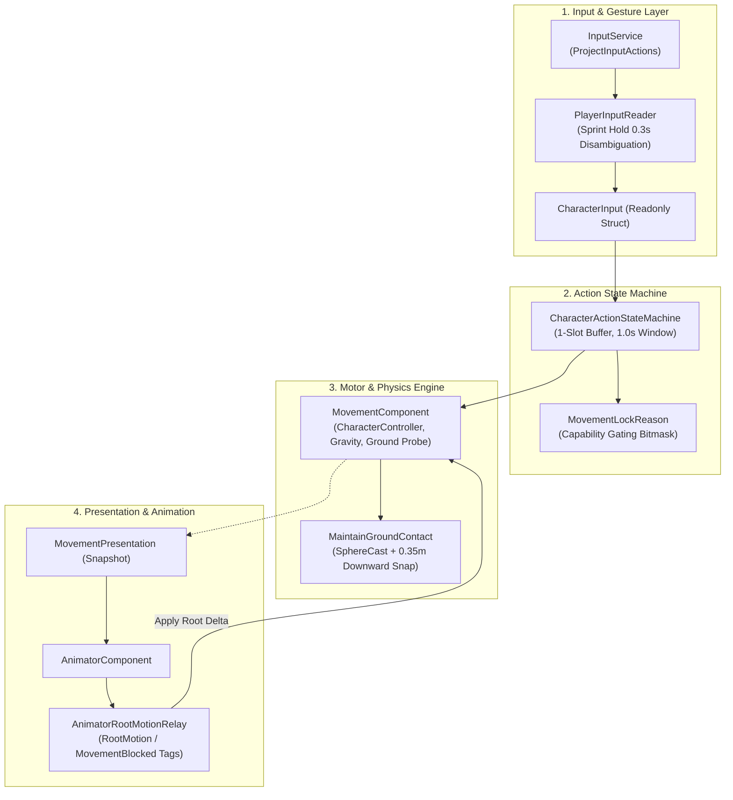

---
tags:
  - unity
  - soulslike
  - locomotion
  - mechanics
  - guide
status: implemented
---

# Movement Mechanics Explained

> Comprehensive architectural and gameplay guide to character movement, aerial physics, dodging, ground probing, and input buffering in SoulsLikeTemplate.

---

## 1. System Overview & Architecture

The movement system in SoulsLikeTemplate is structured into clean, decoupled layers separating hardware input, semantic action dispatching, motor physics calculation, and visual presentation:



---

## 2. Input Handling & Button Buffer Engine

### 2.1 Roll vs. Sprint Disambiguation
Because **Roll** and **Sprint** share a single physical input binding (Space on keyboard / B on gamepad), [`PlayerInputReader.cs`](file:///f:/Private/SoulsLikeTemplate/Assets/Scripts/Entities/Character/Input/PlayerInputReader.cs) disambiguates user intent through hold duration:
- **Button Down**: Starts the internal timer (`_sprintHoldTime = 0`).
- **Button Held ($\ge 0.30\text{ s}$)**: Qualifies the gesture as `SprintHeld = true`.
- **Button Released ($< 0.30\text{ s}$)**: Triggers a `Roll` action on release.

### 2.2 Action Queuing & Buffer Window
- **1-Slot Action Buffer**: The state machine holds the latest actionable input in [`CharacterActionStateMachine`](file:///f:/Private/SoulsLikeTemplate/Assets/Scripts/Entities/Character/Runtime/CharacterActionStateMachine.cs).
- **Buffer Expiration**: Cached actions expire after $1.0\text{ s}$ (`BUFFER_DURATION_SECONDS`), but expiration is only evaluated during `Neutral`.
- **Queue Window Execution**: Animations tag their cancelable recovery frames with `StateMachineState.QueueCheck`. When reached, the buffered command is immediately executed.
- **Roll-to-Sprint Early Exit**: Holding Sprint during a Roll triggers `InterruptRollForSprint()` on the first frame of `QueueCheck`, allowing immediate transition to sprinting without waiting for the full roll recovery animation.

---

## 3. Locomotion: Free-Aim vs. Locked-On

| Locomotion Parameter | Free-Aim (Unlocked Movement) | Locked-On (Target-Relative Strafe) |
|---|---|---|
| **Coordinate Framework** | World-Space relative to Camera View Yaw ($\vec{V}_{\text{cam}}$). | Target-relative polar coordinates ($\vec{T} = \vec{P}_{\text{target}} - \vec{P}_{\text{player}}$). |
| **Facing Vector ($\vec{F}$)** | Smoothly rotates to match the 2D movement vector via `Mathf.SmoothDampAngle`. | Clamped directly toward the active target transform ($\vec{T}$). |
| **Velocity Vector ($\vec{V}$)** | Uniform $100\%$ speed in all $360^\circ$ directions. | Non-uniform: Forward ($100\%$), Lateral Arc ($85\%$), Backward ($72\%$). |
| **Turning Behavior** | Character rotates smoothly to face travel direction. | Character strafes laterally and backpedals with constant lock-on facing. |
| **Roll Behavior** | Directional roll aligned with input angle; triggers forward roll animation. | 4-cardinal quantized roll (`Left`, `Right`, `Forward`, `Backward`) with lateral circular orbit. |

### Speed Scaling in Locked-On Mode
In [`MovementComponent.cs`](file:///f:/Private/SoulsLikeTemplate/Assets/Scripts/Components/Movement/MovementComponent.cs):
$$\text{TargetSpeed} = \text{BaseSpeed} \cdot \left(I_x^2 \cdot 0.85 + I_y^2 \cdot (I_y \ge 0 ? 1.0 : 0.72)\right)$$

---

## 4. Movement Tiers & Speed Tuning

Authoritative values defined in [`Assets/Settings/Player/MovementData.asset`](file:///f:/Private/SoulsLikeTemplate/Assets/Settings/Player/MovementData.asset):

```
+-----------------------------------------------------------------------------+
|                           Movement Speed Metrics                            |
+-----------------------------------------------------------------------------+
| Crouch Walk : 2.0 m/s  | Stamina Drain:  0.0 pts/s | Collider Height: 1.0 m |
| Default Run : 2.0 m/s  | Stamina Drain:  0.0 pts/s | Standard Locomotion    |
| Sprint      : 6.0 m/s  | Stamina Drain: 10.0 pts/s (In Combat Only)         |
| Slide       : 8.0 m/s  | Duration     :  0.80 s    | Fixed Kinematic Action |
+-----------------------------------------------------------------------------+
```

- **Combat Sprint Stamina Drain**: Sprinting drains stamina ($10.0\text{ pts/s}$) only when [`ICombatStateNotifier`](file:///f:/Private/SoulsLikeTemplate/Assets/Scripts/Services/ICombatStateNotifier.cs) reports `CombatState.Combat`. Out of combat, sprinting incurs zero stamina cost.
- **Sprint Gating**: If stamina drops to $\le 0$, sprinting is suppressed until stamina regenerates above `CombatSprintStaminaStartThreshold = 0.0`.

---

## 5. Roll / Dodge Engine & Contextual Combat

```mermaid
flowchart TD
    Input["Dodge Key Released"] --> NeutralCheck{"Move Input Magnitude <= 0.01?"}
    NeutralCheck -->|Yes| Backstep["Trigger Backstep\n(rollDirection = Vector2.down)"]
    NeutralCheck -->|No| ModeCheck{"Movement Mode?"}
    
    ModeCheck -->|Free| FreeRoll["Rotate to World Direction\n(rollDirection = Vector2.up)"]
    ModeCheck -->|LockedOn| LockRoll["Quantize to 4 Cardinal Bins\n(Face Target, Orbit Lateral)"]
    
    FreeRoll --> RootMotion["Apply Root Motion (Planar Delta)"]
    LockRoll --> RootMotion
    Backstep --> RootMotion
    
    RootMotion --> Exit["Roll / Backstep Completes"]
    Exit --> Context["Open 1.0s Contextual Attack Window"]
    Context --> AtkCheck{"Light Attack Pressed?"}
    AtkCheck -->|Yes (from Roll)| RollAtk["AttackType.RollingLightAttack"]
    AtkCheck -->|Yes (from Backstep)| BSAtk["AttackType.BackStepAttack"]
```

### 5.1 Roll Execution
- **Stamina Cost**: `RollStaminaCost = 12.0 pts`.
- **Cooldown**: `RollCooldown = 0.20 s`.
- **Locked Lateral Orbit**: When rolling laterally in lock-on mode, `CalculateLockedRollDelta` converts root displacement into a circular arc around the target:
  $$\Delta \theta = -\text{dir}_x \cdot \frac{\Delta d}{r} \cdot \frac{180}{\pi}$$
  $$r = \|\vec{P}_{\text{player}} - \vec{P}_{\text{target}}\|$$

### 5.2 Backstep Mechanics
- **Trigger**: Sprint/Roll key released with $\|\vec{I}\| \le 0.01$ (neutral stick).
- **Direction**: Displaces linearly along $-\vec{F}$ (opposite character forward).
- **Invincibility**: $0\text{ i-frames}$ natively.
- **Contextual Attack Follow-up**: Light attack within $1.0\text{ s}$ executes `BackStepAttack`.

---

## 6. Jump Logic & Aerial Physics

```text
Grounded
   │ jump accepted (TryStartJump)
   ▼
JumpStart (v_y = sqrt(2 * JumpHeight * |Gravity|) = 6.0 m/s)
   │ vertical velocity reaches apex threshold (v_y <= 0.35 m/s)
   ▼
Airborne (Air Steering: AirAcceleration * AirControl = 2.0 m/s^2)
   │ walkable contact while descending
   ├──────────────► Landing (Impact < 12.0 m/s) ─────► Grounded
   └ hard impact ► HardLanding (Impact >= 12.0 m/s) ──► Grounded
```

### 6.1 Jump Trajectory & Phasing
- **Takeoff Velocity**: $v_y = \sqrt{2 \cdot \text{JumpHeight} \cdot |\text{Gravity}|} = \sqrt{2 \cdot 1.2 \cdot 15} \approx 6.0\text{ m/s}$.
- **Momentum Preservation**: Takeoff preserves existing horizontal ground momentum.
- **Air Control**: In-air steering is capped at $\text{AirAcceleration} \cdot \text{AirControl} = 8.0 \cdot 0.25 = 2.0\text{ m/s}^2$ via `Vector3.MoveTowards`.
- **Apex Detection**: Vertical velocity dropping below `JumpApexThreshold = 0.35 m/s` transitions state from `JumpStart` to `Airborne`.
- **Landing Severity**:
  - *Normal Landing* ($|v_y| < 12.0\text{ m/s}$): Smooth transition back to `Grounded`.
  - *Hard Landing* ($|v_y| \ge 12.0\text{ m/s}$): Sets `LandingType.Hard`, triggering heavy landing recovery.

---

## 7. Crouch Mechanics

- **Collider Height**: Entering crouch reduces `CharacterController.height` from $1.8\text{m}$ to `CrouchHeight = 1.0m` ($\approx 44.4\%$ reduction), adjusting `controller.center.y` to $0.5\text{m}$.
- **Speed Clamping**: Maximum movement speed is capped at `CrouchSpeed = 2.0m/s`.
- **Sprint Suppression**: Sprinting is blocked while crouching.

---

## 8. Ground Alignment & Stairs Logic

Handling uneven terrain, slopes, and stairs without capsule snagging relies on non-allocating SphereCast probing:
- **Probing Method**: [`MovementComponent.TryProbeGround`](file:///f:/Private/SoulsLikeTemplate/Assets/Scripts/Components/Movement/MovementComponent.cs) uses `Physics.SphereCastNonAlloc` with a preallocated 8-element hit buffer.
- **Walkable Threshold**: Surfaces with slope angle $\le \text{controller.slopeLimit}$ are flagged as walkable.
- **Downward Snapping**: [`MaintainGroundContact()`](file:///f:/Private/SoulsLikeTemplate/Assets/Scripts/Components/Movement/MovementComponent.cs) snaps the controller downward up to `GroundSnapDistance = 0.35m` while already grounded, preventing false airborne detachment on stairs.
- **Surface Normal Projection**: Velocity is projected onto the surface normal plane:
  $$\vec{V}_{\text{surface}} = \text{Normalize}\left(\vec{V} - (\vec{V} \cdot \vec{N})\vec{N}\right) \cdot \|\vec{V}\|$$
- **Fall Grace Timer**: `FallTimeout = 0.10s` provides a brief window before ungrounded state is committed when walking off edges or down steep stairs.

---

## 9. Movement Blocking & Action Locking (`MovementLockReason`)

In [`Character.cs`](file:///f:/Private/SoulsLikeTemplate/Assets/Scripts/Entities/Character/Character.cs), movement and control locks are managed through a unified bitmask enum:

```csharp
[Flags]
private enum MovementLockReason
{
    None      = 0,
    Manual    = 1 << 0,  // Script / pause lock
    Animation = 1 << 1,  // Root motion or MovementBlocked tag
    Spawn     = 1 << 2,  // Initial spawn sequence
    Parry     = 1 << 3,  // Active parry deflection window
    Critical  = 1 << 4   // Synchronized critical attack sequence
}
```

This prevents overlapping lifecycles (e.g. an animation completing during a parry or critical) from prematurely restoring player movement.

---

## 10. Design Specification vs. Project Reality

| Feature | Design Specification (Theoretical) | Live SoulsLikeTemplate C# Implementation |
|---|---|---|
| **Input Buffer** | 15–30 frame sliding queue ($250\text{--}500\text{ms}$) | 1-slot buffer with 1.0s retention & `QueueCheck` SMB evaluation |
| **Movement Locking** | Generic bitwise hex flags (`0x01, 0x02, 0x04, 0x08`) | `MovementLockReason` bitmask + Animator Tags (`"RootMotion"`, `"MovementBlocked"`) |
| **Stairs & Ground Alignment** | 2-Bone Inverse Kinematics (IK) & Pelvis adaptation | Pure kinematic downward snap (`GroundSnapDistance = 0.35m`) and `SphereCastNonAlloc` |
| **Locked Roll Direction** | 8-way directional roll with specialized variant clips | 4-cardinal quantized roll with dynamic orbital math (`CalculateLockedRollDelta`) |
| **Weight Tiers & i-Frames** | Light/Med/Heavy/Overloaded i-frame tables | Managed via `CombatDefenseComponent` and `ResolveMeleeHitCommand` checking `IsInvulnerable` |
| **Jump Lower-Body Hurtbox** | Spatial lower-body hurtbox deactivation | Standard physics arc without spatial hurtbox layer disabling |
| **Crouch Attack Aliasing** | `crouch_attack == roll_attack` | Normal light attack execution while crouched |
