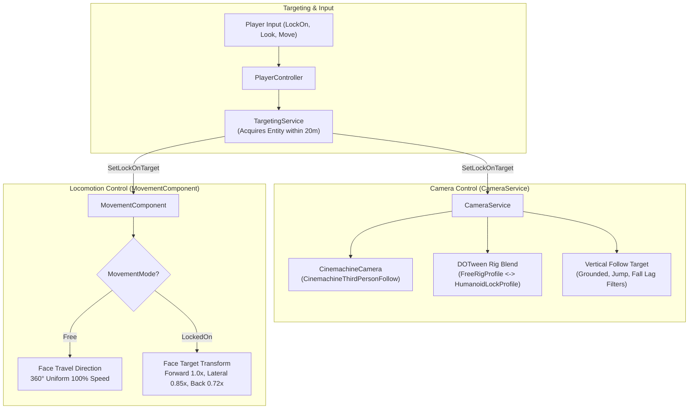

# System Specification: Souls-like Locomotion & Camera System

> Authoritative specification for the 3rd-person character locomotion, Cinemachine 3 camera controller, and target-lock tracking system in SoulsLikeTemplate.

---

## 1. System Overview & Architecture

The system coordinates between three primary components:
- **`CameraService`** ([`Assets/Scripts/Services/CameraService/CameraService.cs`](file:///f:/Private/SoulsLikeTemplate/Assets/Scripts/Services/CameraService/CameraService.cs)): Manages Cinemachine 3 virtual cameras, rig blending, look pitch/yaw, vertical follow smoothing with airborne lag, and target look-at tracking.
- **`TargetingService`** ([`Assets/Scripts/Services/Targeting/TargetingService.cs`](file:///f:/Private/SoulsLikeTemplate/Assets/Services/Targeting/TargetingService.cs)): Manages spatial target acquisition and validity checking across `EntityType.Enemy` actors within $20.0\text{m}$.
- **`MovementComponent`** ([`Assets/Scripts/Components/Movement/MovementComponent.cs`](file:///f:/Private/SoulsLikeTemplate/Assets/Scripts/Components/Movement/MovementComponent.cs)): Governs motor physics, ground probing, directional facing, and speed scaling in both `Free` and `LockedOn` modes.

---

## 2. Unlocked Mode (Free Orbit)

### 2.1 Camera Controller Dynamics
- **Control Mode**: Free Orbit driven by manual mouse / stick input.
- **Input Sensitivity**:
  - Pointer (Mouse): `MouseYawDegreesPerPixel = 0.15°/px`, `MousePitchDegreesPerPixel = 0.15°/px`.
  - Gamepad Stick: `StickYawDegreesPerSecond = 180°/s`, `StickPitchDegreesPerSecond = 135°/s`.
- **Clamping**: Clamped between `BottomClamp = -80.0°` and `TopClamp = 80.0°`.
- **Shoulder Angle Toggle**: `SwitchAngle()` triggers DOTween tweening of `CameraSide` ($0.0 \leftrightarrow 1.0$) with `SwitchAngleDuration = 0.25s`.
- **Collision Handling**: Cinemachine Third Person Follow damping and collision raycasts.

### 2.2 Character Orientation & Facing
- **Heading Determination**: Character forward vector ($\vec{F}$) rotates smoothly toward `worldDirection` (derived from camera yaw $\theta_{\text{cam}}$ and 2D joystick input $\vec{I}$).
- **Smoothing Response**:
  - Grounded: `Mathf.SmoothDampAngle` with `RotationSmoothTime = 0.12s`.
  - Airborne: `Mathf.SmoothDampAngle` with `AirRotationSmoothTime = 0.25s`.
- **Backwards Input**: Pulling backward causes the character to turn around and run toward the camera ($100\%$ speed).
- **Strafing**: Disabled in Free Mode.

### 2.3 Speed Multipliers & Evade
- **Forward / Backward / Lateral**: Uniform $100\%$ baseline velocity ($2.0\text{ m/s}$ run, $6.0\text{ m/s}$ sprint).
- **Roll / Dodge**: 8-directional roll relative to camera direction. Character transform immediately snaps forward to match travel direction on Frame 0.

---

## 3. Locked-On Mode (Target Anchor)

### 3.1 Camera Dynamics & Target Tracking
- **Control Mode**: Target Anchor.
- **Rig Profile Blend**: Transitioning into Lock-On triggers a DOTween blend (`LockRigBlendDuration = 0.30s`) from `_freeRigProfile` to `HumanoidLockProfile` (ShoulderOffset: `(0.5, 0.0, 0.0)`, ArmLength: `0.0`, Distance: `3.8m`, FOV: `48.0°`).
- **Dynamic Elevation & Pitch Adjustment**: Pitch angles dynamically based on target height delta and distance:
  $$\text{Elevation} = \text{atan2}(y_{\text{target}} - y_{\text{player}}, \max(d_{\text{planar}}, \text{LockMinPitchDistance})) \cdot \frac{180}{\pi}$$
  $$\text{Pitch} = \text{Clamp}(\text{LockBasePitch} - \text{Elevation} \cdot \text{Influence}, \text{MinPitch}, \text{MaxPitch})$$
  - `LockBasePitch`: $8.0^\circ$
  - `MinPitch`: $-40.0^\circ$, `MaxPitch`: $60.0^\circ$
- **Close-Range Heading Stability**: To prevent camera whipping when walking directly beneath or past an enemy, `_holdingCloseHeading` engages when distance $\le 1.2\text{m}$ (`LockHeadingHoldDistance`) and releases when distance $\ge 1.8\text{m}$ (`LockHeadingReleaseDistance`).
- **Look-At Smoothing**: `_smoothedFocusOffset` is damped via `Vector3.SmoothDamp` with `LockTargetSmoothTime = 0.15s` during initial target acquisition.

### 3.2 Character Orientation & Movement Dynamics
- **Facing Vector ($\vec{F}$)**: Continuously clamped directly toward the active target transform:
  $$\vec{F} = \text{Normalize}(\vec{P}_{\text{target}} - \vec{P}_{\text{player}})$$
- **Strafing Matrix**: Active. Left/right input forces lateral strafing while maintaining lock-on facing.
- **Directional Speed Scaling**:
  - Forward ($0^\circ$): $100\%$ speed ($1.00\times$).
  - Lateral Arc ($\pm 90^\circ$): $85\%$ speed ($0.85\times$).
  - Backward ($180^\circ$): $72\%$ speed ($0.72\times$).
- **Orbital Roll Mechanics**:
  - Input is quantized into 4 cardinal bins (`Left`, `Right`, `Forward`, `Backward`).
  - Lateral rolls calculate circular displacement around the target:
    $$\Delta \theta = -\text{dir}_x \cdot \frac{\Delta d}{r} \cdot \frac{180}{\pi}$$

---

## 4. Camera Follow Dynamics & Vertical Smoothing

To keep jumping and landing readable without jarring camera snaps, [`CameraService.UpdateFollowTarget`](file:///f:/Private/SoulsLikeTemplate/Assets/Scripts/Services/CameraService/CameraService.cs) implements vertical lag filtering:

| State | Smooth Time | Max Speed | Vertical Lag Window |
|---|---:|---:|---|
| **Grounded** | `0.05 s` | `20.0 m/s` | `sourcePosition.y` (No lag) |
| **Jump Ascent** ($v_y \ge 0$) | `0.20 s` | `10.0 m/s` | Clamped to $y_{\text{source}} - 0.50\text{m}$ (`AirborneRiseLag`) |
| **Falling** ($v_y < 0$) | `0.10 s` | `25.0 m/s` | Clamped to $y_{\text{source}} + 0.75\text{m}$ (`AirborneFallLag`) |
| **Long Fall Catchup** | `0.03 s` | `40.0 m/s` | Engages linearly over `LongFallCatchupDistance = 8.0m` |

---

## 5. Transition Logic & Break Conditions

### 5.1 Lock-On Acquisition (`OnLockOnButtonPressed`)
1. [`PlayerController.HandleLockOnInput`](file:///f:/Private/SoulsLikeTemplate/Assets/Scripts/Entities/Character/PlayerController.cs) invokes [`TargetingService.TryAcquireTarget`](file:///f:/Private/SoulsLikeTemplate/Assets/Scripts/Services/Targeting/TargetingService.cs).
2. `TargetingService` iterates all registered `EntityType.Enemy` candidates within `MAX_LOCK_ON_DISTANCE = 20.0m` and selects the closest alive entity.
3. **On Success**:
   - `Character.SetLockOnTarget(true, entityId)` engages locked movement and target-facing orientation.
   - `CameraService.SetLockOnTarget(entityId)` initiates rig blend and look-at tracking.
4. **On Failure (No Target in Range)**:
   - `CameraService.RecenterCamera()` recenters camera yaw and pitch directly behind the character forward heading.

### 5.2 Break Conditions
Lock-on is automatically cleared when:
- **Manual Toggle**: User presses Lock-On button while locked.
- **Target Death**: Target `TargetingSnapshot.IsAlive == false` or health reaches 0.
- **Out of Range**: Distance between player and target exceeds `MAX_LOCK_ON_DISTANCE = 20.0m`.
- **Game State Change**: Transitions to `GameState.Ended` or `GameState.OnGraceSit`.