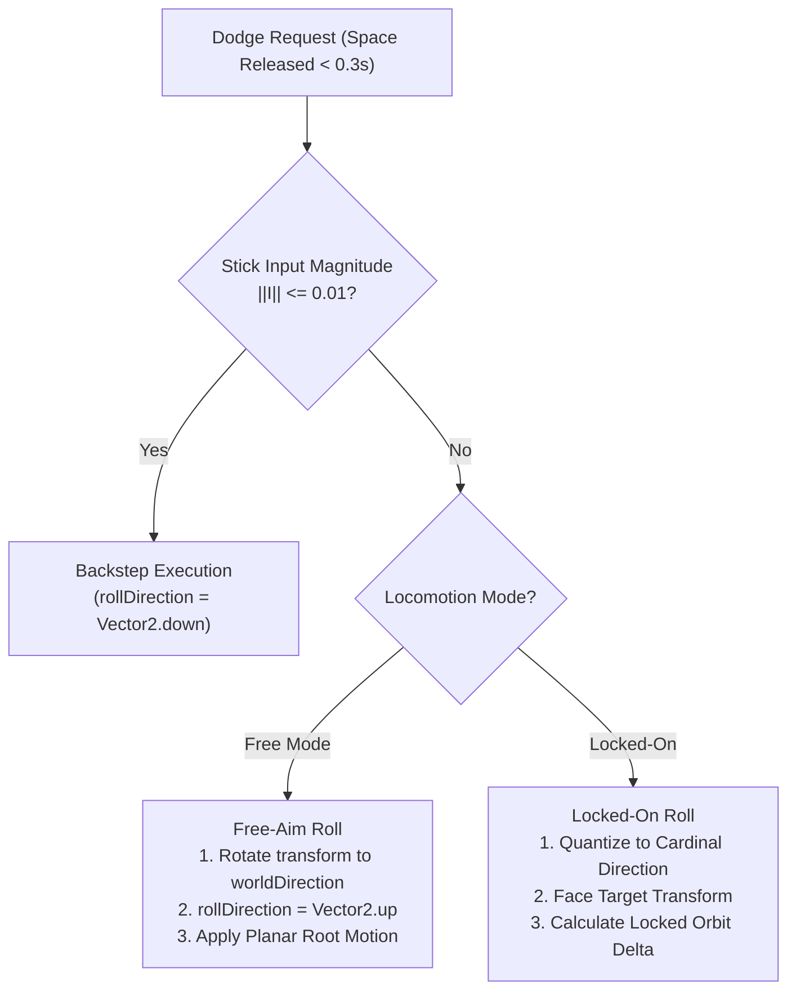
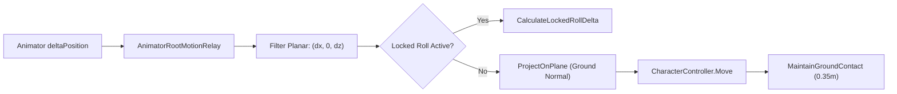

# TECHNICAL SPECIFICATION: Roll & Backstep Vectoring Logic

> Mathematical and architectural specification for dodge roll vectoring, backstep execution, orbital kinematics, and contextual attack transitions in SoulsLikeTemplate.

---

## 1. Dodge Roll Directional Logic

### 1.1 Free-Aim Mode (Unlocked)
- **Vector Evaluation**: The displacement vector ($\vec{D}$) is derived from the camera-relative 2D joystick input ($\vec{I}$) and camera yaw ($\theta_{\text{cam}}$):
  $$\vec{D}_{\text{world}} = \text{Quaternion.Euler}(0, \theta_{\text{cam}}, 0) \cdot \begin{pmatrix} I_x \\ 0 \\ I_y \end{pmatrix}$$
- **Orientation Matching**: The character transform ($T_{\text{char}}$) immediately rotates its forward vector ($\vec{F}$) to align with $\vec{D}_{\text{world}}$ on Frame 0 of roll initialization:
  $$T_{\text{char}}.\text{rotation} = \text{Quaternion.LookRotation}(\vec{D}_{\text{world}}, \text{Vector3.up})$$
- **Animation Parameter**: Sets `rollDirection = Vector2.up`, playing the standard forward roll animation clip while root motion drives the displacement along $\vec{D}_{\text{world}}$.

### 1.2 Target Lock-On Mode
- **Axis Quantization**: While locked on, continuous joystick input is quantized into discrete cardinal axes in [`MovementComponent.QuantizeLockedRollDirection`](file:///f:/Private/SoulsLikeTemplate/Assets/Scripts/Components/Movement/MovementComponent.cs):
  $$\vec{D}_{\text{quantized}} = \begin{cases} 
  (\text{sign}(I_x), 0) & \text{if } |I_x| > |I_y| \\
  (0, \text{sign}(I_y)) & \text{otherwise}
  \end{cases}$$
- **Facing Vector Locking**: Character forward vector ($\vec{F}$) is strictly clamped toward the lock-on target transform ($\vec{T}$) throughout the entire roll arc:
  $$\vec{F} = \text{Normalize}(\vec{P}_{\text{target}} - \vec{P}_{\text{player}})$$
- **Spatial Orbit Mechanics (Lateral Rolls)**:
  For lateral rolls ($\vec{D}_{\text{quantized}} = (\pm 1, 0)$), [`CalculateLockedRollDelta`](file:///f:/Private/SoulsLikeTemplate/Assets/Scripts/Components/Movement/MovementComponent.cs) transforms linear root displacement into an angular circular orbit around the target:
  $$\vec{R} = \vec{P}_{\text{player}} - \vec{P}_{\text{target}}, \quad r = \|\vec{R}\|$$
  $$\Delta \theta = -\text{dir}_x \cdot \frac{\Delta d_{\text{root}}}{r} \cdot \frac{180^\circ}{\pi}$$
  $$\vec{R}_{\text{next}} = \text{Quaternion.AngleAxis}(\Delta \theta, \text{Vector3.up}) \cdot \vec{R}$$
  $$\Delta \vec{P}_{\text{motion}} = \vec{R}_{\text{next}} - \vec{R}$$
- **Forward / Backward Locked Rolls**:
  For longitudinal rolls ($\vec{D}_{\text{quantized}} = (0, \pm 1)$), displacement is directed along the radial line toward/away from the target:
  $$\Delta \vec{P}_{\text{motion}} = \text{Normalize}(\vec{P}_{\text{target}} - \vec{P}_{\text{player}}) \cdot (\text{dir}_y \cdot \Delta d_{\text{root}})$$

---

## 2. Backstep Mechanics & Vector Logic

### 2.1 Trigger Rules & Input Evaluation
- **Neutral Key Release**: Executed when the Dodge key is released ($t_{\text{hold}} < 0.30\text{ s}$) while joystick vector magnitude $\|\vec{I}\| \le 0.01$.
- **Directional Vector**: Forced along $-\vec{F}$ (opposite current character facing).
- **Animation Trigger**: Sets `_backStepStarted = true`, consumed by `Character` to call `AnimatorComponent.TriggerBackStep()`.

### 2.2 Unlocked vs. Lock-On Backstep Behavior
- **Free-Aim (Unlocked)**:
  - Displaces directly opposite to the character facing prior to input release.
  - Enables reverse backstep maneuvers ("Rave Step"): Quickly flicking stick $\vec{I}$ to rotate character $180^\circ$ and releasing dodge produces a backstep retreating *towards* the camera/enemy.
- **Target Lock-On**:
  - Because $\vec{F}$ is clamped to face the locked target, backstepping *always* results in linear spatial retreat away from the target along $-\vec{T}$.

---

## 3. Root Motion Pipeline & Planar Collision

1. **Vertical Delta Suppression**: In [`MovementComponent.ApplyAnimationMovement`](file:///f:/Private/SoulsLikeTemplate/Assets/Scripts/Components/Movement/MovementComponent.cs), vertical root displacement is zeroed during rolls:
   $$\text{verticalDelta} = (\text{Grounded} \lor \text{isRollAction}) ? 0.0 : \Delta P_y$$
   This prevents roll animations from lifting the `CharacterController` and triggering false airborne falls.
2. **Ground Projection**: Planar displacement is projected onto the active ground normal $\vec{N}$:
   $$\vec{P}_{\text{projected}} = \text{Normalize}\left(\vec{P} - (\vec{P} \cdot \vec{N})\vec{N}\right) \cdot \|\vec{P}\|$$
3. **Downward Snapping**: [`MaintainGroundContact()`](file:///f:/Private/SoulsLikeTemplate/Assets/Scripts/Components/Movement/MovementComponent.cs) maintains ground adhesion up to `GroundSnapDistance = 0.35m`.

---

## 4. Frame Data, Cancel Windows & Contextual Attacks

### 4.1 Invulnerability & Stamina
- **Invulnerability**: Standard backstep contains $0\text{ i-frames}$. Roll invulnerability is evaluated via `IHealthComponent.IsInvulnerable` and [`CombatDefenseComponent`](file:///f:/Private/SoulsLikeTemplate/Assets/Scripts/Entities/Combat/CombatDefenseComponent.cs).
- **Stamina Cost**: `RollStaminaCost = 12.0 pts`. Requires `Stamina > RollStaminaStartThreshold = 0.0`.
- **Cooldown**: `RollCooldown = 0.20 s`.

### 4.2 Queue Windows & Sprint Interrupt
- **Queue Window**: When the roll animation reaches `StateMachineState.QueueCheck`, buffered attacks or equipment actions are admitted.
- **Roll-to-Sprint Interrupt**: If `Sprint` is held while rolling, [`CharacterActionStateMachine`](file:///f:/Private/SoulsLikeTemplate/Assets/Scripts/Entities/Character/Runtime/CharacterActionStateMachine.cs) triggers `InterruptRollForSprint()` at `QueueCheck`, breaking immediately into sprint.

### 4.3 Contextual Attack Follow-ups
In [`AttackComponent.cs`](file:///f:/Private/SoulsLikeTemplate/Assets/Scripts/Components/Attack/AttackComponent.cs):
- Exiting a Roll or Backstep starts a $1.0\text{ s}$ timer (`CONTEXTUAL_ATTACK_WINDOW`).
- Light attack during or within $1.0\text{ s}$ of Roll $\rightarrow$ triggers `AttackType.RollingLightAttack`.
- Light attack during or within $1.0\text{ s}$ of Backstep $\rightarrow$ triggers `AttackType.BackStepAttack`.

---

## 5. Summary of C# Source Authority

| System Subsystem | Primary Class Authority | File Path |
|---|---|---|
| Roll & Backstep Motor | `MovementComponent` | [`Assets/Scripts/Components/Movement/MovementComponent.cs`](file:///f:/Private/SoulsLikeTemplate/Assets/Scripts/Components/Movement/MovementComponent.cs) |
| Roll/Sprint Gesture Detection | `PlayerInputReader` | [`Assets/Scripts/Entities/Character/Input/PlayerInputReader.cs`](file:///f:/Private/SoulsLikeTemplate/Assets/Scripts/Entities/Character/Input/PlayerInputReader.cs) |
| Action Buffering & Interrupts | `CharacterActionStateMachine` | [`Assets/Scripts/Entities/Character/Runtime/CharacterActionStateMachine.cs`](file:///f:/Private/SoulsLikeTemplate/Assets/Scripts/Entities/Character/Runtime/CharacterActionStateMachine.cs) |
| Root Motion Tag Interception | `AnimatorRootMotionRelay` | [`Assets/Scripts/Components/Animator/AnimatorRootMotionRelay.cs`](file:///f:/Private/SoulsLikeTemplate/Assets/Scripts/Components/Animator/AnimatorRootMotionRelay.cs) |
| Contextual Follow-up Attacks | `AttackComponent` | [`Assets/Scripts/Components/Attack/AttackComponent.cs`](file:///f:/Private/SoulsLikeTemplate/Assets/Scripts/Components/Attack/AttackComponent.cs) |
| Movement Data & Tuning | `MovementData` (SO Asset) | [`Assets/Settings/Player/MovementData.asset`](file:///f:/Private/SoulsLikeTemplate/Assets/Settings/Player/MovementData.asset) |