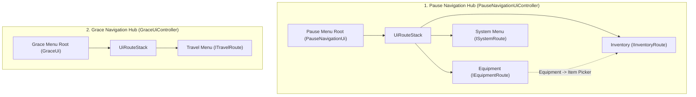

# UI Route & Navigation System Architecture

This document defines the foundational **Route & Navigation Architecture** for all UI menus, modal sub-screens, and hierarchical navigation flows in the SoulsLike project.

---

## 1. Overview & Core Philosophy

In a Souls-like game, UI navigation requires seamless transitions between root menu hubs (such as the **Pause Menu** or the **Site of Grace Resting Menu**) and deeply nested sub-screens (such as **Equipment**, **Inventory**, **Item Pickers**, **System Settings**, or **Fast Travel**).

The UI Route Navigation System adheres to four core design principles:

1. **Stack-Based LIFO Navigation**: Navigation operates as a Last-In-First-Out (LIFO) stack managed by [`UiRouteStack`](file:///f:/Private/SoulsLikeTemplate/Assets/Scripts/Ui/Navigation/UiRouteStack.cs). Pushing a new route hides the current screen; popping a route cleanly restores the previous screen.
2. **Decoupled Hub-and-Spoke Pattern**: Sub-screen controllers (e.g. [`EquipmentUiController`](file:///f:/Private/SoulsLikeTemplate/Assets/Scripts/Ui/Equipment/EquipmentUiController.cs), [`InventoryUiController`](file:///f:/Private/SoulsLikeTemplate/Assets/Scripts/Ui/Inventory/InventoryUiController.cs), [`TravelUiController`](file:///f:/Private/SoulsLikeTemplate/Assets/Scripts/Ui/Travel/TravelUiController.cs)) have zero direct dependencies on their parent routers or peer routes. They communicate exclusively via route interfaces and lifecycle events (e.g., `CloseRequested`).
3. **Single Active Screen Focus**: At any point in time, exactly one UI layer is visible and receiving input. When a sub-route is opened, the underlying root view or previous route is hidden to avoid visual clutter and input bleeding.
4. **Centralized Router Hosts**: Host controllers (e.g. [`PauseNavigationUiController`](file:///f:/Private/SoulsLikeTemplate/Assets/Scripts/Ui/PauseNavigation/PauseNavigationUiController.cs) and [`GraceUiController`](file:///f:/Private/SoulsLikeTemplate/Assets/Scripts/Ui/Grace/GraceUiController.cs)) own the `UiRouteStack`, process global cancel/back inputs (`UiBackAction`), and manage game state synchronization (`GameState.Paused`, `GameState.OnGraceSit`, `GameState.Idle`).

---

## 2. Core Abstractions

```
SoulsLike.Ui.Navigation
 ├── IUiRoute.cs          (Base interface for all navigatable UI routes)
 └── UiRouteStack.cs      (Generic LIFO route stack with show/hide delegates)
```

### A. Base Route Interface: `IUiRoute`
Defined in [`Assets/Scripts/Ui/Navigation/IUiRoute.cs`](file:///f:/Private/SoulsLikeTemplate/Assets/Scripts/Ui/Navigation/IUiRoute.cs):

```csharp
namespace SoulsLike.Ui.Navigation
{
    public interface IUiRoute
    {
        void Show();
        void Hide();
    }
}
```

Every navigable UI screen or sub-controller must implement `IUiRoute` (directly or through domain-specific route interfaces). This standardizes how views are revealed and hidden by the stack manager.

### B. Route Stack Manager: `UiRouteStack`
Defined in [`Assets/Scripts/Ui/Navigation/UiRouteStack.cs`](file:///f:/Private/SoulsLikeTemplate/Assets/Scripts/Ui/Navigation/UiRouteStack.cs):

```csharp
namespace SoulsLike.Ui.Navigation
{
    public sealed class UiRouteStack
    {
        private readonly Stack<IUiRoute> _routes = new();
        private readonly Action _showRoot;
        private readonly Action _hideRoot;

        public bool HasOpenRoutes => _routes.Count > 0;

        public UiRouteStack(Action showRoot, Action hideRoot)
        {
            _showRoot = showRoot;
            _hideRoot = hideRoot;
        }

        public void Open(IUiRoute route)
        {
            HideCurrentRouteOrRoot();
            _routes.Push(route);
            route.Show();
        }

        public void Open(IUiRoute route, Action showRoute)
        {
            HideCurrentRouteOrRoot();
            _routes.Push(route);
            showRoute();
        }

        public void CloseTop()
        {
            _routes.Pop().Hide();
            if (_routes.Count > 0)
            {
                _routes.Peek().Show();
            }
            else
            {
                _showRoot();
            }
        }

        public void CloseAll()
        {
            while (_routes.Count > 0)
            {
                _routes.Pop().Hide();
            }
        }

        private void HideCurrentRouteOrRoot()
        {
            if (_routes.Count > 0)
            {
                _routes.Peek().Hide();
            }
            else
            {
                _hideRoot();
            }
        }
    }
}
```

#### Key Capabilities:
- **`Open(IUiRoute route)`**: Standard transition. Hides either the root menu (if this is the first sub-route) or the existing top route on the stack, pushes the new route, and invokes `route.Show()`.
- **`Open(IUiRoute route, Action showRoute)`**: Parameterized transition. Allows invoking custom display methods with arguments (such as passing slot filters and item selection callbacks to the Inventory route) while still tracking the route on the stack.
- **`CloseTop()`**: Pops the active route, hides it, and either brings the previous route to the foreground (`_routes.Peek().Show()`) or restores the root view (`_showRoot()`).
- **`CloseAll()`**: Unwinds and hides all open routes in the stack, used during state transitions (e.g., resuming gameplay or quitting to main menu).

---

## 3. The Two Route Navigation Hubs

The project divides UI navigation into two primary domain hubs:



| Route Hub | Host Controller | Domain Route Base | Sub-Routes | Primary Trigger |
|---|---|---|---|---|
| **Pause Navigation** | [`PauseNavigationUiController`](file:///f:/Private/SoulsLikeTemplate/Assets/Scripts/Ui/PauseNavigation/PauseNavigationUiController.cs) | [`IPauseNavigationRoute`](file:///f:/Private/SoulsLikeTemplate/Assets/Scripts/Ui/PauseNavigation/IPauseNavigationRoute.cs) | [`IEquipmentRoute`](file:///f:/Private/SoulsLikeTemplate/Assets/Scripts/Ui/Equipment/IEquipmentRoute.cs), [`IInventoryRoute`](file:///f:/Private/SoulsLikeTemplate/Assets/Scripts/Ui/Inventory/IInventoryRoute.cs), [`ISystemRoute`](file:///f:/Private/SoulsLikeTemplate/Assets/Scripts/Ui/System/ISystemRoute.cs) | Gameplay Pause key, Equipment hotkey, Inventory hotkey |
| **Grace Navigation** | [`GraceUiController`](file:///f:/Private/SoulsLikeTemplate/Assets/Scripts/Ui/Grace/GraceUiController.cs) | [`IGraceRoute`](file:///f:/Private/SoulsLikeTemplate/Assets/Scripts/Ui/Grace/IGraceRoute.cs) | [`ITravelRoute`](file:///f:/Private/SoulsLikeTemplate/Assets/Scripts/Ui/Travel/ITravelRoute.cs) | Rest at Grace interaction (`GameState.OnGraceSit`) |

---

## 4. Architecture Rules & Guidelines

### Rule 1: Sub-Routes Expose Domain Route Interfaces
Each sub-route must extend its domain route base interface (which in turn extends `IUiRoute`) and declare a `CloseRequested` event:

```csharp
// Example: Domain route base
public interface IPauseNavigationRoute : IUiRoute
{
    event Action CloseRequested;
}

// Example: Specific sub-route interface
public interface IEquipmentRoute : IPauseNavigationRoute
{
    event Action<EquipmentSlotId> InventoryRequested;
    void SelectItem(InventoryEntryId entryId);
}
```

### Rule 2: Host Router Owns Lifecycle Subscriptions
The host router registers listeners on injected sub-route interfaces in `Initialize()` and unsubscribes in `Dispose()`:

```csharp
public void Initialize()
{
    _view = CreateUi<PauseNavigationUi>();
    _view.AssignPresenter(this);
    _view.Hide();
    _routeStack = new UiRouteStack(_view.Show, _view.Hide);

    _equipmentRoute.CloseRequested += HandleEquipmentCloseRequested;
    _inventoryRoute.CloseRequested += HandleInventoryCloseRequested;
    // ...
}

public void Dispose()
{
    _equipmentRoute.CloseRequested -= HandleEquipmentCloseRequested;
    _inventoryRoute.CloseRequested -= HandleInventoryCloseRequested;
    // ...
}
```

### Rule 3: Event-Driven Sub-Route Requests (No Peer Coupling)
When one sub-route needs to open another (e.g. clicking an Equipment slot to choose an item from Inventory):
1. The originating sub-controller does **not** inject or know about the target sub-controller.
2. It fires a domain event (e.g. `InventoryRequested?.Invoke(slotId)`).
3. The host router captures the event and invokes the parameterized open on `UiRouteStack`:
   ```csharp
   private void HandleEquipmentInventoryRequested(EquipmentSlotId slotId)
   {
       _routeStack.Open(
           _inventoryRoute,
           () => _inventoryRoute.Open(GetItemTypes(slotId), _equipmentRoute.SelectItem));
   }
   ```
4. When the target sub-route finishes selection, it invokes the passed callback and raises `CloseRequested`.
5. The host router calls `_routeStack.CloseTop()`, automatically restoring the original sub-screen.

### Rule 4: Single Back-Input Resolution
The host controller handles global cancel/back actions (`_inputService.UiBackAction` or `Cancel`):
- If `_routeStack.HasOpenRoutes` is **true**: it calls `_routeStack.CloseTop()`.
- If `_routeStack.HasOpenRoutes` is **false**: it exits the root menu and returns the game to gameplay state (`ResumeGame()` or `ExitGraceState()`).
- Always call `_inputService.ConsumeUiBack()` before unwinding the stack to prevent input frame bleed.

### Rule 5: VContainer Dependency Injection
- Sub-controllers and host controllers inherit from [`UiController`](file:///f:/Private/SoulsLikeTemplate/Assets/Scripts/Ui/UiController.cs) and implement `IInitializable`, `ITickable`, `IDisposable`.
- Register them as singletons implementing both self and interfaces in the appropriate `LifetimeScope`:
  ```csharp
  builder.Register<EquipmentUiController>(Lifetime.Singleton).AsSelf().AsImplementedInterfaces();
  builder.Register<InventoryUiController>(Lifetime.Singleton).AsSelf().AsImplementedInterfaces();
  builder.Register<PauseNavigationUiController>(Lifetime.Singleton).AsSelf().AsImplementedInterfaces();
  ```

---

## 5. Related Documentation

- [`Pause_Navigation_Route_Architecture.md`](Pause_Navigation_Route_Architecture.md) — Detailed guide for the Pause Navigation Hub, sub-routes, and hotkeys.
- [`Grace_Route_Navigation_Architecture.md`](Grace_Route_Navigation_Architecture.md) — Detailed guide for the Grace Navigation Hub, fading transitions, and fast travel.
- [`UI_Code_Build_Guide.md`](UI_Code_Build_Guide.md) — Step-by-step guide for creating UI Views, Presenters, Controllers, Prefabs, and Addressables.
