# SoulsLikeGameVault — Consolidated Documentation & Architecture Reference

> **Single Consolidated Vault Export for AI Agent Review & System Analysis**
>
> - **Source Vault Directory:** `SoulsLikeGameVault/`
> - **Total Documents:** 28 Markdown Files
> - **Project Context:** Souls-Like Unity Core Template

---

## Table of Contents

1. [Vault Directory Tree Structure](#vault-directory-tree-structure)
2. [Document Manifest & Metadata Index](#document-manifest--metadata-index)
3. [Full Document Contents](#full-document-contents)
   - [Welcome & Project Overview](#welcome-project-overview)
     - [Welcome.md](#file-welcomemd) (`Welcome.md`)
   - [AI Context & Registry Index](#ai-context-registry-index)
     - [Skill_Context_Index.md](#file-aiskill-context-indexmd) (`ai/Skill_Context_Index.md`)
     - [Markdown_Status_Index.md](#file-aimarkdown-status-indexmd) (`ai/Markdown_Status_Index.md`)
     - [GPT_PRO_REVIEW_PACKAGE.md](#file-aigpt-pro-review-packagemd) (`ai/GPT_PRO_REVIEW_PACKAGE.md`)
   - [Core Subsystem Architecture](#core-subsystem-architecture)
     - [PROJECT_ORGANIZATION.md](#file-architectureproject-organizationmd) (`Architecture/PROJECT_ORGANIZATION.md`)
     - [CHARACTER_SYSTEM_ARCHITECTURE.md](#file-architecturecharacter-system-architecturemd) (`Architecture/CHARACTER_SYSTEM_ARCHITECTURE.md`)
     - [HITBOX_SYSTEM_ARCHITECTURE.md](#file-architecturehitbox-system-architecturemd) (`Architecture/HITBOX_SYSTEM_ARCHITECTURE.md`)
     - [SETTINGS_SYSTEM_ARCHITECTURE.md](#file-architecturesettings-system-architecturemd) (`Architecture/SETTINGS_SYSTEM_ARCHITECTURE.md`)
   - [Design Plans & Feature Artifacts](#design-plans-feature-artifacts)
     - [Hitbox System.md](#file-artifacthitbox-systemmd) (`Artifact/Hitbox System.md`)
     - [Hitbox System Implementation Plan.md](#file-artifacthitbox-system-implementation-planmd) (`Artifact/Hitbox System Implementation Plan.md`)
     - [elden_ring_inventory_equipment_architecture.md](#file-artifactelden-ring-inventory-equipment-architecturemd) (`Artifact/elden_ring_inventory_equipment_architecture.md`)
     - [ELDEN_RING_STYLE_SETTINGS_SYSTEM_PLAN.md](#file-artifactelden-ring-style-settings-system-planmd) (`Artifact/ELDEN_RING_STYLE_SETTINGS_SYSTEM_PLAN.md`)
     - [FLASK_HEALING_SYSTEM_RESEARCH.md](#file-artifactflask-healing-system-researchmd) (`Artifact/FLASK_HEALING_SYSTEM_RESEARCH.md`)
   - [Locomotion & Gameplay Features](#locomotion-gameplay-features)
     - [Movement Mechanics Explained.md](#file-featuresmovement-mechanics-explainedmd) (`features/Movement Mechanics Explained.md`)
     - [Current Jump and Roll System.md](#file-featurescurrent-jump-and-roll-systemmd) (`features/Current Jump and Roll System.md`)
     - [Locomotion Architecture Technical Specification.md](#file-featureslocomotion-architecture-technical-specificationmd) (`features/Locomotion Architecture Technical Specification.md`)
     - [Advanced Locomotion Architecture Prompt Specification.md](#file-featuresadvanced-locomotion-architecture-prompt-specificationmd) (`features/Advanced Locomotion Architecture Prompt Specification.md`)
     - [System Specification - Souls-like Locomotion & Camera System.md](#file-featuressystem-specification---souls-like-locomotion-camera-systemmd) (`features/System Specification - Souls-like Locomotion & Camera System.md`)
     - [Technical Specification - Roll & Backstep Vectoring Logic.md](#file-featurestechnical-specification---roll-backstep-vectoring-logicmd) (`features/Technical Specification - Roll & Backstep Vectoring Logic.md`)
   - [UI Architecture & Navigation Routes](#ui-architecture-navigation-routes)
     - [UI_Code_Build_Guide.md](#file-uiui-code-build-guidemd) (`ui/UI_Code_Build_Guide.md`)
     - [UI_Route_Navigation_Architecture.md](#file-uiui-route-navigation-architecturemd) (`ui/UI_Route_Navigation_Architecture.md`)
     - [Pause_Navigation_Route_Architecture.md](#file-uipause-navigation-route-architecturemd) (`ui/Pause_Navigation_Route_Architecture.md`)
     - [Grace_Route_Navigation_Architecture.md](#file-uigrace-route-navigation-architecturemd) (`ui/Grace_Route_Navigation_Architecture.md`)
     - [Equipment UI-UX Architecture & Unity Implementation Guide.md](#file-uiequipment-ui-ux-architecture-unity-implementation-guidemd) (`ui/Equipment UI-UX Architecture & Unity Implementation Guide.md`)
     - [Inventory UI-UX Architecture & Unity Implementation Guide.md](#file-uiinventory-ui-ux-architecture-unity-implementation-guidemd) (`ui/Inventory UI-UX Architecture & Unity Implementation Guide.md`)
   - [Tasks & Migration Plans](#tasks-migration-plans)
     - [Project_Organization_Analysis_And_Fix_Plan.md](#file-todoproject-organization-analysis-and-fix-planmd) (`ToDo/Project_Organization_Analysis_And_Fix_Plan.md`)
     - [Refactor_Pause_Navigation_Naming.md](#file-todorefactor-pause-navigation-namingmd) (`ToDo/Refactor_Pause_Navigation_Naming.md`)
     - [LIGHTING_BAKE_PLAN.md](#file-todolighting-bake-planmd) (`ToDo/LIGHTING_BAKE_PLAN.md`)

---

## Vault Directory Tree Structure

```text
SoulsLikeGameVault/
├── Welcome.md
├── ai/
│   ├── GPT_PRO_REVIEW_PACKAGE.md
│   ├── Markdown_Status_Index.md
│   └── Skill_Context_Index.md
├── Architecture/
│   ├── CHARACTER_SYSTEM_ARCHITECTURE.md
│   ├── HITBOX_SYSTEM_ARCHITECTURE.md
│   ├── PROJECT_ORGANIZATION.md
│   └── SETTINGS_SYSTEM_ARCHITECTURE.md
├── Artifact/
│   ├── elden_ring_inventory_equipment_architecture.md
│   ├── ELDEN_RING_STYLE_SETTINGS_SYSTEM_PLAN.md
│   ├── FLASK_HEALING_SYSTEM_RESEARCH.md
│   ├── Hitbox System Implementation Plan.md
│   └── Hitbox System.md
├── features/
│   ├── Advanced Locomotion Architecture Prompt Specification.md
│   ├── Current Jump and Roll System.md
│   ├── Locomotion Architecture Technical Specification.md
│   ├── Movement Mechanics Explained.md
│   ├── System Specification - Souls-like Locomotion & Camera System.md
│   └── Technical Specification - Roll & Backstep Vectoring Logic.md
├── ToDo/
│   ├── LIGHTING_BAKE_PLAN.md
│   ├── Project_Organization_Analysis_And_Fix_Plan.md
│   └── Refactor_Pause_Navigation_Naming.md
└── ui/
    ├── Equipment UI-UX Architecture & Unity Implementation Guide.md
    ├── Grace_Route_Navigation_Architecture.md
    ├── Inventory UI-UX Architecture & Unity Implementation Guide.md
    ├── Pause_Navigation_Route_Architecture.md
    ├── UI_Code_Build_Guide.md
    └── UI_Route_Navigation_Architecture.md
```

---

## Document Manifest & Metadata Index

| # | Category / Section | File Name | Vault Relative Path | File Size |
|:---|:---|:---|:---|:---|
| 1 | Welcome & Project Overview | [Welcome.md](#file-welcomemd) | `Welcome.md` | 215 bytes |
| 2 | AI Context & Registry Index | [Skill_Context_Index.md](#file-aiskill-context-indexmd) | `ai/Skill_Context_Index.md` | 2,560 bytes |
| 3 | AI Context & Registry Index | [Markdown_Status_Index.md](#file-aimarkdown-status-indexmd) | `ai/Markdown_Status_Index.md` | 3,978 bytes |
| 4 | AI Context & Registry Index | [GPT_PRO_REVIEW_PACKAGE.md](#file-aigpt-pro-review-packagemd) | `ai/GPT_PRO_REVIEW_PACKAGE.md` | 26,233 bytes |
| 5 | Core Subsystem Architecture | [PROJECT_ORGANIZATION.md](#file-architectureproject-organizationmd) | `Architecture/PROJECT_ORGANIZATION.md` | 4,512 bytes |
| 6 | Core Subsystem Architecture | [CHARACTER_SYSTEM_ARCHITECTURE.md](#file-architecturecharacter-system-architecturemd) | `Architecture/CHARACTER_SYSTEM_ARCHITECTURE.md` | 25,446 bytes |
| 7 | Core Subsystem Architecture | [HITBOX_SYSTEM_ARCHITECTURE.md](#file-architecturehitbox-system-architecturemd) | `Architecture/HITBOX_SYSTEM_ARCHITECTURE.md` | 27,824 bytes |
| 8 | Core Subsystem Architecture | [SETTINGS_SYSTEM_ARCHITECTURE.md](#file-architecturesettings-system-architecturemd) | `Architecture/SETTINGS_SYSTEM_ARCHITECTURE.md` | 14,494 bytes |
| 9 | Design Plans & Feature Artifacts | [Hitbox System.md](#file-artifacthitbox-systemmd) | `Artifact/Hitbox System.md` | 9,798 bytes |
| 10 | Design Plans & Feature Artifacts | [Hitbox System Implementation Plan.md](#file-artifacthitbox-system-implementation-planmd) | `Artifact/Hitbox System Implementation Plan.md` | 18,934 bytes |
| 11 | Design Plans & Feature Artifacts | [elden_ring_inventory_equipment_architecture.md](#file-artifactelden-ring-inventory-equipment-architecturemd) | `Artifact/elden_ring_inventory_equipment_architecture.md` | 28,021 bytes |
| 12 | Design Plans & Feature Artifacts | [ELDEN_RING_STYLE_SETTINGS_SYSTEM_PLAN.md](#file-artifactelden-ring-style-settings-system-planmd) | `Artifact/ELDEN_RING_STYLE_SETTINGS_SYSTEM_PLAN.md` | 51,194 bytes |
| 13 | Design Plans & Feature Artifacts | [FLASK_HEALING_SYSTEM_RESEARCH.md](#file-artifactflask-healing-system-researchmd) | `Artifact/FLASK_HEALING_SYSTEM_RESEARCH.md` | 25,292 bytes |
| 14 | Locomotion & Gameplay Features | [Movement Mechanics Explained.md](#file-featuresmovement-mechanics-explainedmd) | `features/Movement Mechanics Explained.md` | 12,069 bytes |
| 15 | Locomotion & Gameplay Features | [Current Jump and Roll System.md](#file-featurescurrent-jump-and-roll-systemmd) | `features/Current Jump and Roll System.md` | 11,566 bytes |
| 16 | Locomotion & Gameplay Features | [Locomotion Architecture Technical Specification.md](#file-featureslocomotion-architecture-technical-specificationmd) | `features/Locomotion Architecture Technical Specification.md` | 13,832 bytes |
| 17 | Locomotion & Gameplay Features | [Advanced Locomotion Architecture Prompt Specification.md](#file-featuresadvanced-locomotion-architecture-prompt-specificationmd) | `features/Advanced Locomotion Architecture Prompt Specification.md` | 11,187 bytes |
| 18 | Locomotion & Gameplay Features | [System Specification - Souls-like Locomotion & Camera System.md](#file-featuressystem-specification---souls-like-locomotion-camera-systemmd) | `features/System Specification - Souls-like Locomotion & Camera System.md` | 8,153 bytes |
| 19 | Locomotion & Gameplay Features | [Technical Specification - Roll & Backstep Vectoring Logic.md](#file-featurestechnical-specification---roll-backstep-vectoring-logicmd) | `features/Technical Specification - Roll & Backstep Vectoring Logic.md` | 8,800 bytes |
| 20 | UI Architecture & Navigation Routes | [UI_Code_Build_Guide.md](#file-uiui-code-build-guidemd) | `ui/UI_Code_Build_Guide.md` | 5,645 bytes |
| 21 | UI Architecture & Navigation Routes | [UI_Route_Navigation_Architecture.md](#file-uiui-route-navigation-architecturemd) | `ui/UI_Route_Navigation_Architecture.md` | 11,215 bytes |
| 22 | UI Architecture & Navigation Routes | [Pause_Navigation_Route_Architecture.md](#file-uipause-navigation-route-architecturemd) | `ui/Pause_Navigation_Route_Architecture.md` | 10,074 bytes |
| 23 | UI Architecture & Navigation Routes | [Grace_Route_Navigation_Architecture.md](#file-uigrace-route-navigation-architecturemd) | `ui/Grace_Route_Navigation_Architecture.md` | 8,042 bytes |
| 24 | UI Architecture & Navigation Routes | [Equipment UI-UX Architecture & Unity Implementation Guide.md](#file-uiequipment-ui-ux-architecture-unity-implementation-guidemd) | `ui/Equipment UI-UX Architecture & Unity Implementation Guide.md` | 19,037 bytes |
| 25 | UI Architecture & Navigation Routes | [Inventory UI-UX Architecture & Unity Implementation Guide.md](#file-uiinventory-ui-ux-architecture-unity-implementation-guidemd) | `ui/Inventory UI-UX Architecture & Unity Implementation Guide.md` | 16,496 bytes |
| 26 | Tasks & Migration Plans | [Project_Organization_Analysis_And_Fix_Plan.md](#file-todoproject-organization-analysis-and-fix-planmd) | `ToDo/Project_Organization_Analysis_And_Fix_Plan.md` | 23,756 bytes |
| 27 | Tasks & Migration Plans | [Refactor_Pause_Navigation_Naming.md](#file-todorefactor-pause-navigation-namingmd) | `ToDo/Refactor_Pause_Navigation_Naming.md` | 3,931 bytes |
| 28 | Tasks & Migration Plans | [LIGHTING_BAKE_PLAN.md](#file-todolighting-bake-planmd) | `ToDo/LIGHTING_BAKE_PLAN.md` | 3,977 bytes |

---

# Full Document Contents

## Welcome & Project Overview

<a id="welcome-project-overview"></a>

### File: `Welcome.md`
<a id="file-welcomemd"></a>

- **Relative Path:** `SoulsLikeGameVault/Welcome.md`
- **File Size:** 215 bytes
- **Section Category:** Welcome & Project Overview

> 📄 **Source File Begin: `SoulsLikeGameVault/Welcome.md`**

# Welcome

This is your new *vault*.

Make a note of something, [[create a link]], or try [the Importer](https://help.obsidian.md/Plugins/Importer)!

When you're ready, delete this note and make the vault your own.


> 📄 **Source File End: `SoulsLikeGameVault/Welcome.md`**


---

## AI Context & Registry Index

<a id="ai-context-registry-index"></a>

### File: `ai/Skill_Context_Index.md`
<a id="file-aiskill-context-indexmd"></a>

- **Relative Path:** `SoulsLikeGameVault/ai/Skill_Context_Index.md`
- **File Size:** 2,560 bytes
- **Section Category:** AI Context & Registry Index

> 📄 **Source File Begin: `SoulsLikeGameVault/ai/Skill_Context_Index.md`**

# Skill Context Index

This registry is the allow-list for project context loaded by Codex skills. Registered notes remain checked-in Markdown; Obsidian MCP is the preferred targeted reader, not the skill holder.

| Context key | Exact vault-relative note path | Applicable roles and task triggers | Required headings | Authority | Verification date/source | Disk fallback path |
|---|---|---|---|---|---|---|
| `ui-code` | `ui/UI_Code_Build_Guide.md` | `unity_architect`, `csharp_worker`, `unity_operator`, `unity_reviewer`, and `unity_test_runner` for UI controllers, presenters, views, prefabs, or Addressables | 1. C# Script Architecture (\`Assets/Scripts/Ui/<FeatureName>/\`), `2. Prefab UI Asset Creation & Organization`, `3. Addressables & AssetMappingData Setup` | required | 2026-09-01; `AGENTS.md` UI Workflow | `SoulsLikeGameVault/ui/UI_Code_Build_Guide.md` |
| `inventory-ui` | `ui/Inventory UI-UX Architecture & Unity Implementation Guide.md` | The same UI roles, only for inventory UI layout, cells, state, focus, or input work | `2. Spatial Layout & Screen Breakdown`, `4. Cell UI Architecture (Item Grid Slots)`, `6. UI/UX View State Machine`, `7. Navigation, Focus Management & Input Mapping` | advisory | 2026-09-01; checked-in inventory UI guide | `SoulsLikeGameVault/ui/Inventory UI-UX Architecture & Unity Implementation Guide.md` |
| `equipment-ui` | `ui/Equipment UI-UX Architecture & Unity Implementation Guide.md` | The same UI roles, only for equipment UI layout, comparison, navigation, or state work | `2. Spatial UI Breakdown (What is Located Where)`, `3. Interactive UX States & Navigation Flow`, `4. Visual UI Layout Hierarchy` | advisory | 2026-09-01; checked-in equipment UI guide | `SoulsLikeGameVault/ui/Equipment UI-UX Architecture & Unity Implementation Guide.md` |

## Registry rules

- Resolve context by exact key and read only the registered headings needed for the task.
- A `required` note supplies project constraints. An `advisory` note supplies feature guidance and cannot override live source, serialized assets, or required policy.
- If Obsidian MCP is unavailable, read the exact disk fallback. Missing headings, missing files, or conflicts must be reported.
- This registry intentionally stays narrow. `Markdown_Status_Index.md` classifies the rest of the vault but does not register additional context keys.
- Unregistered and unverified notes are not project policy. In particular, `Architecture/PROJECT_ORGANIZATION.md` and character, locomotion, or hitbox drafts are intentionally excluded pending review.


> 📄 **Source File End: `SoulsLikeGameVault/ai/Skill_Context_Index.md`**


---

### File: `ai/Markdown_Status_Index.md`
<a id="file-aimarkdown-status-indexmd"></a>

- **Relative Path:** `SoulsLikeGameVault/ai/Markdown_Status_Index.md`
- **File Size:** 3,978 bytes
- **Section Category:** AI Context & Registry Index

> 📄 **Source File Begin: `SoulsLikeGameVault/ai/Markdown_Status_Index.md`**

# Vault Markdown Status Index

This index classifies checked-in vault Markdown so drafts and historical artifacts cannot be mistaken for project policy. It does not register skill context; only `Skill_Context_Index.md` can do that. Live source, serialized assets, `AGENTS.md`, and registered required context take precedence.

| Path | Classification | Use |
|---|---|---|
| `ai/Skill_Context_Index.md` | required | Exact-key context registry and authority boundary. |
| `ai/Markdown_Status_Index.md` | advisory | Classification index only; it does not extend the authority order. |
| `ai/GPT_PRO_REVIEW_PACKAGE.md` | historical | Time-bounded audit evidence; verify every claim against live files. |
| `Architecture/CHARACTER_SYSTEM_ARCHITECTURE.md` | advisory | Authoritative character system architecture, runtime protocol, and rules. |
| `Architecture/HITBOX_SYSTEM_ARCHITECTURE.md` | advisory | Authoritative hitbox system architecture, hit resolution cascade, defense, and critical runtime guide. |
| `Architecture/PROJECT_ORGANIZATION.md` | advisory | Asset organization guidance; live project structure wins on conflict. |
| `Architecture/SETTINGS_SYSTEM_ARCHITECTURE.md` | advisory | Settings system architecture, segregation model, and observer flow. |
| `Artifact/elden_ring_inventory_equipment_architecture.md` | draft | Design artifact; not registered project context. |
| `Artifact/ELDEN_RING_STYLE_SETTINGS_SYSTEM_PLAN.md` | draft | Settings system implementation plan artifact; not registered project context. |
| `features/Advanced Locomotion Architecture Prompt Specification.md` | draft | Imported prompt artifact; not implementation authority. |
| `features/Current Jump and Roll System.md` | advisory | Implementation note that must be checked against live source. |
| `features/Locomotion Architecture Technical Specification.md` | draft | Design specification; not implementation authority. |
| `features/Movement Mechanics Explained.md` | advisory | Feature explanation; verify against live source before use. |
| `features/System Specification - Souls-like Locomotion & Camera System.md` | draft | Proposed system specification. |
| `features/Technical Specification - Roll & Backstep Vectoring Logic.md` | draft | Proposed vectoring specification. |
| `ToDo/First Steps.md` | historical | Early placeholder note. |
| `Artifact/Hitbox System Implementation Plan.md` | historical | Implemented design plan; superseded by `HITBOX_SYSTEM_ARCHITECTURE.md`. |
| `Artifact/Hitbox System.md` | historical | Implemented design note; superseded by `HITBOX_SYSTEM_ARCHITECTURE.md`. |
| `ToDo/LIGHTING_BAKE_PLAN.md` | draft | Operational plan; validate against current Unity tooling before execution. |
| `ui/UI_Code_Build_Guide.md` | required | Registered `ui-code` context. |
| `ui/Inventory UI-UX Architecture & Unity Implementation Guide.md` | advisory | Registered `inventory-ui` context. |
| `ui/Equipment UI-UX Architecture & Unity Implementation Guide.md` | advisory | Registered `equipment-ui` context. |
| `ui/UI_Route_Navigation_Architecture.md` | advisory | Foundational UI route stack and navigation architecture guide. |
| `ui/Pause_Navigation_Route_Architecture.md` | advisory | Pause navigation hub, sub-route flow, and hotkey architecture. |
| `ui/Grace_Route_Navigation_Architecture.md` | advisory | Grace navigation hub, fade coordination, and travel architecture. |
| `ToDo/Refactor_Pause_Navigation_Naming.md` | advisory | ToDo tracking for refactoring IPauseNavigationRouteNavigation naming. |
| `ToDo/Project_Organization_Analysis_And_Fix_Plan.md` | advisory | Audit analysis of project structure against PROJECT_ORGANIZATION.md and phased remediation plan. |
| `Welcome.md` | historical | Obsidian starter note; no policy value. |

Generated files under repository-root `graphify-out/` are local operational output, not vault documentation. They are ignored, excluded from broad searches, and governed by the retention rule in `AGENTS.md`.


> 📄 **Source File End: `SoulsLikeGameVault/ai/Markdown_Status_Index.md`**


---

### File: `ai/GPT_PRO_REVIEW_PACKAGE.md`
<a id="file-aigpt-pro-review-packagemd"></a>

- **Relative Path:** `SoulsLikeGameVault/ai/GPT_PRO_REVIEW_PACKAGE.md`
- **File Size:** 26,233 bytes
- **Section Category:** AI Context & Registry Index

> 📄 **Source File Begin: `SoulsLikeGameVault/ai/GPT_PRO_REVIEW_PACKAGE.md`**

# GPT Pro Review Package: Local Subagents, Skills, and Markdown

This document is the single review package for the local AI-agent setup in `F:/Private/SoulsLikeTemplate`.

It inventories the project-defined subagents, their models and reasoning effort, project-local skills, Markdown used for policy/context/workflows, and local MCP topology. It separates authoritative guidance from advisory notes and generated output.

## Audit snapshot

| Field | Value |
|---|---|
| Audit date | 2026-09-02 |
| Repository | `F:/Private/SoulsLikeTemplate` |
| Branch | `main` |
| HEAD | `5a158fbb834d3940d931ab2be344787bfbf033b8` |
| Unity | `6000.3.11f1` |
| Canonical agent config | `.codex/config.toml` |
| Custom-agent definitions | `.codex/agents/*.toml` |
| Project skills | `.agents/skills/` |
| Context registry | `SoulsLikeGameVault/ai/Skill_Context_Index.md` |
| Non-generated Markdown discovered | 45 files; all tracked |
| Generated Graphify Markdown | 144 files under `graphify-out/`; ignored/local |

The inventory is based on live files. Generated Graphify output and prior review text are not authoritative when they conflict with current configuration.

## Executive topology

```text
User / parent Codex session
  └─ GPT-5.6 Sol, high reasoning (required by AGENTS.md)
       ├─ multi_agent = true; max 4 concurrent children
       ├─ default child = GPT-5.6 Terra, high reasoning
       └─ one named role per bounded task
            ├─ .codex/agents/*.toml
            │    └─ required workflow skill(s)
            ├─ optional exact-key project context
            │    └─ SoulsLikeGameVault/ai/Skill_Context_Index.md
            └─ role-specific MCP surface where declared

Policy: AGENTS.md
  ├─ role boundaries: .codex/agents/*.toml
  ├─ reusable workflows: .agents/skills/*/SKILL.md
  ├─ exact-key context: Skill_Context_Index.md + registered note
  └─ runtime servers/defaults: .codex/config.toml
```

The parent remains the final decision-maker. Writers are not run concurrently over overlapping files. Review and validation are separate read-only roles after implementation.

## Authority and ownership

The repository states this precedence order in `AGENTS.md`:

1. Active user request and system/developer instructions.
2. `AGENTS.md` for repository-wide policy and routing.
3. `.codex/agents/*.toml` for one custom role’s operating boundary.
4. `.agents/skills/*/SKILL.md` for the selected workflow.
5. `SoulsLikeGameVault/ai/Skill_Context_Index.md` and the exact registered vault note for domain context.

Live source, serialized Unity assets, and current tool output take precedence over generated Graphify output and advisory vault notes. Required registry notes add constraints but cannot override higher-level policy.

| Concern | Owner | Notes |
|---|---|---|
| Repository policy and routing | `AGENTS.md` | Unity tooling, navigation, UI workflow, orchestration, naming, persistence, and test rules |
| Codex runtime/MCP defaults | `.codex/config.toml` | Canonical project-local Codex configuration |
| Role model, effort, sandbox, instructions | `.codex/agents/*.toml` | One bounded role per file |
| Reusable workflows | `.agents/skills/*` | Do not duplicate under `.codex/skills/` |
| Curated project context | `Skill_Context_Index.md` | Exact-key allow-list; not a complete vault index |
| Domain knowledge | Registered vault Markdown | Required or advisory according to registry |
| Generated graph state | `graphify-out/` | Local operational output, never project policy |

## Runtime defaults

Source: `.codex/config.toml`, `AGENTS.md`, and `.codex/agents/README.md`.

| Setting | Value |
|---|---|
| Multi-agent feature | Enabled |
| Maximum concurrent child threads | 4 |
| Default child model | `gpt-5.6-terra` |
| Default child reasoning | `high` |
| Interrupt message | Enabled |
| Required parent model/reasoning | `gpt-5.6-sol` / `high` |
| Per-role recursion | Disabled by `[agents] enabled = false` in every role file |

The eight role files are named role definitions. Their `[agents] enabled = false` setting is documented as preventing recursive child creation; it should not be read as disabling the role itself. The repository also contains an empty legacy `.codex/skills/` directory; no live skill files are present there.

## Local subagents

All rows below are project-defined roles. The model and reasoning values are explicit in the corresponding TOML file and override the runtime default where different.

| Role | Model | Reasoning | Sandbox | Required skill(s) | Conditional/domain skill(s) |
|---|---|---:|---|---|---|
| `context_curator` | `gpt-5.6-luna` | low | read-only | `soulslike-context` | None |
| `graph_explorer` | `gpt-5.6-luna` | medium | read-only | `graphify`, `soulslike-code-navigation` | `soulslike-context` when parent supplies an exact key |
| `unity_architect` | `gpt-5.6-sol` | high | read-only | `soulslike-unity-architecture` | `soulslike-context`, `soulslike-ui-workflow` for UI scope |
| `csharp_worker` | `gpt-5.6-terra` | high | workspace-write | `soulslike-csharp-change` | `soulslike-context`, `soulslike-ui-workflow` for UI code |
| `unity_operator` | `gpt-5.6-terra` | medium | workspace-write | `soulslike-unity-assets` | `soulslike-context`, `soulslike-ui-workflow` for UI assets |
| `unity_profiler` | `gpt-5.6-terra` | high | read-only | `soulslike-performance-analysis` | `soulslike-context` when a registered domain key matters |
| `unity_reviewer` | `gpt-5.6-terra` | high | read-only | `soulslike-change-review` | Same domain skill used by the reviewed change |
| `unity_test_runner` | `gpt-5.6-luna` | low | read-only | `soulslike-validation` | Same domain skill used by the validation target |

### Role responsibilities and boundaries

| Role | Responsibility | Important constraints |
|---|---|---|
| `context_curator` | Retrieve and compress only registered project context needed for a handoff | Exact context key only; no unrelated inspection; no edits; no child agents |
| `graph_explorer` | Map bounded Unity code paths, callers/callees, ownership, and impact using Graphify plus live-source verification | Read-only; focused lookups; stale graph output is never source truth |
| `unity_architect` | Design high-risk or ambiguous Unity systems, refactors, and migrations before implementation | Produces an implementation-ready plan; no code, asset, scene, or project-setting edits |
| `csharp_worker` | Implement one bounded production C# change after path and ownership are assigned | One writer for overlapping scope; no scenes/prefabs/assets/project settings unless assigned |
| `unity_operator` | Perform one bounded Unity Editor or serialized-asset mutation | Official Unity tooling; verifies import, persistence, and console state |
| `unity_profiler` | Collect and interpret measured performance evidence before optimization | No optimization or mutation; separates Editor-only cost from runtime cost |
| `unity_reviewer` | Review an assigned Unity diff for correctness, regressions, lifecycle, DI, async, serialization, and validation gaps | Read-only; severity-ordered concrete findings |
| `unity_test_runner` | Run one explicitly assigned test, build, static check, or reproduction | Read-only; no repairs; reports exact evidence and remaining scope |

Every role TOML instructs the child not to spawn subagents. Parent orchestration rules are in `AGENTS.md`: investigate with `graph_explorer`, use `unity_architect` for high-risk design, assign exactly one writer, then use reviewer/test-runner validation as appropriate.

### Role definition files

| File | Role |
|---|---|
| `.codex/agents/context-curator.toml` | `context_curator` |
| `.codex/agents/graph-explorer.toml` | `graph_explorer` |
| `.codex/agents/unity-architect.toml` | `unity_architect` |
| `.codex/agents/csharp-worker.toml` | `csharp_worker` |
| `.codex/agents/unity-operator.toml` | `unity_operator` |
| `.codex/agents/unity-profiler.toml` | `unity_profiler` |
| `.codex/agents/unity-reviewer.toml` | `unity_reviewer` |
| `.codex/agents/unity-test-runner.toml` | `unity_test_runner` |

### Non-project runtime roles

The local multi-agent runtime also exposes generic `default`, `explorer`, and `worker` roles. They are not defined by this repository and have no project-specific model/effort values in the Markdown/TOML inventory. GPT Pro should distinguish them from the eight project-owned roles above.

Graphify also documents semantic extraction workers for doc/paper/image chunks. That is skill-internal behavior, not a ninth project role; the skill does not pin a separate model or reasoning value. Workers inherit the runtime unless an already-configured Gemini backend is used.

## Project-local skills

Each skill package contains `SKILL.md` and `agents/openai.yaml`. `graphify` additionally contains eight reference Markdown files.

| Skill | Path | Responsibility | Primary consumer |
|---|---|---|---|
| `graphify` | `.agents/skills/graphify/SKILL.md` | Build/query a persistent project knowledge graph; use existing graph first; verify important claims against source | `graph_explorer`; parent for broad questions |
| `soulslike-change-review` | `.agents/skills/soulslike-change-review/SKILL.md` | Review a bounded Unity diff for correctness, regressions, architecture, and validation gaps | `unity_reviewer` |
| `soulslike-code-navigation` | `.agents/skills/soulslike-code-navigation/SKILL.md` | Map a bounded code path, dependencies, entry points, ownership, and impact | `graph_explorer` |
| `soulslike-context` | `.agents/skills/soulslike-context/SKILL.md` | Resolve exact-key curated vault context with Obsidian-first and disk fallback | `context_curator`; conditional for other roles |
| `soulslike-csharp-change` | `.agents/skills/soulslike-csharp-change/SKILL.md` | Implement one bounded production C# change after scope is understood | `csharp_worker` |
| `soulslike-performance-analysis` | `.agents/skills/soulslike-performance-analysis/SKILL.md` | Collect measured evidence for profiling, allocations, spikes, rendering, loading, or synchronization | `unity_profiler` |
| `soulslike-ui-workflow` | `.agents/skills/soulslike-ui-workflow/SKILL.md` | Apply registered UI architecture to controllers, presenters, views, prefabs, Addressables, inventory, and equipment UI | Conditional for architect, worker, operator, reviewer, test runner |
| `soulslike-unity-architecture` | `.agents/skills/soulslike-unity-architecture/SKILL.md` | Design high-risk Unity ownership, lifetime, DI, serialization, asset, and lifecycle changes | `unity_architect` |
| `soulslike-unity-assets` | `.agents/skills/soulslike-unity-assets/SKILL.md` | Perform and persist one bounded Unity scene/prefab/asset/import/serialization mutation | `unity_operator` |
| `soulslike-validation` | `.agents/skills/soulslike-validation/SKILL.md` | Execute one assigned validation task and return compact evidence without repair | `unity_test_runner` |

### Skill package files

| Package | `SKILL.md` | UI/agent metadata |
|---|---:|---|
| `graphify` | 708 lines | `agents/openai.yaml`; implicit invocation allowed |
| `soulslike-change-review` | 16 lines | `agents/openai.yaml` |
| `soulslike-code-navigation` | 13 lines | `agents/openai.yaml` |
| `soulslike-context` | 16 lines | `agents/openai.yaml` |
| `soulslike-csharp-change` | 14 lines | `agents/openai.yaml` |
| `soulslike-performance-analysis` | 14 lines | `agents/openai.yaml` |
| `soulslike-ui-workflow` | 13 lines | `agents/openai.yaml` |
| `soulslike-unity-architecture` | 16 lines | `agents/openai.yaml` |
| `soulslike-unity-assets` | 15 lines | `agents/openai.yaml` |
| `soulslike-validation` | 14 lines | `agents/openai.yaml` |

The ten `openai.yaml` files provide display names, short descriptions, and default prompts. Only `graphify` explicitly sets `allow_implicit_invocation = true`.

### Graphify reference Markdown

These are supporting workflow instructions, not SoulsLike policy. They are loaded only for the trigger described below.

| File | Trigger/purpose |
|---|---|
| `.agents/skills/graphify/references/add-watch.md` | Add a URL to the graph or watch a folder |
| `.agents/skills/graphify/references/exports.md` | Extra exports and large-corpus benchmark |
| `.agents/skills/graphify/references/extraction-spec.md` | Semantic extraction subagent prompt for docs/papers/images |
| `.agents/skills/graphify/references/github-and-merge.md` | GitHub clone or multi-path graph merge |
| `.agents/skills/graphify/references/hooks.md` | Commit hook or native `CLAUDE.md` integration |
| `.agents/skills/graphify/references/query.md` | Query/path/explain against an existing graph |
| `.agents/skills/graphify/references/transcribe.md` | Video/audio transcription when detected |
| `.agents/skills/graphify/references/update.md` | Incremental update or cluster-only flow |

The upstream `hooks.md` and parts of `SKILL.md` still mention Claude/`CLAUDE.md`; those references may be irrelevant in an AGENTS/Codex-first repository and should be reviewed before presenting them as local policy.

## Curated project context

`SoulsLikeGameVault/ai/Skill_Context_Index.md` is an exact-key allow-list, not a directory-wide authority map.

| Key | Note | Authority | Used for |
|---|---|---|---|
| `ui-code` | `ui/UI_Code_Build_Guide.md` | Required | UI controllers, presenters, views, prefabs, Addressables |
| `inventory-ui` | `ui/Inventory UI-UX Architecture & Unity Implementation Guide.md` | Advisory | Inventory layout, cells, state, focus, input |
| `equipment-ui` | `ui/Equipment UI-UX Architecture & Unity Implementation Guide.md` | Advisory | Equipment layout, comparison, navigation, state |

Context resolution is exact-key only. Obsidian MCP is preferred; the checked-in disk fallback is used when Obsidian is unavailable. Unregistered vault notes cannot silently become project policy.

## Markdown inventory

The following is the complete non-generated Markdown inventory at audit time.

### Active policy and operational Markdown

| Path | Lines | Classification |
|---|---:|---|
| `AGENTS.md` | 228 | Repository policy authority |
| `GEMINI.md` | 5 | Client-specific Unity policy pointer; subordinate to `AGENTS.md` |
| `README.md` | 25 | General project overview; not architecture authority |
| `.agents/README.md` | 11 | Project skill/package ownership notes |
| `.codex/agents/README.md` | 27 | Eight-role Sol/Terra/Luna operating guide |
| `Assets/ThirdParty/Jorjouto/ACS/README.md` | vendor | Third-party documentation; not project policy |

### Skill and workflow Markdown

The ten `.agents/skills/*/SKILL.md` files are listed in the skill table above. The eight Graphify reference files are listed in the Graphify table above. They are all project-tracked and operationally discoverable from the skills root.

### Vault Markdown

| Path | Lines | Classification |
|---|---:|---|
| `SoulsLikeGameVault/ai/GPT_PRO_REVIEW_PACKAGE.md` | this file | Review package / inventory |
| `SoulsLikeGameVault/ai/Skill_Context_Index.md` | 16 | Context policy allow-list |
| `SoulsLikeGameVault/Arhitecture/CHARACTER_ECOSYSTEM_ARCHITECTURE_ANALYSIS.md` | 1,541 | Unregistered architecture analysis; advisory/draft |
| `SoulsLikeGameVault/Arhitecture/PROJECT_ORGANIZATION.md` | 88 | Organization guide; stale project name requires review |
| `SoulsLikeGameVault/Artifact/elden_ring_inventory_equipment_architecture.md` | 1,813 | Architecture artifact; not registered context |
| `SoulsLikeGameVault/features/Advanced Locomotion Architecture Prompt Specification.md` | 3 | Prompt artifact; no H1 |
| `SoulsLikeGameVault/features/Current Jump and Roll System.md` | 160 | Feature/system note; not registered context |
| `SoulsLikeGameVault/features/Locomotion Architecture Technical Specification.md` | 29 | Technical specification; not registered context |
| `SoulsLikeGameVault/features/Movement Mechanics Explained.md` | 1,286 | Feature explanation/specification; not registered context |
| `SoulsLikeGameVault/features/System Specification - Souls-like Locomotion & Camera System.md` | 74 | Feature specification; not registered context |
| `SoulsLikeGameVault/features/Technical Specification - Roll & Backstep Vectoring Logic.md` | 49 | Feature specification; not registered context |
| `SoulsLikeGameVault/ToDo/Character_Command_HSM_Runtime_Refactor_Plan.md` | 1,571 | Refactor plan; advisory/draft |
| `SoulsLikeGameVault/ToDo/Character_Mediator_Architectural_Analysis.md` | 89 | Architectural TODO/analysis; contains machine-specific `file:///` link |
| `SoulsLikeGameVault/ToDo/First Steps.md` | 2 | Placeholder; no H1 |
| `SoulsLikeGameVault/ToDo/Hitbox System Implementation Plan.md` | 452 | Implementation plan; not registered context |
| `SoulsLikeGameVault/ToDo/Hitbox System.md` | 327 | System note; not registered context |
| `SoulsLikeGameVault/ToDo/LIGHTING_BAKE_PLAN.md` | 58 | Operational plan; not registered context |
| `SoulsLikeGameVault/ui/Equipment UI-UX Architecture & Unity Implementation Guide.md` | 202 | Advisory registered context: `equipment-ui` |
| `SoulsLikeGameVault/ui/Inventory UI-UX Architecture & Unity Implementation Guide.md` | 202 | Advisory registered context: `inventory-ui` |
| `SoulsLikeGameVault/ui/UI_Code_Build_Guide.md` | 145 | Required registered context: `ui-code` |
| `SoulsLikeGameVault/Welcome.md` | 5 | Obsidian boilerplate; no H1 |

All 45 non-generated Markdown files are currently tracked. Earlier claims that skill/context additions were untracked are stale for this snapshot.

### Generated Graphify Markdown

`graphify-out/` currently contains 144 Markdown files: 15 `GRAPH_REPORT.md` snapshots, 128 query-memory files, and one reflections file. It is ignored by `.gitignore` and explicitly excluded from project policy. Existing generated files must not be mistaken for current documentation or a complete source inventory.

## MCP and local tool topology

### Parent Codex configuration

Source: `.codex/config.toml`.

| Server | State | Purpose |
|---|---|---|
| `unity` | Enabled | Official `unity mcp` bridge; direct Unity CLI operations |
| `serena` | Enabled | `serena-agent==1.7.0`, Python 3.13, project-from-CWD C# symbol/LSP work |
| `obsidian` | Enabled | Loopback Obsidian MCP at HTTP `127.0.0.1:27123` |
| `graphify` | Disabled in parent | Local Graphify server over `graphify-out/graph.json`; role-local for `graph_explorer` |
| `unityMCP` | Disabled tombstone | Legacy compatibility entry; no active command |

`graph-explorer.toml` enables only Graphify for that role and explicitly disables Unity, Serena, Obsidian, and legacy `unityMCP`. Its allowed Graphify tools are `query_graph`, `get_node`, `get_neighbors`, `god_nodes`, `graph_stats`, and `shortest_path`.

### Other tracked client configurations

| File | Servers | Transport notes |
|---|---|---|
| `.agents/mcp_config.json` | `unity`, `obsidian` | Official `unity mcp`; Obsidian HTTPS `127.0.0.1:27124` |
| `.antigravity/mcp_config.json` | `unity`, `obsidian` | Same Unity and Obsidian HTTPS setup |
| `.serena/project.yml` | Serena project state | C# language server, UTF-8, Git-ignore-aware, writable, workspace root `.` |

Absolute project paths are embedded in the generic-agent and Antigravity MCP configs. The Codex config resolves Unity/Serena from project context. All listed configuration files are tracked.

## Security and portability boundaries

Credential values are intentionally not reproduced here.

- Tracked MCP configuration contains an Obsidian bearer authorization value.
- Tracked Obsidian plugin state contains an API key and cryptographic material, including private-key material under the plugin’s `crypto` configuration.
- Loopback binding limits network reachability but does not make a bearer token read-only; the Obsidian service can mutate the vault.
- Codex uses HTTP on port `27123`, while `.agents` and Antigravity use HTTPS on `27124`; the split is not explained by a single canonical transport policy.
- Duplicate client configurations repeat absolute paths and authentication configuration.
- The repository therefore has both local single-user convenience risk and repository-sharing/clone portability risk.

GPT Pro should review secret rotation/removal, sanitized templates, environment/credential injection, canonical MCP source generation, and whether secure port `27124` can become the documented default without breaking local use.

## Findings for GPT Pro review

1. **Authority is mostly explicit.** `AGENTS.md` separates policy, roles, skills, exact-key context, and generated state. Confirm whether it should remain the only policy index.
2. **The eight role model/effort assignments are coherent.** The runtime default is Terra/high; Luna is used for narrow/low-cost tasks; Sol/high is reserved for parent orchestration and architecture.
3. **Role activation versus recursion is easy to misread.** Every role TOML has `[agents] enabled = false`, while the parent has `[agents] enabled = true`. The README explains this as recursion prevention; runtime behavior should be verified.
4. **Graphify is role-local but parent-mandatory by policy.** `AGENTS.md` requires Graphify first for broad questions, while the parent Graphify MCP is disabled. The CLI path works, and `graph_explorer` has dedicated Graphify MCP, but the split should be documented deliberately.
5. **The skill migration has residue.** `.agents/skills/` is the live, tracked root; `.codex/skills/` is empty but still exists.
6. **MCP credentials are a high-priority repository-sharing concern.** The bearer token and plugin crypto state are tracked. Loopback-only exposure and source-control exposure require separate threat models.
7. **MCP transport/configuration is duplicated.** Codex, generic-agent, and Antigravity configuration should be generated from a sanitized canonical source or have an explicit divergence policy.
8. **Upstream Graphify references leak another client’s vocabulary.** `CLAUDE.md` guidance in `hooks.md` should be isolated as upstream reference material or rewritten for this Codex/AGENTS setup.
9. **Some domain Markdown is stale or unregistered.** `Arhitecture/PROJECT_ORGANIZATION.md` names `MirrorMultiplayerTemplate`; one TODO contains legacy Unity command wording; another contains a machine-specific `file:///` link.
10. **The vault is larger than the context registry.** That is safe for policy, but GPT Pro should decide whether reviewed architecture/TODO notes need exact keys or should remain human-only advisory material.
11. **Generated Graphify output is large and historical.** Retention/expiry rules are needed so 144 generated Markdown files do not pollute future broad searches.
12. **The current Graphify index is not evidence for this layer.** Its detection sidecar reports 89 code files and zero documents, and its report predates the current HEAD; direct file inspection is required for agent/skill/config review.

## Decisions requested

1. Keep `AGENTS.md` as the sole repository policy authority, with role TOMLs, skills, and exact-key context strictly subordinate?
2. Keep `.agents/skills/` as the only skill root and remove the empty `.codex/skills/` residue?
3. Keep Graphify role-local, enable it in the parent, or document the CLI/role-MCP split as intentional?
4. Keep the eight role model/effort assignments, especially Luna/low for context and validation and Terra/high for implementation/review?
5. Make one sanitized MCP configuration the source for Codex, generic agents, and Antigravity?
6. Remove tracked bearer/API/private-key material and replace it with local secret provisioning without breaking Obsidian MCP?
7. Standardize Obsidian on secure local transport or document the two-port split explicitly?
8. Rewrite `GEMINI.md` and Graphify’s Claude-specific hook text for current Codex policy, or retain compatibility language?
9. Classify every vault note as required policy, advisory guidance, draft, historical artifact, or generated output?
10. Add exact context keys for reviewed character/locomotion/hitbox notes, or keep the registry narrow?
11. Correct stale project names, machine-specific links, legacy command references, folder spelling, and missing H1s in a separate documentation cleanup?
12. Define Graphify generated-output retention and search-exclusion rules?

## Suggested acceptance criteria

- A clean clone discovers all intended role definitions and skill packages without untracked files.
- One document states the authority order without contradicting the TOMLs or skills.
- Every role has an explicit model, reasoning effort, sandbox, required skill, and recursion policy.
- Default child settings and per-role overrides are documented and runtime-verified.
- Every role receives only the MCP surface it needs.
- UI work resolves `ui-code` first and uses inventory/equipment keys only when applicable.
- Required context is committed, stable, exact-key addressable, and has a disk fallback.
- Advisory/draft notes cannot silently override live source or required policy.
- No bearer token, API key, or private cryptographic material is committed for repository sharing.
- MCP transport and configuration ownership are canonical and portable.
- Generated Graphify output cannot masquerade as authoritative documentation.
- Legacy `.codex/skills` residue, stale client-specific text, and machine-specific links have explicit keep/change/remove decisions.

## Evidence limits

- This package inventories configuration and Markdown; it does not claim that every role has been executed in the current session.
- The existing Graphify graph is gameplay-heavy and does not reliably represent dot-directories, configuration, or all current documentation. The independent audit found no graph nodes for `.codex`, `.agents`, `AGENTS.md`, or project skill/config files.
- The graph report predates the current HEAD; direct filesystem/TOML/JSON inspection is authoritative for this package.
- Unity Editor state, tests, and builds were not run for this documentation task.
- Existing working-tree changes to `Assets/Art/Fonts/Cinzel/Cinzel[wght] SDF.asset` and `UserSettings/Layouts/default-6000.dwlt` were present before this package update and are unrelated to the agent inventory.


> 📄 **Source File End: `SoulsLikeGameVault/ai/GPT_PRO_REVIEW_PACKAGE.md`**


---

## Core Subsystem Architecture

<a id="core-subsystem-architecture"></a>

### File: `Architecture/PROJECT_ORGANIZATION.md`
<a id="file-architectureproject-organizationmd"></a>

- **Relative Path:** `SoulsLikeGameVault/Architecture/PROJECT_ORGANIZATION.md`
- **File Size:** 4,512 bytes
- **Section Category:** Core Subsystem Architecture

> 📄 **Source File Begin: `SoulsLikeGameVault/Architecture/PROJECT_ORGANIZATION.md`**

# Project Organization Guide - SoulsLikeTemplate

This document outlines the asset organization rules for the **SoulsLikeTemplate** Unity project. The project follows a **type-first** structure, where the root folder defines the asset type, and subfolders define the domain or category.

## Structure Overview

```mermaid
graph TD
    A["Assets/"] --> Art["Art/ - Visual assets"]
    A --> Plugins["Plugins/ - Core external packages"]
    A --> Prefabs["Prefabs/ - Reusable objects"]
    A --> Scripts["Scripts/ - C# source code"]
    A --> Settings["Settings/ - Configuration assets"]
    A --> Scenes["Scenes/ - Game levels"]
    A --> Sandbox["Sandbox/ - Technical tests"]
    A --> ThirdParty["ThirdParty/ - External tools & documentation"]
    A --> Addressables["AddressableAssetsData/ - Addressables config"]
    A --> Resources["Resources/ - Minimal bootstrap"]

    Art --> Art1["Models/ - Meshes & character models"]
    Art --> Art2["Animation/ - Controllers & avatar masks"]
    Art --> Art3["Materials/ - Visual surface definitions"]

    Prefabs --> P1["Models/ - Characters, items, and skins"]
    Prefabs --> P2["Ui/ - Canvas and menu elements"]
    Prefabs --> P3["View/ - Network and service orchestration"]

    Scripts --> S1["Components/ - Reusable logic operations"]
    Scripts --> S2["Entities/ - State models and data holders"]
    Scripts --> S3["Services/ - Global systems and VContainer scopes"]
    Scripts --> S4["Editor/ - Editor tooling"]
    Scripts --> S5["Tests/ - Automated unit & integration tests"]

    Settings --> Set1["Input/ - Input system actions"]
    Settings --> Set2["Player/ - Movement and player settings"]
    Settings --> Set3["Build Profiles/ - Project build configs"]
    Settings --> Set4["Data/ - Game databases and settings data"]
```

## Root Folder Definitions

### 1. Art (`Assets/Art`)
Contains all visual assets.
- **Models/**: 3D meshes, FBX files, and their imported materials.
- **Animation/**: Animator Controllers, Animation Clips, and Avatar Masks.
- **Textures/**: Image assets and sprites.
- **Materials/**: Shared material definitions.

### 2. Prefabs (`Assets/Prefabs`)
Contains reusable GameObject configurations.
- **Models/**: Prefabs representing physical entities (Player, Equipment, Items, Skins).
- **Ui/**: Menu screens, HUD elements, and UI widgets.
- **View/**: Non-physical orchestration prefabs (NetworkManager, Scopes, Services).

### 3. Scripts (`Assets/Scripts`)
Contains all project-owned C# source code.
- **Components/**: Logic components that drive behavior (e.g., Movement, Interaction).
- **Entities/**: Data-focused models and shared entity logic.
- **Services/**: Global systems, manager logic, and dependency injection (VContainer).
- **Editor/**: Editor-only scripts and custom inspectors.
- **Tests/**: Automated test suites (EditMode and PlayMode).

### 4. Settings (`Assets/Settings`)
Contains configuration and scriptable object data.
- **Data/**: Game settings and databases (e.g., ScriptableObjects inheriting from the `Data` class, like `HealthData`, `InventoryData`, and the global `AssetMappingData`).
- **Input System Actions**: The `.inputactions` and `.inputsettings` assets.
- **Player Data**: ScriptableObjects like `MovementData`.
- **Render Pipelines**: HDRP/URP profiles and quality settings.

### 5. Plugins (`Assets/Plugins`)
Reserved for major, project-wide external packages.
- **Mirror**: Networking library.
- **TextMesh Pro**: Text rendering.
- **DOTween**: Animation engine.

### 6. Sandbox (`Assets/Sandbox`)
A boundary for temporary development.
- **Scenes/**: Blocking, technical testing, and prototyping levels.
- **Prefabs/Debug/**: Debug-only objects and technical integration tests.

## Placement Rules

1. **Type-First**: Always place assets in the root folder that matches their type (e.g., a weapon model goes in `Art/Models`, not `Prefabs`).
2. **Graphics vs Art**: The folder for visual assets must always be named `Art`.
3. **Addressables**: **Do not modify the `AddressableAssetsData` folder structure.** Assets referenced by Addressables can be moved through the Unity Editor, but the data folder itself must remain intact.
4. **Resources**: Keep `Assets/Resources` minimal. Only use it for bootstrapping assets (e.g., initial VContainer configuration).
5. **Third-Party**: External assets from the Asset Store that are not core plugins belong in `Assets/ThirdParty`.
6. **Scripts**: Maintain the `Components/Entities/Services` separation to ensure a decoupled architecture.


> 📄 **Source File End: `SoulsLikeGameVault/Architecture/PROJECT_ORGANIZATION.md`**


---

### File: `Architecture/CHARACTER_SYSTEM_ARCHITECTURE.md`
<a id="file-architecturecharacter-system-architecturemd"></a>

- **Relative Path:** `SoulsLikeGameVault/Architecture/CHARACTER_SYSTEM_ARCHITECTURE.md`
- **File Size:** 25,446 bytes
- **Section Category:** Core Subsystem Architecture

> 📄 **Source File Begin: `SoulsLikeGameVault/Architecture/CHARACTER_SYSTEM_ARCHITECTURE.md`**

# Character System Architecture & Runtime Guide

## 1. Overview & Core Architectural Philosophy

The **Character System** in the SoulsLikeTemplate represents the player entity aggregate, its motor locomotion, combat action lifecycle, equipment management, and animation feedback loops. 

Following comprehensive refactoring, the architecture adheres to a **Pragmatic Aggregate Facade + Lean Pure C# Runtime** pattern. It eliminates redundant sink interfaces, excessive generic command boilerplate, and disparate boolean flags in favor of high internal cohesion, clear single-source-of-truth capability gating, and a deterministic action state machine.

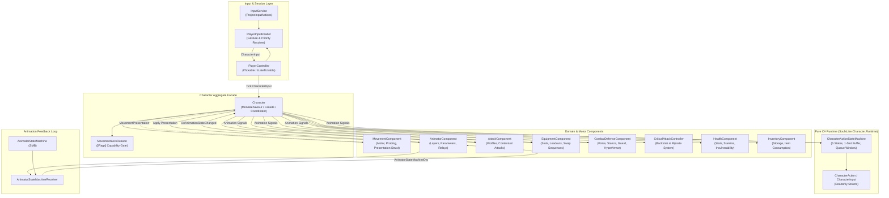

### Core Architectural Pillars

1. **Explicit Aggregate Facade (`Character.cs`)**: `Character` is the central coordination point and external API for the player entity. It coordinates use cases across specialized components without routing through unneeded one-line sink interfaces.
2. **Lean Pure C# Runtime Assembly (`SoulsLike.Character.Runtime.asmdef`)**: Volatile per-frame action sequencing, command buffering, and queue windows are isolated into 4 concise, pure C# types (`CharacterAction`, `CharacterInput`, `CharacterActionStateMachine`, `CharacterActionId`).
3. **Reason-Aware Capability Gating (`MovementLockReason`)**: Control and movement blocking is unified under a single bitmask enum. Independent reasons (Spawn, Animation, Parry, Critical, Manual) prevent overlapping lifecycles from prematurely restoring input or movement.
4. **Deterministic Action State Machine**: 5 discrete states (`Neutral`, `Attack`, `Roll`, `EquipmentSwap`, `Critical`), a 1-slot 1.0s buffer, animation-driven queue windows, roll-to-sprint interrupts, and chained attack exit suppression.
5. **Decoupled Input Adapter (`PlayerInputReader`)**: Translates raw Unity Input System presses and camera yaw into high-level semantic structs (`CharacterInput`), isolating entity logic from hardware input devices.
6. **Snapshot Presentation Flow**: `MovementComponent` produces an immutable `MovementPresentation` struct snapshot each frame, which `Character` pushes directly to `AnimatorComponent` and `CharacterAudioComponent`.
7. **Animation Loopback via DTO Routing**: `AnimatorStateMachine` behaviours emit normalized `AnimatorStateMachineDto` events, which `Character.OnAnimationStateChanged` routes directly to the specific subsystems that own those animation lifecycles.

---

## 2. Entity Identity & Lifetime Management

### 2.1 Entity Boundary & Locator Registration

The player entity is composed of two coordinated layers:
- **`Character` (MonoBehaviour)**: The authoritative gameplay aggregate owning components, physics, combat orchestration, and public facade state.
- **`Entity` / `ViewEntity` (`IEntity`)**: The base entity system identity holding a unique generated 64-bit ID, `EntityType.Player`, and registered with `IEntityLocator`.

### 2.2 Factory & Lifetime Scope (`CharacterFactory.cs`)

When `CharacterFactory.CreateCharacter` is called:
1. Loads the `Character` prefab via Addressables (`IAssetService.LoadPrefab`).
2. Instantiates the prefab and applies the initial spawn position.
3. Retrieves or binds required components: `Character`, `ViewEntity`, `TargetLockNode`, `PlayerMeleeCombatRelay`, `CriticalAttackController`, `AnimatorComponent`, `AttackComponent`, `MovementComponent`, `EquipmentComponent`, `EquipmentPresentation`, `InventoryComponent`, `HealthComponent`, `CombatDefenseComponent`, `CharacterAudioComponent`.
4. Creates a child `LifetimeScope` beneath `RootScope` registering:
   - Entity system (`RegisterEntitySystemExt`, commands: `InteractionCommand`, `GroundItemCollectionCommand`, `ApplyDamageCommand`, `ResolveMeleeHitCommand`, `TargetingCommand`).
   - Domain models, components, ScriptableObjects, and database catalogs (`ItemCatalog`, `WeaponDatabase`, `ShieldDatabase`, `ConsumableDatabase`).
   - UI Controllers (`PlayerHudUiController`, `LockOnUiController`, `InventoryUiController`, `EquipmentUiController`, `SystemUiController`, `PauseNavigationUiController`, `InteractionUiController`).
   - Player orchestration (`PlayerInputReader`, `InteractionController`, `PlayerController`).
5. Reparents the character instance under the child `LifetimeScope` transform.
6. Disposing `CharacterFactory` disposes the entire player child scope cleanly.

---

## 3. Input Pipeline & Semantic Control Translation

Hardware input reads and gesture evaluations are completely decoupled from `Character.cs`.

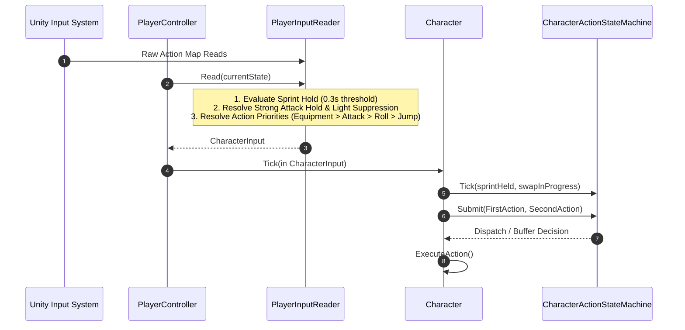

### 3.1 PlayerInputReader (`Assets/Scripts/Entities/Character/Input/PlayerInputReader.cs`)

`PlayerInputReader` encapsulates all gesture timing and input prioritization:
- **Sprint/Roll Gesture**: 
  - Tracks hold duration with a `0.3s` threshold (`SPRINT_HOLD_THRESHOLD`).
  - Hold $\ge 0.3\text{s}$ with movement input $\rightarrow$ `SprintHeld = true`.
  - Release before $0.3\text{s}$ $\rightarrow$ triggers `Roll` action on release.
- **Heavy Attack Gesture**:
  - Pressing strong attack sets `_suppressLightUntilRelease = true`.
  - Prevents accidental light attack execution during heavy attack presses.
- **Action Prioritization Order**:
  1. *Equipment Slot Switches*: `SwitchRightWeapon`, `SwitchLeftWeapon`, `SwitchQuickItem`, `UseQuickItem`.
  2. *Hand Mode Toggle*: `TwoHanded` (can be submitted as a companion second action in the same frame as an equipment switch).
  3. *Heavy Attack*: If strong attack pressed and not currently rolling.
  4. *Special Ability*: If special ability pressed and not rolling.
  5. *Light Attack*: If light attack pressed and not suppressed.
  6. *Guard Press*: Dispatched as Left-Hand Light Attack.
  7. *Roll / Backstep*: Dispatched on sprint button release without hold qualification.
  8. *Jump*: Dispatched on jump press.

### 3.2 CharacterInput & CharacterAction Structs

```csharp
public readonly struct CharacterInput
{
    public Vector2 MoveInput { get; }
    public float CameraYaw { get; }
    public bool SprintHeld { get; }
    public bool CrouchHeld { get; }
    public bool GuardHeld { get; }
    public bool StrongAttackHeld { get; }
    public CharacterAction? FirstAction { get; }
    public CharacterAction? SecondAction { get; }
}

public readonly struct CharacterAction
{
    public enum Kind { Attack, Roll, Jump, Equipment }
    public enum AttackIntent { Light, Heavy, Special }
    public enum EquipmentKind { SwitchRightWeapon, SwitchLeftWeapon, SwitchQuickItem, UseQuickItem, ToggleHandMode }
    public enum Result { Executed, TemporarilyBlocked, Invalid }
    public enum State { Neutral, Attack, Roll, EquipmentSwap, Critical }

    public Kind ActionKind { get; }
    public AttackIntent Intent { get; }
    public EquipmentKind EquipmentAction { get; }
    public bool IsLeftHand { get; }
    public bool IsSprinting { get; }
    public Vector2 MoveInput { get; }
    public float CameraYaw { get; }
    public bool CanBuffer => ActionKind != Kind.Equipment;
}
```

---

## 4. Action State Machine & Action Lifecycle

The `CharacterActionStateMachine` (`Assets/Scripts/Entities/Character/Runtime/CharacterActionStateMachine.cs`) governs action admission, buffering, queue windows, and chaining.

### 4.1 State Hierarchy & Transitions

| State | Allowed Inputs | Queue Window Behavior | Exit / Transition |
|---|---|---|---|
| **`Neutral`** | All actions admitted immediately | N/A (Buffer pruned on timeout) | Transitions to `Attack`, `Roll`, `EquipmentSwap`, or `Critical` on execution |
| **`Attack`** | Non-equipment actions only when Queue Window is open; otherwise buffered | Opens at `QueueCheck` SMB signal; closes on `Enter` | Exits to `Neutral` on `Exit` SMB signal (unless chained) |
| **`Roll`** | Non-equipment actions only when Queue Window is open; otherwise buffered | Opens at `QueueCheck` SMB signal | Exits to `Neutral` on `Exit` SMB signal or early sprint interrupt |
| **`EquipmentSwap`** | One companion equipment action allowed while `_acceptEquipmentCompanion` is true | Managed by `EquipmentComponent` swap phase | Exits to `Neutral` when `equipmentActionInProgress == false` |
| **`Critical`** | All inputs blocked | N/A | Exits to `Neutral` upon `CriticalAttackController.OnCompleted` |

### 4.2 Buffering & Execution Semantics

- **Capacity**: Exactly 1 slot (`_bufferedAction`).
- **Replacement**: Latest actionable input overwrites any previously buffered action.
- **Expiration**: Fixed 1.0 second duration (`BUFFER_DURATION_SECONDS`).
- **Pruning Rule**: Buffer expiration is only pruned while in `Neutral`. A command buffered during an attack remains preserved to execute when the `QueueCheck` window opens, even if nominal duration elapsed during a long attack.
- **Queue Window Execution**: When an animation reaches `QueueCheck`, the state machine opens `_queueWindowOpen` and `Character` immediately attempts to execute the buffered action via `TryExecuteBufferedAction(now)`.
- **Chained Attack Stale-Exit Suppression**: If an attack is chained while another attack animation is active, `_ignoreNextActionExit = true`. When the first animation emits `Exit`, the state machine remains in `Attack` instead of prematurely popping to `Neutral`.
- **Roll-to-Sprint Interrupt**: During `Roll`, if `_sprintHeldDuringRoll` is true when the `QueueCheck` window opens, the state machine sets `_rollSprintInterruptRequested = true` and immediately enters `Neutral`. `Character` consumes this flag and calls `AnimatorComponent.InterruptRollForSprint()`.

---

## 5. Unified Capability Gating (`MovementLockReason`)

To eliminate conflicting boolean flags and prevent race conditions between overlapping blocking lifecycles, `Character.cs` manages movement and control locks using a single bitmask enum:

```csharp
[Flags]
private enum MovementLockReason
{
    None      = 0,
    Manual    = 1 << 0,  // External / script block
    Animation = 1 << 1,  // Root motion / animation block tag
    Spawn     = 1 << 2,  // Initial spawn sequence
    Parry     = 1 << 3,  // Active parry animation window
    Critical  = 1 << 4   // Synchronized critical attack sequence
}
```

### Derived Capability Rules

- **Movement Blocked**: `movementComponent.SetMovementBlocked(_movementLockReasons != MovementLockReason.None)`
- **Input Blocked**: `_actionStateMachine.IsInputBlocked` (synchronized with `Spawn`, `Parry`, `Critical`, or `Grace` transitions).
- **Guard Permission**:
  ```csharp
  private bool CanGuard() => 
      _movementLockReasons == MovementLockReason.None || 
      (_movementLockReasons == MovementLockReason.Animation && _actionStateMachine.CanGuardDuringAnimationBlock);
  ```
  Guard is permitted during animation movement block specifically when `_actionStateMachine.CurrentState == State.Attack && _queueWindowOpen`.

---

## 6. Component Responsibilities & Boundaries

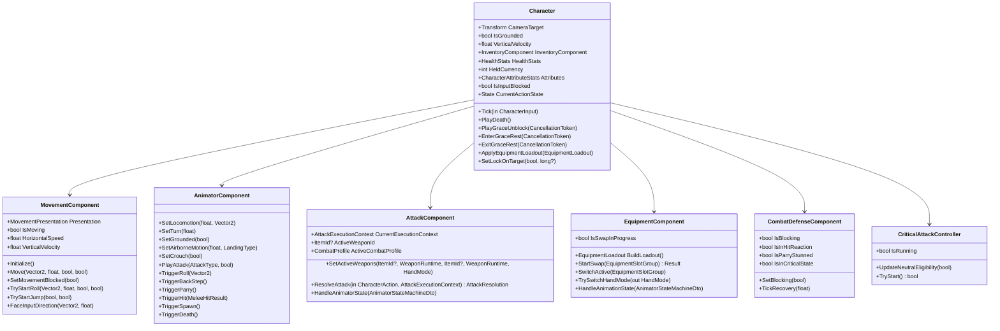

### 6.1 `MovementComponent` (`Assets/Scripts/Components/Movement/MovementComponent.cs`)
- Owns CharacterController motion, ground probing (sphere cast + raycasts), slope alignment, gravity, vertical velocity, and jump/roll/backstep trajectory timers.
- Produces the immutable `MovementPresentation` struct containing: `Speed`, `BlendDirection`, `TurnAmount`, `VerticalVelocity`, `LandingType`, `Grounded`, `Crouching`.
- Exposes one-shot consumption checks: `TryConsumeJumpStarted()`, `TryConsumeRollStarted(out Vector2 dir)`, `TryConsumeBackStepStarted()`, `TryConsumeLanded()`.

### 6.2 `AnimatorComponent` (`Assets/Scripts/Components/Animator/AnimatorComponent.cs`)
- Owns Animator parameters, layer weights (`OneHandedLayer`, `TwoHandedLayer`, `UpperBodyActions`, `FullBodyActions`), smoothing logic, and runtime controller/profile assignment.
- Listens to `AnimatorStateMachineReceiver` and forwards all state machine DTO events to `Character.OnAnimationStateChanged`.

### 6.3 `AttackComponent` (`Assets/Scripts/Components/Attack/AttackComponent.cs`)
- Resolves contextual attacks based on movement and combo state: Light Combo (alternates `LightAttack1` / `LightAttack2`), Heavy Attack, Charged Heavy Attack, Roll Attack, Backstep Attack, Run Attack, Special Attack, and Left-Hand Attack.
- Tracks active weapon IDs, `WeaponRuntime` instances, and combat profile data.

### 6.4 `EquipmentComponent` (`Assets/Scripts/Components/Equipment/EquipmentComponent.cs`)
- Owns equipment slots (Right/Left Armaments, Quick Items, Talismans, Armor) and active slot indexing.
- Direct weapon swap sequencing: `StartSwap` triggers `SwapOut` animation $\rightarrow$ hides current weapon visual on progress $\rightarrow$ advances slot $\rightarrow$ triggers `SwapIn` animation $\rightarrow$ shows new weapon visual $\rightarrow$ completes swap.
- Builds immutable `EquipmentLoadout` snapshots.

### 6.5 `CombatDefenseComponent` & `CriticalAttackController` (`Assets/Scripts/Entities/Combat/`)
- **`CombatDefenseComponent`**: Owns poise, stance, guard angle calculations, guard break stun duration, parry window timing, hyper armor bonuses, and hit reaction states.
- **`CriticalAttackController`**: Evaluates backstab and riposte eligibility based on target distance, height difference, and rear/front angle alignment; executes synchronized victim/attacker animations and applies direct damage.

---

## 7. Frame Execution & Update Order

Each frame follows a strict execution pipeline in `Character.Tick(in CharacterInput input)`:

```text
Character.Tick()
├── 1. Set Strong Attack Held state on AttackComponent; reset charged speed if released
├── 2. Action State Machine Tick:
│      ├── Sample Sprint during Roll for early interrupt
│      └── Advance / complete EquipmentSwap state if swap finished
├── 3. Update CriticalAttackController neutral eligibility
├── 4. State Machine Action Submission:
│      ├── Submit(input.FirstAction)
│      └── Submit(input.SecondAction)
├── 5. Buffer Maintenance:
│      ├── Prune expired buffer if in Neutral
│      ├── TryExecuteBufferedAction() if window open
│      └── ApplyActionStateMachineRequests() (e.g. Roll-to-Sprint Interrupt)
├── 6. Guard & Block Evaluation:
│      ├── Classify Shield Block vs Weapon Block from EquipmentLoadout & ItemCatalog
│      └── Update AnimatorComponent & CombatDefenseComponent blocking state
├── 7. Motor & Physics Execution:
│      ├── Calculate Combat Sprint stamina drain & threshold validation
│      ├── Set MovementComponent movement blocked flag from _movementLockReasons
│      ├── MovementComponent.Move(moveInput, cameraYaw, sprintActive, crouchHeld)
│      └── Consume combat sprint stamina if moving
├── 8. Audio & Recovery:
│      ├── CharacterAudioComponent.Tick(isMoving, isSprinting)
│      ├── CombatDefenseComponent.TickRecovery(deltaTime)
│      └── HealthComponent.TickStaminaRecovery(deltaTime, isBlocking)
└── 9. ApplyMovementPresentation():
       └── Read MovementComponent.Presentation and push values to AnimatorComponent
```

---

## 8. Animation Feedback & Routing Matrix

`Character.OnAnimationStateChanged(AnimatorStateMachineDto state)` dispatches incoming animation callbacks to exact subsystem owners:

| Animator State Machine Name | Signal State | Target Owner / Action |
|---|---|---|
| `LightAttack`, `HeavyAttack`, `RollAttack`, `RunAttack`, `BackStepAttack`, `SpecialAttack`, `Parry` | `Enter` / `QueueCheck` / `Exit` | `AttackComponent.HandleAnimatorState`<br/>`CharacterActionStateMachine` (enters Attack, opens queue, exits to Neutral) |
| `Roll`, `BackStep` | `Enter` / `QueueCheck` / `Exit` | `CharacterActionStateMachine` (enters Roll, opens queue, triggers sprint interrupt or exits) |
| `EquipmentSwapOut`, `EquipmentSwapIn` | `Enter` / `Progress` / `Exit` | `EquipmentComponent.HandleAnimationState`<br/>`CharacterActionStateMachine` |
| `Spawn` | `Enter` / `Exit` | Sets/Clears `MovementLockReason.Spawn` and State Machine input block |
| `Death` | `Exit` | Clears `_isDeathAnimationPlaying`, fires `OnDeathAnimationCompleted` |
| `Parry` | `Enter` / `Exit` | Sets/Clears `MovementLockReason.Parry` and input block |
| `HitReaction` | `Enter` / `Exit` | `CombatDefenseComponent.SetHitReaction(true / false)` |
| `ParryStun` | `Enter` / `Exit` | `CombatDefenseComponent.SetParryStunned(true / false)` |
| `GraceUnblock`, `GraceRestStart`, `GraceRestEnd` | `Enter` / `Exit` | `Character.HandleGraceAnimationState` (advances `GracePhase` and resolves `UniTaskCompletionSource`) |

---

## 9. Lifecycle Systems: Spawn, Death, Grace

### 9.1 Spawn
- `Character.Initialize()` sets `SetInputBlocked(true)` (locking `MovementLockReason.Spawn`) and triggers `Spawn` animation.
- When `StateMachineName.Spawn` exits, `SetInputBlocked(false)` is invoked, enabling player control.

### 9.2 Death & Respawn
- `PlayerController` observes `HealthModel.OnDied` $\rightarrow$ calls `Character.PlayDeath()`.
- `PlayDeath()` cancels any active equipment swap, marks `_isDeathAnimationPlaying = true`, locks input, and triggers `Death` animation.
- When `StateMachineName.Death` exits, `Character` raises `OnDeathAnimationCompleted`.
- `PlayerController` receives `OnDeathAnimationCompleted` $\rightarrow$ calls `_coreGameOrchestrator.RespawnAtLastGrace().Forget()`.
- After scene/fade transitions, `CoreGameOrchestrator` calls `Character.SetPosition()` and `Character.CompleteDeathAnimation()`.

### 9.3 Grace Rest Transitions
Grace transitions are managed asynchronously using `UniTaskCompletionSource<bool>` and `GracePhase` (`None`, `Unblock`, `RestStart`, `RestIdle`, `RestEnd`):
- **`PlayGraceUnblock(token)`**: Locks input, activates invulnerability, plays unblock animation, awaits animation completion.
- **`EnterGraceRest(token)`**: Locks input, activates invulnerability, plays sit down animation, awaits transition into `RestIdle`.
- **`ExitGraceRest(token)`**: Plays stand up animation, awaits completion, clears protection and returns to normal gameplay.

---

## 10. Rules of the Character System (Durable Invariants)

All future modifications, extensions, or agents working on the character codebase MUST adhere to these design rules:

1. **Maintain Single Facade Integrity**: Do not bypass `Character.cs` to mutate internal component state directly from outside the character scope. External systems (`PlayerController`, `CoreGameOrchestrator`, UI controllers) must communicate through `Character` or read-only domain models.
2. **Keep the Runtime Assembly Lean**: Do not introduce Unity scene types, `MonoBehaviour` references, or large interface hierachies into `SoulsLike.Character.Runtime`. Keep `CharacterAction`, `CharacterInput`, and `CharacterActionStateMachine` pure C# with zero external dependencies.
3. **Never Use Unreasoned Boolean Control Locks**: Always use `MovementLockReason` bit flags when locking movement. Never overwrite or clear movement locks with a plain boolean that could clobber an active spawn, parry, critical, or animation lock.
4. **Preserve One-Slot Action Buffer Semantics**: The buffer must remain 1-slot with latest-input replacement and 1.0s timeout. Expired buffer pruning must ONLY occur during `Neutral`.
5. **Honor Animation Queue Windows**: Actions submitted during an attack or roll must never execute immediately; they must buffer and execute when the `QueueCheck` SMB signal is received.
6. **Decouple Hardware Input from Gameplay Logic**: Never read `ProjectInputActions` or `UnityEngine.Input` inside `Character.cs` or any component. All hardware input must be parsed into `CharacterInput` via `PlayerInputReader`.
7. **Use Snapshot Presentation**: Motor and physics components must expose read-only presentation structs (`MovementPresentation`). `Character` is responsible for applying these snapshots to visual/audio sinks.
8. **No Global Event Buses for Gameplay Coordination**: Do not introduce global event aggregators or static events for character internal communication. Use explicit direct method calls, state machines, and scoped observer callbacks.
9. **Single Top-Level Type Per File**: Every C# class, struct, interface, or enum must be defined in its own file matching the type name exactly.


> 📄 **Source File End: `SoulsLikeGameVault/Architecture/CHARACTER_SYSTEM_ARCHITECTURE.md`**


---

### File: `Architecture/HITBOX_SYSTEM_ARCHITECTURE.md`
<a id="file-architecturehitbox-system-architecturemd"></a>

- **Relative Path:** `SoulsLikeGameVault/Architecture/HITBOX_SYSTEM_ARCHITECTURE.md`
- **File Size:** 27,824 bytes
- **Section Category:** Core Subsystem Architecture

> 📄 **Source File Begin: `SoulsLikeGameVault/Architecture/HITBOX_SYSTEM_ARCHITECTURE.md`**

# Hitbox System Architecture & Combat Resolution Guide

## 1. Overview & Core Philosophy

The **Hitbox and Combat Resolution System** in the Souls-like template provides a deterministic, decoupled combat framework for both the player Character and AI Enemies.

The architecture is built upon a fundamental architectural separation:
> **Sword colliders only detect spatial contact.**  
> **Gameplay outcomes (damage, poise break, guard break, parry stun, stagger, criticals) are computed by a single authoritative resolution command.**

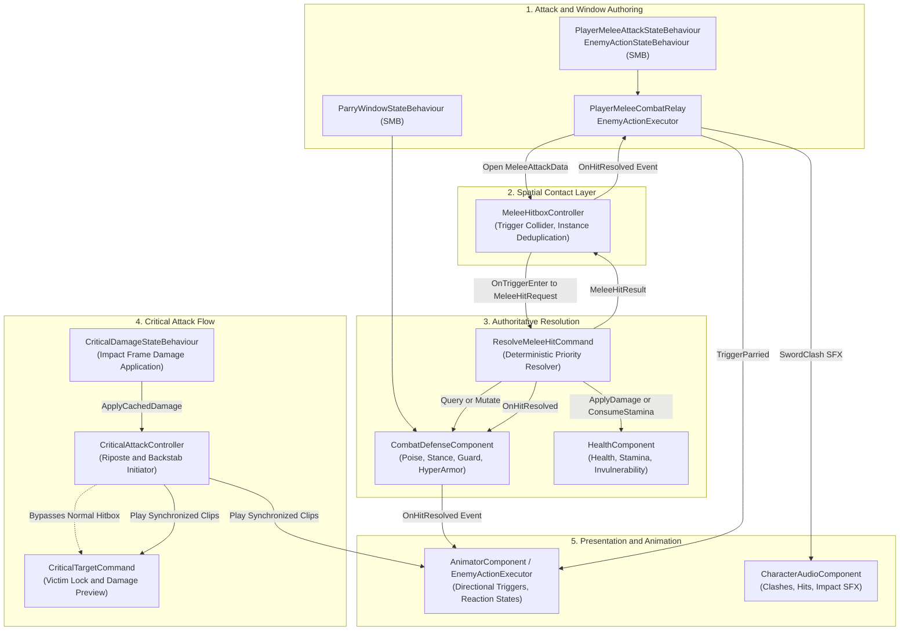

> [!TIP]
> **Obsidian Mermaid Display Tip**: To prevent diagrams from clipping or overflowing horizontally in Obsidian, add a CSS snippet (`.obsidian/snippets/mermaid.css`):
> ```css
> .mermaid svg {
>     max-width: 100%;
>     height: auto;
> }
> ```
> Enable it under **Settings > Appearance > CSS snippets**.

---

### Core Architectural Principles

1. **Strict Spatial vs. Resolution Segregation**: `MeleeHitboxController` owns physical contact detection and deduplication. It never calculates damage numbers, checks poise/stance values, inspects guard angles, or triggers animation clips.
2. **Symmetrical Resolution Engine**: Both Player attacking Enemy and Enemy attacking Player route through the exact same `ResolveMeleeHitCommand` execution pipeline.
3. **Single Hit Per Swing Invariant (`AttackInstanceId`)**: Each weapon swing increments an internal sequence ID. A target entity is resolved at most once per attack swing, regardless of how many hurtbox colliders intersect or physics frames overlap.
4. **Normalized Time Windowing via StateMachineBehaviours**: Active hitbox windows, parry frames, combo windows, and hyper armor windows are authored directly on animation states using normalized time (`0.0f - 1.0f`).
5. **No Automatic Backstab**: A normal melee strike from behind produces a directional `HitFromBack` reaction; it **never** automatically becomes a backstab. Critical attacks must be explicitly initiated through `CriticalAttackController`.
6. **Root Motion Exclusivity**: Combat and reaction animations use root motion for displacement. In-place animation clips (`inPlace`) are strictly excluded to avoid double-movement and sliding artifacts.

---

## 2. Core Concepts & Terminology

### 2.1 Combat Terms
- **Poise**: Controls short hit interruption. When incoming poise damage is less than current effective poise, the character absorbs the blow without interrupting their active action. When poise is depleted, a short directional stagger is triggered.
- **Hyper Armor**: Temporarily increases effective poise during designated attack animation frames. It allows heavy or charged attacks to power through incoming lighter hits without being staggered.
- **Stance**: A separate resilience meter that accumulates posture damage from heavy/charged attacks. When stance is broken (reaches zero), the character collapses into a long vulnerable state and exposes a critical **Riposte** opportunity.
- **Guard & Guard Break**: When blocking within the frontal guard angle, incoming damage is mitigated at the cost of stamina (`GuardDamage`). If stamina is depleted by a block, the guard is shattered (`GuardBroken`), inducing a 1.5-second stagger and opening a critical riposte window.
- **Parry**: An active defensive deflection maneuver. If timed so that an incoming parryable attack hits during the defender's active parry window, the incoming damage is nullified, the attacker's attack is cancelled, and the attacker enters a parry-stun state open to a riposte.

---

## 3. System Architecture & Component Taxonomy

### 3.1 Class & Component Map

| Component / Type | Namespace | File Location | Responsibility |
|---|---|---|---|
| `MeleeHitboxController` | `SoulsLike.Entities.Combat` | `Assets/Scripts/Entities/Combat/MeleeHitboxController.cs` | Trigger collider contact layer, debug visualizer, entity deduplication per attack instance. |
| `ResolveMeleeHitCommand` | `SoulsLike.Entities.BaseEntity.EntityCommands` | `Assets/Scripts/Entities/BaseEntity/EntityCommands/ResolveMeleeHitCommand.cs` | Target-owned command executing the 8-step hit resolution cascade and calculating relative hit direction. |
| `CombatDefenseComponent` | `SoulsLike.Entities.Combat` | `Assets/Scripts/Entities/Combat/CombatDefenseComponent.cs` | Actor-lifetime state holding poise, stance, guard angles, parry windows, hyper armor, and critical eligibility. |
| `PlayerMeleeCombatRelay` | `SoulsLike.Entities.Combat` | `Assets/Scripts/Entities/Combat/PlayerMeleeCombatRelay.cs` | Player combat facade resolving equipped weapon runtime, assembling `MeleeAttackData`, opening/closing hitboxes, and handling attacker recoil. |
| `PlayerMeleeAttackStateBehaviour` | `SoulsLike.Entities.Combat` | `Assets/Scripts/Entities/Combat/PlayerMeleeAttackStateBehaviour.cs` | Animator SMB driving player active hitbox windows, attack SFX timings, and hyper-armor poise bonuses. |
| `EnemyActionExecutor` | `SoulsLike.Entities.Enemy` | `Assets/Scripts/Entities/Enemy/EnemyActionExecutor.cs` | Enemy combat controller driving action phases (Windup, Active, Recovery), combos, hitbox lifecycle, and hit reactions. |
| `EnemyActionStateBehaviour` | `SoulsLike.Entities.Enemy` | `Assets/Scripts/Entities/Enemy/EnemyActionStateBehaviour.cs` | Animator SMB driving enemy active hitbox windows, combo queue windows, recovery timings, and hyper armor. |
| `ParryWindowStateBehaviour` | `SoulsLike.Entities.Combat` | `Assets/Scripts/Entities/Combat/ParryWindowStateBehaviour.cs` | Animator SMB setting `CombatDefenseComponent.IsParryWindowActive` during authored parry frames. |
| `CriticalAttackController` | `SoulsLike.Entities.Combat` | `Assets/Scripts/Entities/Combat/CriticalAttackController.cs` | Evaluates riposte and backstab criteria, aligns attacker/victim transforms, caches lethal preview, and orchestrates synchronized criticals. |
| `CriticalTargetCommand` | `SoulsLike.Entities.BaseEntity.EntityCommands` | `Assets/Scripts/Entities/BaseEntity/EntityCommands/CriticalTargetCommand.cs` | Victim entity command exposing critical eligibility, damage preview/apply, and victim animation binding. |
| `CriticalDamageStateBehaviour` | `SoulsLike.Entities.Combat` | `Assets/Scripts/Entities/Combat/CriticalDamageStateBehaviour.cs` | Animator SMB applying cached critical damage at the authored impact progress (`impactNormalizedTime = 0.22f`). |

---

## 4. Data Layer & Contracts

### 4.1 `MeleeAttackData` (Attack Payload)
Attack values belong to the specific attack action (e.g. Light vs. Heavy vs. Running), not solely to the weapon base stats. A charged attack from a straight sword has different poise damage, impact level, and parryability than a standard light slash.

```csharp
[Serializable]
public struct MeleeAttackData
{
    public CharacterActionId ActionId;    // Action identifier (LightAttack, HeavyAttack, etc.)
    public float HealthDamage;            // Base physical attack * action damage multiplier
    public float GuardDamage;             // Stamina damage inflicted on a blocking defender
    public float PoiseDamage;             // Poise damage toward short hit stagger
    public float StanceDamage;            // Stance damage toward large posture break
    public ImpactLevel ImpactLevel;       // Light, Medium, Heavy impact strength
    public bool CanBeBlocked;             // Whether defender guard can mitigate this attack
    public bool CanBeParried;             // Whether defender parry can deflect this attack
}
```

### 4.2 `MeleeHitRequest` (Contact Snapshot)
Constructed by `MeleeHitboxController.OnTriggerEnter()` and passed to `ResolveMeleeHitCommand.Execute()`:
```csharp
public readonly struct MeleeHitRequest
{
    public long AttackerEntityId { get; }
    public ItemId WeaponId { get; }
    public int AttackInstanceId { get; }
    public Vector3 AttackerPosition { get; }
    public Vector3 ContactPoint { get; }
    public int HitZone { get; }
    public MeleeAttackData Attack { get; }
}
```

### 4.3 `MeleeHitResult` & `MeleeHitResultType` (Outcome)
```csharp
public readonly struct MeleeHitResult
{
    public long AttackerEntityId { get; }
    public long DefenderEntityId { get; }
    public int AttackInstanceId { get; }
    public MeleeHitResultType Type { get; }
    public HitDirection Direction { get; }
    public ImpactLevel ImpactLevel { get; }
    public DamageResult Damage { get; }
}

public enum MeleeHitResultType
{
    Ignored,         // Invalid target, friendly, dead, or uninterruptible state
    Invulnerable,    // Defender is currently i-framed (rolling, resting)
    Parried,         // Defender parried the attack; attacker stunned, riposte open
    Blocked,         // Defender guarded; stamina consumed
    GuardBroken,     // Defender guarded with insufficient stamina; guard broken, critical open
    Hit,             // Normal front/side hit applied to health
    HitFromBack,     // Normal rear hit applied to health (non-critical)
    PoiseStaggered,  // Poise broken; action interrupted, directional stagger played
    StanceBroken,    // Stance broken (reaches 0); long collapse, riposte open
    Killed           // Lethal damage applied; death animation overrides all
}
```

---

## 5. Authoritative Hit Resolution Pipeline

When a weapon trigger enters an entity's collider, resolution proceeds through an explicit 8-tier priority cascade inside `ResolveMeleeHitCommand.Execute()`:

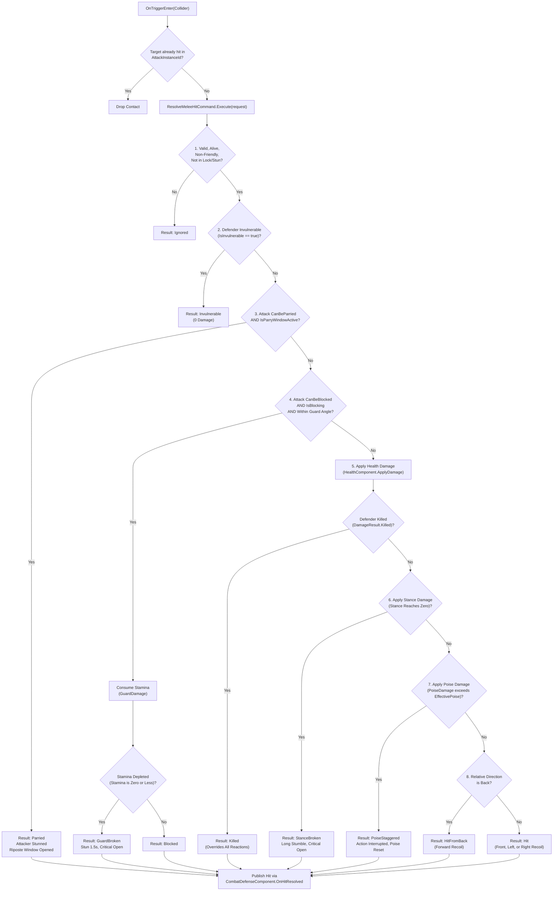

### 5.1 Resolution Cascade Breakdown

1. **Ignored / Invalid Filter**:
   - Rejects missing attacker, self-contact (`attacker.Id == target.Id`), friendly fire (`attacker.EntityType == target.EntityType`), dead actors (`!IsAlive`), or defender currently in critical lock (`IsInCriticalState`), active hit reaction (`IsInHitReaction`), or parry stun (`IsParryStunned`).
2. **Invulnerability Check**:
   - `IHealthComponent.IsInvulnerable` returns `MeleeHitResultType.Invulnerable` with zero health or stamina loss.
3. **Parry Evaluation**:
   - Condition: `request.Attack.CanBeParried == true` AND `_defense.IsParryWindowActive == true`.
   - Effect: Defender receives zero damage. Attacker's `CombatDefenseComponent` receives `SetParryStunned(true)` and `SetCriticalOpportunity(true)`. Attacker hitbox is closed immediately and attacker plays parried recoil.
4. **Guard Evaluation**:
   - Condition: `request.Attack.CanBeBlocked == true` AND `_defense.IsBlocking == true` AND `_defense.IsWithinGuardAngle(request.AttackerPosition) == true`.
   - Guard angle is checked as a cone centered on defender forward: `Vector3.Angle(transform.forward, toAttacker) <= guardAngle * 0.5f` (default 120° cone).
   - Effect: Consumes stamina equal to `GuardDamage`. If stamina reaches `<= 0`, triggers `BeginGuardBreak()` (1.5s stun, critical opportunity) and returns `GuardBroken`; otherwise returns `Blocked`.
5. **Health Damage & Kill Check**:
   - Forwards `DamageRequest` to `HealthComponent.ApplyDamage`. If `Killed == true`, returns `Killed`, suppressing stagger/stance reactions in favor of death.
6. **Stance Break Evaluation**:
   - Subtracts `StanceDamage` from `_currentStance`. If stance reaches zero, sets `HasCriticalOpportunity = true` and returns `StanceBroken`.
7. **Poise Stagger Evaluation**:
   - Effective Poise = `_currentPoise + (_isHyperArmorActive ? _hyperArmorPoiseBonus : 0f)`.
   - If `PoiseDamage >= EffectivePoise` (and `_canBeInterrupted == true`), returns `PoiseStaggered`, interrupts defender action, and resets poise to `maxPoise`.
   - If `PoiseDamage < EffectivePoise`, decreases `_currentPoise`, sets recovery delay timer (`poiseRecoveryDelaySeconds = 1.0s`), and continues without stagger.
8. **Normal Directional Hit**:
   - If relative direction is `HitDirection.Back`, returns `HitFromBack`; otherwise returns `Hit`.

---

## 6. Hit Direction & Spatial Calculation

Direction is calculated relative to the defender's local coordinate space in `ResolveMeleeHitCommand.ResolveDirection`:

```csharp
Vector3 localAttackerPosition = _defense.transform.InverseTransformPoint(attackerPosition);

if (Mathf.Abs(localAttackerPosition.z) >= Mathf.Abs(localAttackerPosition.x))
{
    return localAttackerPosition.z >= 0f ? HitDirection.Front : HitDirection.Back;
}
else
{
    return localAttackerPosition.x >= 0f ? HitDirection.Right : HitDirection.Left;
}
```

### 6.1 Directional Reaction & Movement Mapping

Reaction names describe **where the attack originated**, while root-motion displacement naturally moves the defender **opposite** to the strike:

| Attack Source | Reaction Trigger | Defender Relative Displacement |
|---|---|---|
| **Front** | `HitFront` | Backward |
| **Back** | `HitBack` | Forward |
| **Left** | `HitLeft` | Rightward |
| **Right** | `HitRight` | Leftward |

---

## 7. Combat Defense Meters & Recovery Rules

All defensive meters and runtime combat states are centralized in `CombatDefenseComponent`:

```
+-----------------------------------------------------------------------------+
|                          CombatDefenseComponent                             |
+-----------------------------------------------------------------------------+
| [Guard]      guardAngle: 120 deg | guardBreakDuration: 1.5s                 |
| [Poise]      maxPoise: 100       | recoveryRate: 25/s | delay: 1.0s         |
| [Stance]     maxStance: 100      | recoveryRate: 10/s                       |
| [Critical]   opportunityDuration: 2.0s                                      |
+-----------------------------------------------------------------------------+
```

### 7.1 Meter Lifecycle

- **Poise**:
  - Absorbs incoming `PoiseDamage`.
  - Taking poise damage starts the `poiseRecoveryDelayRemaining` countdown (1.0s).
  - When the delay expires, poise recovers linearly at `poiseRecoveryPerSecond` (25/s) up to `maxPoise`.
  - When broken, poise resets immediately to `maxPoise` after triggering stagger.
- **Hyper Armor**:
  - Activated during designated animation frames via `PlayerMeleeAttackStateBehaviour` or `EnemyActionStateBehaviour`.
  - Adds `_hyperArmorPoiseBonus` to effective poise and can set `_canBeInterrupted = false` for uninterruptible boss/heavy attacks.
- **Stance**:
  - Depleted by `StanceDamage`.
  - Does not suffer a delay timer; recovers linearly at `stanceRecoveryPerSecond` (10/s) when not in critical opportunity.
  - Reaching 0 triggers `StanceBroken` and starts the 2.0s `criticalOpportunityRemaining` window.
- **Critical Opportunity**:
  - Opened by: **Parry Success** (on attacker), **Guard Break** (on defender), or **Stance Break** (on defender).
  - Lasts for `criticalOpportunityDurationSeconds` (2.0s).
  - Automatically resets stance to `maxStance` when the opportunity window expires or when a critical completes.

---

## 8. Synchronized Critical System (Riposte & Backstab)

Critical attacks are orchestrated by `CriticalAttackController` (Player) interacting with `CriticalTargetCommand` (Enemy).

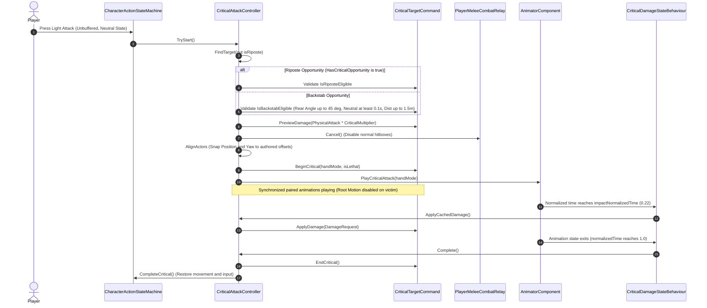

### 8.1 Gating Rules for Criticals

#### Riposte Requirements:
1. Target within horizontal distance `<= 1.5m` and vertical delta `<= 0.5m`.
2. Target `HasCriticalOpportunity == true` (from Parry, Guard Break, or Stance Break).
3. Target is alive, not invulnerable, and not already in critical lock.

#### Backstab Requirements:
1. Target within horizontal distance `<= 1.5m` and vertical delta `<= 0.5m`.
2. Attacker within target's rear cone: `Vector3.Angle(-target.Forward, targetToAttacker) <= 45°` (90° total rear cone).
3. Attacker neutral time: Player must have been in neutral state for `>= 0.1s` (`requiredNeutralSeconds`).
4. **Input Gating**: Must be a **fresh light attack press**. Buffered attack inputs from previous actions are strictly rejected.
5. Target state: Target must **not** be blocking, parrying, in hit reaction, parry stunned, in critical state, or executing an action (`!target.IsExecutingAction`).

### 8.2 Animation & Alignment Protocol

- **Alignment**:
  - Attacker is snapped to target-relative local offset: `(0, 0, -0.9m)` for backstab, `(0, 0, +0.9m)` for riposte.
  - Attacker yaw is rotated to match target yaw (or face target on riposte).
- **Damage Timing**:
  - Damage is **not** applied on start. It is cached during preview and applied exactly once by `CriticalDamageStateBehaviour.OnStateUpdate` at `impactNormalizedTime = 0.22f`.
- **Lethality Branching**:
  - If preview indicates lethal damage, victim plays `CriticalHitOneHandDie` / `CriticalHitTwoHandDie`, seamlessly blending into the death state without a jarring pose reset.

---

## 9. Presentation Layer & Audio/VFX Feedback

Presentation reacts to the resolved outcome; it never decides gameplay:

| Outcome | Visual & Animation Feedback | Audio / SFX Feedback | Action Interruption |
|---|---|---|---|
| **Hit without Stagger** | Blood splatter, subtle hit-stop | Flesh hit sound (`NotifyHit`) | **No interruption**; active attack/motion continues |
| **Poise Stagger** | Directional stagger clip (`HitFront`/`HitBack`/etc.) | Heavy hit impact | **Yes**; active action cancelled |
| **Stance Break** | Collapse / kneeling vulnerability clip | Metallic posture break chime | **Yes**; long collapse, riposte open |
| **Block** | Shield spark VFX, block recoil | Sword clash sound (`NotifySwordClash`) | **No** (if stamina remains); stays in guard pose |
| **Guard Break** | Extended stumble, shield knocked away | Heavy shield shatter / guard break sound | **Yes**; guard broken, riposte open |
| **Parry** | Distinct golden parry spark, strong hit-stop | High-pitch parry deflection ping | **Yes**; attacker deflected into parry stun |
| **Critical (Riposte / Backstab)** | Synced fatal execution animation pair | Critical pierce & impact sound | **Yes**; full actor lock until clip completes |

---

## 10. Authoring Workflows & Inspector Configurations

### 10.1 Weapon Hitbox Prefab Setup
1. Ensure the weapon prefab contains a `Collider` set to `isTrigger = true` (e.g. `CapsuleCollider` or `BoxCollider` along the blade).
2. Attach `MeleeHitboxController`:
   - Assign `hitbox` reference.
   - Assign `hitZone` integer (default `0`).
   - (Optional) Assign `debugRenderer` for visual red-flash feedback during active frames.
3. Reference `MeleeHitboxController` in `WeaponRuntime.meleeHitbox`.

### 10.2 Attack Animation States (Player)
On each attack state inside `CharacterGreatSwordAnimator.controller`:
1. Attach `PlayerMeleeAttackStateBehaviour`:
   - `actionId`: Select the matching `CharacterActionId` (e.g. `LightAttack`, `HeavyAttack`).
   - `activeStart`: Normalized start time for hitbox trigger (e.g. `0.15`).
   - `activeEnd`: Normalized end time to close hitbox (e.g. `0.55`).
   - `hasHyperArmorWindow`: True if attack grants hyper armor.
   - `hyperArmorStart` / `hyperArmorEnd`: Normalized bounds for hyper armor.
   - `hyperArmorPoiseBonus`: Additional poise added during window (e.g. `50.0`).
   - `canBeInterruptedDuringHyperArmor`: False for unbreakable attacks.

### 10.3 Attack Animation States (Enemy)
On each enemy action state inside `ErikaLongSwordEnemy.controller`:
1. Attach `EnemyActionStateBehaviour`:
   - `actionId`: Matching `CharacterActionId`.
   - `hasHitboxWindow`: True if the action swings a weapon.
   - `activeStart` / `activeEnd`: Normalized hitbox active frames.
   - `hasComboWindow`, `comboStart`, `comboEnd`: Normalized window where queued combo transitions are accepted.
   - `recoveryStart`: Point where windup/active turn speeds transition to recovery turn speed.
   - `hasHyperArmorWindow`, `hyperArmorPoiseBonus`: Enemy hyper armor settings.

### 10.4 Parry Animation State Setup
On the Shield Parry animation state:
1. Attach `ParryWindowStateBehaviour`:
   - `activeStart`: Normalized start time for active deflection (e.g. `0.20`).
   - `activeEnd`: Normalized end time for active deflection (e.g. `0.45`).

---

## 11. Architectural Invariants & Hard Rules

```
+-----------------------------------------------------------------------------------+
|                            CRITICAL COMBAT INVARIANTS                             |
+-----------------------------------------------------------------------------------+
| 1. Sword colliders detect contact ONLY. They NEVER compute damage or choose anims. |
| 2. ResolveMeleeHitCommand is the SOLE authority for hit resolution priority.       |
| 3. AttackInstanceId guarantees exactly ONE resolution per target per swing.       |
| 4. Rear normal attacks produce HitFromBack, NEVER an automatic backstab.          |
| 5. Parry succeeds ONLY during the authored ParryWindowStateBehaviour window.      |
| 6. Critical damage is calculated once, cached, and applied at normalized frame.   |
| 7. Death (Killed) SUPPRESSES all other hit, poise, stance, and block reactions.    |
| 8. Root motion is REQUIRED; animations containing "inPlace" are STRICTLY banned.  |
| 9. VContainer dependencies fail fast; do not add null checks around required refs.|
+-----------------------------------------------------------------------------------+
```

---

## 12. Troubleshooting Guide

| Symptom | Probable Cause | Verification Step |
|---|---|---|
| Weapon hits same enemy multiple times in one swing | Missing `_hitEntityIds.Contains` check or `_attackInstanceId` not incremented on open | Verify `MeleeHitboxController.Open()` increments `_attackInstanceId` and clears `_hitEntityIds`. |
| Block does not trigger; damage penetrates shield | Attacker outside guard angle cone, or `CanBeBlocked == false` in `MeleeAttackData` | Check `guardAngle` on `CombatDefenseComponent` (default 120°) and verify `CombatProfile.LightCanBeBlocked`. |
| Parry fails during active shield animation | Contact occurred outside `activeStart` - `activeEnd` normalized range | Inspect `ParryWindowStateBehaviour` normalized values on the Parry state. |
| Backstab does not trigger when standing behind enemy | Attacker was moving/attacking (neutral timer < 0.1s), buffered attack used, or target in action/reaction | Check `CriticalAttackController.IsBackstabEligible` and ensure attack is a fresh light attack press from Neutral. |
| Enemy slides / teleports during hit reaction | Animator using `inPlace` clip instead of root-motion clip, or dual procedural displacement | Ensure all reaction clips in the Animator Controller are from non-`inPlace` FBX assets. |
| Critical damage not applied to victim | `CriticalDamageStateBehaviour` missing from attacker Critical animation state | Ensure `CriticalDamageStateBehaviour` is attached to `OneHandedLayer.Combat.CriticalAttack`. |


> 📄 **Source File End: `SoulsLikeGameVault/Architecture/HITBOX_SYSTEM_ARCHITECTURE.md`**


---

### File: `Architecture/SETTINGS_SYSTEM_ARCHITECTURE.md`
<a id="file-architecturesettings-system-architecturemd"></a>

- **Relative Path:** `SoulsLikeGameVault/Architecture/SETTINGS_SYSTEM_ARCHITECTURE.md`
- **File Size:** 14,494 bytes
- **Section Category:** Core Subsystem Architecture

> 📄 **Source File Begin: `SoulsLikeGameVault/Architecture/SETTINGS_SYSTEM_ARCHITECTURE.md`**

# Settings System Architecture & Segregation Guide

## 1. Overview & Architectural Philosophy

The **SoulsLikeTemplate** project adopts a **Decentralized, Domain-Segregated Settings Architecture** adhering strictly to the **Single Responsibility Principle (SRP)** and **Interface Segregation Principle (ISP)**.

### Current Status
> [!NOTE]
> **No explicit, monolithic `SettingsService` or global "God" settings manager exists in the codebase.**
> Instead, settings are decoupled and distributed across individual domain services and data transfer objects (DTOs), with the **Audio System** serving as the canonical reference archetype.

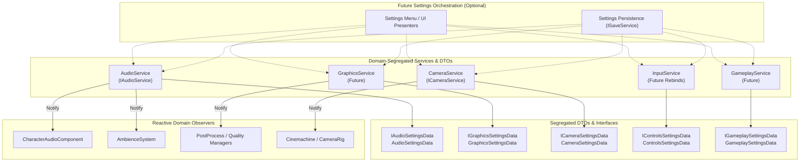

### Why Domain Segregation?
1. **Zero Monolithic Coupling**: Subsystems (Audio, Rendering, Camera, Input) only depend on their own settings data. Audio never needs to know about screen resolutions, and camera smoothing never needs to know about master volume.
2. **Independent Testability & Lifetime**: Domain services can be unit-tested or instantiated in isolation without mocking a giant global settings object.
3. **Reactive Updates**: Systems react immediately to domain-specific changes through the generic `IObserver<T>` pattern.
4. **Clean Serialization Boundaries**: Settings can be serialized, deserialized, validated, and migrated per-domain or composited together for persistence.

---

## 2. Reference Archetype: Audio Settings System

The Audio subsystem exemplifies how domain-segregated settings are defined, owned, updated, and observed.

### 2.1 Interface & DTO Contracts

Settings contracts are split into a read-only interface and a mutable, serializable DTO:

#### Interface: `IAudioSettingsData`
Defined in `SoulsLike.Services.Audio.Data`:
```csharp
namespace SoulsLike.Services.Audio.Data
{
    public interface IAudioSettingsData
    {
        float MasterVolume { get; }
        float MusicVolume { get; }
        float SfxVolume { get; }
        bool MuteAll { get; }
    }
}
```

#### Concrete DTO: `AudioSettingsData`
Defined in `SoulsLike.Services.Audio.Data`:
```csharp
namespace SoulsLike.Services.Audio.Data
{
    [Serializable]
    public class AudioSettingsData : IAudioSettingsData
    {
        [SerializeField, Range(0f, 1f)] private float masterVolume = 1f;
        [SerializeField, Range(0f, 1f)] private float musicVolume = 1f;
        [SerializeField, Range(0f, 1f)] private float sfxVolume = 1f;
        [SerializeField] private bool muteAll;

        public float MasterVolume
        {
            get => masterVolume;
            set => masterVolume = Mathf.Clamp01(value);
        }

        public float MusicVolume
        {
            get => musicVolume;
            set => musicVolume = Mathf.Clamp01(value);
        }

        public float SfxVolume
        {
            get => sfxVolume;
            set => sfxVolume = Mathf.Clamp01(value);
        }

        public bool MuteAll
        {
            get => muteAll;
            set => muteAll = value;
        }
    }
}
```

### 2.2 Domain Publisher / Subject: `IAudioService` & `AudioService`

`IAudioService` acts as the domain-specific subject:
- Holds the current settings snapshot (`CurrentSettings`).
- Exposes `UpdateSettings(IAudioSettingsData newSettings)`.
- Maintains an observer list `IObserver<IAudioSettingsData>`.
- Immediately notifies new observers upon registration (`AddObserver`) with the current settings snapshot.

```csharp
public class AudioService : IAudioService, IInitializable, IDisposable
{
    private readonly AudioData _audioData;
    private readonly List<IObserver<IAudioSettingsData>> _observers = new();
    private AudioSettingsData _settingsData = new();

    public float BaseVolume => _audioData != null ? _audioData.BaseVolume : 1f;
    public IAudioSettingsData CurrentSettings => _settingsData;

    public void AddObserver(IObserver<IAudioSettingsData> observer)
    {
        if (_observers.Contains(observer))
        {
            Debug.LogError("[AudioService] Observer is already added to audio observer list");
            return;
        }
        _observers.Add(observer);
        observer.UpdateState(_settingsData);
    }

    public void RemoveObserver(IObserver<IAudioSettingsData> observer)
    {
        _observers.Remove(observer);
    }

    public void UpdateSettings(IAudioSettingsData newSettings)
    {
        if (newSettings == null) return;
        _settingsData.MasterVolume = newSettings.MasterVolume;
        _settingsData.MusicVolume = newSettings.MusicVolume;
        _settingsData.SfxVolume = newSettings.SfxVolume;
        _settingsData.MuteAll = newSettings.MuteAll;
        NotifyObservers();
    }

    private void NotifyObservers()
    {
        for (var i = 0; i < _observers.Count; i++)
        {
            _observers[i].UpdateState(_settingsData);
        }
    }
}
```

### 2.3 Reactive Observers: `CharacterAudioComponent` & `AmbienceSystem`

Consumers implement `SoulsLike.Services.IObserver<IAudioSettingsData>`:

```csharp
public sealed class CharacterAudioComponent : BaseComponent, IObserver<IAudioSettingsData>
{
    private IAudioService _audioService;
    private bool _isObserving;

    [Inject]
    public void Configure(IAudioService audioService, CharacterAudioData data)
    {
        _audioService = audioService;
        _audioService.AddObserver(this);
        _isObserving = true;
    }

    private void OnDestroy()
    {
        if (!_isObserving) return;
        _audioService.RemoveObserver(this);
        _isObserving = false;
    }

    public void UpdateState(IAudioSettingsData settings)
    {
        float volume = settings.MuteAll
            ? 0f
            : _audioService.BaseVolume * settings.MasterVolume * settings.SfxVolume;

        footstepSource.volume = volume;
        landingSource.volume = volume;
        hitSource.volume = volume;
        swordClashSource.volume = volume;
    }
}
```

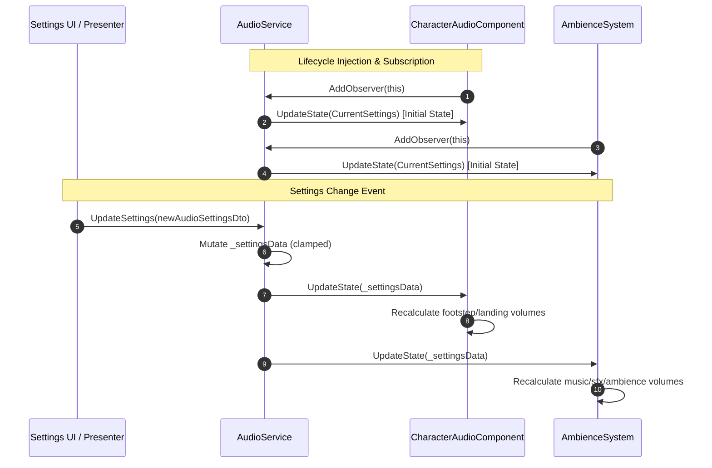

---

## 3. Domain Segregation Blueprint for Other Subsystems

All future settings in the project should follow this exact pattern:

| Domain | Interface | Concrete DTO | Domain Service / Subject | Primary Consumers / Observers |
|---|---|---|---|---|
| **Audio** | `IAudioSettingsData` | `AudioSettingsData` | `IAudioService` / `AudioService` | `CharacterAudioComponent`, `AmbienceSystem`, UI Sound Emitters |
| **Graphics / Video** | `IGraphicsSettingsData` | `GraphicsSettingsData` | `IGraphicsService` / `GraphicsService` | Render Pipeline Assets, Quality Settings, Post-Process Volume Managers |
| **Camera / View** | `ICameraSettingsData` | `CameraSettingsData` | `ICameraService` / `CameraService` | Cinemachine Virtual Cameras, Lock-On Vectoring, Free-Look Controller |
| **Controls / Input** | `IControlsSettingsData` | `ControlsSettingsData` | `InputService` | Input Action Maps, Rebind Overrides, Gamepad Vibration Handlers |
| **Gameplay & Access.** | `IGameplaySettingsData` | `GameplaySettingsData` | `GameplaySettingsService` | Subtitle Presenter, HUD Controller, Target Lock Assist, Localization |

### Example: Blueprint for Graphics Settings

```csharp
namespace SoulsLike.Services.Graphics.Data
{
    public interface IGraphicsSettingsData
    {
        int ResolutionWidth { get; }
        int ResolutionHeight { get; }
        int RefreshRate { get; }
        FullScreenMode WindowMode { get; }
        int TargetFrameRate { get; }
        int VSyncCount { get; }
        int QualityPresetIndex { get; }
        bool MotionBlur { get; }
        float RenderScale { get; }
    }

    [Serializable]
    public class GraphicsSettingsData : IGraphicsSettingsData
    {
        [SerializeField] private int resolutionWidth = 1920;
        [SerializeField] private int resolutionHeight = 1080;
        [SerializeField] private int refreshRate = 60;
        [SerializeField] private FullScreenMode windowMode = FullScreenMode.FullScreenWindow;
        [SerializeField] private int targetFrameRate = 60;
        [SerializeField] private int vSyncCount = 1;
        [SerializeField] private int qualityPresetIndex = 2;
        [SerializeField] private bool motionBlur = true;
        [SerializeField, Range(0.5f, 2f)] private float renderScale = 1f;

        // Public properties with validation / clamping...
    }
}
```

---

## 4. Future Settings Persistence & UI Coordination

When a dedicated Settings UI and persistent storage system are built, the architecture remains modular and decoupled.

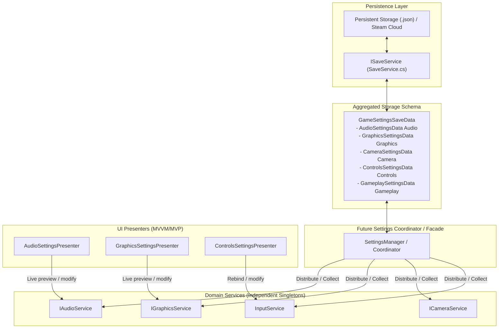

### 4.1 Persistence Workflow
1. **Aggregated DTO**: `GameSettingsSaveData` holds typed instances of each domain's DTO (`AudioSettingsData`, `GraphicsSettingsData`, etc.).
2. **Save**: The coordinator queries `IAudioService.CurrentSettings`, `IGraphicsService.CurrentSettings`, etc., populates `GameSettingsSaveData`, and passes it to `ISaveService.Save("settings", saveData)`.
3. **Load**: On startup, `ISaveService.Load<GameSettingsSaveData>("settings")` deserializes the file. The coordinator delegates `audioService.UpdateSettings(saveData.Audio)`, `graphicsService.UpdateSettings(saveData.Graphics)`, etc.

### 4.2 UI Workflow
- Each settings tab (Audio, Graphics, Gameplay) has its own **Presenter** bound directly to the respective domain service (or via a settings facade).
- Real-time previews (e.g. dragging a volume slider) immediately call `audioService.UpdateSettings(...)`, causing observers to update live without requiring a save.
- "Apply / Cancel" workflows can keep a temporary working copy of the domain DTO and only commit it upon confirmation.

---

## 5. Summary of Architecture Rules & Best Practices

1. **Keep DTOs Pure**: Settings DTOs and interfaces must contain only serializable data and validation clamps. Do not put engine or hardware manipulation logic inside DTOs.
2. **Domain Service Ownership**: The domain service is the authoritative source of truth for its domain settings during runtime.
3. **Use Generic Observers**: Use `SoulsLike.Services.IObserver<T>` for change propagation. Avoid creating redundant custom event delegates for settings updates.
4. **Lifecycle Cleanliness**: Any component registering as an observer must unregister in `OnDestroy()` or `Dispose()`.
5. **VContainer Scoping**: Domain services are registered in `ProjectScope` as singletons (`Lifetime.Singleton`), making them accessible across scene transitions.
6. **No Defensive Null Boilerplate**: Injected dependencies are mandatory and fail-fast via VContainer; do not add redundant null-guard clauses or try-catch boilerplate around DI.


> 📄 **Source File End: `SoulsLikeGameVault/Architecture/SETTINGS_SYSTEM_ARCHITECTURE.md`**


---

## Design Plans & Feature Artifacts

<a id="design-plans-feature-artifacts"></a>

### File: `Artifact/Hitbox System.md`
<a id="file-artifacthitbox-systemmd"></a>

- **Relative Path:** `SoulsLikeGameVault/Artifact/Hitbox System.md`
- **File Size:** 9,798 bytes
- **Section Category:** Design Plans & Feature Artifacts

> 📄 **Source File Begin: `SoulsLikeGameVault/Artifact/Hitbox System.md`**


# Hitbox System

**Sword colliders only detect contact.**  
The final result is decided from attack data, defender state, animation windows, and hit direction.

## 1. Data Layer

### Core terms

- **Poise** controls short hit interruption.
- **Hyper armor** temporarily increases poise during specific attack frames.
- **Stance** is a separate meter. When stance reaches zero, the character enters a long vulnerable state.

### Attack data

Each attack contains:

- `AttackId`
- `HealthDamage`
- `GuardDamage` — stamina or guard damage applied on block
- `PoiseDamage` — ability to cause a short stagger
- `StanceDamage` — builds toward a large stance break
- `ImpactLevel` — `Light`, `Medium`, or `Heavy`
- `PushDistance`
- `CanBeBlocked`
- `CanBeParried`
- `CanTriggerBackstab`
- `BlockRecoil` — how strongly the attacker reacts when blocked
- `ParryStun`
- `MaxHitsPerTarget`

These values belong to the specific attack, not only to the weapon. A light attack and a charged attack from the same sword can have different damage, impact, push, block, and parry behavior.

### Hitbox registration

When an attack starts, register:

- Attacker
- Weapon collider
- Attack data
- Unique attack instance
- Already-hit targets
- Current active or inactive state

This prevents one sword swing from damaging the same target every physics frame.

### Defender data

Each character exposes:

- `Health`
- `Stamina`
- `CurrentPoise`
- `MaxPoise`
- `PoiseRecoveryDelay`
- `CurrentStance`
- `MaxStance`
- `HyperArmorBonus`
- `CanBeInterrupted`
- Hurtboxes
- Blocking state, direction, and guard angle
- Whether the character is inside an active parry window
- Whether the character can currently be backstabbed
- Whether the character is invulnerable
- Whether the character is already in a hit, stun, critical, or death state
- Directional hit reactions for front, back, left, and right impacts at light, medium, and heavy levels

### Animation window data

Attack animations define:

- Weapon hitbox active window
- Hyper armor active window
- Whether the attack can be parried

Parry animations define:

- Startup window
- Active parry window
- Recovery window

Example:

| Time | Phase |
|---|---|
| `0.00–0.25` | Startup |
| `0.25–0.40` | Parry active |
| `0.40–1.00` | Recovery |

Exact values depend on the animation.

Backstab configuration defines:

- Rear detection angle
- Maximum distance
- Maximum height difference
- Required neutral frames
- Whether a fresh light-attack press is required
- Attacker alignment position
- Victim alignment position
- Critical damage
- Damage frame inside the backstab animation

### Hit result

Every resolved interaction produces one result:

- Ignored
- Invulnerable
- Normal hit without stagger
- Stagger hit
- Stance break
- Blocked
- Guard broken
- Parried
- Backstab

---

## 2. Logic Layer

### Normal attack flow

1. Attack animation starts.
2. Create a unique attack instance.
3. Register the sword collider and attack data.
4. Animation enters active attack frames.
5. Enable the sword collider.
6. The sword touches a defender hurtbox.
7. Ignore or reject the contact when:
   - It is the attacker itself.
   - The defender was already hit by this attack instance.
   - The defender is invulnerable.
   - The defender is dead or otherwise invalid.
8. Resolve valid contact as parry, block, or normal hit. A backstab already in progress bypasses normal weapon-hit resolution.

### 1. Backstab

A normal sword hit from behind is **not automatically a backstab**. It produces a regular `HitFromBack` reaction unless a valid backstab action was started.

Backstab flow:

1. Player moves behind the enemy.
2. Player enters the enemy’s rear angle, distance, and height limits.
3. Player performs no action for at least the required number of gameplay frames.
4. Previous attack input must no longer be buffered.
5. Player makes a fresh light-attack press.
6. Rear angle, distance, height, and both character states are checked again.
7. Attacker and victim are aligned to their configured positions.
8. Normal weapon damage is disabled.
9. Synchronized backstab animations begin.
10. Critical damage is applied only at the configured animation damage frame.
11. Both characters are released after the animation; temporary protection from unrelated hits can be applied while the critical animation is active.

If any validation fails, the player performs a normal light attack.

### 2. Parry

The parry window belongs to the defender’s parry animation, not to the enemy attack animation.

A parry succeeds when:

1. Defender is inside the active parry window.
2. Enemy weapon hitbox is active and reaches the defender.
3. The attack is marked as parryable.
4. The attack comes from a valid direction, when directional restrictions apply.

Result:

- Defender receives no normal hit.
- Enemy attack is cancelled.
- Sword hitbox is disabled.
- Enemy enters a strong parry stun.
- Enemy becomes available for a riposte.

Before or after the active parry window, the defender receives the normally resolved hit.

### 3. Block

Block succeeds when:

- Defender is holding block.
- Attack is blockable.
- Attack comes from inside the defender’s guard angle.

Result:

- Reduce or remove health damage.
- Apply stamina or guard damage.
- Apply `BlockRecoil` to the attacker when configured.
- Apply the block reaction to the defender.

If the defender has enough stamina, the defender remains guarding. If stamina reaches zero, guard breaks, the defender enters a long guard-break stun, and becomes open for a critical attack.

### 4. Normal hit

When the attack is not parried, blocked, ignored, or part of an established backstab:

1. Apply health damage.
2. Apply poise damage.
3. Apply stance damage.
4. Evaluate stance break, poise, hyper armor, and whether the defender can currently be interrupted.
5. Select the reaction using `ImpactLevel` and hit direction.
6. Register the defender as already hit by this attack instance.

#### Hit without stagger

When the defender still has enough effective poise, or is temporarily uninterruptible:

- Health and stance damage still apply.
- The current attack continues.
- Blood, sound, and hit effects still play.
- No forced movement or attack cancellation occurs.

This is why some enemies appear to ignore a hit even though damage was applied.

#### Short poise stagger

When poise reaches zero and no higher-priority stance break occurs:

- Cancel the defender’s current attack.
- Play a directional short stagger animation at the attack’s impact level.
- Move the defender slightly opposite the attack source using `PushDistance`.
- Apply a short input and action lock.
- Recover poise after the stagger or configured recovery delay.

#### Stance break

When stance reaches zero:

- Cancel the defender’s current action.
- Enter a long stance-break animation.
- Become vulnerable to a critical attack.
- Suppress the shorter poise-stagger result.
- Recover stance after the vulnerable state.

#### Hyper armor and interruption

Attacking first does not guarantee interruption.

- During ordinary startup frames, the enemy may have normal poise and can be staggered.
- During configured hyper-armor frames, `HyperArmorBonus` raises effective poise, so the same player attack may not interrupt.
- Special attacks can set `CanBeInterrupted` to false for explicitly uninterruptible frames.

### Hit direction

Calculate hit direction relative to the defender. Reaction names describe where the attack came from, not where the victim moves.

| Attack source | Reaction | Victim movement |
|---|---|---|
| Front | `HitFromFront` | Backward |
| Back | `HitFromBack` | Forward |
| Right | `HitFromRight` | Left |
| Left | `HitFromLeft` | Right |

For example, a hit from the enemy’s right side plays `HitFromRight` and moves the enemy left. Heavy impacts move farther; light impacts produce only a small movement.

### Attack end

1. Animation leaves active attack frames.
2. Disable the sword collider.
3. Unregister the active hitbox.
4. Keep the attack instance only as long as necessary.
5. Clear it before the next attack.

---

## 3. Presentation Layer

Presentation reacts to the resolved result. It does not decide gameplay.

### Hit without stagger

- Blood or impact effect
- Hit sound
- Optional small body twitch
- Optional small hit-stop and camera shake
- No attack cancellation
- No forced movement

### Stagger hit

- Current attack animation stops
- Directional stagger animation plays at the resolved impact level
- Small movement opposite the attack source
- Short input and action lock
- Stronger hit-stop or camera shake when appropriate

### Stance break

- Strong collapse or vulnerable animation
- Longer stun
- Critical attack opportunity feedback

### Block

- Shield spark
- Metallic impact sound
- Defender block animation
- Attacker recoil animation
- Stronger effect when guard is broken

### Parry

- Distinct parry spark and sound
- Strong hit-stop
- Attacker animation stops immediately
- Attacker parry-stun animation
- Defender recovery animation
- Riposte opportunity feedback

### Backstab

- Characters snap into aligned positions
- Synchronized attacker and victim animations play
- Normal weapon hitbox is disabled
- Critical sound and effects
- Damage occurs only at the critical impact frame

## Result priority

1. Reject self-contact, invalid or dead targets, invulnerability, and repeated contact from the same attack instance.
2. An established backstab state uses the synchronized critical flow instead of normal weapon-hit resolution.
3. Resolve parry.
4. Resolve block, including guard break.
5. Resolve a normal hit. Within that hit, stance break takes priority over short poise stagger, which takes priority over a hit without stagger.


> 📄 **Source File End: `SoulsLikeGameVault/Artifact/Hitbox System.md`**


---

### File: `Artifact/Hitbox System Implementation Plan.md`
<a id="file-artifacthitbox-system-implementation-planmd"></a>

- **Relative Path:** `SoulsLikeGameVault/Artifact/Hitbox System Implementation Plan.md`
- **File Size:** 18,934 bytes
- **Section Category:** Design Plans & Feature Artifacts

> 📄 **Source File Begin: `SoulsLikeGameVault/Artifact/Hitbox System Implementation Plan.md`**

# Hitbox System Implementation Plan

## Purpose

Implement the design described in `ToDo/Hitbox System.md` for both the player Character and Enemy actors while preserving the useful parts of the current combat pipeline.

The existing implementation is a good contact layer, but it is not yet a complete hit-resolution system. Keep the current animation-timed weapon colliders and insert one shared resolver before health damage. Do not rebuild the combat stack.

The source Hitbox System note is not registered in `ai/Skill_Context_Index.md`. Treat it as advisory design input; live source and serialized assets remain authoritative.

## Existing System

### Player attack flow

```text
Character.Tick
  -> Character.StartAttack
  -> AttackComponent.ResolveAttack
  -> AnimatorComponent.PlayAttack
  -> PlayerMeleeAttackStateBehaviour
  -> PlayerMeleeCombatRelay
  -> MeleeHitboxController
  -> ApplyDamageCommand
  -> HealthComponent
  -> Character.OnDamageApplied
```

### Enemy attack flow

```text
EnemyBrain selects CharacterActionDefinition
  -> EnemyAnimationController.PlayAction
  -> EnemyActionStateBehaviour
  -> EnemyAnimationController.ReportActiveStarted
  -> MeleeHitboxController
  -> ApplyDamageCommand
  -> HealthComponent
  -> EnemyBrain.OnDamageApplied
```

### Existing code to preserve

- `Assets/Scripts/Entities/Combat/MeleeHitboxController.cs`
  - Enables and disables the trigger collider during active attack frames.
  - Rejects self and friendly contacts.
  - Deduplicates targets by entity ID.
- `Assets/Scripts/Entities/Combat/PlayerMeleeAttackStateBehaviour.cs`
  - Authors player hitbox windows using normalized animation time.
- `Assets/Scripts/Entities/Combat/PlayerMeleeCombatRelay.cs`
  - Resolves the equipped weapon, attack damage, and active weapon hitbox.
- `Assets/Scripts/Entities/Enemy/EnemyActionStateBehaviour.cs`
  - Authors enemy active, combo, and recovery windows.
- `Assets/Scripts/Entities/Enemy/EnemyAnimationController.cs`
  - Opens and closes the enemy hitbox and owns enemy action interruption.
- `Assets/Scripts/Components/Health/HealthComponent.cs`
  - Owns health, stamina, invulnerability, and death-related damage application.
- `Assets/Scripts/Entities/BaseEntity/EntityCommands/ApplyDamageCommand.cs`
  - Validates source and target and forwards health damage.

## Comparison Against the Target Design

| Area | Existing system | Required change |
|---|---|---|
| Animation windows | Player and enemy already open and close colliders from normalized animation time | Keep |
| Duplicate hits | `MeleeHitboxController` deduplicates by entity ID | Keep; one target hit per attack initially |
| Attack payload | Damage amount, hit point, hit zone, source, weapon, and action IDs | Add guard, poise, stance, impact, block/parry flags, and attack-instance ID |
| Resolution | Direct health damage | Add one shared priority resolver |
| Block/parry | Player input and animation state only | Make the state affect incoming contact |
| Hit reactions | One generic `Hit` trigger | Return direction and result type to both actor presentations |
| Backstab/riposte | Not implemented | Add one synchronized critical flow |
| Poise/stance/hyper armor | Not implemented | Add after the shared resolver is stable |

## Target Runtime Flow

```text
Animation window
  -> MeleeHitboxController
       contact + attack-instance dedupe only
  -> ResolveMeleeHitCommand
       result priority and defender state
  -> CombatDefenseComponent + HealthComponent
  -> MeleeHitResult
  -> defender presentation + attacker response
```

`MeleeHitboxController` must remain contact-focused. It must not decide block, parry, poise, stance, animation choice, or critical eligibility.

## Core Design

### New combat types

Create one top-level type per file:

- `HitDirection`
- `ImpactLevel`
- `MeleeAttackData`
- `MeleeHitRequest`
- `MeleeHitResultType`
- `MeleeHitResult`
- `CombatDefenseComponent`
- `ResolveMeleeHitCommand`
- `ParryWindowStateBehaviour`
- `CriticalAttackController`
- `CriticalDamageStateBehaviour`

### Data ownership

Do not add another ScriptableObject hierarchy.

- Player attack data is built from `WeaponDefinition + CombatProfile`.
- Enemy attack data is built from `WeaponDefinition + CharacterActionDefinition`.
- `MeleeAttackData` is the normalized runtime value passed to the hitbox.
- Preserve current weapon physical attack scaling and per-action multipliers.
- Add only the fields required by the current implementation phase.

Initial `MeleeAttackData` fields:

- Action ID
- Final health damage
- Guard damage
- Impact level
- Can be blocked
- Can be parried

Later fields:

- Poise damage
- Stance damage
- Hyper-armor interaction
- Push distance
- Block recoil
- Parry stun
- Maximum hits per target

Use `MaxHitsPerTarget = 1` as the initial invariant. Keep the existing target-ID `HashSet` until authored multi-hit attacks are required.

### Defender state

Add one actor-lifetime `CombatDefenseComponent` to both Character and Enemy. It owns only combat-defense state:

- Blocking state and guard angle
- Active parry window
- Current poise and maximum poise
- Current stance and maximum stance
- Hyper-armor bonus
- Whether the actor can currently be interrupted
- Current critical opportunity
- Whether the actor is already in hit, stun, critical, or death state
- An `OnHitResolved` event for presentation

Keep health, stamina, invulnerability, and death application in `HealthComponent`.

### Hitbox changes

Change `MeleeHitboxController.Open` to accept `MeleeAttackData`.

For each open:

1. Increment an internal attack-instance ID.
2. Store the normalized attack data.
3. Clear the processed target-ID set.
4. Enable the trigger collider.

For contact:

1. Resolve the target entity.
2. Reject self, friendly, invalid, dead, or already processed targets.
3. Build `MeleeHitRequest` with attacker position, contact point, IDs, attack instance, and attack data.
4. Invoke `ResolveMeleeHitCommand` on the target.
5. Mark a valid contacted entity as processed even when the result is invulnerable, blocked, or parried.
6. Publish the returned result to the attacker-side relay/controller.

Rename `OnHitConfirmed` to a typed `OnHitResolved` event.

## Result Priority

Resolve exactly one result in this order:

1. Invalid, self, friendly, dead, or repeated contact -> `Ignored`.
2. An established critical flow has normal hitboxes disabled and does not enter normal resolution.
3. Invulnerable -> `Invulnerable`.
4. Active valid parry -> `Parried`.
5. Valid guard -> `Blocked` or `GuardBroken`.
6. Normal health hit.
7. If the defender survives: stance break takes priority over poise stagger, which takes priority over no stagger.
8. Death suppresses all non-death reactions.

A rear normal contact is `HitFromBack`; it never automatically becomes a backstab.

## Hit Direction

Calculate the attacker position in defender-local space and select the dominant axis:

| Local source direction | Result |
|---|---|
| Dominant positive Z | Front |
| Dominant negative Z | Back |
| Dominant positive X | Right |
| Dominant negative X | Left |

Reaction names describe where the attack came from.

## Delivery Phases

### Phase 1: Shared resolution and directional reactions

Code:

1. Add the initial hit contracts, `CombatDefenseComponent`, and `ResolveMeleeHitCommand`.
2. Change `MeleeHitboxController` to pass normalized attack data instead of direct raw health damage.
3. Update `PlayerMeleeCombatRelay` and `EnemyAnimationController` to construct the same runtime attack data.
4. Register the defense component and resolver command in `CharacterFactory` and `EnemyFactory`.
5. Move hit presentation from generic positive-health callbacks to `MeleeHitResult`.
6. Keep existing health events for HUD, death, audio, and persistence.
7. Add explicit player attack cancellation that closes the active weapon hitbox; enemy cancellation continues through `EnemyAnimationController.Interrupt`.

Assets:

- Add/configure `CombatDefenseComponent` on:
  - `Assets/Prefabs/Character/Character.prefab`
  - `Assets/Prefabs/Enemy/ErikaMeleeEnemy.prefab`
- Retain existing hitbox ownership in:
  - `Assets/Prefabs/Swords/LongSword.prefab`
  - `Assets/Prefabs/Enemy/ErikaMeleeEnemy.prefab`
- Migrate attack values in:
  - `Assets/Settings/Items/StraightSwordCombatProfile.asset`
  - `Assets/Settings/Enemy/Actions/*.asset`
- Modify only the active project controllers:
  - `Assets/Art/Animation/CharacterGreatSwordAnimator.controller`
  - `Assets/Art/Animation/Enemy/ErikaLongSwordEnemy.controller`

Replace the generic full-body hit route with four directional states. Do not change the existing player action-layer weight rules.

### Phase 2: Block and parry

1. Write the Character's existing shield/weapon guard state into `CombatDefenseComponent`.
2. Resolve block only when the attack is blockable and inside the guard angle.
3. Consume `GuardDamage` from stamina.
4. Return `GuardBroken` when stamina reaches zero; otherwise return `Blocked`.
5. Let rear and out-of-angle attacks bypass guard.
6. Attach `ParryWindowStateBehaviour` to the real Parry animation state.
7. Only the authored active normalized-time range counts as parry-active.
8. On successful parry:
   - Prevent defender health damage.
   - Close the attacker hitbox immediately.
   - Interrupt the attacker action.
   - Put the attacker into parry stun.
   - Expose a riposte opportunity.
9. Keep elemental guard reduction and enemy-authored guarding/parrying out of this phase.

### Phase 3: Poise, stance, and hyper armor

1. Add poise and stance values to `CombatDefenseComponent`.
2. Apply health, poise, and stance damage from the same resolved hit.
3. Add optional hyper-armor windows to the existing player and enemy attack state behaviours.
4. During hyper armor, add the configured bonus to effective poise.
5. Resolve surviving normal hits as:
   - Stance break
   - Short poise stagger
   - Hit without stagger
6. Reset/recover poise after the configured delay.
7. Reset stance after the vulnerable state ends.
8. Do not add procedural push while using root-motion reaction clips; otherwise movement will be applied twice.

### Phase 4: One critical system for riposte and backstab

Use one player-owned `CriticalAttackController`. Do not create separate synchronization systems.

Before an ordinary player light attack:

1. Reject buffered attacks for critical initiation.
2. Check an existing riposte opportunity from parry, guard break, or stance break.
3. Otherwise check rear angle, distance, height, required neutral time, and both actor states for backstab.
4. Require a fresh light-attack press.
5. If validation fails, continue through the existing normal light-attack path.

On success:

1. Lock both actors in critical state.
2. Close normal weapon hitboxes.
3. Keep the victim in place and align the player to a serialized victim-relative offset.
4. Rotate both actors for the authored animation pair.
5. Calculate and cache the critical result before playback so the correct victim animation is known.
6. Play the synchronized attacker and victim clips.
7. Apply the cached damage exactly once from `CriticalDamageStateBehaviour` at the authored impact progress.
8. Select the `_Die` victim clip only when the cached result is lethal.
9. Release both actors on animation exit.

`CharacterActionStateMachine` must distinguish direct input from buffered execution. A buffered light attack may execute normally but cannot initiate riposte or backstab.

Enemy-initiated critical attacks are outside the initial scope. Enemies still attack, defend, receive directional hits, and act as critical victims through the shared system.

## Animation Plan

### Hard exclusion rule

Never reference an animation whose asset path or clip name contains `inPlace`, case-insensitively. This includes names containing `~inPlace`, `InPlace`, or equivalent capitalization.

Do not extend the current `EnemyAiBootstrap` in-place setup for this work.

### Directional hit MVP

Use one clip per direction first:

| Direction | Clip |
|---|---|
| Front | `Assets/ThirdParty/DoubleL/FBX_Animations/Hit/Hit/Front/Hit_F_1.fbx` |
| Back | `Assets/ThirdParty/DoubleL/FBX_Animations/Hit/Hit/Back/Hit_B_1.fbx` |
| Left | `Assets/ThirdParty/DoubleL/FBX_Animations/Hit/Hit/Left/Hit_L_1.fbx` |
| Right | `Assets/ThirdParty/DoubleL/FBX_Animations/Hit/Hit/Right/Hit_R_1.fbx` |

Available non-`inPlace` variants:

- Front: `Hit_F_1` through `Hit_F_5`, plus `Hit_F_Up` and `Hit_F_Down`.
- Back: `Hit_B_1` through `Hit_B_7`.
- Left: `Hit_L_1`, `Hit_L_2`.
- Right: `Hit_R_1`, `Hit_R_2`.

Add impact-level mappings only after the four-direction MVP is correct. Left and right have only two variants; do not invent a third heavy clip. Reuse the stronger existing variant when necessary.

### Shield block reaction

Use the requested fallback:

`Assets/ThirdParty/DoubleL/FBX_Animations/One Hand Base/Shield/Hit/1Hand_Base_Shield_Block_Hit_4.fbx`

Use it as the one-shot defender reaction, then return to the existing shield guard pose.

### Riposte and backstab pairs

One-handed:

- Attacker: `Assets/ThirdParty/DoubleL/FBX_Animations/One Hand Up/Fatal/Attack/1Hand_Up_Fatal_Attack_1.fbx`
- Victim: `Assets/ThirdParty/DoubleL/FBX_Animations/One Hand Up/Fatal/Hit/1Hand_Up_Fatal_Hit_1.fbx`
- Lethal victim: matching `1Hand_Up_Fatal_Hit_1_Die.fbx`

Two-handed:

- Attacker: `Assets/ThirdParty/DoubleL/FBX_Animations/Two Hand Up/Fatal/Attack/2Hand_Up_Fatal_Attack_1.fbx`
- Victim: `Assets/ThirdParty/DoubleL/FBX_Animations/Two Hand Up/Fatal/Hit/2Hand_Up_Fatal_Hit_1.fbx`
- Lethal victim: matching `2Hand_Up_Fatal_Hit_1_Die.fbx`

The package does not contain clips explicitly named `Riposte` or `Backstab`. Treat the matching Fatal Attack/Fatal Hit clips as synchronized critical pairs. Do not guess the damage frame; preview the pair and author it from the actual contact moment.

Relevant reference scenes are under `Assets/ThirdParty/DoubleL/Demo Scenes/`, including:

- `Demo Enemy Attack & Hit & Magic.unity`
- `Demo One Hand Base.unity`
- `Demo One Hand Up.unity`
- `Demo Two Hand Base.unity`
- `Demo Two Hand Up.unity`

## Presentation Ownership

### Defender side

- `Character` subscribes to `CombatDefenseComponent.OnHitResolved`.
- `AnimatorComponent` receives direction/result-specific triggers.
- `EnemyBrain` or `EnemyAnimationController` consumes the same result.
- Hit without stagger does not cancel the current action.
- Poise stagger, stance break, guard break, parry stun, critical, and death explicitly cancel or replace the current action.

### Attacker side

- `MeleeHitboxController.OnHitResolved` returns the outcome to the active owner.
- `PlayerMeleeCombatRelay` handles hit/block/parry audio and attacker recoil.
- `EnemyAnimationController` handles enemy recoil/parry stun and closes its hitbox.
- A parried attacker receives a riposte opportunity on its own defense component.

## Invariants

- Weapon colliders detect contact; they do not decide gameplay outcomes.
- Player and Enemy use the same hit resolver.
- One attack resolves each entity once even if it has multiple hurtbox colliders.
- A normal rear hit is never promoted to backstab.
- Parry is valid only during its authored active window.
- Critical damage never comes from the normal weapon trigger.
- Critical damage is applied once at the authored impact frame.
- Death overrides hit, block, parry stun, stance break, and non-death critical reactions.
- Non-`inPlace` root-motion reactions must not receive a second procedural push.
- Required dependencies fail fast; do not silently skip combat behavior.

## Risks and Rollback Points

### Risks

- Player runtime controller swaps mean directional and critical states must be present in the equipped weapon controller, not only a no-weapon override.
- Existing player action-layer weights are sensitive; do not change their mutual-exclusion logic while adding hit states.
- Fatal clips require measured alignment and impact progress; names alone do not prove synchronization.
- Multiple hurtbox colliders must continue to deduplicate by entity ID.
- Root-motion reactions can double-move the victim if procedural push is also applied.

### Rollback points

1. New resolver/components are inert until the hitbox call site switches to them.
2. `MeleeHitboxController` can temporarily return to `ApplyDamageCommand` without removing Animator work.
3. Directional controller states can temporarily return to the generic `Hit` state.
4. The critical controller is self-contained and can be removed without changing normal contact resolution.

## Implementation Ownership

Use non-overlapping scopes:

1. Core combat writer:
   - New hit contracts
   - `CombatDefenseComponent`
   - `ResolveMeleeHitCommand`
   - `MeleeHitboxController`
2. Player writer:
   - `CombatProfile`
   - `PlayerMeleeCombatRelay`
   - `Character`
   - `AnimatorComponent`
   - `CharacterFactory`
   - `CriticalAttackController`
3. Enemy writer:
   - `CharacterActionDefinition`
   - `EnemyBrain`
   - `EnemyAnimationController`
   - `EnemyFactory`
4. Unity asset writer:
   - Character and Enemy prefabs
   - Player and Enemy AnimatorControllers
   - Combat profile and enemy action assets
   - StateMachineBehaviour configuration
   - Animation clip assignments

Use exactly one C# writer for overlapping production files. Perform Unity asset work only after code compiles.

## Validation and Acceptance Criteria

- Player sword damages Enemy and Enemy sword damages Character through the same resolver.
- One swing resolves an entity once despite multiple hurtbox colliders.
- Front, back, left, and right contacts select the correct non-`inPlace` clips on both actors.
- Front guard consumes stamina and prevents health damage.
- Rear and out-of-angle attacks bypass guard.
- Guard reaching zero produces guard break.
- Parry succeeds only during authored active frames; early and late contacts resolve normally.
- Parry closes the attacker hitbox, prevents defender damage, and exposes riposte.
- A rear ordinary swing produces `HitFromBack`, not backstab.
- Valid fresh riposte/backstab starts the paired fatal animations.
- Invalid critical validation continues into the normal light attack.
- Buffered light attacks cannot initiate criticals.
- Critical damage occurs exactly once at the authored frame.
- The `_Die` victim animation is used only for a lethal cached result.
- Death suppresses every ordinary reaction.
- No project AnimatorController references a path or clip containing `inPlace`.
- Every modified Unity asset is imported, saved, and reserialized through Unity.
- Unity reports no import or serialization errors.
- No manual Editor save or user interaction is required.

Tests were not run while producing this design. Focused Play Mode scenarios should validate the cases above; automated resolver tests should only be executed when test execution is explicitly requested.


> 📄 **Source File End: `SoulsLikeGameVault/Artifact/Hitbox System Implementation Plan.md`**


---

### File: `Artifact/elden_ring_inventory_equipment_architecture.md`
<a id="file-artifactelden-ring-inventory-equipment-architecturemd"></a>

- **Relative Path:** `SoulsLikeGameVault/Artifact/elden_ring_inventory_equipment_architecture.md`
- **File Size:** 28,021 bytes
- **Section Category:** Design Plans & Feature Artifacts

> 📄 **Source File Begin: `SoulsLikeGameVault/Artifact/elden_ring_inventory_equipment_architecture.md`**

# Elden Ring–Style Inventory & Equipment Architecture Plan

Your current structure is actually a good starting point for this. The main architectural rule I would keep is exactly what you described:

**Inventory/Equipment own state → `Character` mediates changes → Animator / Attack / weapon presentation react.**

You do **not** need an active-slot state machine. Active equipment can remain ordinary model data.

## 1. What you have now

`Character` is already functioning as the component mediator. It wires Movement, Animator, Attack, Equipment and Health together rather than having those components talk directly to each other.

That is the architecture I would keep.

Right now equipment is barely implemented:

- `EquipmentComponent` has an `_equipmentParent`, `_weaponAnchor`, mediator reference, and an unused `_activeSlotIndex`.
- its only real behavior is switching `HandMode`.
- `EquipmentModel` contains only `ActiveHandMode`.
- `InventoryComponent` is empty.
- `InventoryData` is also empty.

So this is a good moment to define the data correctly rather than adapting an existing wrong inventory structure.

There is one current coupling I would change as part of this work. `Character.UpdateBehaviour()` currently says:

`Equipment.SwitchHandMode()` → `Animator.TransitionHandMode()`.

So `Character` already performs the mediation, which is good, but hand switching currently operates independently from the actual equipped item.

That needs to become equipment-aware.

---

# 2. The central data architecture

I would split the system into four layers:

**Item definition**

> What is a Long Sword?

**Inventory entry**

> Alex owns this particular Long Sword.

**Equipment slot**

> That inventory Long Sword is assigned to Right Hand Slot 1.

**Active equipment**

> Right Hand Slot 1 is currently selected, therefore that Long Sword is currently in the character's hand.

This distinction becomes extremely important once you add duplicate weapons, upgrades, infusions, quantities, etc.

---

# 3. ItemId — your foreign-key approach

I agree with your idea.

Have one stable enum:

**ItemId**

Conceptually:

- None
- LongSword
- Claymore
- WoodenShield
- KnightShield
- CrimsonFlask
- LightningGrease
- FireGrease
- GoldenRuneSmall
- GoldenRuneLarge
- etc.

Every inventory entry and every ground item has an `ItemId`.

It works exactly like a database foreign key:

`InventoryEntry.ItemId → ItemDatabase.ItemId`

`GroundItem.ItemId → ItemDatabase.ItemId`

`Equipment → InventoryEntry → ItemId → ItemDatabase`

The important part is:

**do not put all gameplay information directly inside `InventoryItem`.**

`InventoryItem` should reference the database.

---

# 4. Item database

I would create a dedicated **ItemDatabase / ItemCatalog**.

Do not turn the current `InventoryData` into the item database. `InventoryData` should later mean something like initial inventory/save inventory configuration.

Your global database should contain the definitions.

### ItemDefinition

Every item has common information:

| Field | Meaning |
|---|---|
| ItemId | Primary key |
| ItemType | Weapon / Shield / Consumable / etc |
| Name | UI |
| Description | UI |
| Icon | UI |
| MaxStack | 1 / 10 / 99 / etc |
| IsConsumable | gameplay/UI |
| IsEquipable | gameplay/UI |
| WorldPickupPresentation | optional world appearance |
| EquipmentGroups | where this item is allowed |

And then item-specific data is referenced separately.

I would **not** build one monster `ItemData` containing SwordDamage, ShieldBlock, FlaskHeal, SoulAmount, InfusionPower, etc.

Normalize it just like your database analogy.

Conceptually:

```text
ItemDefinition
       |
       +---- WeaponDefinition
       |
       +---- ShieldDefinition
       |
       +---- ConsumableDefinition
       |
       +---- etc.
```

The `ItemId` is effectively the foreign key between those datasets.

---

# 5. Use capabilities, not only ItemType

There are actually two different concepts.

### ItemType

Primarily describes what something **is**:

- Weapon
- Shield
- Consumable
- KeyItem
- Material
- Currency/Soul
- etc.

### Item capabilities/data

Describe what it can **do**.

For example:

**Lightning Grease**

- ItemType = Consumable
- has UseData
- use target = active weapon
- applies temporary lightning infusion

**Crimson Flask**

- ItemType = Consumable
- has UseData
- heals character

**Golden Rune**

- ItemType = Consumable
- has UseData
- grants souls

So you don't end up with:

`if ItemType == LightningConsumable...`

The type is mostly classification/filtering.

The actual behavior comes from the item's use/equipment/combat data.

---

# 6. Weapon definition

Your weapon-specific definition should contain things such as:

**WeaponDefinition**

- ItemId
- weapon family/type
  - StraightSword
  - GreatSword
  - Axe
  - etc.
- attack/combat profile
- base damage/stat data
- animation profile
- weapon prefab/presentation
- right-hand anchor/configuration
- two-handed capability
- blocking capability
- infusion capability
- potentially special attack/weapon art later

One important separation:

### Don't store RuntimeAnimatorController directly as "the sword controller" if many swords share animations.

Instead:

```text
LongSword
    AnimationProfile = StraightSword

Broadsword
    AnimationProfile = StraightSword

Claymore
    AnimationProfile = GreatSword
```

And:

```text
StraightSwordAnimationProfile
    RuntimeAnimatorController = ...

GreatSwordAnimationProfile
    RuntimeAnimatorController = ...
```

That will scale much better.

---

# 7. Your animator setup fits this particularly well

Your `AnimatorComponent` currently owns all the generic character parameters:

- locomotion
- jump
- roll
- crouch
- turn
- lock-on
- attacks
- blocking

And your no-weapon/sword animators have the **same controller structure**.

That's exactly what you want.

So:

```text
No weapon
    animation profile = Unarmed

Sword
    animation profile = StraightSword
```

When active equipment changes:

```text
Equipment
     ↓
Character mediator
     ↓
resolve WeaponDefinition
     ↓
AnimatorComponent.ApplyAnimationProfile(...)
```

`EquipmentComponent` should **never** access the Animator directly.

The mediator remains responsible for that relationship.

Your Animator already handles one-handed/two-handed layer transitions separately.

So controller selection and hand-mode selection can stay two different concepts:

```text
Controller:
    StraightSword

HandMode:
    OneHanded

             ↓

Controller:
    StraightSword

HandMode:
    TwoHanded
```

Perfectly valid.

---

# 8. Inventory runtime data

Here is one place where I would slightly modify your "current equipment only needs ItemId" idea.

An inventory entry should be approximately:

### InventoryEntry

| State | Purpose |
|---|---|
| EntryId | unique runtime/save identity |
| ItemId | FK to ItemDatabase |
| Quantity | stack amount |
| InstanceState | optional mutable data |

Why both `EntryId` and `ItemId`?

Imagine:

```text
LongSword
+0
Lightning affinity

LongSword
+10
Fire affinity
```

Both have:

`ItemId = LongSword`

but they are not the same inventory item anymore.

Elden Ring-style equipment eventually requires this distinction.

So:

```text
ItemId
```

identifies **what kind of item it is**.

```text
InventoryEntryId
```

identifies **the item owned by this character**.

For Flask/Grease/etc. the entry can simply be stackable:

```text
LightningGrease
Quantity = 12
```

For equipment:

```text
LongSword
Quantity = 1
WeaponInstanceState = ...
```

You don't have to implement upgrades/affinities now, but reserving this concept now prevents a painful rewrite later.

---

# 9. Ground item

Your world item should use exactly the same identity system.

### GroundItem

Runtime world representation:

```text
ItemId
Quantity
Optional instance state
```

That's it from the inventory perspective.

Then the component can resolve:

```text
ItemId
 ↓
ItemDatabase
 ↓
name
icon
pickup text
type
inventory rules
etc.
```

So one `GroundItem` implementation can represent:

- sword
- shield
- flask
- grease
- rune/soul
- key item
- whatever

Even if visually they all currently look like the same soul pickup.

Pickup flow:

```text
GroundItem
    ↓
Character / pickup mediator
    ↓
InventoryComponent.Add(...)
    ↓
InventoryModel changed
    ↓
UI refresh / pickup notification
    ↓
destroy GroundItem
```

Later, dropping an upgraded weapon can transfer its instance state back into a `GroundItem`.

---

# 10. Equipment is NOT inventory

This separation is particularly important.

Inventory means:

> What does the player own?

Equipment means:

> Which owned things are assigned to usable slots?

So the EquipmentModel should reference inventory entries.

Conceptually:

```text
Inventory

#17 LongSword
#18 WoodenShield
#19 CrimsonFlask x5
#20 LightningGrease x12
```

Equipment:

```text
RightWeapon[0] = #17
RightWeapon[1] = Empty
RightWeapon[2] = Empty

LeftShield[0] = #18
LeftShield[1] = Empty
LeftShield[2] = Empty

QuickItem[0] = #19
QuickItem[1] = #20
...
```

Equipment doesn't create copies of those items.

---

# 11. Equipment slot groups

This is where your "mapping group" belongs.

I would define an **EquipmentSlotGroupDefinition**.

Example groups:

| Group | Allowed |
|---|---|
| RightWeapon | sword/weapon |
| LeftShield | shield |
| QuickItem | flask + usable consumables |
| Pouch | usable consumables, optional later |

For your project initially:

```text
RightWeapon
    Slot count: 3
    Allowed group: Weapons

LeftShield
    Slot count: 3
    Allowed group: Shields

QuickItem
    Slot count: N
    Allowed group:
        Flask
        Consumable
        SoulConsumable
```

Don't scatter logic like:

```text
if sword -> weapon slot
if shield -> shield slot
if flask -> consumable slot
```

through UI/EquipmentComponent.

Instead the definition says:

```text
LongSword
    EquipGroups = Weapon

KnightShield
    EquipGroups = Shield

CrimsonFlask
    EquipGroups = QuickItem

LightningGrease
    EquipGroups = QuickItem
```

The UI and EquipmentComponent ask the same mapping data.

That prevents inventory UI and gameplay equipment validation from diverging.

---

# 12. EquipmentModel

This is where your current `EquipmentModel` needs its main expansion.

Currently it only contains:

```text
ActiveHandMode
```

Target conceptually:

```text
EquipmentModel

RightWeaponSlots
LeftShieldSlots
QuickItemSlots

ActiveRightWeaponSlot
ActiveLeftShieldSlot
ActiveQuickItemSlot

HandMode
```

That's sufficient.

There is **no active-slot FSM**.

---

# 13. Active-slot logic

This part can remain extremely simple.

For every group:

```text
Slots[]
ActiveIndex
```

Therefore:

```text
ActiveItem = Slots[ActiveIndex]
```

That's your state.

Example:

```text
RightWeaponSlots

0 = Empty
1 = LongSword
2 = Empty

ActiveIndex = 0
ActiveItem = None
```

Input:

```text
SwitchRightWeapon
```

Equipment changes:

```text
ActiveIndex = 1
ActiveItem = LongSword
```

and reports it.

Next switch:

```text
ActiveIndex = 2
ActiveItem = None
```

Exactly your:

> empty → sword → empty

requirement.

You can later choose per group whether switching:

- includes empty slots,
- or skips empty slots.

For your described design I would initially **include empty**, because `None` is a legitimate active equipment state.

---

# 14. Don't make `_activeSlotIndex` global

Your current `EquipmentComponent` already contains:

`private int _activeSlotIndex = -1;`

That won't be sufficient.

There isn't one active slot.

There is:

```text
ActiveRightWeaponIndex
ActiveLeftShieldIndex
ActiveQuickItemIndex
```

or, more generally:

```text
GroupId → ActiveIndex
```

The latter is cleaner if you want it fully generic.

---

# 15. Assignment versus activation

These must be completely different operations.

### Equip/Assign

Inventory UI:

```text
LongSword
 → assign to RightWeapon Slot 1
```

This modifies the equipment slot content.

### Activate

Gameplay input:

```text
SwitchRightWeapon
```

This changes which assigned slot is active.

Don't combine the two.

This distinction is how you get the Elden Ring behavior cleanly.

---

# 16. Active equipment notification

This should go through `Character`.

I would have Equipment produce one meaningful payload conceptually like:

### ActiveEquipmentChanged

```text
Group
PreviousSlot
CurrentSlot

PreviousItem
CurrentItem

HandMode
```

`CurrentItem` can contain/reference:

```text
InventoryEntryId
ItemId
resolved ItemDefinition
```

Then:

```text
EquipmentComponent
        ↓
Character mediator
        ├── AnimatorComponent
        ├── AttackComponent
        └── EquipmentPresentation
```

This is exactly the mediator architecture you're describing.

---

# 17. Character should coordinate the result

For weapon:

```text
Right weapon:
None → LongSword
```

Equipment notifies Character.

Character resolves what changed and does:

```text
Animator
    StraightSword animation profile

Attack
    LongSword combat profile

Equipment presentation
    spawn/show LongSword prefab
```

For:

```text
LongSword → None
```

Character does:

```text
Animator
    Unarmed animation profile

Attack
    Unarmed / no weapon profile

Equipment presentation
    remove/hide LongSword
```

You do not need:

```text
UnarmedState
SwordState
ShieldState
...
```

The item data itself determines the configuration.

---

# 18. AttackComponent

I haven't been given `AttackComponent`, so this part is architectural rather than based on its internal implementation.

From `Character` I can see that Attack already interacts through the mediator: Character tells Animator to play an `AttackType`, while animator state notifications are routed back into Attack.

That relationship should remain.

The missing addition is:

```text
AttackComponent
    CurrentCombatProfile
    CurrentWeaponRuntime
```

When equipment changes:

```text
Character
    ↓
AttackComponent.SetActiveWeapon(...)
```

Then Attack shouldn't need to query Equipment on every attack.

It simply operates with its current combat context.

---

# 19. Weapon runtime component

I agree that the spawned weapon itself should have a **small runtime component**.

But its responsibility needs to stay narrow.

Something like conceptually:

### WeaponRuntime

Responsible for:

- weapon hitbox
- active damage modifiers
- temporary infusion
- weapon VFX
- perhaps weapon-specific collision data
- current runtime weapon state

Not responsible for:

- inventory
- slot switching
- deciding whether it is equipped
- UI
- changing animator controllers

So Lightning Grease would roughly flow:

```text
QuickItem = LightningGrease

Use
 ↓
Consumable effect
 ↓
Character
 ↓
Current active WeaponRuntime
 ↓
Apply temporary Lightning modifier
 ↓
damage + weapon VFX updated
```

That's a very good use for a component on the instantiated weapon.

---

# 20. Temporary infusion versus weapon identity

Do not modify `ItemDefinition`.

For example:

```text
LongSword definition
PhysicalDamage = 100
```

while runtime:

```text
LongSword WeaponRuntime

TemporaryModifiers:
    Lightning +40
    duration 60 sec
```

The database stays immutable.

Same principle for:

- buffs
- durability if you ever use it
- temporary enchants
- coatings
- status effects

---

# 21. Hand mode

This is the area I would change most carefully.

Currently `HandMode` only has:

- OneHanded
- TwoHanded

And Character simply toggles it regardless of equipment.

Instead:

```text
RequestTwoHandMode
       ↓
Equipment validates active equipment
       ↓
new HandMode
       ↓
Character
       ↓
Animator
Attack
Presentation
```

For a sword:

```text
LongSword
CanTwoHand = true
```

so:

```text
OneHanded ⇄ TwoHanded
```

For a shield, according to your restriction, simply make that capability unavailable.

So don't put:

```text
if ItemType == Shield
```

inside Character.

Put the capability in the relevant equipment/weapon data.

---

# 22. Effective equipment versus assigned equipment

This will matter when two-handing.

Suppose:

```text
Right active = LongSword
Left active = KnightShield

HandMode = OneHanded
```

Effective loadout:

```text
Right = LongSword
Left = KnightShield
```

Switch sword to two-handed:

```text
HandMode = TwoHanded
```

Equipment assignments have **not changed**:

```text
Right slot = LongSword
Left slot = KnightShield
```

But effective combat equipment becomes:

```text
Right = LongSword / TwoHanded
Left = None
```

The shield remains assigned.

It just isn't currently usable/presented as the active hand.

Going back to one-handed restores it automatically.

This distinction will save you from a lot of ugly special-case equipment manipulation.

---

# 23. Animator responsibility after this change

Your existing Animator should remain mostly presentation-oriented.

It already has:

- attack triggers
- locomotion
- roll
- jump
- blocking
- one/two-handed layers

and receives notifications rather than deciding gameplay.

Add only the concept:

```text
ApplyAnimationProfile
```

It should not receive:

```text
ItemId.LongSword
```

and internally know what a LongSword means.

Instead:

```text
Character
    ItemId
      ↓
ItemDatabase
      ↓
WeaponDefinition
      ↓
AnimationProfile
      ↓
Animator
```

That keeps the Animator completely independent of inventory data.

---

# 24. AnimatorModel

Your `AnimatorModel` is currently empty.

I wouldn't force equipment state into it.

Animator doesn't need its own copy of:

- current ItemId
- equipped weapon
- inventory entry
- slot index

Those belong to Equipment.

At most AnimatorModel might eventually contain animation-state-related information, but that's unrelated to this inventory work.

---

# 25. Equipment presentation

I would separate one additional concept from `EquipmentComponent`.

You currently already have `_equipmentParent` and `_weaponAnchor`.

Long term, equipment has two responsibilities if you leave these there:

1. equipment state
2. GameObject presentation

I would conceptually separate them as:

```text
EquipmentComponent
    state/selection/validation

EquipmentPresentation
    weapon prefab
    shield prefab
    right-hand anchor
    left-hand anchor
    show/hide/spawn/despawn
```

It can still be a component under Character.

Character mediator coordinates them.

This also makes equipment logic testable without needing instantiated sword prefabs.

---

# 26. UI becomes straightforward

Inventory UI works entirely from:

```text
InventoryEntry
    ↓ ItemId
ItemDatabase
```

Generic inventory slot can therefore display:

```text
Icon
Name
Quantity
```

Details panel resolves the same item:

### Sword

```text
Description
Physical Damage
Scaling
Requirements
Weight
etc.
```

### Shield

```text
Description
Guard
Resistance
etc.
```

### Flask

```text
Description
Heal amount
Quantity
```

### Soul/rune

```text
Description
Soul amount
```

Same generic inventory slot.

Different details renderer according to available item data/capabilities.

That's very close to the data architecture you were describing.

---

# 27. Equipment UI

Equipment UI should **not** contain its own classification rules.

When the user opens:

```text
Right Weapon Slot 1
```

UI asks:

```text
EquipmentSlotGroupDefinition
AllowedGroup = Weapon
```

and filters Inventory entries against that.

Shield slot:

```text
AllowedGroup = Shield
```

Quick slot:

```text
AllowedGroup = QuickUsable
```

So both gameplay validation and UI filtering use the same mapping.

---

# 28. Recommended data hierarchy

Putting everything together, I would aim for this:

```text
ITEM DATABASE

ItemDefinition
 ├─ ItemId
 ├─ DisplayData
 ├─ ItemType
 ├─ StackData
 ├─ EquipmentGroups
 │
 ├─ WeaponDefinition? --------→ CombatProfile
 │                         └──→ AnimationProfile
 │                         └──→ WeaponPrefab
 │
 ├─ ShieldDefinition?
 │
 └─ UseDefinition? ----------→ Heal
                            → InfuseWeapon
                            → GrantSouls
                            → etc.
```

Runtime:

```text
INVENTORY

InventoryModel
 └─ InventoryEntry[]
       ├─ EntryId
       ├─ ItemId
       ├─ Quantity
       └─ InstanceState
```

Equipment:

```text
EQUIPMENT

EquipmentModel

RightWeaponGroup
 ├─ Slots[]
 └─ ActiveIndex

LeftShieldGroup
 ├─ Slots[]
 └─ ActiveIndex

QuickItemGroup
 ├─ Slots[]
 └─ ActiveIndex

HandMode
```

Then derived:

```text
ActiveRightItem
ActiveLeftItem
ActiveQuickItem

EffectiveRightItem
EffectiveLeftItem
```

---

# 29. How your final runtime flow should look

### Picking up sword

```text
GroundItem(LongSword)
        ↓
InventoryComponent
        ↓
InventoryEntry #17 / LongSword
```

Nothing changes on character equipment yet.

---

### Assigning sword

```text
Equipment UI
        ↓
EquipmentComponent
        ↓
RightWeapon Slot 1 = InventoryEntry #17
```

Still doesn't necessarily make it active unless Slot 1 is currently active.

---

### Switching active weapon

```text
input
 ↓
Character
 ↓
EquipmentComponent.SwitchActive(RightWeapon)
 ↓
EquipmentModel changes ActiveIndex
 ↓
Equipment reports ActiveEquipmentChanged
 ↓
Character
 ├─ Animator → StraightSword profile
 ├─ Attack → sword combat profile
 └─ EquipmentPresentation → sword prefab
```

This is the core architecture.

No FSM.

---

# 30. What I would change in the existing files

### `Character`

**Keep it as mediator.**

Add responsibilities for routing:

- active equipment changed
- hand mode changed
- item used
- weapon runtime changed

But don't put inventory/equipment rules inside it.

Its current role already matches this architecture well.

---

### `InventoryComponent`

Build:

```text
InventoryComponent
InventoryModel
```

Responsibilities:

- Add item
- Remove item
- Consume quantity
- find InventoryEntry
- stack handling
- notify inventory changes

Not equipment.

---

### `InventoryData`

Repurpose as one of:

**InitialInventoryData**

or save/initial configuration.

I would not use it as the global item catalogue.

Create separate:

```text
ItemDatabase
```

---

### `EquipmentModel`

Expand substantially.

Own:

```text
Slot groups
Active index per group
HandMode
```

It becomes the authoritative equipment state.

---

### `EquipmentComponent`

Responsible for operations:

```text
Assign
Unequip
SwitchActive
SwitchHandMode
Validate slot compatibility
```

It should not know animator logic.

And remove the idea of one global `_activeSlotIndex`; active selection belongs per equipment group.

---

### `AnimatorComponent`

Keep all existing locomotion/combat animator responsibility.

Add:

```text
apply animation profile/controller
```

Don't make it inventory-aware.

---

### `AttackComponent`

Add active combat context.

Conceptually:

```text
CurrentWeapon
CurrentCombatProfile
HandMode
```

It gets those changes from Character.

---

### new `WeaponRuntime`

Small component on weapon prefab:

```text
weapon runtime modifiers
infusion
hitbox
VFX
damage source
```

No inventory logic.

---

### new `EquipmentPresentation`

Handles:

```text
spawn sword
remove sword
spawn shield
hide shield while 2H
anchors
```

This can initially live in EquipmentComponent if you want to avoid another component immediately, but architecturally I would plan for the separation.

---

# 31. Implementation order I recommend

Do this in the following order because every next stage depends cleanly on the previous one.

### Phase 1 — Item domain

Define:

```text
ItemId
ItemType
EquipmentGroup
ItemDefinition
ItemDatabase

WeaponDefinition
ShieldDefinition
Consumable/UseDefinition
AnimationProfile
CombatProfile
```

No UI and almost no runtime functionality yet.

---

### Phase 2 — Inventory

Define:

```text
InventoryEntry
InventoryEntryId
InventoryModel
InventoryComponent
```

Implement conceptually:

```text
Add
Remove
Stack
Consume
Query
```

Ground items can now work.

---

### Phase 3 — Ground item

Create generic:

```text
GroundItem
ItemId
Quantity
instance state if required
```

Pickup → Inventory.

Now every future item automatically supports world pickup.

---

### Phase 4 — Equipment model

Create:

```text
EquipmentSlotGroupDefinition

EquipmentSlot
EquipmentSlotGroupState
EquipmentModel
```

Start with:

```text
RightWeapon x3
LeftShield x3
QuickItem xN
```

Implement:

```text
Assign
Remove
SwitchActive
```

Still no Animator changes.

---

### Phase 5 — Active equipment mediation

Add:

```text
ActiveEquipmentChanged
```

Equipment → Character.

Character then updates:

```text
Animator
Attack
EquipmentPresentation
```

At this point:

**Empty → sword → empty**

should fully work.

This is the first major gameplay milestone.

---

### Phase 6 — Runtime animator controller

Introduce:

```text
AnimationProfileId
```

For now:

```text
Unarmed
StraightSword
```

Sword's WeaponDefinition references `StraightSword`.

Character applies it when active equipment changes.

Your locomotion/jump/roll structure stays identical across those controllers, which makes this architecture especially suitable.

---

### Phase 7 — Hand mode

Only after active weapons work.

Move from:

```text
press input
→ blindly toggle HandMode
```

to:

```text
press input
→ Equipment requests hand-mode change
→ validate current active item
→ EquipmentModel changes
→ Character notified
→ Animator / Attack / Presentation updated
```

This replaces the current direct `SwitchHandMode()` → `TransitionHandMode()` path.

---

### Phase 8 — Weapon runtime + consumables

Add:

```text
WeaponRuntime
RuntimeWeaponModifiers
```

Then implement first generic item effects:

```text
Heal
GrantSouls
InfuseActiveWeapon
```

Lightning grease becomes your first test of cross-system consumable behavior.

---

### Phase 9 — UI

Only now bind your existing UI prefabs.

Inventory UI works against InventoryModel.

Equipment UI works against EquipmentModel.

Both resolve `ItemId` through `ItemDatabase`.

At that point UI is mostly presentation rather than secretly defining gameplay rules.

---

# 32. The most important architectural distinction

The resulting chain should be:

```text
                 STATIC DATA
                     │
                 ItemDatabase
                     │
                     ▼
GroundItem ─────→ InventoryEntry
                     │
                     ▼
               Equipment Slot
                     │
                     ▼
                 Active Slot
                     │
                     ▼
                  Character
                 /    |     \
                /     |      \
          Animator   Attack   EquipmentPresentation
                               │
                               ▼
                         WeaponRuntime
```

And **not**:

```text
UI
 ↓
Weapon prefab
 ↓
Animator
 ↓
Inventory
```

or:

```text
EquipmentComponent
 ↓
AnimatorComponent
 ↓
AttackComponent
```

The `Character` mediator remains the place where those systems meet.

---

## One modification I strongly recommend to your original idea

Your idea:

> current equipment ItemId = sword/shield/etc.

is fine as a **derived value**, but I would not make `ItemId` the complete equipment reference.

Use:

```text
Equipment Slot
    ↓
InventoryEntryId
    ↓
ItemId
```

Then:

```text
CurrentItemId
```

can simply be obtained from the selected inventory entry.

That small distinction buys you support for **two copies of the same sword with different upgrade/infusion/runtime state** without redesigning inventory/equipment later.

Everything else about your proposed flow—especially **Equipment → Character mediator → Animator/Attack** and avoiding an active-slot FSM—is the direction I would use.


> 📄 **Source File End: `SoulsLikeGameVault/Artifact/elden_ring_inventory_equipment_architecture.md`**


---

### File: `Artifact/ELDEN_RING_STYLE_SETTINGS_SYSTEM_PLAN.md`
<a id="file-artifactelden-ring-style-settings-system-planmd"></a>

- **Relative Path:** `SoulsLikeGameVault/Artifact/ELDEN_RING_STYLE_SETTINGS_SYSTEM_PLAN.md`
- **File Size:** 51,194 bytes
- **Section Category:** Design Plans & Feature Artifacts

> 📄 **Source File Begin: `SoulsLikeGameVault/Artifact/ELDEN_RING_STYLE_SETTINGS_SYSTEM_PLAN.md`**

# Elden Ring–Style Settings System — Detailed Architecture and Implementation Plan

> **Project:** SoulsLikeTemplate  
> **Target:** Unity 6.x, VContainer, Addressables, Input System, project MVP UI conventions  
> **Research snapshot:** 2026-09-02  
> **Purpose:** Define the settings data, runtime behavior, persistence, and UI architecture before implementation.

---

## 0. Executive Decision

Build the settings feature around **one cohesive `SettingsService` that owns the saved settings document and edit transaction**, while existing domain systems remain responsible for applying their own runtime behavior.

Do **not** create:

- one independent settings repository/service for every domain;
- a large settings “God object” that directly manipulates every Unity API;
- an interface for every settings DTO only to make fields read-only;
- a generic observer network copied into graphics, camera, gameplay, controls, and UI;
- a reflection-driven universal form builder for the first version;
- separate presenter/controller classes for every settings tab.

Use this split instead:

```text
Settings UI
    ↓ edits a draft through
SettingsUiController
    ↓
SettingsService
    ├── owns Current / Draft / Baseline
    ├── loads, validates, migrates, saves
    ├── performs Apply / Cancel / Defaults
    └── delegates runtime application to:
         ├── AudioService
         ├── CameraService
         ├── InputService
         ├── GraphicsSettingsApplier
         └── PresentationSettingsApplier
```

### Source of truth

- `SettingsService.Current` is the **single committed settings source of truth**.
- `SettingsService.Draft` exists only while the settings menu is being edited.
- Domain services may keep an **applied runtime cache**, but they do not independently load or save the same settings.
- The UI never calls `Screen`, `QualitySettings`, `AudioMixer`, `InputAction`, camera components, or HUD objects directly.

This keeps the system readable and cohesive without forcing unrelated game systems into one implementation class.

---

# 1. Elden Ring Settings Reference

## 1.1 Research boundary

The settings list below combines:

- launch-version menu documentation and screenshots;
- later official additions such as camera auto-rotation and ray tracing;
- current official patch evidence that graphics and keyboard/mouse settings remain accessible from the System menu.

Some rows differ by:

- PC versus console;
- platform capabilities;
- game version;
- connected input device.

The exact internal save architecture of Elden Ring is not public. Therefore:

- **menu organization, exposed options, navigation, and visible behavior** are reference material;
- **the project architecture below is an independent recommendation**.

---

## 1.2 Data exposed by Elden Ring

### Game Options

| Setting | Data shape | Project meaning |
|---|---:|---|
| Toggle Aim Lock-On | `bool` | Whether attack input can automatically acquire/retain a target according to combat rules |
| Auto-Target | `bool` | Whether target selection automatically chooses a nearby valid enemy |
| Manual Attack Aiming | `bool` | Allows attack direction adjustment where the combat implementation supports it |
| Vibration Function | normalized `float` | Global controller vibration strength |
| Motion Sensor Functions | platform-specific bindings | Defer unless motion-capable devices are supported |
| Performance Mode / Quality Mode | enum on consoles | For this PC-first project, represent through graphics presets instead |

### Camera Options

| Setting | Data shape | Project meaning |
|---|---:|---|
| Camera X-Axis | enum / inversion bool | Horizontal camera direction |
| Camera Y-Axis | enum / inversion bool | Vertical camera direction |
| Reset Camera Y-Axis | toggle | Whether reset/lock action also recenters pitch |
| Camera Speed | normalized `float` or UI integer | Free-look and/or lock-on camera sensitivity |
| Camera Auto-Wall Recovery | `bool` | Enables camera correction when geometry blocks the preferred camera pose |
| Cinematic Effects | `bool` | Enables nonessential camera shake, impulses, and dramatic camera effects |
| Camera Auto Rotate | `bool` | Enables movement-driven camera rotation assistance |

### Sound and Display

| Setting | Data shape | Project meaning |
|---|---:|---|
| Display Blood | `bool` | Enables blood presentation only; gameplay remains unchanged |
| Subtitles | `bool` | Enables subtitle presenter |
| HUD | enum | `Auto`, `Always`, `Off` |
| Show Tutorials | `bool` | Enables tutorial pop-ups/instructions |
| HDR | `bool` plus calibration | Only expose when the active platform/pipeline supports it |
| Adjust Brightness | calibrated `float` | Opens a dedicated calibration panel |
| Device for On-Screen Prompts | enum | `Auto`, `KeyboardMouse`, `Gamepad` |
| Master Volume | normalized `float` | Global audio multiplier |
| Music Volume | normalized `float` | Music bus multiplier |
| Sound Effects Volume | normalized `float` | SFX bus multiplier |
| Voice Volume | normalized `float` | Dialogue/voice bus multiplier |

### Network

| Setting | Data shape | Recommendation |
|---|---:|---|
| Cross-Region Play | enum/bool | Defer until the multiplayer architecture defines region behavior |
| Send Summon Sign | enum | Defer |
| Voice Chat | `bool` | Defer until voice chat exists |
| Display Player Names | enum | Defer until online identity display exists |
| Launch Setting | enum | Defer until offline/online startup is implemented |

Do not add a Network tab containing nonfunctional settings.

### Controls

Elden Ring exposes controller and keyboard/mouse binding screens. The project should support:

- controller bindings;
- keyboard/mouse bindings;
- reset one binding;
- reset all bindings;
- current-device glyphs;
- conflict feedback;
- canceling an active rebind.

### PC Graphics

#### Basic graphics page

- Screen Mode
- Resolution
- Auto-Detect Best Rendering Settings
- Ray Tracing Quality
- Quality Settings / preset
- Advanced Settings

#### Advanced graphics page

- Texture Quality
- Antialiasing Quality
- SSAO
- Depth of Field
- Motion Blur
- Shadow Quality
- Lighting Quality
- Effects Quality
- Volumetric Quality
- Reflection Quality
- Water Surface Quality
- Shader Quality
- Global Illumination Quality
- Grass Quality

The project does not need every row immediately. Only expose a row when there is a real Unity/URP implementation behind it.

---

## 1.3 Elden Ring behavior and logic

### Menu access

The System/settings pages are accessible from both:

- the title/main-menu flow;
- the in-game menu.

The same settings data is therefore global and must survive scene transitions.

### Category navigation

The menu uses:

- a horizontal category/tab strip;
- shoulder-button or keyboard tab switching;
- a vertical list inside the selected category;
- contextual `Back`, `Defaults`, and `Help` commands;
- nested pages for controls and advanced graphics.

### Value editing

Rows use a small number of interaction types:

- toggle;
- left/right choice;
- slider;
- action button opening a nested page;
- binding row.

This is a useful model for the project: a small reusable row set, not a unique prefab and script for every option.

### Input prompts

The selected prompt-device setting changes the glyphs and labels shown in menus and gameplay. Rebound inputs should be reflected by the displayed prompt.

### Platform/version capability

Rows are not universally available. Examples include:

- motion controls on supported consoles;
- HDR only when supported;
- ray tracing only on supported platforms/rendering paths;
- PC-only resolution and advanced graphics controls.

The project must build option visibility from a capability query rather than showing disabled placeholders for permanently unsupported features.

### Pause ownership

The settings panel must not decide whether gameplay pauses. It can be opened from:

- a main-menu owner where no gameplay exists;
- a pause-menu owner that chooses to pause;
- a Souls-like in-game menu owner that may intentionally leave the world running.

`SettingsUiController` manages settings, not `Time.timeScale`.

### Apply behavior: project decision

The visible Elden Ring layout emphasizes immediate editing and does not present a large permanent “Apply” button in the screenshots reviewed. Exact save timing is not officially documented.

For this project:

- safe values preview immediately;
- committed persistence remains transactional;
- leaving with unsaved changes asks the user to apply or discard;
- risky display changes receive a temporary confirmation countdown.

This preserves the responsive Elden Ring feel while making resolution and window-mode changes safe.

---

## 1.4 Elden Ring presentation

Use the following presentation principles without copying copyrighted assets:

- dark, translucent full-screen overlay;
- muted background scene visible behind the menu;
- title in the upper-left;
- horizontal icon tabs near the top;
- sparse vertical option list;
- label on the left, current value on the right;
- subtle full-width highlight for the selected row;
- left/right arrows for enumerable values;
- thin sliders with numeric feedback where useful;
- bottom contextual description for the selected row;
- bottom input legend for Back, Defaults, Help, Apply, or related actions;
- nested subpages that preserve the same visual language.

Use project-created icons, frames, textures, and fonts.

---

# 2. Existing Project Constraints

The attached architecture document is used only to identify existing implementation conventions and integration points.

## Existing runtime facts to preserve

- `AudioService` already holds audio settings and notifies audio consumers.
- Existing consumers subscribe through the project’s `IObserver<T>` pattern.
- Services are registered through VContainer and survive as project-level services.
- `ISaveService` is the expected persistence integration point.
- Future domains named in the document include graphics, camera, controls, and gameplay.

## Existing UI rules to preserve

The UI guide defines:

- scripts under `Assets/Scripts/Ui/<FeatureName>/`;
- a presenter interface;
- a `BaseUi` view;
- a `UiController` implementation that creates the view through `IUiService`;
- VContainer registration in the relevant scope;
- prefab location under `Assets/Prefabs/Ui/<FeatureName>/`;
- Addressable group `Ui`;
- registration in `AssetMappingData.uiMappings`.

The plan below follows these project rules but avoids multiplying controllers/presenters by tab.

---

# 3. Recommended Architecture

## 3.1 Architecture diagram

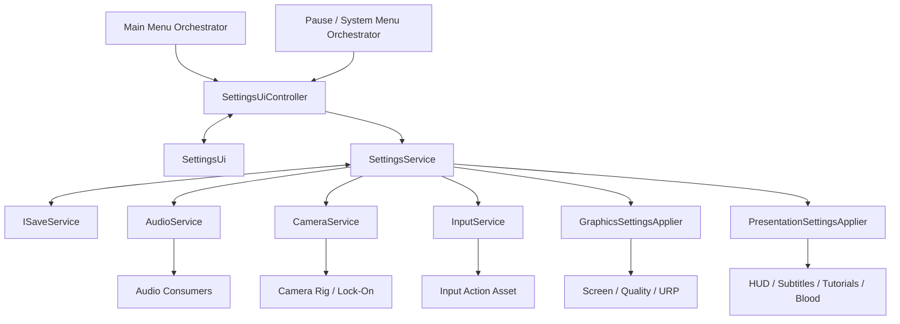

## 3.2 Responsibility table

| Component | Owns | Must not own |
|---|---|---|
| `SettingsService` | committed settings, edit draft, baseline, validation, migration, save/load, apply/cancel/defaults transaction | UI widgets, direct scene-object manipulation |
| `SettingsUiController` | UI flow, row callbacks, tab state, binding draft values, dirty dialog, display confirmation flow | persistence format, Unity graphics/audio APIs |
| `SettingsUi` | serialized view references, event subscription, visual state, selection/navigation | settings data authority, save/load, domain behavior |
| `AudioService` | applying audio values to the existing audio runtime and notifying current consumers | loading/saving the global settings file |
| `CameraService` | applying camera options to free/lock-on camera behavior | settings persistence |
| `InputService` | action maps, rebind capture, override application, current input device | settings menu presentation |
| `GraphicsSettingsApplier` | supported modes, quality/URP changes, display apply/revert | settings transaction or UI |
| `PresentationSettingsApplier` | HUD, subtitles, tutorials, blood, brightness integration | persistence or graphics mode handling |
| `ISaveService` | reading/writing serialized data | interpreting or applying settings |

## 3.3 Why one settings service

A single settings document is inherently one user preference set. Splitting every category into an independent repository produces:

- duplicated load/save lifecycle;
- ordering problems at startup;
- a coordinator that must reconstruct the aggregate;
- multiple competing runtime sources of truth;
- more interfaces and observer boilerplate than actual behavior.

A single `SettingsService` is not a God object when it delegates actual domain application. Its cohesive responsibility is:

> Maintain one valid, persistent, editable game-settings document and coordinate its application.

## 3.4 Why not make every domain observe the aggregate

A global `GameSettingsData` notification would make unrelated consumers depend on the entire document.

Instead:

- `SettingsService` sends the relevant section to the owning domain service/applier;
- the domain service decides how its internal consumers receive changes;
- the existing audio observer pattern can remain inside audio;
- other domains do not need an observer list unless they already have multiple real consumers.

---

# 4. Data Design

## 4.1 Top-level save document

```csharp
[Serializable]
public sealed class GameSettingsData
{
    public int SchemaVersion = SettingsSchema.CurrentVersion;

    public GameplaySettingsData Gameplay = new();
    public CameraSettingsData Camera = new();
    public AudioSettingsData Audio = new();
    public DisplaySettingsData Display = new();
    public GraphicsSettingsData Graphics = new();
    public ControlsSettingsData Controls = new();
}
```

Keep concrete serializable data classes. Do not create `IGameplaySettingsData`, `ICameraSettingsData`, and similar interfaces unless a real read-only polymorphic boundary appears later.

## 4.2 Gameplay data

```csharp
[Serializable]
public sealed class GameplaySettingsData
{
    public bool ToggleAimLockOn = true;
    public bool AutoTarget = true;
    public bool ManualAttackAiming = false;
}
```

Only include settings whose behavior exists or is part of the same implementation task.

## 4.3 Camera data

```csharp
[Serializable]
public sealed class CameraSettingsData
{
    public bool InvertHorizontal;
    public bool InvertVertical;
    public bool ResetVerticalOnCameraReset = true;
    public float Sensitivity = 0.5f;
    public bool AutoWallRecovery = true;
    public bool CinematicEffects = true;
    public bool AutoRotate = true;
}
```

`Sensitivity` is stored normalized from `0..1`. The UI may display `1..10`. `CameraService` maps it to real speed ranges.

## 4.4 Audio data

Reuse or migrate the existing type, adding voice volume if voice/dialogue has a separate bus.

```csharp
[Serializable]
public sealed class AudioSettingsData
{
    public float MasterVolume = 1f;
    public float MusicVolume = 1f;
    public float SfxVolume = 1f;
    public float VoiceVolume = 1f;
    public bool MuteAll;
}
```

Rules:

- serialized values are normalized `0..1`;
- clamp after loading;
- the view can display `0..10`;
- keep `MuteAll` only if the project already uses it or needs a global mute command;
- do not create separate values for every sound source.

## 4.5 Display/presentation data

```csharp
public enum HudMode
{
    Auto,
    Always,
    Off
}

public enum PromptDeviceMode
{
    Auto,
    KeyboardMouse,
    Gamepad
}

[Serializable]
public sealed class DisplaySettingsData
{
    public bool DisplayBlood = true;
    public bool Subtitles = true;
    public HudMode Hud = HudMode.Auto;
    public bool ShowTutorials = true;
    public float Brightness = 0.5f;
    public PromptDeviceMode PromptDevice = PromptDeviceMode.Auto;
}
```

Do not store direct scene-object references in settings data.

## 4.6 Graphics data

```csharp
public enum GraphicsPreset
{
    Low,
    Medium,
    High,
    Maximum,
    Custom
}

[Serializable]
public struct DisplayModeData
{
    public int Width;
    public int Height;
    public uint RefreshRateNumerator;
    public uint RefreshRateDenominator;
}

[Serializable]
public sealed class GraphicsSettingsData
{
    public FullScreenMode WindowMode = FullScreenMode.FullScreenWindow;
    public DisplayModeData DisplayMode;
    public GraphicsPreset Preset = GraphicsPreset.High;

    public bool RayTracing;
    public int TextureQuality;
    public int AntialiasingQuality;
    public int AmbientOcclusionQuality;
    public bool DepthOfField = true;
    public bool MotionBlur = true;
    public int ShadowQuality;
    public int LightingQuality;
    public int EffectsQuality;
    public int VolumetricQuality;
    public int ReflectionQuality;
    public int WaterQuality;
    public int ShaderQuality;
    public int GlobalIlluminationQuality;
    public int GrassQuality;
}
```

Rules:

- persist the actual width, height, and refresh ratio;
- never persist an index into `Screen.resolutions`;
- filter and deduplicate the runtime resolution list for presentation;
- `AutoDetectBestRenderingSettings` is an action, not persisted state;
- an advanced option change sets `Preset = Custom`;
- unsupported values are normalized to the nearest valid runtime value.

A simpler first milestone may contain only:

- window mode;
- resolution;
- VSync;
- frame-rate cap;
- quality preset;
- motion blur;
- render scale.

Add the full Elden Ring-like advanced list only when each option has a real URP mapping.

## 4.7 Controls data

```csharp
[Serializable]
public sealed class ControlsSettingsData
{
    public float VibrationStrength = 1f;
    public string BindingOverridesJson = string.Empty;
}
```

The Input System already provides a compact binding-overrides JSON representation. Do not serialize an independently invented list of every key unless the project has a concrete need that the override format cannot satisfy.

## 4.8 Defaults asset

Create:

```text
Assets/Settings/Data/SettingsDefaultsData.asset
```

with:

```csharp
[CreateAssetMenu(...)]
public sealed class SettingsDefaultsData : ScriptableObject
{
    [SerializeField] private GameSettingsData defaults;
    public GameSettingsData CreateCopy();
}
```

Rules:

- the asset defines hardware-independent defaults;
- first-run resolution can be replaced with the current desktop/native mode;
- do not mutate the ScriptableObject instance at runtime;
- use deep copies;
- keep graphics presets in the same asset or one explicit `GraphicsPresetsData` asset;
- avoid one ScriptableObject per setting.

## 4.9 Schema version and migration

`SchemaVersion` is required from the first release.

Migration flow:

```text
Load JSON
  → deserialize
  → migrate old schema versions sequentially
  → validate/clamp
  → fill absent sections from defaults
  → apply
```

Examples of future migrations:

- add `VoiceVolume` using the old master volume as the initial value;
- replace a boolean HUD setting with `HudMode`;
- rename an input action while retaining compatible override data;
- replace a refresh-rate integer with numerator/denominator data.

Unknown/newer schema versions should not be overwritten silently. Log a clear error and use safe defaults for the current run.

---

# 5. SettingsService Contract and State

## 5.1 Interface

Keep the public API small.

```csharp
public interface ISettingsService
{
    GameSettingsData Current { get; }
    GameSettingsData Draft { get; }

    bool IsEditing { get; }
    bool HasUnsavedChanges { get; }

    UniTask InitializeAsync();

    void BeginEdit();
    void Preview(SettingsSection section);
    void ResetSection(SettingsSection section);

    UniTask<SettingsApplyResult> ApplyAsync();
    void CancelEdit();
}
```

Optional display-confirmation methods may be added directly:

```csharp
void ConfirmPendingDisplayChange();
void RevertPendingDisplayChange();
```

Do not expose generic event buses or dozens of setting-specific methods.

## 5.2 Internal state

```text
_current   = last committed and successfully loaded/applied settings
_baseline  = copy of _current when BeginEdit starts
_draft     = mutable copy edited by the UI
```

State rules:

- no edit session: `_draft` and `_baseline` are null or inactive;
- `BeginEdit()` deep-copies `_current` twice;
- UI mutates only `_draft`;
- `Preview(section)` applies the relevant draft section;
- `ApplyAsync()` validates, applies, commits, then saves;
- `CancelEdit()` reapplies `_baseline` to previewed sections and discards the session.

## 5.3 Equality and dirty state

Avoid updating a manual “dirty” flag in every UI callback.

Use either:

- explicit value equality per settings section; or
- one deterministic serialized/hash comparison acceptable for a small settings document.

Prefer explicit `Equals`/comparison helpers because they also support:

- section-level dirty markers;
- deciding whether a risky display change occurred;
- avoiding unnecessary runtime reapplication.

---

# 6. Runtime Behavior

## 6.1 Startup workflow

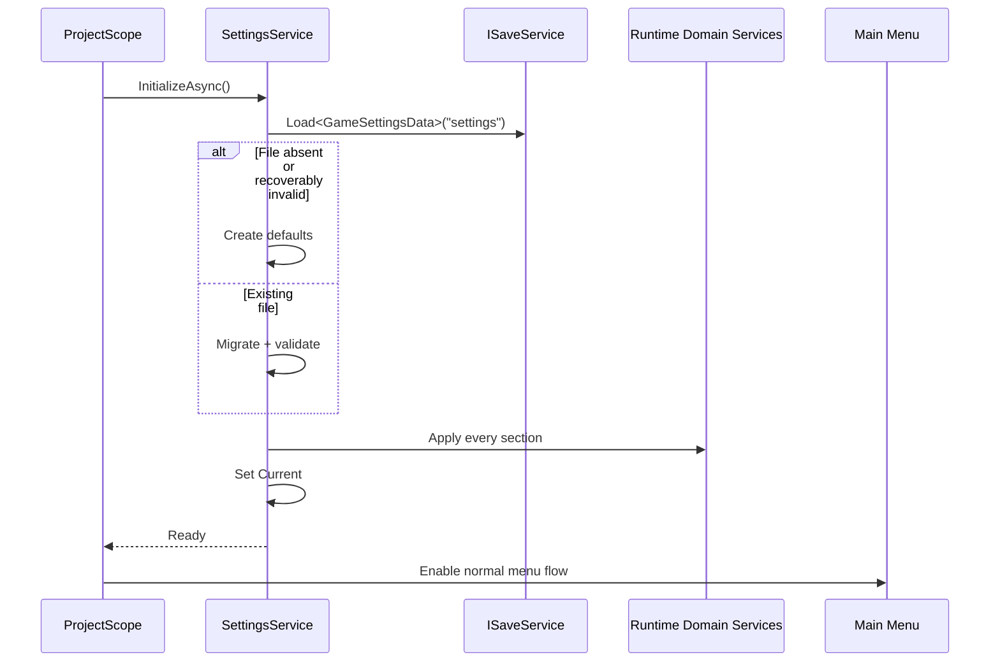

Settings must be applied before:

- the player can enter gameplay;
- the first HUD renders with wrong visibility;
- initial camera sensitivity is used;
- the first audio frame plays at default levels;
- input prompts are shown.

## 6.2 Opening the menu

```text
Parent orchestrator requests SettingsUiController.Open()
  → controller creates/shows SettingsUi
  → settingsService.BeginEdit()
  → controller binds Draft into all visible rows
  → controller selects the last in-session tab or Game Options
```

Do not auto-show settings from `IInitializable.Initialize()`.

## 6.3 Safe live preview

Preview immediately:

- master/music/SFX/voice volume;
- camera sensitivity and axis inversion;
- camera auto-rotate/wall recovery/cinematic effects;
- HUD mode;
- subtitles;
- tutorial visibility;
- blood presentation;
- brightness/post-process calibration;
- gameplay targeting toggles;
- vibration;
- input rebind overrides.

Live preview does not mean immediate disk writes.

## 6.4 Deferred settings

Apply only when the user confirms Apply:

- resolution;
- refresh rate;
- window/fullscreen mode;
- quality preset;
- advanced URP quality values;
- ray tracing or renderer changes;
- render scale if it can cause a noticeable frame hitch.

## 6.5 Apply workflow

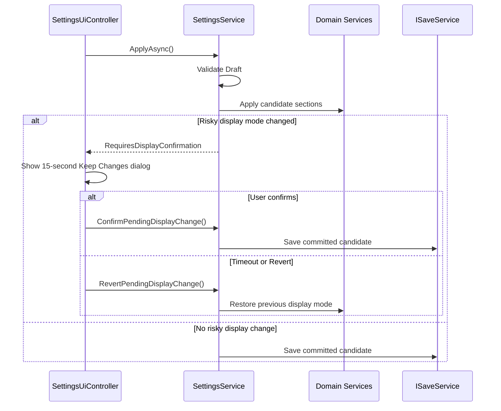

Save only after the candidate has been applied successfully.

## 6.6 Leaving with unsaved changes

On Back:

```text
No changes
  → close immediately

Changes exist
  → modal:
       Apply
       Discard
       Continue Editing
```

`Discard`:

- reapplies baseline values for every previewed section;
- restores baseline binding overrides;
- restores baseline UI prompt mode;
- closes only after restoration succeeds.

## 6.7 Defaults

Defaults operate on the **current category**, matching the contextual menu action.

Flow:

```text
Defaults command
  → optional confirmation
  → copy default section into Draft
  → preview safe values
  → update all rows
  → mark section dirty
```

The Controls page should separately support:

- reset selected binding;
- reset all bindings;
- restore default vibration.

## 6.8 Persistence

Use `ISaveService` and a dedicated settings key/file independent of character progression.

Required behavior:

- load missing file → defaults;
- load corrupt file → log and use defaults without crashing;
- save only validated data;
- retain the last committed file while the menu contains an uncommitted draft;
- use an atomic temp-file/replace strategy if the current `ISaveService` supports extension;
- do not use `PlayerPrefs` as the main settings document.

Suggested key:

```text
settings
```

Suggested data location is whatever `ISaveService` already uses under Unity’s persistent data path.

---

# 7. Domain Integration

## 7.1 Audio

### Existing system

Retain the current audio service and observer flow to avoid unrelated rewrites.

### Change

Make `AudioService` accept one applied audio section:

```csharp
void ApplySettings(AudioSettingsData settings);
```

It should:

- clamp values;
- update its runtime cache;
- update AudioMixer buses when present;
- notify existing audio consumers;
- avoid writing persistence.

### Volume mapping

If mixer parameters use decibels:

```text
0       → minimum/mute dB
0..1    → logarithmic dB conversion
```

Do not use a purely linear dB mapping.

### UI

Display `0..10`, store `0..1`.

---

## 7.2 Camera

Add one cohesive method:

```csharp
void ApplySettings(CameraSettingsData settings);
```

Map settings to existing camera behavior:

- horizontal/vertical inversion → input direction multipliers;
- sensitivity → camera input speed;
- reset Y → reset-camera behavior;
- auto-wall recovery → collision correction policy;
- cinematic effects → impulse/shake permission;
- auto-rotate → movement-driven recenter/rotation assistance.

Do not create settings that merely change stored values while camera code ignores them.

---

## 7.3 Gameplay targeting

The owning lock-on/combat system reads applied values through its existing service/mediator boundary.

Expected behavior:

- `ToggleAimLockOn` changes whether attack behavior can enter/retain targeting;
- `AutoTarget` controls automatic acquisition rules;
- `ManualAttackAiming` enables manual attack direction only for attacks that support it.

These settings must not alter animation data or weapon data directly.

---

## 7.4 Display and presentation

`PresentationSettingsApplier` applies:

- `DisplayBlood` to blood VFX spawning/presentation;
- `Subtitles` to subtitle presenter visibility;
- `HudMode` to HUD visibility policy;
- `ShowTutorials` to tutorial presenter eligibility;
- `Brightness` to a dedicated global volume/color-adjustment parameter;
- `PromptDevice` to the prompt/glyph resolver.

### HUD Auto

Recommended rule:

```text
Always → HUD visible whenever gameplay HUD is allowed
Off    → HUD hidden except mandatory critical prompts
Auto   → HUD hides while idle and reappears on relevant events/input
```

Define the exact “Auto” wake conditions in the HUD feature, not in `SettingsService`.

---

## 7.5 Graphics

Create one `GraphicsSettingsApplier`, not a broad `GraphicsService` unless graphics already has ongoing runtime responsibilities beyond settings.

Responsibilities:

- report supported capabilities;
- enumerate display modes;
- validate requested mode;
- apply quality preset;
- apply advanced URP settings;
- apply/revert display mode;
- report apply failures.

### Display mode list

At runtime:

1. read supported full-screen resolutions;
2. keep width, height, and refresh ratio;
3. deduplicate exact duplicates;
4. optionally group the UI first by dimensions, then refresh rate;
5. guarantee the current desktop/window mode is representable;
6. do not store list indices.

### Risky display confirmation

When resolution/window mode/refresh changes:

1. remember the applied baseline mode;
2. apply candidate mode;
3. wait at least until Unity has processed the change;
4. show `Keep these display settings? 15`;
5. confirm → commit/save;
6. timeout/back → restore baseline mode.

### Presets

A preset is an explicit map to:

- Unity quality level;
- selected URP asset;
- render scale;
- shadow settings;
- post-process settings;
- any project-specific quality managers.

Changing one advanced value switches the displayed preset to `Custom`.

### Capabilities

Example:

```csharp
public readonly struct SettingsCapabilities
{
    public bool SupportsHdr;
    public bool SupportsRayTracing;
    public bool SupportsExclusiveFullscreen;
    public bool SupportsRefreshRateSelection;
    public bool SupportsMotionControls;
    public bool SupportsVibration;
}
```

The controller uses this to omit unsupported rows.

---

## 7.6 Controls and rebinding

### Storage

Store Input System binding overrides as JSON in `ControlsSettingsData.BindingOverridesJson`.

### Rebind flow

```text
Select binding row
  → disable normal settings navigation for that row
  → disable relevant gameplay action map
  → show "Press a key/button"
  → start interactive rebind
  → ignore invalid controls
  → detect conflicts
  → accept, replace, swap, or cancel
  → save override JSON into Draft
  → apply override for preview
  → update glyph/text
```

### Required cancellation paths

- dedicated cancel button;
- Escape/Back;
- timeout;
- UI closure;
- device disconnect;
- controller destruction.

### Conflicts

For V1, use an explicit and readable policy:

- same control in the same action map/control scheme → show conflict modal;
- choices: replace existing binding or cancel;
- do not silently create ambiguous duplicates.

### Prompt device

`Auto` follows the last meaningful input device. Ignore:

- mouse jitter;
- noisy analog controls below a threshold;
- virtual devices not intended for UI prompts.

A forced prompt mode overrides auto-detection.

---

# 8. UI Architecture

## 8.1 Folder structure

```text
Assets/Scripts/Ui/Settings/
├── ISettingsPresenter.cs
├── SettingsUiController.cs
├── SettingsUi.cs
├── SettingsTab.cs
├── SettingsOptionId.cs
├── SettingsOptionViewData.cs
└── Options/
    ├── SettingsOptionUi.cs
    ├── ToggleSettingsOptionUi.cs
    ├── SliderSettingsOptionUi.cs
    ├── ChoiceSettingsOptionUi.cs
    ├── ActionSettingsOptionUi.cs
    └── BindingSettingsOptionUi.cs
```

This is the maximum useful split for the feature. Do not create separate domain presenters/controllers for each tab unless the single controller becomes genuinely difficult to maintain after implementation.

## 8.2 Presenter interface

Use a small generic UI-action interface:

```csharp
public interface ISettingsPresenter
{
    void SelectTab(SettingsTab tab);
    void SelectOption(SettingsOptionId option);

    void SetToggle(SettingsOptionId option, bool value);
    void SetSlider(SettingsOptionId option, float normalizedValue);
    void StepChoice(SettingsOptionId option, int direction);
    void ActivateOption(SettingsOptionId option);

    void RestoreCurrentTabDefaults();
    void Apply();
    void Back();
    void ShowHelp();
}
```

A central switch from `SettingsOptionId` to typed draft fields is acceptable here. It is easier to trace than:

- reflection;
- expression trees;
- dozens of one-method adapter classes;
- one presenter method per option.

## 8.3 `SettingsUi`

Responsibilities:

- inherit `BaseUi`;
- contain root panels, tab buttons, option row references, help text, command legend;
- subscribe/unsubscribe serialized UI events;
- forward actions to `ISettingsPresenter`;
- render row values and enabled/visible state;
- preserve current selection while open;
- display nested pages and dialogs.

It must not:

- load or save data;
- call domain services;
- modify `Time.timeScale`;
- determine platform capabilities;
- perform rebind logic;
- call Unity rendering APIs.

## 8.4 `SettingsUiController`

Responsibilities:

- inherit `UiController`;
- implement `ISettingsPresenter`;
- create `SettingsUi` through `CreateUi<SettingsUi>()`;
- assign itself as presenter;
- begin/end edit sessions;
- translate row actions into typed draft changes;
- call preview for safe sections;
- query capabilities;
- build visible rows;
- refresh selected-row help text;
- coordinate dirty-exit and display-confirmation dialogs;
- report save/apply failures through the project UI message pattern.

Do not make it auto-show during initialization.

## 8.5 Tabs

Recommended order:

```text
Game
Camera
Sound & Display
Graphics
Controls
Network (only when implemented)
```

Alternative: split Sound and Display into separate tabs when the option count grows. Do not split only to mimic service boundaries.

## 8.6 Option row types

### Toggle row

```text
[Display Blood]                              On
```

### Choice row

```text
[HUD]                              <  Auto  >
```

### Slider row

```text
[Master Volume]                     ───●──  7
```

### Action row

```text
[Advanced Graphics]                         >
```

### Binding row

```text
[Light Attack]                            R1
```

Every row exposes:

- option ID;
- label localization key;
- help localization key;
- current visual value;
- selectable/interactable state.

## 8.7 Explicit row composition

For V1, compose rows explicitly in the prefab or controller setup. Avoid a metadata/reflection system that discovers fields from settings DTOs.

A lightweight `SettingsOptionViewData` is acceptable for presentation:

```csharp
public readonly struct SettingsOptionViewData
{
    public SettingsOptionId Id;
    public string Label;
    public string Value;
    public string Help;
    public bool IsEnabled;
}
```

It is UI data, not persistent data.

## 8.8 Navigation rules

- Up/Down: move through visible rows.
- Left/Right: change toggle/choice/slider.
- Confirm: activate action or binding row.
- Shoulder buttons / assigned keyboard keys: change tab.
- Back: exit nested page, then settings root.
- Defaults: reset current tab.
- Help: show expanded explanation.
- Mouse hover updates selection and contextual help.
- Hidden rows are removed from navigation order.
- Disabled rows remain only when the reason is temporary and can be explained.
- Slider hold repeats smoothly without saving every tick.

## 8.9 UI state

Persist only genuine preferences. Do not persist incidental menu state such as:

- selected row;
- current scroll position;
- last tab;
- whether the help overlay was open.

Retaining the last tab while the same menu instance remains open is fine.

## 8.10 Nested panels

Use the same root feature/presenter for:

- Advanced Graphics;
- Button Settings;
- Keyboard/Mouse Settings;
- Brightness Calibration.

Do not create separate addressable full-screen UIs unless a panel becomes independently reusable elsewhere.

---

# 9. Prefab and Addressables Plan

## 9.1 Prefab

```text
Assets/Prefabs/Ui/Settings/SettingsUi.prefab
```

Required root setup:

- `SettingsUi` component;
- `CanvasGroup` required by `BaseUi`;
- full-screen anchors;
- safe-area-aware content root if console support is planned;
- serialized tab, row, help, and legend references.

Suggested hierarchy:

```text
SettingsUi
├── BackgroundDim
├── Header
│   ├── Title
│   └── Tabs
├── Body
│   ├── OptionList
│   └── Scrollbar
├── Footer
│   ├── ContextHelp
│   └── CommandLegend
├── AdvancedGraphicsPanel
├── ControlsPanel
├── BrightnessPanel
├── UnsavedChangesDialog
└── DisplayConfirmationDialog
```

## 9.2 Addressables

- mark `SettingsUi.prefab` Addressable;
- group: `Ui`;
- address: `SettingsUi`;
- add `SettingsUi` → prefab reference to `AssetMappingData.uiMappings`.

## 9.3 Scope registration

### Project scope

```text
SettingsService
GraphicsSettingsApplier
PresentationSettingsApplier
SettingsDefaultsData
```

Register service interfaces/self according to existing project conventions.

### UI owner scopes

Register `SettingsUiController` in every scope that can open the settings feature:

- main-menu scope;
- gameplay/system-menu scope.

The controller is scene/UI-flow scoped. `SettingsService` is project scoped.

Avoid a project-singleton UI controller holding destroyed scene UI references.

---

# 10. Planned Files

## New runtime files

```text
Assets/Scripts/Services/Settings/
├── ISettingsService.cs
├── SettingsService.cs
├── GameSettingsData.cs
├── SettingsEnums.cs
├── SettingsSchema.cs
├── SettingsValidator.cs
├── SettingsMigration.cs
├── SettingsApplyResult.cs
├── SettingsCapabilities.cs
├── GraphicsSettingsApplier.cs
└── PresentationSettingsApplier.cs
```

`SettingsValidator` and `SettingsMigration` may initially be private/static code inside `SettingsService` if they remain small. Extract only when there are multiple migrations or meaningful independent tests.

## New UI files

```text
Assets/Scripts/Ui/Settings/
├── ISettingsPresenter.cs
├── SettingsUiController.cs
├── SettingsUi.cs
├── SettingsTab.cs
├── SettingsOptionId.cs
├── SettingsOptionViewData.cs
└── Options/
    ├── SettingsOptionUi.cs
    ├── ToggleSettingsOptionUi.cs
    ├── SliderSettingsOptionUi.cs
    ├── ChoiceSettingsOptionUi.cs
    ├── ActionSettingsOptionUi.cs
    └── BindingSettingsOptionUi.cs
```

## New assets

```text
Assets/Prefabs/Ui/Settings/SettingsUi.prefab
Assets/Settings/Data/SettingsDefaultsData.asset
Assets/Settings/Data/GraphicsPresetsData.asset   # only if needed
```

## Existing files likely modified

```text
AudioService / IAudioService
CameraService / ICameraService
InputService
ProjectScope
MainMenuScope
Gameplay or SystemMenu scope
AssetMappingData.asset
Input Actions asset / generated wrapper integration
HUD presenter or controller
Subtitle presenter
Tutorial service/presenter
Blood VFX presentation entry point
Global Volume / post-process integration
```

Do not modify all of these speculatively. Phase 0 must identify the actual owner for each option first.

---

# 11. Implementation Phases

## Phase 0 — Audit and integration map

### Goal

Verify what already exists before writing the settings architecture into code.

### Tasks

1. Inspect:
   - `AudioService` and all current settings observers;
   - `CameraService` and free/lock-on camera dependencies;
   - input action assets and `InputService`;
   - HUD, subtitle, tutorial, blood, and prompt systems;
   - URP assets, quality levels, render scale, volumes, and post-processing;
   - `ISaveService` load/save API and corruption behavior;
   - existing modal/dialog UI;
   - main-menu and in-game system-menu entry points.

2. Produce a matrix:

| Option | Runtime owner | Behavior exists? | Preview/deferred | Platform capability | V1? |
|---|---|---:|---|---|---:|

3. Mark every proposed option:
   - implement now;
   - hide until behavior exists;
   - explicitly defer.

4. Confirm whether the existing audio settings type can be reused without breaking serialized data.

### Exit criteria

- every V1 row has a real runtime owner;
- no visible row is a no-op;
- exact existing files to modify are known.

---

## Phase 1 — Core settings data and persistence

### Tasks

1. Add `GameSettingsData` and initial schema version.
2. Add section DTOs and enums.
3. Add `SettingsDefaultsData`.
4. Implement deep-copy and equality helpers.
5. Implement validation/clamping.
6. Implement missing/corrupt-file fallback.
7. Implement load/save through `ISaveService`.
8. Register `SettingsService` in `ProjectScope`.
9. Apply loaded settings before normal menu/game startup.
10. Add logging only for actionable failures.

### Tests

- first launch creates defaults;
- restart loads saved values;
- null/missing sections receive defaults;
- out-of-range values clamp;
- corrupt JSON does not prevent startup;
- current settings are not mutated through defaults asset references.

---

## Phase 2 — Edit transaction and runtime integration

### Tasks

1. Implement `BeginEdit`, `Preview`, `ApplyAsync`, `CancelEdit`, and section defaults.
2. Integrate existing `AudioService`.
3. Integrate `CameraService`.
4. Integrate gameplay targeting owner.
5. Add `PresentationSettingsApplier`.
6. Add basic `GraphicsSettingsApplier`.
7. Integrate Input System binding override load/apply.
8. Ensure cancel restores every live-previewed section.
9. Ensure save occurs once per committed Apply, not per slider tick.

### Tests

- preview changes runtime but not `Current`;
- cancel restores exact baseline;
- apply updates `Current` and persists;
- reopening begins from committed values;
- no duplicate audio observers or domain subscriptions are created.

---

## Phase 3 — Settings UI shell

### Tasks

1. Add presenter, controller, view, enums, and row components.
2. Build tabs and option list.
3. Implement contextual help and command legend.
4. Implement keyboard, gamepad, and mouse navigation.
5. Implement hidden/disabled capability behavior.
6. Add unsaved-changes dialog.
7. Register controller in main-menu and gameplay UI scopes.
8. Create prefab, Addressable entry, and `AssetMappingData` mapping.

### Tests

- open/close repeatedly without duplicate listeners;
- same UI opens from title and in-game menu;
- parent owns pause behavior;
- selection cannot land on hidden rows;
- input legend follows prompt-device mode.

---

## Phase 4 — First complete functional categories

Recommended first delivery:

### Game

- Toggle Aim Lock-On
- Auto-Target
- Manual Attack Aiming only if implemented

### Camera

- horizontal inversion;
- vertical inversion;
- sensitivity;
- reset Y;
- auto wall recovery;
- cinematic effects;
- auto rotate.

### Sound and Display

- master/music/SFX/voice;
- subtitles;
- HUD mode;
- tutorials;
- blood;
- brightness;
- prompt device.

### Graphics basic

- window mode;
- resolution;
- VSync;
- frame-rate cap;
- quality preset;
- motion blur;
- render scale if already supported.

### Controls basic

- vibration;
- open controller bindings;
- open keyboard/mouse bindings.

---

## Phase 5 — Safe graphics transaction

### Tasks

1. Enumerate and normalize display modes.
2. Detect changes to mode/resolution/refresh.
3. Apply at Unity’s supported timing.
4. Add 15-second display confirmation dialog.
5. Revert on timeout, Back, focus loss where appropriate, or apply failure.
6. Save only after confirmation.
7. Add graphics capabilities.
8. Add preset-to-URP/quality mapping.
9. Set preset to Custom after advanced edits.

### Tests

- supported mode list is stable;
- duplicate modes are not shown;
- invalid saved mode falls back safely;
- timeout restores previous mode;
- restart uses confirmed mode only;
- unsupported ray tracing/HDR rows are absent.

---

## Phase 6 — Full input rebinding

### Tasks

1. Build binding list from explicit supported gameplay actions.
2. Start/cancel interactive rebind.
3. Show current binding and control-scheme glyph.
4. Detect conflicts.
5. Support reset selected and reset all.
6. Serialize override JSON into draft.
7. Restore baseline overrides on settings cancel.
8. Load overrides before gameplay actions become active.
9. Test hot-switching input devices.

### Tests

- bindings survive restart;
- cancel during capture leaves old binding intact;
- duplicate conflict is never silent;
- menu navigation is not rebound out from under the active capture flow;
- device disconnect does not leave actions disabled.

---

## Phase 7 — Advanced graphics and polish

### Tasks

1. Add only advanced options with verified URP implementation.
2. Add auto-detect as a one-shot command if a real heuristic exists.
3. Add localization keys for labels, values, and help.
4. Add hold-repeat for sliders/choices.
5. Add menu sounds.
6. Add accessibility improvements:
   - readable selected state;
   - sufficient contrast;
   - scalable text where feasible;
   - no information communicated only by color;
   - clear rebind prompts and timeout.
7. Profile allocations while sliding and changing tabs.

---

# 12. Test Plan

## Data tests

- deep copies do not share nested references;
- equality detects one changed field;
- every float is clamped;
- invalid enum values normalize;
- defaults asset remains unchanged;
- schema migration is deterministic.

## Service tests

- initialization order;
- one load and one initial apply;
- preview does not save;
- apply saves once;
- cancel never saves;
- applying identical settings performs no expensive work;
- domain apply failure leaves committed data intact.

## Graphics tests

- fullscreen/windowed/borderless;
- multiple resolutions and refresh rates;
- monitor change where supported;
- invalid saved resolution;
- display confirmation;
- focus lost during countdown;
- unsupported exclusive fullscreen on non-Windows platforms;
- quality preset and custom state;
- scene transitions do not reset graphics.

## Audio tests

- zero volume;
- mute all;
- master × bus level;
- live preview;
- cancel restoration;
- no clicks or invalid logarithm at zero.

## Camera/gameplay tests

- free camera and lock-on both use applied sensitivity;
- X/Y inversion;
- reset vertical option;
- wall recovery toggle;
- cinematic impulse toggle;
- targeting toggles affect real acquisition behavior.

## Presentation tests

- HUD Auto/Always/Off;
- subtitles;
- tutorial gating;
- blood presentation only;
- brightness calibration;
- prompt device Auto/forced modes.

## Input tests

- controller and keyboard/mouse rebind;
- composite bindings;
- conflict handling;
- reset selected/all;
- cancellation;
- override persistence;
- device hot swap;
- UI still navigable after binding changes.

## UI lifecycle tests

- open/close 20 times;
- scene transition with settings closed/open;
- no duplicate listeners;
- no references to destroyed UI;
- parent pause state restored correctly;
- dirty exit paths;
- defaults on each tab;
- nested page Back behavior.

---

# 13. Acceptance Criteria

The feature is complete only when all of the following are true:

1. `SettingsService.Current` is the sole committed settings source.
2. Opening the menu creates an isolated draft.
3. Safe values preview immediately.
4. Preview never writes the settings file.
5. Apply validates, applies, commits, and saves once.
6. Discard restores all previewed runtime values exactly.
7. Risky display changes require confirmation and revert on timeout.
8. Missing/corrupt settings never block startup.
9. Settings survive scene transitions and application restart.
10. The same feature opens from main menu and in-game system menu.
11. The settings controller does not own pause behavior.
12. The view does not call services or Unity settings APIs.
13. Every visible option has implemented behavior.
14. Unsupported platform options are absent from navigation.
15. Rebound inputs persist and update displayed prompts.
16. Prefab location, Addressables group/address, and `AssetMappingData` follow project UI rules.
17. Existing audio behavior remains functional during the migration.
18. No new generic observer layer is introduced across all settings domains.
19. No separate settings repository is created per tab/domain.
20. No reflection-based automatic form architecture is required for V1.

---

# 14. Explicitly Rejected Approaches

## A. Independent service per settings domain

Rejected because it creates multiple persistence authorities and requires another coordinator to implement one settings menu transaction.

Domain services should apply behavior; they should not each become separate settings repositories.

## B. One class directly controlling every engine subsystem

Rejected because it makes `SettingsService` a God object and makes graphics/audio/input behavior difficult to test independently.

## C. Generic `IObserver<GameSettingsData>` everywhere

Rejected because every consumer receives unrelated changes and becomes coupled to the aggregate.

## D. Interface plus mutable DTO for every section

Rejected for V1 because there is no demonstrated polymorphic need. Concrete serialized data plus controlled ownership is simpler.

## E. One presenter/controller per tab

Rejected initially because all tabs share the same transaction, navigation, dirty state, defaults, and exit behavior.

## F. Save on every UI event

Rejected because sliders can generate many writes and an interrupted edit would overwrite the last known-good configuration.

## G. Persist resolution list index

Rejected because resolution order and availability can change across monitors and devices.

## H. Display nonfunctional Elden Ring options

Rejected. Visual parity is less important than every setting having real behavior.

## I. Settings UI changes `Time.timeScale`

Rejected because pause behavior belongs to the parent menu/game flow.

---

# 15. Recommended First Deliverable

To keep the first implementation controlled, deliver this vertical slice:

1. `GameSettingsData`, defaults, version, load/save, edit transaction.
2. Existing audio settings integrated into the aggregate.
3. Camera inversion and sensitivity.
4. HUD mode and subtitles if their owners already exist.
5. Basic graphics: window mode, resolution, quality preset, motion blur.
6. Vibration and binding-overrides persistence.
7. One complete Settings UI with tabs, reusable rows, help, defaults, Apply/Discard.
8. Display confirmation/revert.
9. Main-menu and in-game entry points.
10. Tests for load, preview, apply, cancel, display revert, and restart persistence.

Defer until the vertical slice is stable:

- full advanced graphics;
- HDR;
- ray tracing;
- motion sensor bindings;
- network tab;
- auto-detect rendering heuristic;
- settings search;
- reflection-generated UI;
- cloud/device split.

This delivers a clean foundation with visible value and without locking the project into unnecessary abstraction.


> 📄 **Source File End: `SoulsLikeGameVault/Artifact/ELDEN_RING_STYLE_SETTINGS_SYSTEM_PLAN.md`**


---

### File: `Artifact/FLASK_HEALING_SYSTEM_RESEARCH.md`
<a id="file-artifactflask-healing-system-researchmd"></a>

- **Relative Path:** `SoulsLikeGameVault/Artifact/FLASK_HEALING_SYSTEM_RESEARCH.md`
- **File Size:** 25,292 bytes
- **Section Category:** Design Plans & Feature Artifacts

> 📄 **Source File Begin: `SoulsLikeGameVault/Artifact/FLASK_HEALING_SYSTEM_RESEARCH.md`**

# Elden Ring Flask Mechanics & SoulsLike Codebase Research

## 1. Executive Summary

This document provides a comprehensive analysis of the **Flask Healing System** in *Elden Ring* and a complete architectural survey of the existing **SoulsLikeTemplate** codebase. It is prepared as a reference dossier so that other AI agents/engineers can review the exact state of existing systems and design an implementation plan.

> [!NOTE]
> This document contains **system research and architectural discovery only**. It does not propose implementation code, modifications, or execution plans.

---

## 2. Elden Ring Reference Flask Mechanics

In *Elden Ring* (and the broader Soulsborne lineage), flask drinking is a core tactical mechanic characterized by **commitment**, **action locking**, and **punishment windows**.

```
[Use Item Input]
       │
       ▼
[Check Charges] ──(Charges == 0)──► [Play Empty Flask Animation] ──► [End Action]
       │ (Charges > 0)
       ▼
[Enter Drink State] ──► Lock Actions (Attacks, Rolls, Weapon Swaps, Jumps)
       │             ──► Reduce Locomotion Speed (Slow Walk, No Sprint)
       ▼
[Windup Phase] (~0.0s - ~0.8s: Character pulls flask from belt and raises to mouth)
       │
       ├─► (Interrupted by Stagger/Knockdown) ──► Cancel Drink, No Charge Consumed, No Heal
       ▼
[Sip Event Frame] (~0.8s: Flask touches lips)
       │
       ├─► Decrement Flask Quantity (-1)
       ├─► Apply Instant HP / FP / Buff to Character
       ├─► Trigger Drink VFX (particle splash) and SFX ("glug" audio)
       ▼
[Chug / Chain Drinking Window] (Early Recovery Phase)
       │
       ├─► (Player presses Use Item again) ──► Loop Sip Animation (Fast consecutive drink, -1 Charge, +Heal)
       ▼
[Recovery Phase] (~0.8s - ~1.8s: Lower flask, return to hip)
       │
       ├─► (Interrupted by Stagger) ──► Heal already applied; cut recovery to hit reaction
       ├─► (Input Queue Window Opens) ──► Buffer subsequent Roll / Attack inputs
       ▼
[Exit Drink State] ──► Restore Normal Locomotion & Action Permissions
```

### 2.1. Flask Variants
1. **Flask of Crimson Tears**: Consumes 1 charge to restore a flat or scaled chunk of Health Points (HP).
2. **Flask of Cerulean Tears**: Consumes 1 charge to restore Focus Points (FP / Mana).
3. **Flask of Wondrous Physick**: Consumes 1 charge to apply custom mixed Crystal Tear effects (e.g., heal over time, explosive damage, stamina recovery boost, temporary damage absorption bubble).

### 2.2. Locomotion & Control Restrictions
- **Slow Walk**: While drinking on foot, the character transitions to a restricted walk speed (~30%–40% of standard move speed). Sprinting and crouching are disabled.
- **Action Lock**: The player cannot initiate light/heavy attacks, weapon skills, spells, weapon swaps, rolls, backsteps, or jumps during the windup and initial sip phase.
- **Rotation**: Character maintains directional control and can turn at a dampened rate while slow-walking.
- **Input Queueing / Buffering**: Pressing roll or attack during the late recovery phase buffers the action, triggering it on the first available exit frame.

### 2.3. Chugging / Multi-Sip Mechanic
- If the player presses the **Use Item** button again during the post-sip window before the flask is put back on the belt:
  - The character does **not** lower the flask.
  - The animation transitions into a rapid repeat sip cycle ("chug loop").
  - An additional charge is consumed and another heal payload is applied.

### 2.4. Empty Flask Interaction
- If current charges are **zero**:
  - The character attempts to drink, lifts the flask, tilts/inverts it, looks inside, shakes it, and performs a frustrated head-scratch / arm drop animation (`Item_Drink_Not`).
  - No health is restored.
  - The player is locked into this animation for ~1.5–2.0 seconds, leaving them completely vulnerable.
  - A distinct dry/empty audio sound effect plays.

### 2.5. Interruption & Poise Rules
- **Pre-Sip Interruption**: If the character takes poise damage sufficient to stagger, knock down, or launch them *before* the sip frame event, the action is cancelled:
  - No flask charge is consumed.
  - No HP is restored.
- **Post-Sip Interruption**: If hit *after* the sip frame during recovery:
  - The HP has already been granted and charge consumed.
  - The stagger animation cancels the remaining recovery duration.

### 2.6. Replenishment at Checkpoints
- Resting at a **Site of Grace** fully refills all flask charges to their maximum allocation.
- In Elden Ring open world, defeating specific enemy groups / crimson teardrop scarabs also refills flask charges dynamically.

---

## 3. Existing Codebase Architecture Survey

This section catalogs all existing subsystems in `f:\Private\SoulsLikeTemplate` that interface with flask usage, items, character actions, health, movement blocking, animations, and UI.

### 3.1. Item & Inventory Subsystem

| File Path | Key Types / Assets | Current State / Responsibility |
|---|---|---|
| [`Assets/Scripts/Items/ItemTypes.cs`](file:///f:/Private/SoulsLikeTemplate/Assets/Scripts/Items/ItemTypes.cs) | `ItemId`, `ItemType`, `EquipmentGroup`, `ItemUseType` | Defines `ItemId.CrimsonFlask = 3`, `ItemType.Consumable = 5`, `EquipmentGroup.QuickItem = 9`, `ItemUseType.Heal = 1`. |
| [`Assets/Scripts/Items/ItemDefinition.cs`](file:///f:/Private/SoulsLikeTemplate/Assets/Scripts/Items/ItemDefinition.cs) | `ItemDefinition` | Stores metadata: `ItemId`, `DisplayName`, `Description`, `Icon`, `Weight`, `MaxStack`, `EquipmentGroups`. |
| [`Assets/Scripts/Items/ConsumableDefinition.cs`](file:///f:/Private/SoulsLikeTemplate/Assets/Scripts/Items/ConsumableDefinition.cs) | `ConsumableDefinition` | Stores `ItemId`, `ItemUseType`, `EffectAmount`, `DurationSeconds`. |
| [`Assets/Scripts/Items/ConsumableDatabase.cs`](file:///f:/Private/SoulsLikeTemplate/Assets/Scripts/Items/ConsumableDatabase.cs) | `ConsumableDatabase` | ScriptableObject database indexing consumable items by `ItemId`. |
| [`Assets/Scripts/Items/ItemCatalog.cs`](file:///f:/Private/SoulsLikeTemplate/Assets/Scripts/Items/ItemCatalog.cs) | `ItemCatalog` | Central VContainer-registered service providing `GetItem(ItemId)` and `GetConsumable(ItemId)`. |
| [`Assets/Settings/Items/ConsumableDatabase.asset`](file:///f:/Private/SoulsLikeTemplate/Assets/Settings/Items/ConsumableDatabase.asset) | YAML Asset | Contains entry for `itemId: 3` (`CrimsonFlask`), `useType: 1` (`Heal`), `effectAmount: 60`, `durationSeconds: 0`. |
| [`Assets/Settings/Items/ItemDatabase.asset`](file:///f:/Private/SoulsLikeTemplate/Assets/Settings/Items/ItemDatabase.asset) | YAML Asset | Contains entry for `itemId: 3` (`Crimson Flask`), `icon: b8dd92f11f6bdcb468bf094ff75ff713`, `maxStack: 10`, `equipmentGroups: QuickItem`. |
| [`Assets/Scripts/Components/Inventory/InventoryComponent.cs`](file:///f:/Private/SoulsLikeTemplate/Assets/Scripts/Components/Inventory/InventoryComponent.cs) | `InventoryComponent`, `InventoryEntry` | Manages player inventory entries: `Add()`, `Remove()`, `Consume(InventoryEntryId, quantity)`. |
| [`Assets/Scripts/Components/Equipment/EquipmentSlots.cs`](file:///f:/Private/SoulsLikeTemplate/Assets/Scripts/Components/Equipment/EquipmentSlots.cs) | `EquipmentSlotGroup`, `EquipmentSlotId`, `EquipmentSlotCatalog` | Defines `EquipmentSlotGroup.QuickItem` spanning 10 slots (`QuickItem1` to `QuickItem10`). `IsCyclable(QuickItem)` is `true`. |
| [`Assets/Scripts/Components/Equipment/EquipmentComponent.cs`](file:///f:/Private/SoulsLikeTemplate/Assets/Scripts/Components/Equipment/EquipmentComponent.cs) | `EquipmentComponent`, `EquipmentModel` | Tracks assigned equipment and active slots. `SwitchActive(EquipmentSlotGroup.QuickItem)` advances the active quick item slot. |

#### Current Item Consumption Behavior in Character
In [`Character.cs` (lines 651–686)](file:///f:/Private/SoulsLikeTemplate/Assets/Scripts/Entities/Character/Character.cs#L651-L686):
```csharp
private bool TryUseActiveQuickItem()
{
    EquippedItemContext quickItem = equipmentComponent.BuildLoadout().ActiveQuickItem;
    if (quickItem == null) return false;
    ItemDefinition item = _itemCatalog.GetItem(quickItem.ItemId);
    if (item.ItemType != ItemType.Consumable)
    {
        throw new InvalidOperationException($"Quick-item slot contains non-consumable '{item.DisplayName}'.");
    }

    ConsumableDefinition consumable = _itemCatalog.GetConsumable(quickItem.ItemId);

    switch (consumable.UseType)
    {
        case ItemUseType.Heal:
            Heal(consumable.EffectAmount);
            break;
        case ItemUseType.GrantCurrency:
            GrantCurrency(Mathf.RoundToInt(consumable.EffectAmount));
            break;
        case ItemUseType.InfuseActiveWeapon:
            WeaponRuntime runtime = equipmentPresentation.ActiveRightWeaponRuntime;
            if (runtime == null) return false;
            runtime.ApplyLightningInfusion(consumable.EffectAmount, consumable.DurationSeconds);
            break;
        default:
            throw new ArgumentOutOfRangeException(nameof(consumable.UseType), consumable.UseType, null);
    }

    inventoryComponent.Consume(quickItem.Entry.EntryId);
    return true;
}
```
**Key Observations**:
- Item usage is currently **synchronous and instant**.
- `Heal()` is called immediately on button press.
- `inventoryComponent.Consume()` immediately decreases quantity.
- No state machine state is entered; no animation trigger is fired.
- No empty check or empty-state feedback occurs if the item is not present.

---

### 3.2. Health & Stat Subsystem

| File Path | Key Types | Current State / Responsibility |
|---|---|---|
| [`Assets/Scripts/Components/Health/HealthComponent.cs`](file:///f:/Private/SoulsLikeTemplate/Assets/Scripts/Components/Health/HealthComponent.cs) | `HealthComponent`, `IHealthComponent` | Authoritative health manager. Contains `CalculateHeal()`, `ApplyDamage()`, `ConsumeFocus()`, `RestoreFocus()`, `ConsumeStamina()`, `TickStaminaRecovery()`. |
| [`Assets/Scripts/Components/Health/HealthModel.cs`](file:///f:/Private/SoulsLikeTemplate/Assets/Scripts/Components/Health/HealthModel.cs) | `HealthModel` | Emits `OnStatsChanged`, `OnDamageApplied`, `OnDied`. |
| [`Assets/Scripts/Components/Health/HealthStats.cs`](file:///f:/Private/SoulsLikeTemplate/Assets/Scripts/Components/Health/HealthStats.cs) | `HealthStats` | Struct holding `CurrentHealth`, `MaxHealth`, `CurrentFocus`, `MaxFocus`, `CurrentStamina`, `MaxStamina`, `IsAlive`. |
| [`Assets/Scripts/Entities/Character/Character.cs`](file:///f:/Private/SoulsLikeTemplate/Assets/Scripts/Entities/Character/Character.cs) | `Character` | Exposes `public void Heal(float amount) => healthComponent.ApplyAuthoritativeStats(healthComponent.CalculateHeal(healthComponent.Stats, amount));` (lines 595–596). |
| [`Assets/Scripts/Entities/Character/PlayerController.cs`](file:///f:/Private/SoulsLikeTemplate/Assets/Scripts/Entities/Character/PlayerController.cs) | `PlayerController` | Refills HP, FP, and Stamina on `GameState.OnGraceSit` (lines 76–85). |

**Key Observations**:
- The health system already has full support for receiving authoritative heals via `CalculateHeal` and `ApplyAuthoritativeStats`.
- `HealthModel.OnStatsChanged` notifies the UI immediately when health changes.
- Focus points (FP) can also be modified with `RestoreFocus(float)`.

---

### 3.3. Input & Character Action State Machine

| File Path | Key Types | Current State / Responsibility |
|---|---|---|
| [`Assets/Scripts/Services/Input/ProjectInputActions.inputactions`](file:///f:/Private/SoulsLikeTemplate/Assets/Scripts/Services/Input/ProjectInputActions.inputactions) | Input Actions | Defines `UseItem` (default binding: 'R' key / Gamepad X/Square) and `SwitchFlask` (default binding: 'Down Arrow' / D-Pad Down). |
| [`Assets/Scripts/Entities/Character/Input/PlayerInputReader.cs`](file:///f:/Private/SoulsLikeTemplate/Assets/Scripts/Entities/Character/Input/PlayerInputReader.cs) | `PlayerInputReader` | Reads inputs in `Read(CharacterAction.State currentState)`: `actions.UseItem.WasPressedThisFrame()` generates `CharacterAction.Equipment(CharacterAction.EquipmentKind.UseQuickItem)`. `actions.SwitchFlask.WasPressedThisFrame()` generates `CharacterAction.Equipment(CharacterAction.EquipmentKind.SwitchQuickItem)`. |
| [`Assets/Scripts/Entities/Character/Runtime/CharacterAction.cs`](file:///f:/Private/SoulsLikeTemplate/Assets/Scripts/Entities/Character/Runtime/CharacterAction.cs) | `CharacterAction` | Defines `Kind` (`Attack`, `Roll`, `Jump`, `Equipment`), `EquipmentKind` (`SwitchRightWeapon`, `SwitchLeftWeapon`, `SwitchQuickItem`, `UseQuickItem`, `ToggleHandMode`), and `State` (`Neutral`, `Attack`, `Roll`, `EquipmentSwap`, `Critical`). |
| [`Assets/Scripts/Entities/Character/Runtime/CharacterActionStateMachine.cs`](file:///f:/Private/SoulsLikeTemplate/Assets/Scripts/Entities/Character/Runtime/CharacterActionStateMachine.cs) | `CharacterActionStateMachine` | Manages active action state, 1.0s input buffer (`Buffer`, `TryGetBufferedAction`), queue windows (`_queueWindowOpen`, `HandleQueueCheck`), and execution gates (`CanExecute`). |

**Key Observations**:
- `CharacterAction.State` currently does **not** include an `ItemUse` or `Drinking` state.
- In `CharacterAction.cs`, `CanBuffer` is currently `ActionKind != Kind.Equipment`.
- In `CharacterActionStateMachine.cs`, states `Attack` and `Roll` open a queue window via `HandleQueueCheck` during their animation, allowing buffered actions to transition smoothly.

---

### 3.4. Movement & Locomotion Blocking Subsystem

| File Path | Key Types | Current State / Responsibility |
|---|---|---|
| [`Assets/Scripts/Components/Movement/MovementComponent.cs`](file:///f:/Private/SoulsLikeTemplate/Assets/Scripts/Components/Movement/MovementComponent.cs) | `MovementComponent`, `MovementModel` | Character locomotion controller. Has `SetMovementBlocked(bool)`, `SetSpeedMultiplier(SpeedMultiplierKey, float)`, and `RemoveSpeedMultiplier(SpeedMultiplierKey)`. |
| [`Assets/Scripts/Entities/Character/SpeedMultiplierKey.cs`](file:///f:/Private/SoulsLikeTemplate/Assets/Scripts/Entities/Character/SpeedMultiplierKey.cs) | `SpeedMultiplierKey` | Enum of speed modifier sources (`InventoryWeight`, `WeaponZoom`, `WeaponTestRiffle`, `Slide`). |
| [`Assets/Scripts/Entities/Character/Character.cs`](file:///f:/Private/SoulsLikeTemplate/Assets/Scripts/Entities/Character/Character.cs) | `MovementLockReason` | Bitmask enum: `None = 0, Manual = 1, Animation = 2, Spawn = 4, Parry = 8, Critical = 16`. Evaluated in `SetMovementLock()`. |
| [`Assets/Scripts/Components/Animator/AnimatorRootMotionRelay.cs`](file:///f:/Private/SoulsLikeTemplate/Assets/Scripts/Components/Animator/AnimatorRootMotionRelay.cs) | `AnimatorRootMotionRelay` | Scans active animator state tags for `"RootMotion"` and `"MovementBlocked"`. Calls `Character.SetAnimationMotionContract(movementBlocked)`. |

**Key Observations**:
- `MovementComponent` can enforce either a complete movement lock (`SetMovementBlocked(true)`) or a reduced speed modifier via `SetSpeedMultiplier(key, float)`.
- If a state has the `"MovementBlocked"` or `"RootMotion"` tag in the Animator, `AnimatorRootMotionRelay` automatically coordinates with `Character.SetAnimationMotionContract()`.

---

### 3.5. Animator, StateMachineBehaviours, and Art Assets

| File Path | Key Types | Current State / Responsibility |
|---|---|---|
| [`Assets/Scripts/Components/Animator/AnimatorComponent.cs`](file:///f:/Private/SoulsLikeTemplate/Assets/Scripts/Components/Animator/AnimatorComponent.cs) | `AnimatorComponent` | Central animator controller interface. Manages layer weights (`OneHandedLayer`, `TwoHandedLayer`, `UpperBodyActions`, `FullBodyActions`), parameter hashes, triggers, and state machine observation. |
| [`Assets/Scripts/Components/Animations/AnimatorStateMachine.cs`](file:///f:/Private/SoulsLikeTemplate/Assets/Scripts/Components/Animations/AnimatorStateMachine.cs) | `AnimatorStateMachine` (`StateMachineBehaviour`) | Unity `StateMachineBehaviour` attached to animator states. Reports `OnEnter`, `OnProgress` (at normalized time), `OnQueueCheck` (at normalized time), and `OnExit` to `IAnimatorStateMachineReceiver`. |
| [`Assets/Scripts/Components/Animations/AnimatorStateMachineReceiver.cs`](file:///f:/Private/SoulsLikeTemplate/Assets/Scripts/Components/Animations/AnimatorStateMachineReceiver.cs) | `AnimatorStateMachineReceiver` | MonoBehaviour on character root that receives callbacks from `AnimatorStateMachine` and forwards them to `AnimatorComponent.UpdateState()`. |
| [`Assets/Scripts/Components/Animations/StateMachineName.cs`](file:///f:/Private/SoulsLikeTemplate/Assets/Scripts/Components/Animations/StateMachineName.cs) | `StateMachineName` | Enum of state machines (`Idle`, `LightAttack`, `Roll`, `Spawn`, `EquipmentSwapOut`, `GraceRestStart`, `HitReaction`, `ParryStun`, etc.). |
| [`Assets/Art/Animation/CharacterGreatSwordAnimator.controller`](file:///f:/Private/SoulsLikeTemplate/Assets/Art/Animation/CharacterGreatSwordAnimator.controller) | AnimatorController | The character's primary Animator Controller containing locomotion blend trees, full-body action layers, and upper-body overlay layers. |

#### Available Animation Assets in Repository

The project already contains dedicated item interaction and drinking animations in the DoubleL asset library:

1. [`Assets/ThirdParty/DoubleL/FBX_Animations/Actions/Item/Item_Drink.fbx`](file:///f:/Private/SoulsLikeTemplate/Assets/ThirdParty/DoubleL/FBX_Animations/Actions/Item/Item_Drink.fbx)
   - Full drinking animation clip (drawing item, raising to mouth, drinking, lowering item).
2. [`Assets/ThirdParty/DoubleL/FBX_Animations/Actions/Item/Item_Drink_Not.fbx`](file:///f:/Private/SoulsLikeTemplate/Assets/ThirdParty/DoubleL/FBX_Animations/Actions/Item/Item_Drink_Not.fbx)
   - Empty/failed drink animation clip (lifting flask, inverting/shaking, inspecting, head scratch / disappointed body language).
3. [`Assets/ThirdParty/DoubleL/FBX_Animations/Actions/Item/Item_Use.fbx`](file:///f:/Private/SoulsLikeTemplate/Assets/ThirdParty/DoubleL/FBX_Animations/Actions/Item/Item_Use.fbx)
   - Generic consumable item usage clip.
4. [`Assets/ThirdParty/DoubleL/FBX_Animations/Actions/Item/Item_NotHave.fbx`](file:///f:/Private/SoulsLikeTemplate/Assets/ThirdParty/DoubleL/FBX_Animations/Actions/Item/Item_NotHave.fbx)
   - Item missing / gesture clip.

---

### 3.6. UI / HUD Subsystem

| File Path | Key Types | Current State / Responsibility |
|---|---|---|
| [`Assets/Scripts/Ui/PlayerHud/PlayerHudUi.cs`](file:///f:/Private/SoulsLikeTemplate/Assets/Scripts/Ui/PlayerHud/PlayerHudUi.cs) | `PlayerHudUi`, `StatBar` | Manages visual stat bars (HP bar with trailing yellow damage buffer, FP bar, Stamina bar) and 4 directional equipment HUD slots (`topSlot`, `leftSlot`, `rightSlot`, `bottomSlot`). |
| [`Assets/Scripts/Ui/PlayerHud/EquipmentSlotHud.cs`](file:///f:/Private/SoulsLikeTemplate/Assets/Scripts/Ui/PlayerHud/EquipmentSlotHud.cs) | `EquipmentSlotHud` | Renders individual HUD slot: icon sprite, quantity text count, active/normal border outline color, canvas group alpha dimming (`isDimmed`). |
| [`Assets/Scripts/Ui/PlayerHud/PlayerHudUiController.cs`](file:///f:/Private/SoulsLikeTemplate/Assets/Scripts/Ui/PlayerHud/PlayerHudUiController.cs) | `PlayerHudUiController` | Subscribes to `_healthModel.OnStatsChanged`, `_equipmentComponent.LoadoutChanged`, `_equipmentComponent.SlotChanged`, and `_inventoryComponent.Model.Changed`. Invokes `_playerHudUi.UpdateEquipment()` and `_playerHudUi.UpdateStats()`. |

**Key Observations**:
- The UI already reflects the active Quick Item (icon and quantity) in `bottomSlot`.
- `EquipmentSlotHud` already has built-in support for `SetItem(itemIcon, quantity, isDimmed)` and `SetEmpty(isDimmed)`.
- When an item is consumed or swapped, `PlayerHudUiController` automatically pushes updated view data to `PlayerHudUi`.

---

## 4. Subsystem Interaction Matrix

```
                      ┌───────────────────────────┐
                      │    PlayerInputReader      │
                      └─────────────┬─────────────┘
                                    │ (UseItem / SwitchFlask)
                                    ▼
                      ┌───────────────────────────┐
                      │ CharacterActionStateMach. │
                      └─────────────┬─────────────┘
                                    │ (TryDispatch / Execute)
                                    ▼
┌────────────────────────────────────────────────────────────────────────┐
│                              Character                                 │
│                                                                        │
│  ┌──────────────────────┐  ┌────────────────────┐  ┌────────────────┐  │
│  │  EquipmentComponent  │  │  HealthComponent   │  │  MovementComp. │  │
│  │  (Active Quick Item) │  │  (Apply Heal / FP) │  │  (Slow Walk /  │  │
│  └──────────┬───────────┘  └──────────┬─────────┘  │   Block Lock)  │  │
│             │                         │            └───────┬────────┘  │
│             ▼                         ▼                    │           │
│  ┌──────────────────────┐  ┌────────────────────┐          │           │
│  │  InventoryComponent  │  │    HealthModel     │          │           │
│  │  (Consume Quantity)  │  │  (OnStatsChanged)  │          │           │
│  └──────────┬───────────┘  └──────────┬─────────┘          │           │
│             │                         │                    │           │
└─────────────┼─────────────────────────┼────────────────────┼───────────┘
              │                         │                    │
              ▼                         ▼                    ▼
   ┌──────────────────────────────────────────────────────────────┐
   │                    PlayerHudUiController                     │
   │           ┌───────────────────────────────────────┐          │
   │           │              PlayerHudUi              │          │
   │           │  [HP Bar]  [FP Bar]  [QuickItem Slot] │          │
   │           └───────────────────────────────────────┘          │
   └──────────────────────────────────────────────────────────────┘
```

---

## 5. Summary of Key Discovery Findings

1. **Item Definition & Database**:
   - `CrimsonFlask` already exists with `ItemId = 3`, `ItemType = Consumable`, `EquipmentGroup = QuickItem`, `ItemUseType = Heal`, and `effectAmount = 60`.
   - The icon asset [`CrimsonFlaskIcon.png`](file:///f:/Private/SoulsLikeTemplate/Assets/Art/Textures/ItemIcons/CrimsonFlaskIcon.png) is configured.
2. **Current Character Execution Gap**:
   - `Character.TryUseActiveQuickItem()` executes instant synchronous healing without animation, delay, state tracking, or movement reduction.
3. **Existing Animation Assets**:
   - High-quality FBX clips for drinking (`Item_Drink.fbx`) and empty flask inspection (`Item_Drink_Not.fbx`) are already present in `Assets/ThirdParty/DoubleL/FBX_Animations/Actions/Item/`.
4. **Animation & State Machine Pipeline**:
   - The project uses `AnimatorStateMachine` (`StateMachineBehaviour`) with `OnProgress` and `OnQueueCheck` callbacks routed to `Character.OnAnimationStateChanged()`.
   - `MovementComponent` provides speed multiplier infrastructure (`SetSpeedMultiplier`) and full movement lock (`SetMovementBlocked`).
5. **Health & UI Readiness**:
   - `HealthComponent` and `HealthModel` have complete calculation and notification pipelines for healing.
   - `PlayerHudUi` and `EquipmentSlotHud` already support dynamic stat bars and quantity rendering for quick items.


> 📄 **Source File End: `SoulsLikeGameVault/Artifact/FLASK_HEALING_SYSTEM_RESEARCH.md`**


---

## Locomotion & Gameplay Features

<a id="locomotion-gameplay-features"></a>

### File: `features/Movement Mechanics Explained.md`
<a id="file-featuresmovement-mechanics-explainedmd"></a>

- **Relative Path:** `SoulsLikeGameVault/features/Movement Mechanics Explained.md`
- **File Size:** 12,069 bytes
- **Section Category:** Locomotion & Gameplay Features

> 📄 **Source File Begin: `SoulsLikeGameVault/features/Movement Mechanics Explained.md`**

---
tags:
  - unity
  - soulslike
  - locomotion
  - mechanics
  - guide
status: implemented
---

# Movement Mechanics Explained

> Comprehensive architectural and gameplay guide to character movement, aerial physics, dodging, ground probing, and input buffering in SoulsLikeTemplate.

---

## 1. System Overview & Architecture

The movement system in SoulsLikeTemplate is structured into clean, decoupled layers separating hardware input, semantic action dispatching, motor physics calculation, and visual presentation:

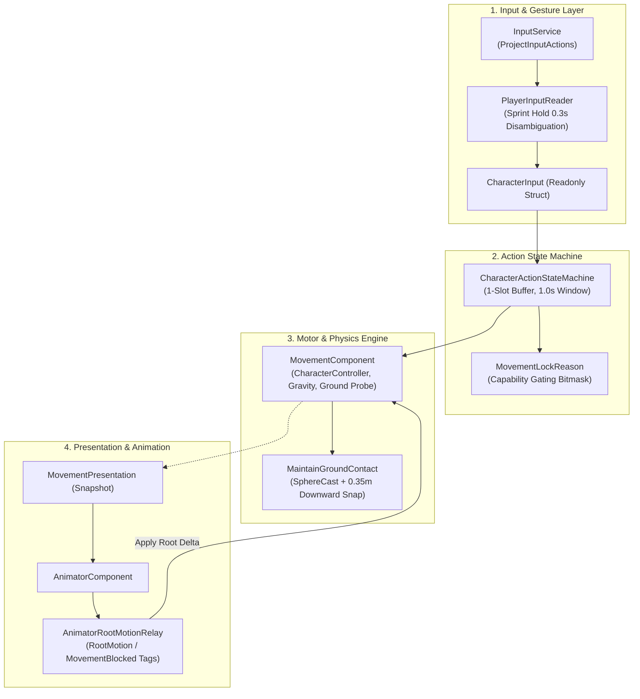

---

## 2. Input Handling & Button Buffer Engine

### 2.1 Roll vs. Sprint Disambiguation
Because **Roll** and **Sprint** share a single physical input binding (Space on keyboard / B on gamepad), [`PlayerInputReader.cs`](file:///f:/Private/SoulsLikeTemplate/Assets/Scripts/Entities/Character/Input/PlayerInputReader.cs) disambiguates user intent through hold duration:
- **Button Down**: Starts the internal timer (`_sprintHoldTime = 0`).
- **Button Held ($\ge 0.30\text{ s}$)**: Qualifies the gesture as `SprintHeld = true`.
- **Button Released ($< 0.30\text{ s}$)**: Triggers a `Roll` action on release.

### 2.2 Action Queuing & Buffer Window
- **1-Slot Action Buffer**: The state machine holds the latest actionable input in [`CharacterActionStateMachine`](file:///f:/Private/SoulsLikeTemplate/Assets/Scripts/Entities/Character/Runtime/CharacterActionStateMachine.cs).
- **Buffer Expiration**: Cached actions expire after $1.0\text{ s}$ (`BUFFER_DURATION_SECONDS`), but expiration is only evaluated during `Neutral`.
- **Queue Window Execution**: Animations tag their cancelable recovery frames with `StateMachineState.QueueCheck`. When reached, the buffered command is immediately executed.
- **Roll-to-Sprint Early Exit**: Holding Sprint during a Roll triggers `InterruptRollForSprint()` on the first frame of `QueueCheck`, allowing immediate transition to sprinting without waiting for the full roll recovery animation.

---

## 3. Locomotion: Free-Aim vs. Locked-On

| Locomotion Parameter | Free-Aim (Unlocked Movement) | Locked-On (Target-Relative Strafe) |
|---|---|---|
| **Coordinate Framework** | World-Space relative to Camera View Yaw ($\vec{V}_{\text{cam}}$). | Target-relative polar coordinates ($\vec{T} = \vec{P}_{\text{target}} - \vec{P}_{\text{player}}$). |
| **Facing Vector ($\vec{F}$)** | Smoothly rotates to match the 2D movement vector via `Mathf.SmoothDampAngle`. | Clamped directly toward the active target transform ($\vec{T}$). |
| **Velocity Vector ($\vec{V}$)** | Uniform $100\%$ speed in all $360^\circ$ directions. | Non-uniform: Forward ($100\%$), Lateral Arc ($85\%$), Backward ($72\%$). |
| **Turning Behavior** | Character rotates smoothly to face travel direction. | Character strafes laterally and backpedals with constant lock-on facing. |
| **Roll Behavior** | Directional roll aligned with input angle; triggers forward roll animation. | 4-cardinal quantized roll (`Left`, `Right`, `Forward`, `Backward`) with lateral circular orbit. |

### Speed Scaling in Locked-On Mode
In [`MovementComponent.cs`](file:///f:/Private/SoulsLikeTemplate/Assets/Scripts/Components/Movement/MovementComponent.cs):
$$\text{TargetSpeed} = \text{BaseSpeed} \cdot \left(I_x^2 \cdot 0.85 + I_y^2 \cdot (I_y \ge 0 ? 1.0 : 0.72)\right)$$

---

## 4. Movement Tiers & Speed Tuning

Authoritative values defined in [`Assets/Settings/Player/MovementData.asset`](file:///f:/Private/SoulsLikeTemplate/Assets/Settings/Player/MovementData.asset):

```
+-----------------------------------------------------------------------------+
|                           Movement Speed Metrics                            |
+-----------------------------------------------------------------------------+
| Crouch Walk : 2.0 m/s  | Stamina Drain:  0.0 pts/s | Collider Height: 1.0 m |
| Default Run : 2.0 m/s  | Stamina Drain:  0.0 pts/s | Standard Locomotion    |
| Sprint      : 6.0 m/s  | Stamina Drain: 10.0 pts/s (In Combat Only)         |
| Slide       : 8.0 m/s  | Duration     :  0.80 s    | Fixed Kinematic Action |
+-----------------------------------------------------------------------------+
```

- **Combat Sprint Stamina Drain**: Sprinting drains stamina ($10.0\text{ pts/s}$) only when [`ICombatStateNotifier`](file:///f:/Private/SoulsLikeTemplate/Assets/Scripts/Services/ICombatStateNotifier.cs) reports `CombatState.Combat`. Out of combat, sprinting incurs zero stamina cost.
- **Sprint Gating**: If stamina drops to $\le 0$, sprinting is suppressed until stamina regenerates above `CombatSprintStaminaStartThreshold = 0.0`.

---

## 5. Roll / Dodge Engine & Contextual Combat

```mermaid
flowchart TD
    Input["Dodge Key Released"] --> NeutralCheck{"Move Input Magnitude <= 0.01?"}
    NeutralCheck -->|Yes| Backstep["Trigger Backstep\n(rollDirection = Vector2.down)"]
    NeutralCheck -->|No| ModeCheck{"Movement Mode?"}
    
    ModeCheck -->|Free| FreeRoll["Rotate to World Direction\n(rollDirection = Vector2.up)"]
    ModeCheck -->|LockedOn| LockRoll["Quantize to 4 Cardinal Bins\n(Face Target, Orbit Lateral)"]
    
    FreeRoll --> RootMotion["Apply Root Motion (Planar Delta)"]
    LockRoll --> RootMotion
    Backstep --> RootMotion
    
    RootMotion --> Exit["Roll / Backstep Completes"]
    Exit --> Context["Open 1.0s Contextual Attack Window"]
    Context --> AtkCheck{"Light Attack Pressed?"}
    AtkCheck -->|Yes (from Roll)| RollAtk["AttackType.RollingLightAttack"]
    AtkCheck -->|Yes (from Backstep)| BSAtk["AttackType.BackStepAttack"]
```

### 5.1 Roll Execution
- **Stamina Cost**: `RollStaminaCost = 12.0 pts`.
- **Cooldown**: `RollCooldown = 0.20 s`.
- **Locked Lateral Orbit**: When rolling laterally in lock-on mode, `CalculateLockedRollDelta` converts root displacement into a circular arc around the target:
  $$\Delta \theta = -\text{dir}_x \cdot \frac{\Delta d}{r} \cdot \frac{180}{\pi}$$
  $$r = \|\vec{P}_{\text{player}} - \vec{P}_{\text{target}}\|$$

### 5.2 Backstep Mechanics
- **Trigger**: Sprint/Roll key released with $\|\vec{I}\| \le 0.01$ (neutral stick).
- **Direction**: Displaces linearly along $-\vec{F}$ (opposite character forward).
- **Invincibility**: $0\text{ i-frames}$ natively.
- **Contextual Attack Follow-up**: Light attack within $1.0\text{ s}$ executes `BackStepAttack`.

---

## 6. Jump Logic & Aerial Physics

```text
Grounded
   │ jump accepted (TryStartJump)
   ▼
JumpStart (v_y = sqrt(2 * JumpHeight * |Gravity|) = 6.0 m/s)
   │ vertical velocity reaches apex threshold (v_y <= 0.35 m/s)
   ▼
Airborne (Air Steering: AirAcceleration * AirControl = 2.0 m/s^2)
   │ walkable contact while descending
   ├──────────────► Landing (Impact < 12.0 m/s) ─────► Grounded
   └ hard impact ► HardLanding (Impact >= 12.0 m/s) ──► Grounded
```

### 6.1 Jump Trajectory & Phasing
- **Takeoff Velocity**: $v_y = \sqrt{2 \cdot \text{JumpHeight} \cdot |\text{Gravity}|} = \sqrt{2 \cdot 1.2 \cdot 15} \approx 6.0\text{ m/s}$.
- **Momentum Preservation**: Takeoff preserves existing horizontal ground momentum.
- **Air Control**: In-air steering is capped at $\text{AirAcceleration} \cdot \text{AirControl} = 8.0 \cdot 0.25 = 2.0\text{ m/s}^2$ via `Vector3.MoveTowards`.
- **Apex Detection**: Vertical velocity dropping below `JumpApexThreshold = 0.35 m/s` transitions state from `JumpStart` to `Airborne`.
- **Landing Severity**:
  - *Normal Landing* ($|v_y| < 12.0\text{ m/s}$): Smooth transition back to `Grounded`.
  - *Hard Landing* ($|v_y| \ge 12.0\text{ m/s}$): Sets `LandingType.Hard`, triggering heavy landing recovery.

---

## 7. Crouch Mechanics

- **Collider Height**: Entering crouch reduces `CharacterController.height` from $1.8\text{m}$ to `CrouchHeight = 1.0m` ($\approx 44.4\%$ reduction), adjusting `controller.center.y` to $0.5\text{m}$.
- **Speed Clamping**: Maximum movement speed is capped at `CrouchSpeed = 2.0m/s`.
- **Sprint Suppression**: Sprinting is blocked while crouching.

---

## 8. Ground Alignment & Stairs Logic

Handling uneven terrain, slopes, and stairs without capsule snagging relies on non-allocating SphereCast probing:
- **Probing Method**: [`MovementComponent.TryProbeGround`](file:///f:/Private/SoulsLikeTemplate/Assets/Scripts/Components/Movement/MovementComponent.cs) uses `Physics.SphereCastNonAlloc` with a preallocated 8-element hit buffer.
- **Walkable Threshold**: Surfaces with slope angle $\le \text{controller.slopeLimit}$ are flagged as walkable.
- **Downward Snapping**: [`MaintainGroundContact()`](file:///f:/Private/SoulsLikeTemplate/Assets/Scripts/Components/Movement/MovementComponent.cs) snaps the controller downward up to `GroundSnapDistance = 0.35m` while already grounded, preventing false airborne detachment on stairs.
- **Surface Normal Projection**: Velocity is projected onto the surface normal plane:
  $$\vec{V}_{\text{surface}} = \text{Normalize}\left(\vec{V} - (\vec{V} \cdot \vec{N})\vec{N}\right) \cdot \|\vec{V}\|$$
- **Fall Grace Timer**: `FallTimeout = 0.10s` provides a brief window before ungrounded state is committed when walking off edges or down steep stairs.

---

## 9. Movement Blocking & Action Locking (`MovementLockReason`)

In [`Character.cs`](file:///f:/Private/SoulsLikeTemplate/Assets/Scripts/Entities/Character/Character.cs), movement and control locks are managed through a unified bitmask enum:

```csharp
[Flags]
private enum MovementLockReason
{
    None      = 0,
    Manual    = 1 << 0,  // Script / pause lock
    Animation = 1 << 1,  // Root motion or MovementBlocked tag
    Spawn     = 1 << 2,  // Initial spawn sequence
    Parry     = 1 << 3,  // Active parry deflection window
    Critical  = 1 << 4   // Synchronized critical attack sequence
}
```

This prevents overlapping lifecycles (e.g. an animation completing during a parry or critical) from prematurely restoring player movement.

---

## 10. Design Specification vs. Project Reality

| Feature | Design Specification (Theoretical) | Live SoulsLikeTemplate C# Implementation |
|---|---|---|
| **Input Buffer** | 15–30 frame sliding queue ($250\text{--}500\text{ms}$) | 1-slot buffer with 1.0s retention & `QueueCheck` SMB evaluation |
| **Movement Locking** | Generic bitwise hex flags (`0x01, 0x02, 0x04, 0x08`) | `MovementLockReason` bitmask + Animator Tags (`"RootMotion"`, `"MovementBlocked"`) |
| **Stairs & Ground Alignment** | 2-Bone Inverse Kinematics (IK) & Pelvis adaptation | Pure kinematic downward snap (`GroundSnapDistance = 0.35m`) and `SphereCastNonAlloc` |
| **Locked Roll Direction** | 8-way directional roll with specialized variant clips | 4-cardinal quantized roll with dynamic orbital math (`CalculateLockedRollDelta`) |
| **Weight Tiers & i-Frames** | Light/Med/Heavy/Overloaded i-frame tables | Managed via `CombatDefenseComponent` and `ResolveMeleeHitCommand` checking `IsInvulnerable` |
| **Jump Lower-Body Hurtbox** | Spatial lower-body hurtbox deactivation | Standard physics arc without spatial hurtbox layer disabling |
| **Crouch Attack Aliasing** | `crouch_attack == roll_attack` | Normal light attack execution while crouched |


> 📄 **Source File End: `SoulsLikeGameVault/features/Movement Mechanics Explained.md`**


---

### File: `features/Current Jump and Roll System.md`
<a id="file-featurescurrent-jump-and-roll-systemmd"></a>

- **Relative Path:** `SoulsLikeGameVault/features/Current Jump and Roll System.md`
- **File Size:** 11,566 bytes
- **Section Category:** Locomotion & Gameplay Features

> 📄 **Source File Begin: `SoulsLikeGameVault/features/Current Jump and Roll System.md`**

---
tags:
  - unity
  - soulslike
  - locomotion
  - jump
  - roll
status: implemented
---

# Current Jump and Roll System

> Implementation note for the current SoulsLikeTemplate movement and locomotion system. This document outlines the authoritative C# runtime architecture, movement state machines, and key differences from theoretical design specifications.

## Sources of truth

- **Movement Authority**: [`Assets/Scripts/Components/Movement/MovementComponent.cs`](file:///f:/Private/SoulsLikeTemplate/Assets/Scripts/Components/Movement/MovementComponent.cs)
- **Movement Tuning**: [`Assets/Scripts/Components/Movement/MovementData.cs`](file:///f:/Private/SoulsLikeTemplate/Assets/Scripts/Components/Movement/MovementData.cs) and [`Assets/Settings/Player/MovementData.asset`](file:///f:/Private/SoulsLikeTemplate/Assets/Settings/Player/MovementData.asset)
- **Character Aggregate Facade**: [`Assets/Scripts/Entities/Character/Character.cs`](file:///f:/Private/SoulsLikeTemplate/Assets/Scripts/Entities/Character/Character.cs)
- **Input Adapter**: [`Assets/Scripts/Entities/Character/Input/PlayerInputReader.cs`](file:///f:/Private/SoulsLikeTemplate/Assets/Scripts/Entities/Character/Input/PlayerInputReader.cs)
- **Action State Machine & Buffer**: [`Assets/Scripts/Entities/Character/Runtime/CharacterActionStateMachine.cs`](file:///f:/Private/SoulsLikeTemplate/Assets/Scripts/Entities/Character/Runtime/CharacterActionStateMachine.cs) and [`CharacterAction.cs`](file:///f:/Private/SoulsLikeTemplate/Assets/Scripts/Entities/Character/Runtime/CharacterAction.cs)
- **Animation Presentation Bridge**: [`Assets/Scripts/Components/Animator/AnimatorComponent.cs`](file:///f:/Private/SoulsLikeTemplate/Assets/Scripts/Components/Animator/AnimatorComponent.cs) and [`AnimatorRootMotionRelay.cs`](file:///f:/Private/SoulsLikeTemplate/Assets/Scripts/Components/Animator/AnimatorRootMotionRelay.cs)
- **Locomotion State Definitions**: [`Assets/Scripts/Components/Movement/LocomotionState.cs`](file:///f:/Private/SoulsLikeTemplate/Assets/Scripts/Components/Movement/LocomotionState.cs)
- **Contextual Attack Follow-ups**: [`Assets/Scripts/Components/Attack/AttackComponent.cs`](file:///f:/Private/SoulsLikeTemplate/Assets/Scripts/Components/Attack/AttackComponent.cs)

### Active Runtime Controllers
The live runtime controllers are:
- `NoWeaponAnimator.controller`
- `CharacterGreatSwordAnimator.controller`
- `CharacterGreatSwordLeftHandAnimator.controller`
- `CharacterGreatSwordDualWieldAnimator.controller`

---

## Ownership and Update Flow

```mermaid
flowchart TD
    PIR["PlayerInputReader\n(Evaluates 0.3s Sprint Hold & Actions)"] -->|CharacterInput| PC["PlayerController"]
    PC -->|Tick(CharacterInput)| C["Character (Facade)"]
    C --> CASM["CharacterActionStateMachine\n(1-Slot Buffer, 1.0s Window)"]
    C -->|Move, Jump, Roll| MC["MovementComponent\n(CharacterController, Gravity, Probing)"]
    MC -.->|MovementPresentation Snapshot| C
    C -->|SetLocomotion, SetAirborneMotion| AC["AnimatorComponent"]
    AC -->|RootMotion / MovementBlocked Tags| RMR["AnimatorRootMotionRelay"]
    RMR -->|ApplyAnimationMovement| MC
    AC -->|QueueCheck / Exit SMB DTOs| C
    C -->|State Updates| CASM
```

1. `PlayerInputReader.Read` parses raw Unity Input System presses and camera yaw into a semantic [`CharacterInput`](file:///f:/Private/SoulsLikeTemplate/Assets/Scripts/Entities/Character/Runtime/CharacterInput.cs) struct.
2. `PlayerController.Tick` delivers `CharacterInput` to `Character.Tick`.
3. `CharacterActionStateMachine` holds and dispatches actions (Roll, Jump, Attack, Equipment) with a 1-slot buffer.
4. `MovementComponent` owns the `CharacterController`, horizontal and vertical velocity, gravity, ground probing, collision resolution, jump state, and roll state.
5. `MovementComponent` produces an immutable `MovementPresentation` struct snapshot each frame, which `Character` pushes to `AnimatorComponent` and `CharacterAudioComponent`.

---

## Jump State Machine

```text
Grounded
   │ jump accepted (TryStartJump)
   ▼
JumpStart
   │ vertical velocity reaches apex threshold (<= 0.35 m/s)
   ▼
Airborne
   │ walkable contact while descending
   ├──────────────► Landing (Impact < 12 m/s) ─────► Grounded
   └ hard impact ► HardLanding (Impact >= 12 m/s) ──► Grounded
```

If support is lost without a jump request (e.g. running off a ledge), the character enters `Airborne` directly after the `FallTimeout` grace window expires. A ledge fall therefore does not play the jump-start trigger.

### Jump Acceptance and Trajectory

- **Buffer Execution**: Jump is submitted as [`CharacterAction.Jump`](file:///f:/Private/SoulsLikeTemplate/Assets/Scripts/Entities/Character/Runtime/CharacterAction.cs) into `CharacterActionStateMachine`.
- **Preconditions**: `TryStartJump` requires grounded status (`Model.Grounded == true`), unblocked movement (`_movementLockReasons == MovementLockReason.None`), enough stamina (`JumpStaminaCost = 10`), and completed jump cooldown (`JumpTimeout = 0.5s`).
- **Takeoff Velocity**: Physics-calculated:
  $$v_{\text{takeoff}} = \sqrt{2 \cdot \text{JumpHeight} \cdot |\text{Gravity}|} = \sqrt{2 \cdot 1.2 \cdot 15} \approx 6.0\text{ m/s}$$
- **Momentum Preservation**: Current horizontal momentum at takeoff is preserved into the air.
- **Air Control**: Directional steering in mid-air uses `Vector3.MoveTowards` scaled by `AirAcceleration * AirControl` ($8.0 \cdot 0.25 = 2.0\text{ m/s}^2$).
- **Takeoff Probe Suppression**: Ground probing is suppressed for `JumpGroundIgnoreTime = 0.12s` or while $v_y > 0$ so the capsule does not immediately re-land on the takeoff ledge.
- **Apex Detection**: Evaluated from vertical velocity reaching `JumpApexThreshold = 0.35 m/s`, transitioning `LocomotionState.JumpStart` $\rightarrow$ `LocomotionState.Airborne`.
- **Landing Evaluation**: Requires downward vertical velocity ($v_y \le 0$), minimum airborne duration (`MinimumAirborneTime = 0.08s`), and walkable ground contact (`SphereCastNonAlloc` within slope limit).
- **Landing Severity**:
  - **Normal Landing** ($|v_y| < 12.0\text{ m/s}$): Sets `LandingType.Normal`, transitions to `Landing` and immediately recovers.
  - **Hard Landing** ($|v_y| \ge 12.0\text{ m/s}$): Sets `LandingType.Hard`, transitions to `HardLanding`.

### Current Jump Tuning (`MovementData.asset`)

| Setting | Current Value | Purpose |
|---|---:|---|
| **Jump Height** | `1.2 m` | Target vertical displacement |
| **Gravity** | `-15.0 m/s²` | Downward vertical acceleration |
| **Jump Timeout** | `0.50 s` | Cooldown timer between jump starts |
| **Air Control** | `0.25` | Authority multiplier for airborne horizontal steering |
| **Air Acceleration** | `8.0 m/s²` | Horizontal acceleration rate applied to air steering |
| **Air Rotation Smooth Time** | `0.25 s` | Facing response smoothing time while airborne |
| **Jump Ground-Ignore Time** | `0.12 s` | Takeoff ground-probe suppression window |
| **Minimum Airborne Time** | `0.08 s` | Prevents same-frame takeoff/landing glitches |
| **Jump Apex Threshold** | `0.35 m/s` | Transition velocity from `JumpStart` to `Airborne` |
| **Fall Timeout** | `0.10 s` | Grace timer before airborne state on stairs/ledges |
| **Hard Landing Min Fall Speed** | `12.0 m/s` | Impact speed threshold selecting `HardLanding` |
| **Jump Stamina Cost** | `10.0 pts` | Stamina consumed on jump takeoff |

---

## Jump Animation Contract

`AnimatorComponent` receives:
- `Grounded` (bool)
- `Jump` (trigger)
- `VerticalVelocity` (float)
- `LandingType` (int: `0 = None`, `1 = Normal`, `2 = Hard`)

The live controllers use these values to drive jump takeoff, the airborne loop, falling blend trees, normal landings, and hard landing stumbles. The animation layer acts as a presentation sink; `MovementComponent` remains the sole authority for physical state, position, and velocity.

---

## Roll and Sprint Input

In [`PlayerInputReader.cs`](file:///f:/Private/SoulsLikeTemplate/Assets/Scripts/Entities/Character/Input/PlayerInputReader.cs), `Sprint` and `Roll` share the same physical button binding:
- **Press**: Starts the hold timer (`_sprintHoldTime = 0`).
- **Hold ($\ge 0.30\text{ s}$)**: Qualifies input as `SprintHeld = true`.
- **Release ($< 0.30\text{ s}$)**: Dispatches [`CharacterAction.Roll(moveInput, cameraYaw)`](file:///f:/Private/SoulsLikeTemplate/Assets/Scripts/Entities/Character/Runtime/CharacterAction.cs).

### Roll Execution

1. **Preconditions**: Grounded status, unblocked movement, sufficient stamina (`RollStaminaCost = 12.0`), and completed `RollCooldown = 0.20s` (or open animation cancel window).
2. **Direction Resolution**:
   - **Free-Aim Mode**: Character rotates to face `worldDirection` ($T_{\text{char}} \rightarrow \vec{D}$), and `rollDirection` is set to `Vector2.up`.
   - **Locked-On Mode**: Character faces the lock-on target. `QuantizeLockedRollDirection` clamps input to 4 cardinal bins (`Left`, `Right`, `Forward`, `Backward`).
   - **Neutral Input**: If $\|\vec{I}\| \le 0.01$, triggers **Backstep** (`rollDirection = Vector2.down`).
3. **Motion Application**:
   - Rolling animations use root motion tagged `"RootMotion"`.
   - `AnimatorRootMotionRelay` captures root delta. Planar motion is extracted (`planarDelta = Vector3(dx, 0, dz)`).
   - In Locked-On lateral rolls, `CalculateLockedRollDelta` converts linear root displacement into a circular orbit around the target:
     $$\Delta \theta = -\text{dir}_x \cdot \frac{\Delta d}{r} \cdot \frac{180}{\pi}$$
   - Vertical delta is zeroed during rolls to prevent false airborne detachment.
4. **Follow-up Attacks**:
   - In [`AttackComponent.cs`](file:///f:/Private/SoulsLikeTemplate/Assets/Scripts/Components/Attack/AttackComponent.cs), rolling sets a 1.0s contextual attack window upon exit. Light attack within this window triggers `AttackType.RollingLightAttack` (or `AttackType.BackStepAttack` after a backstep).

---

## Action Buffering and Queue Windows

[`CharacterActionStateMachine`](file:///f:/Private/SoulsLikeTemplate/Assets/Scripts/Entities/Character/Runtime/CharacterActionStateMachine.cs) implements a deterministic 1-slot action buffer:
- **Buffer Retention**: 1-slot with `BUFFER_DURATION_SECONDS = 1.0s`. Latest input overwrites any previously buffered action.
- **Queue Check Window**: When an animation reaches its `QueueCheck` normalized frame (via `AnimatorStateMachine` SMB), `Character` calls `TryExecuteBufferedAction(now)`.
- **Roll-to-Sprint Interrupt**: Holding sprint while rolling triggers `InterruptRollForSprint()` as soon as the `QueueCheck` window opens, breaking into a sprint without completing full recovery.
- **Chained Action Exit Suppression**: Chained attacks or rolls set `_ignoreNextActionExit = true` so the preceding animation's `Exit` signal does not prematurely pop the state machine back to `Neutral`.

---

## Current Boundaries and Non-Implemented Systems

1. **No Spatial Lower-Body Hurtbox Toggling**: The jump currently provides no lower-body ground sweep pass-through.
2. **No Weight-Tier i-Frame Scaling**: Rolls use standard root-motion clips without equipment-load i-frame branching.
3. **No Foot Placement IK**: Ground snapping is purely kinematic via `SphereCastNonAlloc` and `GroundSnapDistance = 0.35m`.
4. **Action Buffer Capacity**: Uses a 1-slot 1.0s buffer rather than a multi-command sliding frame queue.
5. **Crouch Attack Aliasing**: Crouch does not automatically alias light attacks to rolling attacks; attacks from crouch execute normal light attacks while crouched.


> 📄 **Source File End: `SoulsLikeGameVault/features/Current Jump and Roll System.md`**


---

### File: `features/Locomotion Architecture Technical Specification.md`
<a id="file-featureslocomotion-architecture-technical-specificationmd"></a>

- **Relative Path:** `SoulsLikeGameVault/features/Locomotion Architecture Technical Specification.md`
- **File Size:** 13,832 bytes
- **Section Category:** Locomotion & Gameplay Features

> 📄 **Source File Begin: `SoulsLikeGameVault/features/Locomotion Architecture Technical Specification.md`**

---
name: locomotion-spec
description: Technical specification and system architecture for character locomotion, action buffering, root motion, ground probing, and state machine capability gating.
version: 2.0.0
---

# SYSTEM SPECIFICATION: Locomotion Architecture

> Authoritative technical specification for the Souls-like character locomotion engine, movement physics, root-motion integration, input disambiguation, and capability gating in SoulsLikeTemplate.

---

## 1. Input Engine & Buffer Management

```mermaid
flowchart TD
    Raw["ProjectInputActions (Sprint/Move/Jump/Attack)"] --> PIR["PlayerInputReader"]
    PIR --> HoldCheck{"Sprint Press Duration<br/>>= 0.30s?"}
    HoldCheck -->|Yes| Sprint["SprintHeld = true"]
    HoldCheck -->|No (on Release)| Roll["Dispatch CharacterAction.Roll"]
    
    PIR --> Struct["Build CharacterInput"]
    Struct --> CASM["CharacterActionStateMachine"]
    
    CASM --> StateCheck{"Current State == Neutral?"}
    StateCheck -->|Yes| Exec["Execute Action Immediately"]
    StateCheck -->|No| QueueCheck{"Queue Window Open<br/>(QueueCheck Signal)?"}
    QueueCheck -->|Yes| Exec
    QueueCheck -->|No| Buf["Store in 1-Slot Buffer<br/>(1.0s Retention)"]
```

### 1.1 Key-Release Action Mapping (Sprint vs. Roll)
- **Input Sharing**: Sprint and Roll share the primary dodge keybinding in [`PlayerInputReader.cs`](file:///f:/Private/SoulsLikeTemplate/Assets/Scripts/Entities/Character/Input/PlayerInputReader.cs).
- **Key-Down Event**: Starts an internal hold timer (`_sprintHoldTime = 0.0s`).
- **Hold Qualification ($t_{\text{hold}} \ge 0.30\text{ s}$)**: Qualifies the gesture as `SprintHeld = true` when directional movement input exists.
- **Key-Release Event ($t_{\text{hold}} < 0.30\text{ s}$)**: Dispatches [`CharacterAction.Roll(moveInput, cameraYaw)`](file:///f:/Private/SoulsLikeTemplate/Assets/Scripts/Entities/Character/Runtime/CharacterAction.cs).

### 1.2 Action State Machine & 1-Slot Buffer
- **Buffer Model**: [`CharacterActionStateMachine`](file:///f:/Private/SoulsLikeTemplate/Assets/Scripts/Entities/Character/Runtime/CharacterActionStateMachine.cs) implements a deterministic 1-slot buffer (`_bufferedAction`).
- **Buffer Lifetime**: `1.0s` (`BUFFER_DURATION_SECONDS`).
- **Replacement Policy**: The newest actionable command overwrites any previous entry.
- **Pruning Rule**: Buffer expiration is evaluated and pruned only when in `CharacterAction.State.Neutral`.
- **Cancel Windows**: Animation states emit `StateMachineState.QueueCheck` via `AnimatorStateMachine` StateMachineBehaviours. When received, `Character` consumes the buffered action via `TryExecuteBufferedAction(now)`.
- **Roll-to-Sprint Interrupt**: If `Sprint` is held while rolling, the state machine triggers `InterruptRollForSprint()` on the very first frame of the `QueueCheck` window, seamlessly breaking into sprint.

---

## 2. Root-Motion Centric Architecture

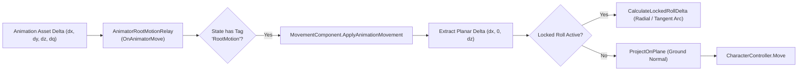

### 2.1 Motion Extraction & Tag Contracts
- **Root Motion Relay**: [`AnimatorRootMotionRelay.cs`](file:///f:/Private/SoulsLikeTemplate/Assets/Scripts/Components/Animator/AnimatorRootMotionRelay.cs) intercepts `OnAnimatorMove()`.
- **Tags**:
  - `RootMotion`: Engages root motion evaluation and passes $\Delta \vec{P}_{\text{root}}$ and $\mathbf{Q}_{\text{root}}$ to `MovementComponent`.
  - `MovementBlocked`: Blocks standard kinematic stick movement during non-root-motion recovery animations.
- **Planar Isolation**: To prevent animations from lifting the character controller and triggering false airborne falls, vertical animation displacement is zeroed during rolls and grounded states:
  $$\Delta \vec{P}_{\text{planar}} = (\Delta P_x, 0, \Delta P_z)$$
- **Velocity Decoupling**: Standard kinematic velocity integration is zeroed when `_movementBlocked` is active.

---

## 3. Movement Blocking & Capability Gating

Capability locks are unified under a bitmask enum in [`Character.cs`](file:///f:/Private/SoulsLikeTemplate/Assets/Scripts/Entities/Character/Character.cs):

```csharp
[Flags]
private enum MovementLockReason
{
    None      = 0,
    Manual    = 1 << 0,  // Script / external pause
    Animation = 1 << 1,  // Root motion or MovementBlocked tag
    Spawn     = 1 << 2,  // Initial spawn sequence
    Parry     = 1 << 3,  // Active parry animation window
    Critical  = 1 << 4   // Synchronized critical execution
}
```

### Capability Matrix

| Reason | Movement Blocked | Input Blocked | Can Guard? | Trigger / Clearing Event |
|---|---|---|---|---|
| **Manual** | `true` | `false` | `false` | External gameplay scripts |
| **Animation** | `true` | `false` | Only during `QueueCheck` in `Attack` | `AnimatorRootMotionRelay` tags |
| **Spawn** | `true` | `true` | `false` | `StateMachineName.Spawn` Exit |
| **Parry** | `true` | `true` | `false` | `StateMachineName.Parry` Exit |
| **Critical** | `true` | `true` | `false` | `CriticalAttackController.OnCompleted` |

---

## 4. Ground Alignment, Slopes & Stairs Physics

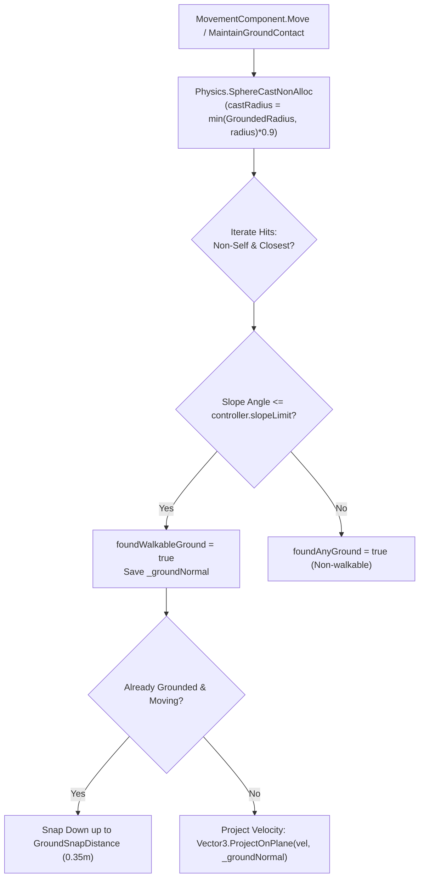

### 4.1 Ground Probing & Slope Physics
- **SphereCast Probing**: [`MovementComponent.TryProbeGround`](file:///f:/Private/SoulsLikeTemplate/Assets/Scripts/Components/Movement/MovementComponent.cs) uses `Physics.SphereCastNonAlloc` with a preallocated array (`GROUND_PROBE_HIT_CAPACITY = 8`) to detect ground geometry without allocations.
- **Cast Geometry**:
  - Origin: Transform center minus lower hemisphere offset ($y_{\text{center}} - \frac{h}{2} + r$).
  - Radius: $\min(\text{GroundedRadius}, \text{controller.radius}) \times 0.9$.
  - Layers: `Model.GroundLayers` (ignores triggers).
- **Walkable Threshold**: Tested against `Vector3.Angle(hit.normal, Vector3.up) <= controller.slopeLimit`.
- **Slope Projection**: Grounded velocity is projected onto the surface tangent:
  $$\vec{V}_{\text{projected}} = \text{Normalize}\left(\vec{V} - (\vec{V} \cdot \vec{N})\vec{N}\right) \cdot \|\vec{V}\|$$

### 4.2 Downward Ground Snapping & Stairs Traversal
- **Snap Distance**: `GroundSnapDistance = 0.35m`.
- **Stair Stepping**: When moving down stairs or slopes, `MaintainGroundContact()` performs downward correction up to $0.35\text{m}$ if the character is already grounded, preventing false airborne transitions.
- **Fall Grace Timer**: `FallTimeout = 0.10s`. If ground support is temporarily lost while descending geometry, the character remains grounded until the timer expires.
- **Note on Foot IK**: The current template uses pure kinematic capsule snapping; 2-bone Foot IK is not active in the project.

---

## 5. Locomotion Modes: Free-Aim vs. Target Lock-On

### 5.1 Free-Aim Mode (Unlocked)
- **Coordinate Space**: World space relative to Camera Yaw:
  $$\vec{D}_{\text{world}} = \text{Quaternion.Euler}(0, \theta_{\text{cam}}, 0) \cdot (I_x, 0, I_y)$$
- **Facing Alignment**: Character yaw rotates smoothly toward movement travel direction using `Mathf.SmoothDampAngle`:
  - Grounded Smooth Time: `RotationSmoothTime = 0.12s`
  - Airborne Smooth Time: `AirRotationSmoothTime = 0.25s`
- **Speed Multiplier**: Uniform $100\%$ speed in all $360^\circ$ directions.

### 5.2 Target Lock-On Mode
- **Coordinate Space**: Target-relative local axes (Forward $\rightarrow$ Target, Right $\rightarrow \text{Vector3.Cross}(\text{Up}, \text{Forward})$).
- **Facing Vector**: Character forward is clamped directly to face the locked target:
  $$\vec{F} = \text{Normalize}(\vec{P}_{\text{target}} - \vec{P}_{\text{character}})$$
- **Directional Speed Modifiers**:
  $$\text{TargetSpeed} = \text{BaseSpeed} \cdot \left(I_x^2 \cdot 0.85 + I_y^2 \cdot (I_y \ge 0 ? 1.0 : 0.72)\right)$$
  - Forward ($0^\circ$): $100\%$ speed ($1.00\times$)
  - Lateral Arc ($\pm 90^\circ$): $85\%$ speed ($0.85\times$)
  - Backward ($180^\circ$): $72\%$ speed ($0.72\times$)

---

## 6. Movement Tiers & Tuning Values

Values authored in [`Assets/Settings/Player/MovementData.asset`](file:///f:/Private/SoulsLikeTemplate/Assets/Settings/Player/MovementData.asset):

| Movement Tier | Speed (m/s) | Stamina Cost / Drain | Stealth Context |
|---|---:|---|---|
| **Crouch Walk** | `2.0 m/s` | `0.0 pts/s` | Reduced collider height (`1.0m`), low profile |
| **Jog / Run (Default Stick)** | `2.0 m/s` | `0.0 pts/s` | Standard locomotion |
| **Sprint (Hold Space)** | `6.0 m/s` | In Combat: `10.0 pts/s`<br/>Out of Combat: `0.0 pts/s` | Highest speed; suppressed while crouched |
| **Slide** | `8.0 m/s` | `0.0 pts` | Fixed duration `0.80s` |

---

## 7. Roll, Dodge & Backstep Engine

### 7.1 Roll Mechanics
- **Stamina Cost**: `RollStaminaCost = 12.0 pts` (Requires `Stamina > RollStaminaStartThreshold = 0.0`).
- **Cooldown**: `RollCooldown = 0.20s`.
- **Direction Resolution**:
  - **Free-Aim**: Faces travel direction immediately; triggers forward roll animation clip.
  - **Locked-On**: Clamps input to 4 cardinal directions (`Left`, `Right`, `Forward`, `Backward`).
  - **Locked Lateral Orbit**: Translates along a circular arc around the target:
    $$\Delta \theta = -\text{dir}_x \cdot \frac{\Delta d}{r} \cdot \frac{180}{\pi}$$
- **Contextual Follow-up**: Rolling opens a 1.0s window upon completion; pressing light attack triggers `RollingLightAttack`.

### 7.2 Backstep Mechanics
- **Trigger**: Sprint/Roll key released with $\|\vec{I}\| \le 0.01$ (neutral stick).
- **Direction**: Displaces linearly along $-\vec{F}$ (opposite current facing).
- **Invincibility**: $0\text{ i-frames}$ natively.
- **Contextual Follow-up**: Light attack within 1.0s triggers `BackStepAttack`.

---

## 8. Jump Logic & Aerial Physics

### 8.1 Trajectory & Phases
1. **Takeoff**: `TryStartJump` checks grounded state, stamina (`JumpStaminaCost = 10.0`), and cooldown (`JumpTimeout = 0.50s`).
   $$v_y = \sqrt{2 \cdot \text{JumpHeight} \cdot |\text{Gravity}|} = \sqrt{2 \cdot 1.2 \cdot 15} \approx 6.0\text{ m/s}$$
2. **Ascent (`JumpStart`)**: Horizontal takeoff momentum is preserved. Ground probing is suppressed for `JumpGroundIgnoreTime = 0.12s`.
3. **Apex (`Airborne`)**: When vertical velocity drops to $\le \text{JumpApexThreshold} = 0.35\text{ m/s}$, state machine transitions to `LocomotionState.Airborne`.
4. **Air Steering**: Directional control is modulated via `Vector3.MoveTowards`:
   $$\Delta \vec{V}_{\text{air}} = \text{AirAcceleration} \cdot \text{AirControl} \cdot \Delta t = 8.0 \cdot 0.25 \cdot \Delta t = 2.0 \cdot \Delta t$$
5. **Landing**: Requires $v_y \le 0$, airborne duration $\ge 0.08\text{s}$, and walkable ground contact:
   - **Normal Landing** ($|v_y| < 12.0\text{ m/s}$): Sets `LandingType.Normal`, returns to `Grounded`.
   - **Hard Landing** ($|v_y| \ge 12.0\text{ m/s}$): Sets `LandingType.Hard`, triggers heavy landing recovery.

---

## 9. Crouch Architecture

- **Capsule Adjustment**: Entering crouch modifies the `CharacterController` directly:
  - Height: Default ($1.8\text{m}$) $\rightarrow$ `CrouchHeight = 1.0m` ($\approx 44.4\%$ reduction).
  - Center: $Y = \text{CrouchHeight} \times 0.5 = 0.5\text{m}$.
- **Speed Clamping**: Limits maximum speed to `CrouchSpeed = 2.0m/s`.
- **Sprint Suppression**: Sprinting is blocked while crouching.

---

## 10. Implementation Mapping & Deviations Summary

| Design Feature | Theoretical FromSoftware Specification | SoulsLikeTemplate C# Reality |
|---|---|---|
| **Input Buffer** | 15–30 frame sliding queue ($250\text{--}500\text{ms}$) | 1-slot buffer with 1.0s retention in [`CharacterActionStateMachine`](file:///f:/Private/SoulsLikeTemplate/Assets/Scripts/Entities/Character/Runtime/CharacterActionStateMachine.cs) |
| **Movement Locking** | Bitwise hex flags (`0x01, 0x02, 0x04, 0x08`) | [`MovementLockReason`](file:///f:/Private/SoulsLikeTemplate/Assets/Scripts/Entities/Character/Character.cs) bitmask + Animator Tags (`"RootMotion"`, `"MovementBlocked"`) |
| **Stairs & Ground Alignment** | 2-Bone Inverse Kinematics (IK) & Pelvis adaptation | Pure kinematic downward snap ([`GroundSnapDistance = 0.35m`](file:///f:/Private/SoulsLikeTemplate/Assets/Scripts/Components/Movement/MovementData.cs)) and `SphereCastNonAlloc` |
| **Roll Direction (Locked)** | 8-directional roll with variant clips | 4-cardinal quantized roll with dynamic orbital math (`CalculateLockedRollDelta`) |
| **Weight Tiers & i-Frames** | Light/Med/Heavy/Overloaded i-frame tables | Not yet segmented by weight load; invulnerability managed by [`CombatDefenseComponent`](file:///f:/Private/SoulsLikeTemplate/Assets/Scripts/Entities/Combat/CombatDefenseComponent.cs) |
| **Jump Lower-Body Hurtbox** | Spatial lower-body hurtbox deactivation | Standard physics arc without spatial hurtbox layer disabling |
| **Crouch Attack Aliasing** | `crouch_attack == roll_attack` | Normal light attack execution while crouched |


> 📄 **Source File End: `SoulsLikeGameVault/features/Locomotion Architecture Technical Specification.md`**


---

### File: `features/Advanced Locomotion Architecture Prompt Specification.md`
<a id="file-featuresadvanced-locomotion-architecture-prompt-specificationmd"></a>

- **Relative Path:** `SoulsLikeGameVault/features/Advanced Locomotion Architecture Prompt Specification.md`
- **File Size:** 11,187 bytes
- **Section Category:** Locomotion & Gameplay Features

> 📄 **Source File Begin: `SoulsLikeGameVault/features/Advanced Locomotion Architecture Prompt Specification.md`**

---
name: advanced-locomotion-prompt-spec
description: System prompt specification and mathematical reference for Souls-like character locomotion architecture, with implementation mapping to SoulsLikeTemplate C# systems.
version: 2.0.0
---

# Advanced Locomotion Architecture Prompt Specification

> **SYSTEM PROMPT & TECHNICAL REFERENCE**: Game Physics & Animation Systems for FromSoftware-style Action RPG Locomotion.

This document serves as both a high-fidelity system prompt specification for AI reasoning and an architectural reference comparing theoretical FromSoftware mechanics with the live C# implementation in **SoulsLikeTemplate**.

---

## 1. Input Engine & Buffer Management

### 1.1 Key-Release Action Mapping (Sprint vs. Roll)
- **Key-Down Event**: Starts an internal timer ($t_{\text{hold}}$).
- **Key-Up Event ($t_{\text{hold}} < T_{\text{threshold}}$)**: Triggers the `Roll` state transition on key release.
  - Threshold: $T_{\text{threshold}} = 0.30\text{ s}$ ($18\text{ frames}$ at $60\text{ FPS}$).
- **Hold Event ($t_{\text{hold}} \ge T_{\text{threshold}}$)**: Suppresses the Roll registration and transitions locomotion directly into `Sprint`.

### 1.2 Input Buffer Model
- **Buffer Architecture**: Deterministic 1-slot action buffer holding the latest user intent.
- **Buffer Retention**: $1.0\text{ s}$ lifetime (`BUFFER_DURATION_SECONDS`).
- **Behavior**: Any action command (`Attack`, `Roll`, `Jump`, `Equipment`) received during non-cancelable action states is cached.
- **Cancel Evaluation**: The queued action executes on frame 1 of the earliest cancel window (when the `StateMachineState.QueueCheck` signal is received from an active StateMachineBehaviour).
- **Roll-to-Sprint Interrupt**: Holding Sprint during a Roll breaks out of the roll animation on the first frame of `QueueCheck`.

---

## 2. Root-Motion Centric Locomotion Architecture

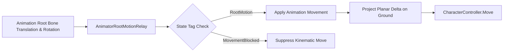

### 2.1 Motion Extraction & Blending
- **Root Motion Primacy**: Velocity ($\vec{V}$) and yaw rotation ($\Delta \theta$) are extracted directly from the root bone's translation vector ($\vec{\Delta P}_{\text{root}}$) and rotation quaternion ($\mathbf{Q}_{\text{root}}$) frame-by-frame:
  $$\vec{V}_{\text{frame}} = \frac{\vec{\Delta P}_{\text{root}}}{\Delta t}, \quad \Delta \theta_{\text{frame}} = \text{Yaw}(\mathbf{Q}_{\text{root}})$$
- **Velocity Decoupling**: Kinematic controller acceleration is zeroed out during root-motion driven actions (attacks, rolls, staggers). The capsule translation is governed strictly by the keyframed delta in the animation asset.
- **Planar Isolation**: Vertical root-motion translation is filtered during grounded locomotion and rolls to prevent false airborne detachment:
  $$\vec{\Delta P}_{\text{planar}} = (\Delta P_x, 0, \Delta P_z)$$

---

## 3. Movement Blocking & Action Locking System

The movement system exposes an Action State Locking API driven by bitwise flags in [`Character.cs`](file:///f:/Private/SoulsLikeTemplate/Assets/Scripts/Entities/Character/Character.cs):

### 3.1 Movement Lock State Flags (`MovementLockReason`)
- `0x01` (`Manual`): External script pause or explicit movement freeze.
- `0x02` (`Animation`): Root motion active or `"MovementBlocked"` tag active on current animator state.
- `0x04` (`Spawn`): Initial character spawn sequence lock.
- `0x08` (`Parry`): Active parry deflection window lock.
- `0x10` (`Critical`): Synchronized riposte / backstab execution lock.

### 3.2 Action State Behaviors
- **Attacks & Weapon Skills**: Sets `MovementLockReason.Animation`. Player cannot steer manually; positional lunge or step-forward is governed strictly by the attack clip's root displacement.
- **Hit Reactions & Stagger**: Hard lock on user inputs. Velocity is driven by the stagger recoil root motion animation curve corresponding to the impact direction.
- **Roll / Backstep**: Direction vector is locked at Frame 0 based on input angle. Transitions to cancelable recovery window when `QueueCheck` is reached.
- **Landing Recovery**:
  - *Normal Fall* ($|v_y| < 12.0\text{ m/s}$): Smooth blending into grounded locomotion without movement lock.
  - *Hard Landing* ($|v_y| \ge 12.0\text{ m/s}$): Selects `LandingType.Hard`, playing heavy landing recovery stumble.

---

## 4. Ground Alignment & Stairs Logic

Handling uneven geometry and stairways without capsule snagging relies on non-allocating SphereCast probing and surface normal projection.

```mermaid
flowchart TD
    Cast["Physics.SphereCastNonAlloc\n(Radius = 0.9 * controller.radius)"] --> Filter["Filter Hits by Layer & Slope Limit"]
    Filter --> Walkable{"Walkable Ground Hit?"}
    Walkable -->|Yes| Ground["Model.Grounded = true<br/>Save _groundNormal"]
    Walkable -->|No| Air["Model.Grounded = false<br/>(After FallTimeout 0.10s)"]
    Ground --> Snap["Snap Downward up to GroundSnapDistance (0.35m)"]
    Ground --> Proj["Project Velocity onto Surface Normal Plane"]
```

### 4.1 Probing & Downward Snapping
- **SphereCast NonAlloc**: Probes ground geometry using `Physics.SphereCastNonAlloc` with a preallocated 8-hit buffer.
- **Slope Angle Limits**: Slopes exceeding `CharacterController.slopeLimit` are rejected as non-walkable.
- **Ground Snapping**: When moving downward over slopes or stair treads, [`MaintainGroundContact()`](file:///f:/Private/SoulsLikeTemplate/Assets/Scripts/Components/Movement/MovementComponent.cs) pulls the capsule down up to `GroundSnapDistance = 0.35m` to prevent bouncing or false airborne detachment.
- **Surface Normal Projection**:
  $$\vec{V}_{\text{surface}} = \text{Normalize}\left(\vec{V} - (\vec{V} \cdot \vec{N})\vec{N}\right) \cdot \|\vec{V}\|$$

---

## 5. Locomotion Modes: Free-Aim vs. Target Lock-On

### 5.1 Unlocked Locomotion (Free-Aim)
- **Coordinate System**: World-Space relative to Camera View Vector $\vec{V}_{\text{cam}}$.
- **Facing Vector ($\vec{F}$)**: Rotates smoothly to match the 2D movement vector using `Mathf.SmoothDampAngle` (`RotationSmoothTime = 0.12s`).
- **Velocity Vector ($\vec{V}$)**: Uniform $100\%$ speed scalar in all $360^\circ$ directions.

### 5.2 Target Lock-On Locomotion
- **Coordinate System**: Target-relative local axes.
- **Facing Vector ($\vec{F}$)**: Fixed directly toward the locked target transform $\vec{T}$.
- **Velocity Scaling**:
  - Forward ($0^\circ$): $100\%$ base velocity ($1.00\times$).
  - Lateral Arc ($\pm 90^\circ$): $85\%$ base velocity ($0.85\times$).
  - Backward ($180^\circ$): $72\%$ base velocity ($0.72\times$).
- **Orbital Rolls**: Locked lateral rolls orbit circularly around the locked target:
  $$\Delta \theta = -\text{dir}_x \cdot \frac{\Delta d}{r} \cdot \frac{180}{\pi}$$

---

## 6. Movement Tiers & Velocity Metrics

Authoritative values from [`Assets/Settings/Player/MovementData.asset`](file:///f:/Private/SoulsLikeTemplate/Assets/Settings/Player/MovementData.asset):

- **Crouch Walk**: $2.0\text{ m/s}$ | Stamina: $0.0\text{ pts/s}$ | Capsule Height: $1.0\text{ m}$
- **Run (Default Stick)**: $2.0\text{ m/s}$ | Stamina: $0.0\text{ pts/s}$ | Standard locomotion
- **Sprint (Hold Space)**: $6.0\text{ m/s}$ | Stamina: Combat $10.0\text{ pts/s}$ / Non-Combat $0.0\text{ pts/s}$
- **Slide**: $8.0\text{ m/s}$ | Duration: $0.80\text{ s}$

---

## 7. Roll / Dodge Engine & Contextual Combat

### 7.1 Roll Mechanics
- **Stamina Cost**: `RollStaminaCost = 12.0 pts`.
- **Cooldown**: `RollCooldown = 0.20 s`.
- **Directional Modes**:
  - *Free-Aim*: Rotates character to `worldDirection`, triggering forward roll animation.
  - *Target Lock-On*: Direction quantized into 4 cardinal bins (`Left`, `Right`, `Forward`, `Backward`) with lateral orbital displacement.
- **Backstep**: Triggered when Space is released with stick magnitude $\|\vec{I}\| \le 0.01$.

### 7.2 Contextual Attack Follow-ups
In [`AttackComponent.cs`](file:///f:/Private/SoulsLikeTemplate/Assets/Scripts/Components/Attack/AttackComponent.cs):
- Roll completion sets a $1.0\text{ s}$ contextual attack timer (`CONTEXTUAL_ATTACK_WINDOW`).
- Light attack during or immediately after roll $\rightarrow$ `AttackType.RollingLightAttack`.
- Light attack during or immediately after backstep $\rightarrow$ `AttackType.BackStepAttack`.
- Light attack while sprinting $\rightarrow$ `AttackType.SprintingAttack`.

---

## 8. Jump Logic & Aerial Physics

### 8.1 Aerial Physics
- **Takeoff Impulse**: $v_y = \sqrt{2 \cdot \text{JumpHeight} \cdot |\text{Gravity}|} = \sqrt{2 \cdot 1.2 \cdot 15} \approx 6.0\text{ m/s}$.
- **Horizontal Preservation**: Preserves ground velocity vector at takeoff.
- **Air Steering Authority**: Directional steering accelerated at $\text{AirAcceleration} \cdot \text{AirControl} = 8.0 \cdot 0.25 = 2.0\text{ m/s}^2$.
- **Apex Transition**: Vertical velocity dropping below `JumpApexThreshold = 0.35 m/s` transitions state from `JumpStart` to `Airborne`.

---

## 9. Template Realization & Architecture Mapping

| Theoretical FromSoftware Concept | SoulsLikeTemplate C# Implementation | File Location |
|---|---|---|
| Sliding Input Buffer (15–30 frames) | 1-slot buffer with 1.0s retention & `QueueCheck` SMB evaluation | [`CharacterActionStateMachine.cs`](file:///f:/Private/SoulsLikeTemplate/Assets/Scripts/Entities/Character/Runtime/CharacterActionStateMachine.cs) |
| Bitwise Movement Lock Flags | `MovementLockReason` enum bitmask (Manual, Animation, Spawn, Parry, Critical) | [`Character.cs`](file:///f:/Private/SoulsLikeTemplate/Assets/Scripts/Entities/Character/Character.cs) |
| Root Motion Interception | `OnAnimatorMove` relay filtering `"RootMotion"` and `"MovementBlocked"` tags | [`AnimatorRootMotionRelay.cs`](file:///f:/Private/SoulsLikeTemplate/Assets/Scripts/Components/Animator/AnimatorRootMotionRelay.cs) |
| Foot Placement IK & Pelvis Adaptation | Kinematic SphereCast non-alloc ground probing and downward snap ($0.35\text{m}$) | [`MovementComponent.cs`](file:///f:/Private/SoulsLikeTemplate/Assets/Scripts/Components/Movement/MovementComponent.cs) |
| Lock-On Orbit Trajectory | `CalculateLockedRollDelta` computing circular angular displacement | [`MovementComponent.cs`](file:///f:/Private/SoulsLikeTemplate/Assets/Scripts/Components/Movement/MovementComponent.cs) |
| Contextual Roll/Backstep Attacks | `AttackComponent` observing `StateMachineName` exit events with 1.0s window | [`AttackComponent.cs`](file:///f:/Private/SoulsLikeTemplate/Assets/Scripts/Components/Attack/AttackComponent.cs) |
| Combat Sprint Stamina Drain | `ICombatStateNotifier` checking `CombatState.Combat` draining $10.0\text{ pts/s}$ | [`Character.cs`](file:///f:/Private/SoulsLikeTemplate/Assets/Scripts/Entities/Character/Character.cs) |
| Invulnerability / i-Frames | `CombatDefenseComponent` and `ResolveMeleeHitCommand` checking `IsInvulnerable` | [`CombatDefenseComponent.cs`](file:///f:/Private/SoulsLikeTemplate/Assets/Scripts/Entities/Combat/CombatDefenseComponent.cs) |


> 📄 **Source File End: `SoulsLikeGameVault/features/Advanced Locomotion Architecture Prompt Specification.md`**


---

### File: `features/System Specification - Souls-like Locomotion & Camera System.md`
<a id="file-featuressystem-specification---souls-like-locomotion-camera-systemmd"></a>

- **Relative Path:** `SoulsLikeGameVault/features/System Specification - Souls-like Locomotion & Camera System.md`
- **File Size:** 8,153 bytes
- **Section Category:** Locomotion & Gameplay Features

> 📄 **Source File Begin: `SoulsLikeGameVault/features/System Specification - Souls-like Locomotion & Camera System.md`**

---
name: locomotion-camera-system-spec
description: Technical system specification for 3rd-person character locomotion, Cinemachine 3 camera controller, and targeting service in SoulsLikeTemplate.
version: 2.0.0
---

# System Specification: Souls-like Locomotion & Camera System

> Authoritative specification for the 3rd-person character locomotion, Cinemachine 3 camera controller, and target-lock tracking system in SoulsLikeTemplate.

---

## 1. System Overview & Architecture

The system coordinates between three primary components:
- **`CameraService`** ([`Assets/Scripts/Services/CameraService/CameraService.cs`](file:///f:/Private/SoulsLikeTemplate/Assets/Scripts/Services/CameraService/CameraService.cs)): Manages Cinemachine 3 virtual cameras, rig blending, look pitch/yaw, vertical follow smoothing with airborne lag, and target look-at tracking.
- **`TargetingService`** ([`Assets/Scripts/Services/Targeting/TargetingService.cs`](file:///f:/Private/SoulsLikeTemplate/Assets/Services/Targeting/TargetingService.cs)): Manages spatial target acquisition and validity checking across `EntityType.Enemy` actors within $20.0\text{m}$.
- **`MovementComponent`** ([`Assets/Scripts/Components/Movement/MovementComponent.cs`](file:///f:/Private/SoulsLikeTemplate/Assets/Scripts/Components/Movement/MovementComponent.cs)): Governs motor physics, ground probing, directional facing, and speed scaling in both `Free` and `LockedOn` modes.

```mermaid
flowchart TD
    subgraph Target_System["Targeting & Input"]
        Input["Player Input (LockOn, Look, Move)"] --> PC["PlayerController"]
        PC --> TS["TargetingService\n(Acquires Entity within 20m)"]
    end

    subgraph Camera_System["Camera Control (CameraService)"]
        TS -->|SetLockOnTarget| CS["CameraService"]
        CS --> CC["CinemachineCamera\n(CinemachineThirdPersonFollow)"]
        CS --> RigBlend["DOTween Rig Blend\n(FreeRigProfile <-> HumanoidLockProfile)"]
        CS --> FollowLag["Vertical Follow Target\n(Grounded, Jump, Fall Lag Filters)"]
    end

    subgraph Movement_System["Locomotion Control (MovementComponent)"]
        TS -->|SetLockOnTarget| MC["MovementComponent"]
        MC --> ModeCheck{"MovementMode?"}
        ModeCheck -->|Free| FreeMove["Face Travel Direction\n360° Uniform 100% Speed"]
        ModeCheck -->|LockedOn| LockMove["Face Target Transform\nForward 1.0x, Lateral 0.85x, Back 0.72x"]
    end
```

---

## 2. Unlocked Mode (Free Orbit)

### 2.1 Camera Controller Dynamics
- **Control Mode**: Free Orbit driven by manual mouse / stick input.
- **Input Sensitivity**:
  - Pointer (Mouse): `MouseYawDegreesPerPixel = 0.15°/px`, `MousePitchDegreesPerPixel = 0.15°/px`.
  - Gamepad Stick: `StickYawDegreesPerSecond = 180°/s`, `StickPitchDegreesPerSecond = 135°/s`.
- **Clamping**: Clamped between `BottomClamp = -80.0°` and `TopClamp = 80.0°`.
- **Shoulder Angle Toggle**: `SwitchAngle()` triggers DOTween tweening of `CameraSide` ($0.0 \leftrightarrow 1.0$) with `SwitchAngleDuration = 0.25s`.
- **Collision Handling**: Cinemachine Third Person Follow damping and collision raycasts.

### 2.2 Character Orientation & Facing
- **Heading Determination**: Character forward vector ($\vec{F}$) rotates smoothly toward `worldDirection` (derived from camera yaw $\theta_{\text{cam}}$ and 2D joystick input $\vec{I}$).
- **Smoothing Response**:
  - Grounded: `Mathf.SmoothDampAngle` with `RotationSmoothTime = 0.12s`.
  - Airborne: `Mathf.SmoothDampAngle` with `AirRotationSmoothTime = 0.25s`.
- **Backwards Input**: Pulling backward causes the character to turn around and run toward the camera ($100\%$ speed).
- **Strafing**: Disabled in Free Mode.

### 2.3 Speed Multipliers & Evade
- **Forward / Backward / Lateral**: Uniform $100\%$ baseline velocity ($2.0\text{ m/s}$ run, $6.0\text{ m/s}$ sprint).
- **Roll / Dodge**: 8-directional roll relative to camera direction. Character transform immediately snaps forward to match travel direction on Frame 0.

---

## 3. Locked-On Mode (Target Anchor)

### 3.1 Camera Dynamics & Target Tracking
- **Control Mode**: Target Anchor.
- **Rig Profile Blend**: Transitioning into Lock-On triggers a DOTween blend (`LockRigBlendDuration = 0.30s`) from `_freeRigProfile` to `HumanoidLockProfile` (ShoulderOffset: `(0.5, 0.0, 0.0)`, ArmLength: `0.0`, Distance: `3.8m`, FOV: `48.0°`).
- **Dynamic Elevation & Pitch Adjustment**: Pitch angles dynamically based on target height delta and distance:
  $$\text{Elevation} = \text{atan2}(y_{\text{target}} - y_{\text{player}}, \max(d_{\text{planar}}, \text{LockMinPitchDistance})) \cdot \frac{180}{\pi}$$
  $$\text{Pitch} = \text{Clamp}(\text{LockBasePitch} - \text{Elevation} \cdot \text{Influence}, \text{MinPitch}, \text{MaxPitch})$$
  - `LockBasePitch`: $8.0^\circ$
  - `MinPitch`: $-40.0^\circ$, `MaxPitch`: $60.0^\circ$
- **Close-Range Heading Stability**: To prevent camera whipping when walking directly beneath or past an enemy, `_holdingCloseHeading` engages when distance $\le 1.2\text{m}$ (`LockHeadingHoldDistance`) and releases when distance $\ge 1.8\text{m}$ (`LockHeadingReleaseDistance`).
- **Look-At Smoothing**: `_smoothedFocusOffset` is damped via `Vector3.SmoothDamp` with `LockTargetSmoothTime = 0.15s` during initial target acquisition.

### 3.2 Character Orientation & Movement Dynamics
- **Facing Vector ($\vec{F}$)**: Continuously clamped directly toward the active target transform:
  $$\vec{F} = \text{Normalize}(\vec{P}_{\text{target}} - \vec{P}_{\text{player}})$$
- **Strafing Matrix**: Active. Left/right input forces lateral strafing while maintaining lock-on facing.
- **Directional Speed Scaling**:
  - Forward ($0^\circ$): $100\%$ speed ($1.00\times$).
  - Lateral Arc ($\pm 90^\circ$): $85\%$ speed ($0.85\times$).
  - Backward ($180^\circ$): $72\%$ speed ($0.72\times$).
- **Orbital Roll Mechanics**:
  - Input is quantized into 4 cardinal bins (`Left`, `Right`, `Forward`, `Backward`).
  - Lateral rolls calculate circular displacement around the target:
    $$\Delta \theta = -\text{dir}_x \cdot \frac{\Delta d}{r} \cdot \frac{180}{\pi}$$

---

## 4. Camera Follow Dynamics & Vertical Smoothing

To keep jumping and landing readable without jarring camera snaps, [`CameraService.UpdateFollowTarget`](file:///f:/Private/SoulsLikeTemplate/Assets/Scripts/Services/CameraService/CameraService.cs) implements vertical lag filtering:

| State | Smooth Time | Max Speed | Vertical Lag Window |
|---|---:|---:|---|
| **Grounded** | `0.05 s` | `20.0 m/s` | `sourcePosition.y` (No lag) |
| **Jump Ascent** ($v_y \ge 0$) | `0.20 s` | `10.0 m/s` | Clamped to $y_{\text{source}} - 0.50\text{m}$ (`AirborneRiseLag`) |
| **Falling** ($v_y < 0$) | `0.10 s` | `25.0 m/s` | Clamped to $y_{\text{source}} + 0.75\text{m}$ (`AirborneFallLag`) |
| **Long Fall Catchup** | `0.03 s` | `40.0 m/s` | Engages linearly over `LongFallCatchupDistance = 8.0m` |

---

## 5. Transition Logic & Break Conditions

### 5.1 Lock-On Acquisition (`OnLockOnButtonPressed`)
1. [`PlayerController.HandleLockOnInput`](file:///f:/Private/SoulsLikeTemplate/Assets/Scripts/Entities/Character/PlayerController.cs) invokes [`TargetingService.TryAcquireTarget`](file:///f:/Private/SoulsLikeTemplate/Assets/Scripts/Services/Targeting/TargetingService.cs).
2. `TargetingService` iterates all registered `EntityType.Enemy` candidates within `MAX_LOCK_ON_DISTANCE = 20.0m` and selects the closest alive entity.
3. **On Success**:
   - `Character.SetLockOnTarget(true, entityId)` engages locked movement and target-facing orientation.
   - `CameraService.SetLockOnTarget(entityId)` initiates rig blend and look-at tracking.
4. **On Failure (No Target in Range)**:
   - `CameraService.RecenterCamera()` recenters camera yaw and pitch directly behind the character forward heading.

### 5.2 Break Conditions
Lock-on is automatically cleared when:
- **Manual Toggle**: User presses Lock-On button while locked.
- **Target Death**: Target `TargetingSnapshot.IsAlive == false` or health reaches 0.
- **Out of Range**: Distance between player and target exceeds `MAX_LOCK_ON_DISTANCE = 20.0m`.
- **Game State Change**: Transitions to `GameState.Ended` or `GameState.OnGraceSit`.


> 📄 **Source File End: `SoulsLikeGameVault/features/System Specification - Souls-like Locomotion & Camera System.md`**


---

### File: `features/Technical Specification - Roll & Backstep Vectoring Logic.md`
<a id="file-featurestechnical-specification---roll-backstep-vectoring-logicmd"></a>

- **Relative Path:** `SoulsLikeGameVault/features/Technical Specification - Roll & Backstep Vectoring Logic.md`
- **File Size:** 8,800 bytes
- **Section Category:** Locomotion & Gameplay Features

> 📄 **Source File Begin: `SoulsLikeGameVault/features/Technical Specification - Roll & Backstep Vectoring Logic.md`**

---
name: roll-backstep-spec
description: Technical specification for dodge roll, backstep vectoring, orbital mathematics, and contextual attack follow-ups in SoulsLikeTemplate.
version: 2.0.0
---

# TECHNICAL SPECIFICATION: Roll & Backstep Vectoring Logic

> Mathematical and architectural specification for dodge roll vectoring, backstep execution, orbital kinematics, and contextual attack transitions in SoulsLikeTemplate.

---

## 1. Dodge Roll Directional Logic

```mermaid
flowchart TD
    Trigger["Dodge Request (Space Released < 0.3s)"] --> InputCheck{"Stick Input Magnitude<br/>||I|| <= 0.01?"}
    InputCheck -->|Yes| Backstep["Backstep Execution\n(rollDirection = Vector2.down)"]
    InputCheck -->|No| ModeCheck{"Locomotion Mode?"}
    
    ModeCheck -->|Free Mode| Free["Free-Aim Roll\n1. Rotate transform to worldDirection\n2. rollDirection = Vector2.up\n3. Apply Planar Root Motion"]
    ModeCheck -->|Locked-On| Lock["Locked-On Roll\n1. Quantize to Cardinal Direction\n2. Face Target Transform\n3. Calculate Locked Orbit Delta"]
```

### 1.1 Free-Aim Mode (Unlocked)
- **Vector Evaluation**: The displacement vector ($\vec{D}$) is derived from the camera-relative 2D joystick input ($\vec{I}$) and camera yaw ($\theta_{\text{cam}}$):
  $$\vec{D}_{\text{world}} = \text{Quaternion.Euler}(0, \theta_{\text{cam}}, 0) \cdot \begin{pmatrix} I_x \\ 0 \\ I_y \end{pmatrix}$$
- **Orientation Matching**: The character transform ($T_{\text{char}}$) immediately rotates its forward vector ($\vec{F}$) to align with $\vec{D}_{\text{world}}$ on Frame 0 of roll initialization:
  $$T_{\text{char}}.\text{rotation} = \text{Quaternion.LookRotation}(\vec{D}_{\text{world}}, \text{Vector3.up})$$
- **Animation Parameter**: Sets `rollDirection = Vector2.up`, playing the standard forward roll animation clip while root motion drives the displacement along $\vec{D}_{\text{world}}$.

### 1.2 Target Lock-On Mode
- **Axis Quantization**: While locked on, continuous joystick input is quantized into discrete cardinal axes in [`MovementComponent.QuantizeLockedRollDirection`](file:///f:/Private/SoulsLikeTemplate/Assets/Scripts/Components/Movement/MovementComponent.cs):
  $$\vec{D}_{\text{quantized}} = \begin{cases} 
  (\text{sign}(I_x), 0) & \text{if } |I_x| > |I_y| \\
  (0, \text{sign}(I_y)) & \text{otherwise}
  \end{cases}$$
- **Facing Vector Locking**: Character forward vector ($\vec{F}$) is strictly clamped toward the lock-on target transform ($\vec{T}$) throughout the entire roll arc:
  $$\vec{F} = \text{Normalize}(\vec{P}_{\text{target}} - \vec{P}_{\text{player}})$$
- **Spatial Orbit Mechanics (Lateral Rolls)**:
  For lateral rolls ($\vec{D}_{\text{quantized}} = (\pm 1, 0)$), [`CalculateLockedRollDelta`](file:///f:/Private/SoulsLikeTemplate/Assets/Scripts/Components/Movement/MovementComponent.cs) transforms linear root displacement into an angular circular orbit around the target:
  $$\vec{R} = \vec{P}_{\text{player}} - \vec{P}_{\text{target}}, \quad r = \|\vec{R}\|$$
  $$\Delta \theta = -\text{dir}_x \cdot \frac{\Delta d_{\text{root}}}{r} \cdot \frac{180^\circ}{\pi}$$
  $$\vec{R}_{\text{next}} = \text{Quaternion.AngleAxis}(\Delta \theta, \text{Vector3.up}) \cdot \vec{R}$$
  $$\Delta \vec{P}_{\text{motion}} = \vec{R}_{\text{next}} - \vec{R}$$
- **Forward / Backward Locked Rolls**:
  For longitudinal rolls ($\vec{D}_{\text{quantized}} = (0, \pm 1)$), displacement is directed along the radial line toward/away from the target:
  $$\Delta \vec{P}_{\text{motion}} = \text{Normalize}(\vec{P}_{\text{target}} - \vec{P}_{\text{player}}) \cdot (\text{dir}_y \cdot \Delta d_{\text{root}})$$

---

## 2. Backstep Mechanics & Vector Logic

### 2.1 Trigger Rules & Input Evaluation
- **Neutral Key Release**: Executed when the Dodge key is released ($t_{\text{hold}} < 0.30\text{ s}$) while joystick vector magnitude $\|\vec{I}\| \le 0.01$.
- **Directional Vector**: Forced along $-\vec{F}$ (opposite current character facing).
- **Animation Trigger**: Sets `_backStepStarted = true`, consumed by `Character` to call `AnimatorComponent.TriggerBackStep()`.

### 2.2 Unlocked vs. Lock-On Backstep Behavior
- **Free-Aim (Unlocked)**:
  - Displaces directly opposite to the character facing prior to input release.
  - Enables reverse backstep maneuvers ("Rave Step"): Quickly flicking stick $\vec{I}$ to rotate character $180^\circ$ and releasing dodge produces a backstep retreating *towards* the camera/enemy.
- **Target Lock-On**:
  - Because $\vec{F}$ is clamped to face the locked target, backstepping *always* results in linear spatial retreat away from the target along $-\vec{T}$.

---

## 3. Root Motion Pipeline & Planar Collision

```mermaid
flowchart LR
    Delta["Animator deltaPosition"] --> Relay["AnimatorRootMotionRelay"]
    Relay --> Planar["Filter Planar: (dx, 0, dz)"]
    Planar --> OrbitCheck{"Locked Roll Active?"}
    OrbitCheck -->|Yes| Orbit["CalculateLockedRollDelta"]
    OrbitCheck -->|No| Proj["ProjectOnPlane (Ground Normal)"]
    Proj --> Move["CharacterController.Move"]
    Move --> Snap["MaintainGroundContact (0.35m)"]
```

1. **Vertical Delta Suppression**: In [`MovementComponent.ApplyAnimationMovement`](file:///f:/Private/SoulsLikeTemplate/Assets/Scripts/Components/Movement/MovementComponent.cs), vertical root displacement is zeroed during rolls:
   $$\text{verticalDelta} = (\text{Grounded} \lor \text{isRollAction}) ? 0.0 : \Delta P_y$$
   This prevents roll animations from lifting the `CharacterController` and triggering false airborne falls.
2. **Ground Projection**: Planar displacement is projected onto the active ground normal $\vec{N}$:
   $$\vec{P}_{\text{projected}} = \text{Normalize}\left(\vec{P} - (\vec{P} \cdot \vec{N})\vec{N}\right) \cdot \|\vec{P}\|$$
3. **Downward Snapping**: [`MaintainGroundContact()`](file:///f:/Private/SoulsLikeTemplate/Assets/Scripts/Components/Movement/MovementComponent.cs) maintains ground adhesion up to `GroundSnapDistance = 0.35m`.

---

## 4. Frame Data, Cancel Windows & Contextual Attacks

### 4.1 Invulnerability & Stamina
- **Invulnerability**: Standard backstep contains $0\text{ i-frames}$. Roll invulnerability is evaluated via `IHealthComponent.IsInvulnerable` and [`CombatDefenseComponent`](file:///f:/Private/SoulsLikeTemplate/Assets/Scripts/Entities/Combat/CombatDefenseComponent.cs).
- **Stamina Cost**: `RollStaminaCost = 12.0 pts`. Requires `Stamina > RollStaminaStartThreshold = 0.0`.
- **Cooldown**: `RollCooldown = 0.20 s`.

### 4.2 Queue Windows & Sprint Interrupt
- **Queue Window**: When the roll animation reaches `StateMachineState.QueueCheck`, buffered attacks or equipment actions are admitted.
- **Roll-to-Sprint Interrupt**: If `Sprint` is held while rolling, [`CharacterActionStateMachine`](file:///f:/Private/SoulsLikeTemplate/Assets/Scripts/Entities/Character/Runtime/CharacterActionStateMachine.cs) triggers `InterruptRollForSprint()` at `QueueCheck`, breaking immediately into sprint.

### 4.3 Contextual Attack Follow-ups
In [`AttackComponent.cs`](file:///f:/Private/SoulsLikeTemplate/Assets/Scripts/Components/Attack/AttackComponent.cs):
- Exiting a Roll or Backstep starts a $1.0\text{ s}$ timer (`CONTEXTUAL_ATTACK_WINDOW`).
- Light attack during or within $1.0\text{ s}$ of Roll $\rightarrow$ triggers `AttackType.RollingLightAttack`.
- Light attack during or within $1.0\text{ s}$ of Backstep $\rightarrow$ triggers `AttackType.BackStepAttack`.

---

## 5. Summary of C# Source Authority

| System Subsystem | Primary Class Authority | File Path |
|---|---|---|
| Roll & Backstep Motor | `MovementComponent` | [`Assets/Scripts/Components/Movement/MovementComponent.cs`](file:///f:/Private/SoulsLikeTemplate/Assets/Scripts/Components/Movement/MovementComponent.cs) |
| Roll/Sprint Gesture Detection | `PlayerInputReader` | [`Assets/Scripts/Entities/Character/Input/PlayerInputReader.cs`](file:///f:/Private/SoulsLikeTemplate/Assets/Scripts/Entities/Character/Input/PlayerInputReader.cs) |
| Action Buffering & Interrupts | `CharacterActionStateMachine` | [`Assets/Scripts/Entities/Character/Runtime/CharacterActionStateMachine.cs`](file:///f:/Private/SoulsLikeTemplate/Assets/Scripts/Entities/Character/Runtime/CharacterActionStateMachine.cs) |
| Root Motion Tag Interception | `AnimatorRootMotionRelay` | [`Assets/Scripts/Components/Animator/AnimatorRootMotionRelay.cs`](file:///f:/Private/SoulsLikeTemplate/Assets/Scripts/Components/Animator/AnimatorRootMotionRelay.cs) |
| Contextual Follow-up Attacks | `AttackComponent` | [`Assets/Scripts/Components/Attack/AttackComponent.cs`](file:///f:/Private/SoulsLikeTemplate/Assets/Scripts/Components/Attack/AttackComponent.cs) |
| Movement Data & Tuning | `MovementData` (SO Asset) | [`Assets/Settings/Player/MovementData.asset`](file:///f:/Private/SoulsLikeTemplate/Assets/Settings/Player/MovementData.asset) |


> 📄 **Source File End: `SoulsLikeGameVault/features/Technical Specification - Roll & Backstep Vectoring Logic.md`**


---

## UI Architecture & Navigation Routes

<a id="ui-architecture-navigation-routes"></a>

### File: `ui/UI_Code_Build_Guide.md`
<a id="file-uiui-code-build-guidemd"></a>

- **Relative Path:** `SoulsLikeGameVault/ui/UI_Code_Build_Guide.md`
- **File Size:** 5,645 bytes
- **Section Category:** UI Architecture & Navigation Routes

> 📄 **Source File Begin: `SoulsLikeGameVault/ui/UI_Code_Build_Guide.md`**

# UI Code Build & Architecture Guide

This document outlines the step-by-step process for creating and wiring new UI features within the project. It covers C# code architecture (MVP / Controller pattern with VContainer), Prefab creation according to project organization guidelines, and Addressables configuration with `AssetMappingData`.

---

## 1. C# Script Architecture (`Assets/Scripts/Ui/<FeatureName>/`)

UI features follow a decoupled **Controller-Presenter-View** pattern.
All scripts for a feature reside in:
`Assets/Scripts/Ui/<FeatureName>/` (e.g. [`Assets/Scripts/Ui/MainMenu`](../../Assets/Scripts/Ui/MainMenu))

### A. Create Presenter Interface (`I<FeatureName>Presenter.cs`)
Defines the user actions and callbacks that the UI view can invoke.

```csharp
namespace SoulsLike.Ui.MainMenu
{
    public interface IMainMenuPresenter
    {
        void PlayGame();
        void OpenOptions();
        void ExitGame();
    }
}
```

### B. Create UI View Script (`<FeatureName>Ui.cs`)
Inherits from `BaseUi` (from `SoulsLike.Ui.Base`). Implements view lifecycle (e.g., `IStartable` from `VContainer.Unity` or standard Unity methods) to subscribe/unsubscribe button clicks.

```csharp
using SoulsLike.Ui.Base;
using UnityEngine;
using VContainer.Unity;

namespace SoulsLike.Ui.MainMenu
{
    public class MainMenuUi : BaseUi, IStartable
    {
        [SerializeField] private CustomButton playButton;
        [SerializeField] private CustomButton optionsButton;
        [SerializeField] private CustomButton exitButton;

        private IMainMenuPresenter Presenter { get; set; }

        public void AssignPresenter(IMainMenuPresenter presenter)
        {
            Presenter = presenter;
        }

        void IStartable.Start()
        {
            playButton.onClick.AddListener(Presenter.PlayGame);
            optionsButton.onClick.AddListener(Presenter.OpenOptions);
            exitButton.onClick.AddListener(Presenter.ExitGame);
        }

        public void OnDestroy()
        {
            playButton.onClick.RemoveListener(Presenter.PlayGame);
            optionsButton.onClick.RemoveListener(Presenter.OpenOptions);
            exitButton.onClick.RemoveListener(Presenter.ExitGame);
        }
    }
}
```

### C. Create UI Controller Script (`<FeatureName>UiController.cs`)
Inherits from `UiController` (from `SoulsLike`) and implements `IInitializable` (from `VContainer.Unity`) as well as the Presenter interface (`I<FeatureName>Presenter`).

```csharp
using SoulsLike.Orchestrators.MainMenu;
using SoulsLike.Services;
using VContainer.Unity;

namespace SoulsLike.Ui.MainMenu
{
    public class MainMenuUiController : UiController, IInitializable, IMainMenuPresenter
    {
        private readonly IMainMenuOrchestrator _mainMenuOrchestrator;
        private MainMenuUi _mainMenuUi;

        public MainMenuUiController(IUiService uiService, IMainMenuOrchestrator mainMenuOrchestrator)
            : base(uiService)
        {
            _mainMenuOrchestrator = mainMenuOrchestrator;
        }

        public void Initialize()
        {
            _mainMenuUi = CreateUi<MainMenuUi>();
            _mainMenuUi.AssignPresenter(this);
            _mainMenuUi.Show();
        }

        public void PlayGame() => _mainMenuOrchestrator.PlayGame();
        public void OpenOptions() => _mainMenuOrchestrator.OpenOptions();
        public void ExitGame() => _mainMenuOrchestrator.ExitGame();
    }
}
```

### D. Register Controller in VContainer Scope
In the corresponding `LifetimeScope` (e.g. [`MainMenuScope.cs`](../../Assets/Scripts/Services/VContainer/MainMenuScope.cs)), register the UI Controller:

```csharp
builder.Register<MainMenuUiController>(Lifetime.Singleton).AsSelf().AsImplementedInterfaces();
```

---

## 2. Prefab UI Asset Creation & Organization

### Save Folder Pattern
According to the project organization rules defined in [`PROJECT_ORGANIZATION.md`](../Architecture/PROJECT_ORGANIZATION.md):
- The project follows a **type-first** structure: root folder = asset type (`Prefabs/`), subfolder = domain (`Ui/`).
- Save location: `Assets/Prefabs/Ui/<FeatureName>/<FeatureName>Ui.prefab`
- Example: [`Assets/Prefabs/Ui/MainMenu/MainMenuUi.prefab`](../../Assets/Prefabs/Ui/MainMenu/MainMenuUi.prefab)

### Hierarchy Setup in Unity
1. Create a Canvas / Root UI GameObject with the `<FeatureName>Ui` component attached.
2. Attach `CanvasGroup` to the root (required by `BaseUi`).
3. Connect UI components (e.g. `CustomButton`, text labels) to serializable fields in the `<FeatureName>Ui` script inspector.
4. Save the UI as a prefab in `Assets/Prefabs/Ui/<FeatureName>/`.

> [!NOTE]
> Unity MCP tools can be used to generate, modify, and manage UI prefabs directly inside Unity.

---

## 3. Addressables & AssetMappingData Setup

After creating the UI prefab asset:

1. **Mark as Addressable**:
   - In Unity Editor, select the prefab.
   - Check the **Addressable** box in the Inspector.
   - Assign the asset to the **`Ui`** Addressable Group (defined in [`Assets/AddressableAssetsData/AssetGroups/Ui.asset`](../../Assets/AddressableAssetsData/AssetGroups/Ui.asset)).
   - Set the Addressable Address to the UI class name (e.g. `MainMenuUi`). Existing entries in the `Ui` group include `SystemUi`, `EquipmentUi`, `MainMenuUi`, `LockOnUi`, `PlayerHudUi`.

2. **Register in `AssetMappingData`**:
   - Navigate to [`Assets/Settings/Data/AssetMappingData.asset`](../../Assets/Settings/Data/AssetMappingData.asset).
   - In the `uiMappings` dictionary, add a key-value entry:
     - **Key**: UI C# Class Name (e.g. `MainMenuUi`).
     - **Value**: Reference to the Addressable UI Prefab GameObject asset.


> 📄 **Source File End: `SoulsLikeGameVault/ui/UI_Code_Build_Guide.md`**


---

### File: `ui/UI_Route_Navigation_Architecture.md`
<a id="file-uiui-route-navigation-architecturemd"></a>

- **Relative Path:** `SoulsLikeGameVault/ui/UI_Route_Navigation_Architecture.md`
- **File Size:** 11,215 bytes
- **Section Category:** UI Architecture & Navigation Routes

> 📄 **Source File Begin: `SoulsLikeGameVault/ui/UI_Route_Navigation_Architecture.md`**

# UI Route & Navigation System Architecture

This document defines the foundational **Route & Navigation Architecture** for all UI menus, modal sub-screens, and hierarchical navigation flows in the SoulsLike project.

---

## 1. Overview & Core Philosophy

In a Souls-like game, UI navigation requires seamless transitions between root menu hubs (such as the **Pause Menu** or the **Site of Grace Resting Menu**) and deeply nested sub-screens (such as **Equipment**, **Inventory**, **Item Pickers**, **System Settings**, or **Fast Travel**).

The UI Route Navigation System adheres to four core design principles:

1. **Stack-Based LIFO Navigation**: Navigation operates as a Last-In-First-Out (LIFO) stack managed by [`UiRouteStack`](file:///f:/Private/SoulsLikeTemplate/Assets/Scripts/Ui/Navigation/UiRouteStack.cs). Pushing a new route hides the current screen; popping a route cleanly restores the previous screen.
2. **Decoupled Hub-and-Spoke Pattern**: Sub-screen controllers (e.g. [`EquipmentUiController`](file:///f:/Private/SoulsLikeTemplate/Assets/Scripts/Ui/Equipment/EquipmentUiController.cs), [`InventoryUiController`](file:///f:/Private/SoulsLikeTemplate/Assets/Scripts/Ui/Inventory/InventoryUiController.cs), [`TravelUiController`](file:///f:/Private/SoulsLikeTemplate/Assets/Scripts/Ui/Travel/TravelUiController.cs)) have zero direct dependencies on their parent routers or peer routes. They communicate exclusively via route interfaces and lifecycle events (e.g., `CloseRequested`).
3. **Single Active Screen Focus**: At any point in time, exactly one UI layer is visible and receiving input. When a sub-route is opened, the underlying root view or previous route is hidden to avoid visual clutter and input bleeding.
4. **Centralized Router Hosts**: Host controllers (e.g. [`PauseNavigationUiController`](file:///f:/Private/SoulsLikeTemplate/Assets/Scripts/Ui/PauseNavigation/PauseNavigationUiController.cs) and [`GraceUiController`](file:///f:/Private/SoulsLikeTemplate/Assets/Scripts/Ui/Grace/GraceUiController.cs)) own the `UiRouteStack`, process global cancel/back inputs (`UiBackAction`), and manage game state synchronization (`GameState.Paused`, `GameState.OnGraceSit`, `GameState.Idle`).

---

## 2. Core Abstractions

```
SoulsLike.Ui.Navigation
 ├── IUiRoute.cs          (Base interface for all navigatable UI routes)
 └── UiRouteStack.cs      (Generic LIFO route stack with show/hide delegates)
```

### A. Base Route Interface: `IUiRoute`
Defined in [`Assets/Scripts/Ui/Navigation/IUiRoute.cs`](file:///f:/Private/SoulsLikeTemplate/Assets/Scripts/Ui/Navigation/IUiRoute.cs):

```csharp
namespace SoulsLike.Ui.Navigation
{
    public interface IUiRoute
    {
        void Show();
        void Hide();
    }
}
```

Every navigable UI screen or sub-controller must implement `IUiRoute` (directly or through domain-specific route interfaces). This standardizes how views are revealed and hidden by the stack manager.

### B. Route Stack Manager: `UiRouteStack`
Defined in [`Assets/Scripts/Ui/Navigation/UiRouteStack.cs`](file:///f:/Private/SoulsLikeTemplate/Assets/Scripts/Ui/Navigation/UiRouteStack.cs):

```csharp
namespace SoulsLike.Ui.Navigation
{
    public sealed class UiRouteStack
    {
        private readonly Stack<IUiRoute> _routes = new();
        private readonly Action _showRoot;
        private readonly Action _hideRoot;

        public bool HasOpenRoutes => _routes.Count > 0;

        public UiRouteStack(Action showRoot, Action hideRoot)
        {
            _showRoot = showRoot;
            _hideRoot = hideRoot;
        }

        public void Open(IUiRoute route)
        {
            HideCurrentRouteOrRoot();
            _routes.Push(route);
            route.Show();
        }

        public void Open(IUiRoute route, Action showRoute)
        {
            HideCurrentRouteOrRoot();
            _routes.Push(route);
            showRoute();
        }

        public void CloseTop()
        {
            _routes.Pop().Hide();
            if (_routes.Count > 0)
            {
                _routes.Peek().Show();
            }
            else
            {
                _showRoot();
            }
        }

        public void CloseAll()
        {
            while (_routes.Count > 0)
            {
                _routes.Pop().Hide();
            }
        }

        private void HideCurrentRouteOrRoot()
        {
            if (_routes.Count > 0)
            {
                _routes.Peek().Hide();
            }
            else
            {
                _hideRoot();
            }
        }
    }
}
```

#### Key Capabilities:
- **`Open(IUiRoute route)`**: Standard transition. Hides either the root menu (if this is the first sub-route) or the existing top route on the stack, pushes the new route, and invokes `route.Show()`.
- **`Open(IUiRoute route, Action showRoute)`**: Parameterized transition. Allows invoking custom display methods with arguments (such as passing slot filters and item selection callbacks to the Inventory route) while still tracking the route on the stack.
- **`CloseTop()`**: Pops the active route, hides it, and either brings the previous route to the foreground (`_routes.Peek().Show()`) or restores the root view (`_showRoot()`).
- **`CloseAll()`**: Unwinds and hides all open routes in the stack, used during state transitions (e.g., resuming gameplay or quitting to main menu).

---

## 3. The Two Route Navigation Hubs

The project divides UI navigation into two primary domain hubs:

```mermaid
graph TD
    subgraph Pause_Hub["1. Pause Navigation Hub (PauseNavigationUiController)"]
        P_Root["Pause Menu Root (PauseNavigationUi)"]
        P_Stack["UiRouteStack"]
        P_Eq["Equipment (IEquipmentRoute)"]
        P_Inv["Inventory (IInventoryRoute)"]
        P_Sys["System Menu (ISystemRoute)"]
        
        P_Root --> P_Stack
        P_Stack --> P_Eq
        P_Stack --> P_Inv
        P_Stack --> P_Sys
        P_Eq -.->|Equipment -> Item Picker| P_Inv
    end

    subgraph Grace_Hub["2. Grace Navigation Hub (GraceUiController)"]
        G_Root["Grace Menu Root (GraceUi)"]
        G_Stack["UiRouteStack"]
        G_Trav["Travel Menu (ITravelRoute)"]
        
        G_Root --> G_Stack
        G_Stack --> G_Trav
    end
```

| Route Hub | Host Controller | Domain Route Base | Sub-Routes | Primary Trigger |
|---|---|---|---|---|
| **Pause Navigation** | [`PauseNavigationUiController`](file:///f:/Private/SoulsLikeTemplate/Assets/Scripts/Ui/PauseNavigation/PauseNavigationUiController.cs) | [`IPauseNavigationRoute`](file:///f:/Private/SoulsLikeTemplate/Assets/Scripts/Ui/PauseNavigation/IPauseNavigationRoute.cs) | [`IEquipmentRoute`](file:///f:/Private/SoulsLikeTemplate/Assets/Scripts/Ui/Equipment/IEquipmentRoute.cs), [`IInventoryRoute`](file:///f:/Private/SoulsLikeTemplate/Assets/Scripts/Ui/Inventory/IInventoryRoute.cs), [`ISystemRoute`](file:///f:/Private/SoulsLikeTemplate/Assets/Scripts/Ui/System/ISystemRoute.cs) | Gameplay Pause key, Equipment hotkey, Inventory hotkey |
| **Grace Navigation** | [`GraceUiController`](file:///f:/Private/SoulsLikeTemplate/Assets/Scripts/Ui/Grace/GraceUiController.cs) | [`IGraceRoute`](file:///f:/Private/SoulsLikeTemplate/Assets/Scripts/Ui/Grace/IGraceRoute.cs) | [`ITravelRoute`](file:///f:/Private/SoulsLikeTemplate/Assets/Scripts/Ui/Travel/ITravelRoute.cs) | Rest at Grace interaction (`GameState.OnGraceSit`) |

---

## 4. Architecture Rules & Guidelines

### Rule 1: Sub-Routes Expose Domain Route Interfaces
Each sub-route must extend its domain route base interface (which in turn extends `IUiRoute`) and declare a `CloseRequested` event:

```csharp
// Example: Domain route base
public interface IPauseNavigationRoute : IUiRoute
{
    event Action CloseRequested;
}

// Example: Specific sub-route interface
public interface IEquipmentRoute : IPauseNavigationRoute
{
    event Action<EquipmentSlotId> InventoryRequested;
    void SelectItem(InventoryEntryId entryId);
}
```

### Rule 2: Host Router Owns Lifecycle Subscriptions
The host router registers listeners on injected sub-route interfaces in `Initialize()` and unsubscribes in `Dispose()`:

```csharp
public void Initialize()
{
    _view = CreateUi<PauseNavigationUi>();
    _view.AssignPresenter(this);
    _view.Hide();
    _routeStack = new UiRouteStack(_view.Show, _view.Hide);

    _equipmentRoute.CloseRequested += HandleEquipmentCloseRequested;
    _inventoryRoute.CloseRequested += HandleInventoryCloseRequested;
    // ...
}

public void Dispose()
{
    _equipmentRoute.CloseRequested -= HandleEquipmentCloseRequested;
    _inventoryRoute.CloseRequested -= HandleInventoryCloseRequested;
    // ...
}
```

### Rule 3: Event-Driven Sub-Route Requests (No Peer Coupling)
When one sub-route needs to open another (e.g. clicking an Equipment slot to choose an item from Inventory):
1. The originating sub-controller does **not** inject or know about the target sub-controller.
2. It fires a domain event (e.g. `InventoryRequested?.Invoke(slotId)`).
3. The host router captures the event and invokes the parameterized open on `UiRouteStack`:
   ```csharp
   private void HandleEquipmentInventoryRequested(EquipmentSlotId slotId)
   {
       _routeStack.Open(
           _inventoryRoute,
           () => _inventoryRoute.Open(GetItemTypes(slotId), _equipmentRoute.SelectItem));
   }
   ```
4. When the target sub-route finishes selection, it invokes the passed callback and raises `CloseRequested`.
5. The host router calls `_routeStack.CloseTop()`, automatically restoring the original sub-screen.

### Rule 4: Single Back-Input Resolution
The host controller handles global cancel/back actions (`_inputService.UiBackAction` or `Cancel`):
- If `_routeStack.HasOpenRoutes` is **true**: it calls `_routeStack.CloseTop()`.
- If `_routeStack.HasOpenRoutes` is **false**: it exits the root menu and returns the game to gameplay state (`ResumeGame()` or `ExitGraceState()`).
- Always call `_inputService.ConsumeUiBack()` before unwinding the stack to prevent input frame bleed.

### Rule 5: VContainer Dependency Injection
- Sub-controllers and host controllers inherit from [`UiController`](file:///f:/Private/SoulsLikeTemplate/Assets/Scripts/Ui/UiController.cs) and implement `IInitializable`, `ITickable`, `IDisposable`.
- Register them as singletons implementing both self and interfaces in the appropriate `LifetimeScope`:
  ```csharp
  builder.Register<EquipmentUiController>(Lifetime.Singleton).AsSelf().AsImplementedInterfaces();
  builder.Register<InventoryUiController>(Lifetime.Singleton).AsSelf().AsImplementedInterfaces();
  builder.Register<PauseNavigationUiController>(Lifetime.Singleton).AsSelf().AsImplementedInterfaces();
  ```

---

## 5. Related Documentation

- [`Pause_Navigation_Route_Architecture.md`](Pause_Navigation_Route_Architecture.md) — Detailed guide for the Pause Navigation Hub, sub-routes, and hotkeys.
- [`Grace_Route_Navigation_Architecture.md`](Grace_Route_Navigation_Architecture.md) — Detailed guide for the Grace Navigation Hub, fading transitions, and fast travel.
- [`UI_Code_Build_Guide.md`](UI_Code_Build_Guide.md) — Step-by-step guide for creating UI Views, Presenters, Controllers, Prefabs, and Addressables.


> 📄 **Source File End: `SoulsLikeGameVault/ui/UI_Route_Navigation_Architecture.md`**


---

### File: `ui/Pause_Navigation_Route_Architecture.md`
<a id="file-uipause-navigation-route-architecturemd"></a>

- **Relative Path:** `SoulsLikeGameVault/ui/Pause_Navigation_Route_Architecture.md`
- **File Size:** 10,074 bytes
- **Section Category:** UI Architecture & Navigation Routes

> 📄 **Source File Begin: `SoulsLikeGameVault/ui/Pause_Navigation_Route_Architecture.md`**

# Pause Navigation Route Architecture

This document details the architecture, component interaction, navigation flows, and implementation rules for the **Pause Navigation System** (`Assets/Scripts/Ui/PauseNavigation/`).

---

## 1. Overview

The Pause Navigation System is the central routing hub for character management and game configuration during active gameplay. It manages modal transitions between the Pause Menu root and three primary sub-screens:
1. **Equipment** ([`IEquipmentRoute`](file:///f:/Private/SoulsLikeTemplate/Assets/Scripts/Ui/Equipment/IEquipmentRoute.cs)) — Weapon, armor, and talisman loadouts.
2. **Inventory** ([`IInventoryRoute`](file:///f:/Private/SoulsLikeTemplate/Assets/Scripts/Ui/Inventory/IInventoryRoute.cs)) — Item bag browsing and nested item selection for equipment slots.
3. **System** ([`ISystemRoute`](file:///f:/Private/SoulsLikeTemplate/Assets/Scripts/Ui/System/ISystemRoute.cs)) — Game options, controls, and game quitting.

---

## 2. Core Components & Structure

```
Assets/Scripts/Ui/PauseNavigation/
 ├── IPauseNavigationRoute.cs            (Domain base route interface extending IUiRoute)
 ├── IPauseNavigationPresenter.cs        (Presenter contract for the root Pause UI)
 ├── IPauseNavigationRouteNavigation.cs   (Router contract for opening Pause sub-routes)
 ├── PauseNavigationUi.cs               (BaseUi view with root navigation buttons)
 └── PauseNavigationUiController.cs     (Host router controller managing state and UiRouteStack)
```

### A. Domain Route Base: `IPauseNavigationRoute`
Defined in [`Assets/Scripts/Ui/PauseNavigation/IPauseNavigationRoute.cs`](file:///f:/Private/SoulsLikeTemplate/Assets/Scripts/Ui/PauseNavigation/IPauseNavigationRoute.cs):
```csharp
using System;
using SoulsLike.Ui.Navigation;

namespace SoulsLike.Ui.PauseNavigation
{
    public interface IPauseNavigationRoute : IUiRoute
    {
        event Action CloseRequested;
    }
}
```
All Pause sub-routes (`IEquipmentRoute`, `IInventoryRoute`, `ISystemRoute`) inherit from this interface, ensuring they provide a standardized `CloseRequested` event.

### B. Presenter Interface: `IPauseNavigationPresenter`
Defined in [`Assets/Scripts/Ui/PauseNavigation/IPauseNavigationPresenter.cs`](file:///f:/Private/SoulsLikeTemplate/Assets/Scripts/Ui/PauseNavigation/IPauseNavigationPresenter.cs):
```csharp
namespace SoulsLike.Ui.PauseNavigation
{
    public interface IPauseNavigationPresenter
    {
        void OpenEquipment();
        void OpenInventory();
        void OpenSystem();
    }
}
```
Exposes root menu button actions to the view (`PauseNavigationUi`).

### C. Router Interface: `IPauseNavigationRouteNavigation`
Defined in [`Assets/Scripts/Ui/PauseNavigation/IPauseNavigationRouteNavigation.cs`](file:///f:/Private/SoulsLikeTemplate/Assets/Scripts/Ui/PauseNavigation/IPauseNavigationRouteNavigation.cs):
```csharp
namespace SoulsLike.Ui.PauseNavigation
{
    public interface IPauseNavigationRouteNavigation
    {
        void OpenEquipment();
        void OpenInventory();
        void OpenSystem();
    }
}
```

> [!WARNING]
> **Naming Redundancy Warning & Planned Refactor**:
> The interface name `IPauseNavigationRouteNavigation` suffers from redundant naming ("Navigation" repeated twice in the type and namespace). A refactoring task has been scheduled to rename this interface to `IPauseMenuRouter` (or `IPauseNavigationRouter`). See [Section 6](#6-todo-refactor-ipausenavigationroutenavigation-naming) and [`Refactor_Pause_Navigation_Naming.md`](../ToDo/Refactor_Pause_Navigation_Naming.md).

### D. View: `PauseNavigationUi`
Defined in [`Assets/Scripts/Ui/PauseNavigation/PauseNavigationUi.cs`](file:///f:/Private/SoulsLikeTemplate/Assets/Scripts/Ui/PauseNavigation/PauseNavigationUi.cs):
- Inherits from [`BaseUi`](file:///f:/Private/SoulsLikeTemplate/Assets/Scripts/Ui/Base/BaseUi.cs).
- Binds buttons (`openEquipmentButton`, `openInventoryButton`, `openSystemButton`) to presenter methods.

### E. Controller & Host Router: `PauseNavigationUiController`
Defined in [`Assets/Scripts/Ui/PauseNavigation/PauseNavigationUiController.cs`](file:///f:/Private/SoulsLikeTemplate/Assets/Scripts/Ui/PauseNavigation/PauseNavigationUiController.cs):
- Implements `IInitializable`, `ITickable`, `IDisposable`, `IPauseNavigationPresenter`, `IPauseNavigationRouteNavigation`.
- Injected dependencies:
  - `IUiService` — UI factory and view instantiation.
  - `ICoreGameOrchestrator` — Game state control (`PauseGame()`, `ResumeGame()`, `GameState`).
  - `IInputService` — Input action queries (`UiBackAction`, `Pause`, `OpenEquipmentAction`, `OpenInventoryAction`).
  - `IEquipmentRoute` — Sub-route for equipment management.
  - `IInventoryRoute` — Sub-route for inventory and item picking.
  - `ISystemRoute` — Sub-route for system settings and quit.
- Manages an internal [`UiRouteStack`](file:///f:/Private/SoulsLikeTemplate/Assets/Scripts/Ui/Navigation/UiRouteStack.cs).

---

## 3. Navigation Flows & Sequence

### A. Opening Pause Menu from Gameplay
```mermaid
sequenceDiagram
    autonumber
    actor Player
    participant Input as IInputService
    participant Router as PauseNavigationUiController
    participant Orchestrator as ICoreGameOrchestrator
    participant View as PauseNavigationUi

    Player->>Input: Press CharacterActions.Pause
    Input->>Router: Tick() detects Pause pressed & GameState == Idle
    Router->>Orchestrator: PauseGame() (State -> GameState.Paused)
    Router->>View: Show()
```

### B. Nested Sub-Route Flow: Equipment to Inventory Item Picker
When selecting a weapon or armor slot in the Equipment screen:

```mermaid
sequenceDiagram
    autonumber
    actor Player
    participant EqCtrl as EquipmentUiController
    participant Router as PauseNavigationUiController
    participant Stack as UiRouteStack
    participant InvCtrl as InventoryUiController

    Player->>EqCtrl: SubmitSlot(EquipmentSlotId.RightHand1)
    EqCtrl->>Router: Fire InventoryRequested(slotId)
    Router->>Router: GetItemTypes(slotId) (resolves ItemType.Weapon)
    Router->>Stack: Open(_inventoryRoute, () => _inventoryRoute.Open(types, _equipmentRoute.SelectItem))
    Stack->>EqCtrl: Hide()
    Stack->>InvCtrl: Open(types, callback)
    InvCtrl->>InvCtrl: PopulateGrid(filtered items in _isSelectionMode)
    Player->>InvCtrl: OnItemSubmitted(selectedEntryId)
    InvCtrl->>EqCtrl: Invoke callback: SelectItem(selectedEntryId)
    EqCtrl->>EqCtrl: EquipmentComponent.Assign(slotId, entryId) & Refresh()
    InvCtrl->>Router: Fire CloseRequested
    Router->>Stack: CloseTop()
    Stack->>InvCtrl: Hide()
    Stack->>EqCtrl: Show() & FocusSlot(slotId)
```

### C. Direct Gameplay Hotkeys
Players can open Equipment or Inventory directly from gameplay without clicking through the Pause root menu:
1. `_inputService.OpenEquipmentAction.WasPressedThisFrame()` or `OpenInventoryAction` triggers in `Tick()`.
2. Controller verifies `_gameOrchestrator.CurrentGameState == GameState.Idle`.
3. Controller pauses gameplay: `_gameOrchestrator.PauseGame()`.
4. Controller opens the route directly on `UiRouteStack` (`_routeStack.Open(_equipmentRoute)`).
5. When the player backs out, `CloseTop()` pops the route and restores the root pause menu, or closing the pause menu resumes gameplay.

### D. Back & Stack Unwinding Logic
```csharp
private void HandleUiBack()
{
    if (_routeStack.HasOpenRoutes)
    {
        _routeStack.CloseTop();
        return;
    }

    _view.Hide();
    _gameOrchestrator.ResumeGame();
}
```

---

## 4. Slot-to-ItemType Mapping Rules

When opening the inventory picker for an equipment slot, `PauseNavigationUiController` applies slot filter rules:

```csharp
private static IReadOnlyCollection<ItemType> GetItemTypes(EquipmentSlotId slotId)
{
    if (slotId is >= EquipmentSlotId.RightHand1 and <= EquipmentSlotId.RightHand3)
    {
        return _rightHandItemTypes; // Weapon
    }

    if (slotId is >= EquipmentSlotId.LeftHand1 and <= EquipmentSlotId.LeftHand3)
    {
        return _leftHandItemTypes;  // Weapon, Shield
    }

    if (slotId is >= EquipmentSlotId.Arrow1 and <= EquipmentSlotId.Bolt2)
    {
        return _ammunitionItemTypes; // Ammunition
    }

    if (slotId is >= EquipmentSlotId.Head and <= EquipmentSlotId.Legs)
    {
        return _armorItemTypes;      // Armor
    }

    if (slotId is >= EquipmentSlotId.Talisman1 and <= EquipmentSlotId.Talisman4)
    {
        return _talismanItemTypes;   // Talisman
    }

    return _consumableItemTypes;     // Consumable (Quick Item slots)
}
```

---

## 5. VContainer DI Registration

Registered in [`CharacterFactory.cs`](file:///f:/Private/SoulsLikeTemplate/Assets/Scripts/Entities/Character/CharacterFactory.cs):

```csharp
builder.Register<EquipmentUiController>(Lifetime.Singleton).AsSelf().AsImplementedInterfaces();
builder.Register<InventoryUiController>(Lifetime.Singleton).AsSelf().AsImplementedInterfaces();
builder.Register<PauseNavigationUiController>(Lifetime.Singleton).AsSelf().AsImplementedInterfaces();
```

---

## 6. TODO: Refactor `IPauseNavigationRouteNavigation` Naming

### Problem
The interface name [`IPauseNavigationRouteNavigation`](file:///f:/Private/SoulsLikeTemplate/Assets/Scripts/Ui/PauseNavigation/IPauseNavigationRouteNavigation.cs) has redundant "Navigation" words:
- Namespace: `SoulsLike.Ui.PauseNavigation`
- Interface: `IPauseNavigationRouteNavigation`

### Recommended Target Name
Rename `IPauseNavigationRouteNavigation` to **`IPauseMenuRouter`** (or `IPauseNavigationRouter`).

### Planned Action Items
- [ ] Rename interface file to `IPauseMenuRouter.cs`.
- [ ] Update definition: `public interface IPauseMenuRouter { void OpenEquipment(); void OpenInventory(); void OpenSystem(); }`.
- [ ] Update [`PauseNavigationUiController.cs`](file:///f:/Private/SoulsLikeTemplate/Assets/Scripts/Ui/PauseNavigation/PauseNavigationUiController.cs) implementation list.
- [ ] Update any DI bindings or consumers.
- [ ] See full tracking note: [`Refactor_Pause_Navigation_Naming.md`](../ToDo/Refactor_Pause_Navigation_Naming.md).


> 📄 **Source File End: `SoulsLikeGameVault/ui/Pause_Navigation_Route_Architecture.md`**


---

### File: `ui/Grace_Route_Navigation_Architecture.md`
<a id="file-uigrace-route-navigation-architecturemd"></a>

- **Relative Path:** `SoulsLikeGameVault/ui/Grace_Route_Navigation_Architecture.md`
- **File Size:** 8,042 bytes
- **Section Category:** UI Architecture & Navigation Routes

> 📄 **Source File Begin: `SoulsLikeGameVault/ui/Grace_Route_Navigation_Architecture.md`**

# Grace Route Navigation Architecture

This document details the architecture, state transitions, fading coordination, and sub-route flows for the **Site of Grace Navigation System** (`Assets/Scripts/Ui/Grace/`).

---

## 1. Overview

The Grace Navigation System manages the UI and interactive choices available to the player while resting at a **Site of Grace** (bonfire checkpoint). It coordinates:
1. **Grace Rest State & Cinematic Fading**: Synchronizes UI reveal with screen fade effects via [`IFadeService`](file:///f:/Private/SoulsLikeTemplate/Assets/Scripts/Services/Fade/IFadeService.cs).
2. **Sub-Route Navigation**: Manages transitions to sub-screens such as **Fast Travel** ([`ITravelRoute`](file:///f:/Private/SoulsLikeTemplate/Assets/Scripts/Ui/Travel/ITravelRoute.cs)) via [`UiRouteStack`](file:///f:/Private/SoulsLikeTemplate/Assets/Scripts/Ui/Navigation/UiRouteStack.cs).
3. **Grace Exit**: Coordinates with [`GraceSystem`](file:///f:/Private/SoulsLikeTemplate/Assets/Scripts/Interactions/GraceSystem.cs) to return character control to gameplay.

---

## 2. Core Components & Structure

```
Assets/Scripts/Ui/Grace/
 ├── IGraceRoute.cs            (Domain base route interface extending IUiRoute)
 ├── IGraceUiPresenter.cs      (Presenter contract for Grace root UI)
 ├── IGraceRouteNavigation.cs  (Router contract for opening Grace sub-routes)
 ├── GraceUi.cs                (BaseUi view with Travel and Leave buttons)
 └── GraceUiController.cs      (Host router controller managing state, fade, and UiRouteStack)
```

### A. Domain Route Base: `IGraceRoute`
Defined in [`Assets/Scripts/Ui/Grace/IGraceRoute.cs`](file:///f:/Private/SoulsLikeTemplate/Assets/Scripts/Ui/Grace/IGraceRoute.cs):
```csharp
using System;
using SoulsLike.Ui.Navigation;

namespace SoulsLike.Ui.Grace
{
    public interface IGraceRoute : IUiRoute
    {
        event Action CloseRequested;
    }
}
```
All sub-routes under the Grace hub (e.g. [`ITravelRoute`](file:///f:/Private/SoulsLikeTemplate/Assets/Scripts/Ui/Travel/ITravelRoute.cs)) implement `IGraceRoute`.

### B. Router Interface: `IGraceRouteNavigation`
Defined in [`Assets/Scripts/Ui/Grace/IGraceRouteNavigation.cs`](file:///f:/Private/SoulsLikeTemplate/Assets/Scripts/Ui/Grace/IGraceRouteNavigation.cs):
```csharp
namespace SoulsLike.Ui.Grace
{
    public interface IGraceRouteNavigation
    {
        void OpenTravel();
    }
}
```
Defines navigation operations accessible from the Grace menu (expandable for Level Up, Spell Attunement, or Flask Allocation).

### C. Presenter Interface: `IGraceUiPresenter`
Defined in [`Assets/Scripts/Ui/Grace/IGraceUiPresenter.cs`](file:///f:/Private/SoulsLikeTemplate/Assets/Scripts/Ui/Grace/IGraceUiPresenter.cs):
```csharp
namespace SoulsLike.Ui.Grace
{
    public interface IGraceUiPresenter
    {
        void OpenTravel();
        void Leave();
    }
}
```

### D. View: `GraceUi`
Defined in [`Assets/Scripts/Ui/Grace/GraceUi.cs`](file:///f:/Private/SoulsLikeTemplate/Assets/Scripts/Ui/Grace/GraceUi.cs):
- Inherits from [`BaseUi`](file:///f:/Private/SoulsLikeTemplate/Assets/Scripts/Ui/Base/BaseUi.cs).
- Binds buttons (`travelButton`, `leaveButton`) to presenter methods.

### E. Host Controller & Router: `GraceUiController`
Defined in [`Assets/Scripts/Ui/Grace/GraceUiController.cs`](file:///f:/Private/SoulsLikeTemplate/Assets/Scripts/Ui/Grace/GraceUiController.cs):
- Implements `IInitializable`, `ITickable`, `IDisposable`, `IGameStateObserver`, `IGraceUiPresenter`, `IGraceRouteNavigation`.
- Injected dependencies:
  - `IUiService` — UI instantiation.
  - `GraceSystem` — Gameplay grace rest and exit management.
  - `IGameStateNotifier` — Subscribes to global game state changes (`GameState.OnGraceSit`).
  - `IFadeService` — Full-screen fade in/out during grace sit.
  - `ITravelRoute` — Fast travel sub-route.
  - `IInputService` — Handles `UiBackAction`.
- Manages an internal [`UiRouteStack`](file:///f:/Private/SoulsLikeTemplate/Assets/Scripts/Ui/Navigation/UiRouteStack.cs).

---

## 3. Grace Rest & Fading Sequence

When the player interacts with a Site of Grace, the game transitions to `GameState.OnGraceSit`. The UI does not appear instantly; instead, it coordinates with a screen fade:

```mermaid
sequenceDiagram
    autonumber
    actor Player
    participant GraceSys as GraceSystem
    participant Notifier as IGameStateNotifier
    participant Controller as GraceUiController
    participant Fade as IFadeService
    participant View as GraceUi

    Player->>GraceSys: Interact with Site of Grace
    GraceSys->>Notifier: SetState(GameState.OnGraceSit)
    Notifier->>Controller: OnGameStateChanged(GameState.OnGraceSit)
    Controller->>View: Hide()
    Controller->>Fade: FadeInOut(0.5f, 0.5f, ShowGraceUiAfterFade)
    Note over Fade: Screen fades to black, rests at grace, fades back in
    Fade->>Controller: Callback: ShowGraceUiAfterFade()
    Controller->>View: Show() (_isGraceUiReady = true)
```

### Key Safety Checks During Fade:
- If the player leaves grace before the fade completes (`!_isOnGraceSit` or `_isLeaving`), the UI remains hidden.
- If a sub-route was somehow opened, `_routeStack.HasOpenRoutes` prevents root view overlap.

---

## 4. Sub-Route Navigation: Fast Travel Flow

The primary sub-route currently connected to Grace navigation is the **Travel System** (`Assets/Scripts/Ui/Travel/`):

```mermaid
sequenceDiagram
    autonumber
    actor Player
    participant GraceCtrl as GraceUiController
    participant Stack as UiRouteStack
    participant TravelCtrl as TravelUiController
    participant TravelView as TravelUi
    participant Popup as IGenericPopupService
    participant TravelSvc as TravelService

    Player->>GraceCtrl: OpenTravel()
    GraceCtrl->>Stack: Open(_travelRoute)
    Stack->>GraceCtrl: _view.Hide()
    Stack->>TravelCtrl: Show()
    TravelCtrl->>TravelView: ShowLocations(locations) & ShowGraces(...)
    
    Player->>TravelCtrl: Select Grace (OnGraceSelection)
    TravelCtrl->>Popup: ShowAcceptPopup("Travel", "Travel to {grace}?", callback)
    Player->>Popup: Click Accept (accepted == true)
    Popup->>TravelSvc: Travel(graceId).Forget()
```

### Back / Cancel from Travel Screen:
1. If the player presses Cancel/Back while browsing travel destinations:
2. [`TravelUiController`](file:///f:/Private/SoulsLikeTemplate/Assets/Scripts/Ui/Travel/TravelUiController.cs) fires `CloseRequested`.
3. `GraceUiController.HandleTravelCloseRequested()` calls `_routeStack.CloseTop()`.
4. `UiRouteStack` hides `TravelUi` and restores `GraceUi`.

---

## 5. Exit Grace Navigation Flow

When the player chooses "Leave" or presses `UiBackAction` from the root Grace menu:

```mermaid
sequenceDiagram
    autonumber
    actor Player
    participant Controller as GraceUiController
    participant View as GraceUi
    participant GraceSys as GraceSystem
    participant Notifier as IGameStateNotifier

    Player->>Controller: Leave() or UiBackAction (HasOpenRoutes == false)
    Controller->>View: Hide()
    Controller->>GraceSys: ExitGraceState()
    GraceSys->>Notifier: SetState(GameState.Idle)
    Notifier->>Controller: OnGameStateChanged(GameState.Idle)
    Controller->>Controller: _routeStack.CloseAll(), reset flags
```

---

## 6. VContainer DI Registration

Registered in [`CoreScope.cs`](file:///f:/Private/SoulsLikeTemplate/Assets/Scripts/Services/VContainer/CoreScope.cs):

```csharp
builder.Register<TravelUiController>(Lifetime.Singleton).AsSelf().AsImplementedInterfaces();
builder.Register<GraceUiController>(Lifetime.Singleton).AsSelf().AsImplementedInterfaces();
```

---

## 7. Related Documentation

- [`UI_Route_Navigation_Architecture.md`](UI_Route_Navigation_Architecture.md) — Foundational Route Stack and navigation system architecture.
- [`Pause_Navigation_Route_Architecture.md`](Pause_Navigation_Route_Architecture.md) — Pause menu navigation system architecture.
- [`UI_Code_Build_Guide.md`](UI_Code_Build_Guide.md) — Step-by-step guide for creating UI Views, Presenters, and Controllers.


> 📄 **Source File End: `SoulsLikeGameVault/ui/Grace_Route_Navigation_Architecture.md`**


---

### File: `ui/Equipment UI-UX Architecture & Unity Implementation Guide.md`
<a id="file-uiequipment-ui-ux-architecture-unity-implementation-guidemd"></a>

- **Relative Path:** `SoulsLikeGameVault/ui/Equipment UI-UX Architecture & Unity Implementation Guide.md`
- **File Size:** 19,037 bytes
- **Section Category:** UI Architecture & Navigation Routes

> 📄 **Source File Begin: `SoulsLikeGameVault/ui/Equipment UI-UX Architecture & Unity Implementation Guide.md`**

# Equipment UI/UX Architecture Guide

This guide breaks down the structure, spatial layout, UX interaction states, visual design specifications, and C# Unity implementation details for the Souls-like Equipment UI.

---

## 1. UI/UX Design Philosophy & Architectural Overview

The equipment interface follows FromSoftware's dark fantasy minimalist aesthetic:
- **Low Clutter, High Information Density:** Complex RPG calculations and equipment slots are neatly organized into modular panels that update dynamically without obscuring gameplay context.
- **Immediate Feedback Loop:** Every hover, selection, or slot assignment instantly updates inspector cards, candidate comparisons, and global character stats (Equip Load, Weight, Attack Ratings).
- **Diegetic Medieval Palette:** Dark slate/stone container backgrounds (`#121417`, `#1A1A18`) with subtle borders (`#3A342B`), framed by warm gold focus accents (`#C5A059`) and parchment typography (`#E6DFD3` / `#E6E1C5`).
- **Gamepad-First Spatial Navigation:** Grid-based multi-row navigation explicitly configured for D-pad / WASD movement with clear active selection borders and seamless mouse/pointer hover support.
- **Decoupled MVP / Controller Pattern:** Built on `EquipmentUi` (View), `EquipmentUiController` (Controller / Presenter), `EquipmentSlotUI` (Slot View), and `CharacterStatsUi` (Shared Stats View), resolved and injected via VContainer.

---

## 2. Spatial UI Breakdown (What is Located Where)

The Equipment Screen is divided into **four main visual zones** plus an **Inventory Picker Overlay modal** rendered over a dimmed live game world.

```
+-----------------------------------------------------------------------------------------------+
| ZONE 1: TOP HEADER (Title: "EQUIPMENT", Player Summary: "Runes 45,210")                       |
+-------------------------------------------------------------+---------------------------------+
| ZONE 2: EQUIPMENT SLOTS GRID (Left Side - 28 Slots)         | ZONE 4: CHARACTER STATUS        |
|                                                             |         & CALCULATIONS PANEL    |
| [R-Arm 1]   [R-Arm 2]   [R-Arm 3]                           | (Right Side: CharacterStatsUi)  |
| [L-Arm 1]   [L-Arm 2]   [L-Arm 3]                           | - Base Attributes (8 stats)     |
| [Arrow 1]   [Arrow 2]   [Bolt 1]   [Bolt 2]                 |   (Vig, Min, End, Str, Dex,     |
| [Head]      [Chest]     [Arms]     [Legs]                   |    Int, Fth, Arc)               |
| [Talisman1] [Talisman2] [Talisman3] [Talisman4]             | - Right Armament Attack Power   |
| [Quick 1]   [Quick 2]   [Quick 3]  [Quick 4]  [Quick 5]     | - Left Armament Attack Power    |
| [Quick 6]   [Quick 7]   [Quick 8]  [Quick 9]  [Quick 10]    | - Equip Load (Current / Max)    |
|                                                             | - Poise                         |
| +---------------------------------------------------------+ |                                 |
| | ZONE 3: ITEM INSPECTOR CARD (Middle / Lower Left)       | |                                 |
| | Icon, Name, Category, Skill, FP Cost, Physical Attack,  | |                                 |
| | Requirements (Str/Dex/Int/Fth/Arc), Scaling, Weight     | |                                 |
| +---------------------------------------------------------+ |                                 |
+-------------------------------------------------------------+---------------------------------+
| ZONE 5: BOTTOM ACTION BAR (Select, Back, Remove, Switch Display)                              |
+-----------------------------------------------------------------------------------------------+
```

---

### Zone 1: Top Navigation Bar & Header
- **Location:** Top edge of the screen (Full Width).
- **Elements:**
  - **Screen Title (`screenTitleText`):** Fixed label displaying `"EQUIPMENT"`.
  - **Player Summary (`playerSummaryText`):** Bound via `DisplayPlayerSummary(Character character)` displaying held currency: `Runes {character.HeldCurrency:N0}`.

---

### Zone 2: Equipment Grid Panel (Left Side)
Organized into 6 logical equipment groups across 7 navigation rows (28 total slots defined by `EquipmentSlotId`). Each slot is an `EquipmentSlotUI` component showing the equipped item sprite, stack quantity, lock overlay, or empty slot placeholder.

1. **Right-Hand Armaments (Row 1 - 3 Slots):** `RightHand1`, `RightHand2`, `RightHand3` (Weapons/Catalysts/Shields in Right Hand).
2. **Left-Hand Armaments (Row 2 - 3 Slots):** `LeftHand1`, `LeftHand2`, `LeftHand3` (Shields/Weapons/Catalysts in Left Hand).
3. **Ammunition (Row 3 - 4 Slots):** `Arrow1`, `Arrow2`, `Bolt1`, `Bolt2` (Projectiles for Bows & Crossbows).
4. **Apparel / Armor (Row 4 - 4 Slots):** `Head`, `Chest`, `Arms`, `Legs`.
5. **Talismans (Row 5 - 4 Slots):** `Talisman1`, `Talisman2`, `Talisman3`, `Talisman4`.
6. **Quick Items / Belt (Rows 6 & 7 - 10 Slots in 2x5 Grid):** `QuickItem1` through `QuickItem5` (Row 6) and `QuickItem6` through `QuickItem10` (Row 7).

---

### Zone 3: Item Inspector Card (Middle / Lower Left)
Displays detailed specifications of the **currently highlighted slot or candidate item** (bound via `EquipmentUi.DisplaySlot()`):
- **Item Graphic (`inspectorItemIcon`):** Item sprite thumbnail (disabled when slot is empty).
- **Item Title (`inspectorItemName`):** Full display name, or placeholder `[Empty {SlotDisplayName}]` when unequipped.
- **Category (`inspectorItemCategory`):** Item type label (`item.ItemType.ToString()`).
- **Weapon Skill & FP Cost (`inspectorSkillName`, `inspectorSkillFpCost`):** Equipped skill name and focus point cost (`FP {stats.SkillFocusCost}`).
- **Attack Rating Summary (`inspectorAttackSummary`):** Physical attack power (`Physical {stats.PhysicalAttack}`).
- **Stat Requirements (`inspectorReqStr`, `inspectorReqDex`, `inspectorReqInt`, `inspectorReqFth`, `inspectorReqArc`):** Required attribute thresholds. Rendered in **Red** (`ColorUnmetRequirement` `#E53935`) if the character's base attribute is below the required value, otherwise rendered in **Parchment Primary** (`ColorParchmentPrimary` `#E6DFD3`).
- **Attribute Scaling (`inspectorScalingText`):** Formatted scaling grades (`STR {grade}  DEX {grade}`).
- **Item Weight (`inspectorWeightText`):** Numerical weight value (`Weight {item.Weight:F1}`).
- **Live Comparison Delta (`EquipmentUi.UpdateComparison`):** When previewing candidate gear, modifies attack and weight strings:
  - Attack: `Physical {candidateAttack} ({attackDelta:+#;-#;0})`
  - Weight: `Weight Δ {weightDelta:+0.0;-0.0;0.0}`

---

### Zone 4: Character Status & Calculations Panel (Right Side)
Rendered by the reusable `CharacterStatsUi` component, updating in real time on loadout changes:
- **Character Attributes (8 Stats):**
  - `vigorText`: Vigor
  - `mindText`: Mind
  - `enduranceText`: Endurance
  - `strengthText`: Strength
  - `dexterityText`: Dexterity
  - `intelligenceText`: Intelligence
  - `faithText`: Faith
  - `arcaneText`: Arcane
- **Attack Ratings:**
  - `rightAttackText`: Right Armament Attack Power (supports live delta comparison)
  - `leftAttackText`: Left Armament Attack Power
- **Equip Load (`equipLoadText`):**
  - Displays `{equipWeight:F1} / {maxEquipWeight:F1}`
  - Maximum load formula: `maxEquipWeight = 45.0f + (character.Attributes.Endurance * 1.5f)`
- **Poise (`poiseText`):**
  - Poise rating (currently initialized to `0`).

---

### Zone 5: Bottom Action Bar (Controller Legend)
- **Location:** Bottom of the screen (`actionPromptsText`).
- **Text:** `"Select   Back   Remove   Switch Display"`.
- **Action Bindings:**
  - `[Enter / Gamepad A / Left Click]`: Select / Open item picker for focused slot.
  - `[Delete / Gamepad X]`: Unequip item from selected slot (`UnequipAction`).
  - `[Q / Escape / Gamepad B]`: Back / Close screen (`UiBackAction` / `PauseNavigationUiController`).
  - `[F / Gamepad RS]`: Switch display / Toggle simple view.

---

### Inventory Picker Overlay & Stat Comparison Modal
- **Container (`inventoryPickerOverlay`):** Modal window embedded within `EquipmentUi` (or routed via `PauseNavigationUiController` to `InventoryUiController.Open`).
- **Grid Container (`inventoryPickerGridContainer`):** 5-column layout populated with candidate `InventorySlotUI` instances matching the target slot's `EquipmentGroup` compatibility.
- **Comparison Panel (`comparisonPanel`):** Displays side-by-side attack power and weight differences when focusing candidate items before confirming equipment.

---

## 3. Interactive UX States & Navigation Flow

```
[ Primary Equipment Screen ]
       |
       |-- (D-Pad / WASD / Arrow Keys) -> Move cursor across 28 slots (ConfigureSlotNavigation)
       |-- (Pointer Enter / Hover) ------> Immediate slot focus & inspector card update
       |-- (Press Delete / Gamepad X) ---> Unequip selected slot (EquipmentUiController.UnequipSelectedSlot)
       |-- (Press Q / Escape / B) -------> Close equipment screen & return to pause / gameplay
       |
       v  (Press Enter / Gamepad A / Click)
[ Inventory Selection Modal / Picker ]
       |
       |-- Populates filtered candidate items (EquipmentGroup compatibility)
       |-- (Navigate Candidate Grid) ----> Live hover stat comparison (UpdateComparison)
       |                                   - Attack delta: (+5) in Blue / (-12) in Red
       |                                   - Weight delta: Δ +2.5
       |-- (Press Enter / Gamepad A) ----> Assign item to slot & refresh loadout
       |-- (Press Q / Escape / B) -------> Cancel picker & restore focused slot
```

### State 1: Primary Equipment Navigation & Inspection
- The user navigates the 28 equipment slots using D-Pad, WASD, Arrow keys, or Mouse Hover.
- `ConfigureSlotNavigation()` establishes explicit 2D neighbor relationships (`_up`, `_down`, `_left`, `_right`) between rows of varying widths (3, 3, 4, 4, 4, 5, 5).
- On focus (`OnSelect` / `OnPointerEnter`), `EquipmentSlotUI` fires `SlotFocused`, calling `EquipmentUiController.FocusSlot(slotId)`.
- Zone 3 (Item Inspector) and Zone 4 (Character Stats) refresh immediately with the slot's current item details.

### State 2: Inventory Selection Modal & Live Stat Comparison
- Pressing `Enter` / Gamepad `A` / clicking an unlocked slot invokes `SubmitSlot(slotId)`.
- Opens candidate items filtered by `EquipmentSlotCatalog.GetCompatibilityGroup(slotId)`:
  - `RightHand1..3` & `LeftHand1..3` $\rightarrow$ Armaments (Weapons / Shields)
  - `Arrow1..2` $\rightarrow$ Arrows
  - `Bolt1..2` $\rightarrow$ Bolts
  - `Head`, `Chest`, `Arms`, `Legs` $\rightarrow$ Corresponding Armor types
  - `Talisman1..4` $\rightarrow$ Talismans
  - `QuickItem1..10` $\rightarrow$ Consumables
- Focusing a candidate item triggers `EquipmentUiController.FocusCandidate(entryId)`, calculating deltas:
  $$\Delta \text{Attack} = \text{Candidate.PhysicalAttack} - \text{Current.PhysicalAttack}$$
  $$\Delta \text{Weight} = \text{Candidate.Weight} - \text{Current.Weight}$$
- Submitting a candidate calls `EquipmentUiController.SelectItem(entryId)` $\rightarrow$ `EquipmentComponent.Assign(slotId, entryId)`, updating character attributes, weapon models, and UI slots.

### State 3: Unequipping & Slot Clearing
- While focusing an assigned slot, pressing `Delete` (Keyboard) or `Gamepad X` triggers `UnequipAction`.
- `EquipmentUiController.UnequipSelectedSlot()` invokes `EquipmentComponent.Unequip(slotId)`.
- Fires `EquipmentComponent.SlotChanged`, clearing the slot visual and refreshing loadout calculations.

---

## 4. Visual UI Layout Hierarchy

### Prefab GameObject & CanvasGroup Structure (`EquipmentUi.prefab`)

```
[EquipmentUi] (Root: RectTransform, CanvasGroup, EquipmentUi)
 ├── [HeaderPanel]
 │    ├── TitleText ("EQUIPMENT")
 │    └── PlayerSummaryText ("Runes 45,210")
 ├── [MainContentPanel]
 │    ├── [EquipmentGridPanel] (Transform: equipmentGridContainer)
 │    │    ├── Row 1 (RightHandSlots: 3x EquipmentSlotUI)
 │    │    ├── Row 2 (LeftHandSlots: 3x EquipmentSlotUI)
 │    │    ├── Row 3 (AmmoSlots: 4x EquipmentSlotUI)
 │    │    ├── Row 4 (ArmorSlots: 4x EquipmentSlotUI)
 │    │    ├── Row 5 (TalismanSlots: 4x EquipmentSlotUI)
 │    │    ├── Row 6 (QuickItemSlots 1..5: 5x EquipmentSlotUI)
 │    │    └── Row 7 (QuickItemSlots 6..10: 5x EquipmentSlotUI)
 │    ├── [ItemInspectorPanel]
 │    │    ├── InspectorItemIcon (Image)
 │    │    ├── InspectorItemName (TMP_Text)
 │    │    ├── InspectorItemCategory (TMP_Text)
 │    │    ├── InspectorSkillName & InspectorSkillFpCost (TMP_Text)
 │    │    ├── InspectorAttackSummary (TMP_Text)
 │    │    ├── InspectorRequirementsContainer (5x TMP_Text: Str, Dex, Int, Fth, Arc)
 │    │    ├── InspectorScalingText (TMP_Text)
 │    │    └── InspectorWeightText (TMP_Text)
 │    └── [CharacterStatsPanel] (CharacterStatsUi component)
 │         ├── AttributeValuesContainer (8x TMP_Text: Vig, Min, End, Str, Dex, Int, Fth, Arc)
 │         ├── RightAttackText (TMP_Text)
 │         ├── LeftAttackText (TMP_Text)
 │         ├── EquipLoadText (TMP_Text)
 │         └── PoiseText (TMP_Text)
 ├── [InventoryPickerOverlay] (GameObject: inventoryPickerOverlay)
 │    ├── [InventoryPickerGridContainer] (5-column Grid: Transform)
 │    └── [ComparisonPanel] (GameObject: comparisonPanel)
 └── [BottomActionBar]
      └── ActionPromptsText (TMP_Text)
```

### Component Layer Hierarchy (`EquipmentSlotUI`)
Each equipment slot widget is built with layered MPUIKit and TextMeshPro components:
1. **`borderImage` (`MPImage`):** Outer styled frame (`normalBorderColor` `#1A1A18`).
2. **`selectionHighlight` (`MPImage`):** Golden focus highlight border (`#C5A059`), enabled on focus.
3. **`iconImage` (`Image`):** High-resolution item icon sprite.
4. **`quantityText` (`TMP_Text`):** Stack counter (active when item is stackable and quantity > 1).
5. **`lockOverlay` (`GameObject`):** Padlock graphic displayed if the slot is locked.

---

## 5. Visual Language, Typography & Color Palette

### Color Palette Reference

| Token Name | Hex Code | Visual Application & UX Context |
| :--- | :--- | :--- |
| **Slate Background** | `#121417` | Screen backdrop and main container panels. |
| **Slot Frame Border** | `#1A1A18` / `#3A342B` | Default unselected slot borders (`normalBorderColor`). |
| **Active Focus Gold** | `#C5A059` / `#D4AF37` | Active selection border and focus glow (`selectedBorderColor`). |
| **Parchment Primary** | `#E6DFD3` / `#E6E1C5` | Primary text for item titles, normal stats, and labels (`ColorParchmentPrimary`). |
| **Stat Buff / Improvement** | `#62B5F6` / Soft Blue | Positive attack comparison deltas (`ColorStatBuff`). |
| **Stat Nerf / Penalty** | `#EF5350` / Soft Red | Negative attack comparison deltas (`ColorStatNerf`). |
| **Unmet Requirement** | `#E53935` / Solid Red | Stat requirement text when player stats are insufficient (`ColorUnmetRequirement`). |

### Typography & Styling
- **Font Asset:** Cinzel / TextMeshPro serif tabular font asset.
- **Numbers & Counters:** Fixed numeric widths (tabular figures) to eliminate jitter when updating real-time stats.

---

## 6. Technical C# Implementation & DI Wiring

### Core Classes & Architecture Map

| Class / Interface | Namespace | Role & Responsibilities |
| :--- | :--- | :--- |
| [`EquipmentUi`](../../Assets/Scripts/Ui/Equipment/EquipmentUi.cs) | `SoulsLike.Ui.Equipment` | Root View component (inherits `BaseUi`). Manages 28 slot bindings, inspector updates, picker overlay, and navigation graphs. |
| [`EquipmentUiController`](../../Assets/Scripts/Ui/Equipment/EquipmentUiController.cs) | `SoulsLike.Ui.Equipment` | Controller / Presenter. Handles user input, slot focus/selection, item assignment/unequipping, and character stat calculations. |
| [`IEquipmentPresenter`](../../Assets/Scripts/Ui/Equipment/IEquipmentPresenter.cs) | `SoulsLike.Ui.Equipment` | Presenter contract defining `FocusSlot`, `SubmitSlot`, `FocusCandidate`, `SubmitCandidate`, `UnequipSelectedSlot`, `CancelPicker`, and `CloseEquipment`. |
| [`IEquipmentRoute`](../../Assets/Scripts/Ui/Equipment/IEquipmentRoute.cs) | `SoulsLike.Ui.Equipment` | Pause navigation route interface (inherits `IPauseNavigationRoute`). Exposes `InventoryRequested` event and `SelectItem` method. |
| [`EquipmentSlotUI`](../../Assets/Scripts/Ui/Equipment/EquipmentSlotUI.cs) | `SoulsLike.Ui.Equipment` | Interactive slot view component handling Unity EventSystem events (`ISelectHandler`, `IDeselectHandler`, `IPointerClickHandler`, `ISubmitHandler`, `IMoveHandler`). |
| [`CharacterStatsUi`](../../Assets/Scripts/Ui/Inventory/CharacterStatsUi.cs) | `SoulsLike.Ui.Inventory` | Reusable character attribute and combat stat panel shared between Equipment and Inventory screens. |
| [`EquipmentComponent`](../../Assets/Scripts/Components/Equipment/EquipmentComponent.cs) | `SoulsLike.Entities.Character.Components.Equipment` | Domain component managing equipped inventory entries, slot assignments, active weapon cycling, and hand modes. |
| [`EquipmentSlotCatalog`](../../Assets/Scripts/Components/Equipment/EquipmentSlots.cs) | `SoulsLike.Entities.Character.Components.Equipment` | Static catalog defining slot groups, compatibility groups, cyclability, and display names for all 28 slots. |

### VContainer DI Registration & Lifecycle
`EquipmentUiController` is registered as a Singleton in `CharacterFactory.cs` under the player's `CharacterScope`:

```csharp
// Registered in CharacterFactory.cs
builder.Register<EquipmentUiController>(Lifetime.Singleton)
       .AsSelf()
       .AsImplementedInterfaces();
```

- **Instantiation:** Created lazily or on initialize via `_view = CreateUi<EquipmentUi>()` through `IUiService`.
- **Addressables:** Prefab is registered in Addressables group `Ui` with address `"EquipmentUi"` and mapped in `AssetMappingData.asset`.
- **Event Synchronization:** Subscribes to `_equipment.SlotChanged`, `_equipment.LoadoutChanged`, and `_inventory.Model.Changed` to automatically synchronize UI state with runtime domain changes.

### Input Mapping Reference

| Input Action | Primary Keyboard Binding | Gamepad Binding | Handler |
| :--- | :--- | :--- | :--- |
| **Open Equipment** | `<Keyboard>/o` | `<Gamepad>/start` | `PauseNavigationUiController.Tick()` |
| **Unequip Slot** | `<Keyboard>/delete` | `<Gamepad>/buttonWest` (`X`) | `EquipmentUiController.Tick()` $\rightarrow$ `UnequipSelectedSlot()` |
| **UI Back / Cancel** | `<Keyboard>/q` / `<Keyboard>/escape` | `<Gamepad>/buttonEast` (`B`) | `PauseNavigationUiController.HandleUiBack()` |
| **Slot Navigation** | Arrow Keys / WASD | D-Pad / Left Stick | `EquipmentSlotUI.OnMove()` |
| **Select / Confirm** | `Enter` / Left Click | `<Gamepad>/buttonSouth` (`A`) | `EquipmentSlotUI.OnSubmit()` / `OnPointerClick()` |

---

*End of Equipment UI/UX Architecture Guide.*


> 📄 **Source File End: `SoulsLikeGameVault/ui/Equipment UI-UX Architecture & Unity Implementation Guide.md`**


---

### File: `ui/Inventory UI-UX Architecture & Unity Implementation Guide.md`
<a id="file-uiinventory-ui-ux-architecture-unity-implementation-guidemd"></a>

- **Relative Path:** `SoulsLikeGameVault/ui/Inventory UI-UX Architecture & Unity Implementation Guide.md`
- **File Size:** 16,496 bytes
- **Section Category:** UI Architecture & Navigation Routes

> 📄 **Source File Begin: `SoulsLikeGameVault/ui/Inventory UI-UX Architecture & Unity Implementation Guide.md`**

# Inventory UI/UX Architecture Guide

A detailed UX and technical C# architecture breakdown of the game's Inventory UI, view state controller, cell slot widgets, real-time stat delta engine, and VContainer integration.

---

## 1. Executive Overview & Design Philosophy

The game's inventory UI utilizes a **3-column diegetic panel layout** anchored over a semi-transparent dark backdrop.

### Core Design Goals
1. **High Stat Density without Visual Overwhelm:** Simultaneously presents item grid navigation, item metadata/art, scaling stats, and full character attributes.
2. **Diegetic Context & World Awareness:** The backdrop maintains semi-transparency and dark vignetting, allowing the player to remain aware of their in-game surroundings and lighting.
3. **Modal & Ergonomic Navigation:** Designed primarily for controller D-pad / bumper navigation and keyboard/mouse with immediate visual and stat feedback on item focus.
4. **Contextual View States:** Managed by `InventoryViewStateController`, allowing instant toggling between standard dual-panel view, extended narrative lore text, and simple/compact view for visual character inspection.
5. **Dual-Mode Operation:** Functions as both a standalone categorized inventory browser and a modal picker overlay (`IInventoryRoute.Open`) invoked by the Equipment system.

---

## 2. Spatial Layout & Screen Breakdown

The interface is structured around a three-column vertical core bounded by a persistent top header bar and a bottom keymap navigation footer.

```
+----------------------------------------------------------------------------------------------------+
|  [Header Bar] Title ("INVENTORY") | Primary Category Tabs | Sub-Category Icons                     |
+------------------------------------+----------------------------------+----------------------------+
|                                    |                                  |                            |
|  COLUMN 1: ITEM GRID               | COLUMN 2: ITEM DETAILS & LORE    | COLUMN 3: CHARACTER STATS  |
|  (~30% Width - 5xN Grid)           | (~40% Width - ItemDetails / Lore)| (~30% Width - Stats Sheet) |
|                                    |                                  |                            |
|  - Scrollable Grid (5 Columns)     | - High-Res Item Artwork          | - Base Attributes (8 stats)|
|  - Category / Subcategory Filtering| - Item Type / Weight / Skill     |   (Vig, Min, End, Str, Dex,|
|  - Equipped Status Badges (R1, L1) | - Attack Power Breakdown         |    Int, Fth, Arc)          |
|  - Stack Quantity Counters (x99)   | - Guard Boost                    | - Right Arm Attack & Delta |
|  - Unmet Requirement Overlays      | - Attribute Scaling (S..E)       | - Left Arm Attack          |
|  - Ash of War / Skill Badges       | - Stat Requirements Benchmarks   | - Equip Load (Cur / Max)   |
|                                    | - Lore Description Card (State 2)| - Poise                    |
|                                    |                                  |                            |
+------------------------------------+----------------------------------+----------------------------+
|  [Footer Bar] Legend: Select (Enter/A) | Back (Q/B) | Toggle Lore (R/Y) | Simple View (F/RS)       |
+----------------------------------------------------------------------------------------------------+
```

### Layout Specifications

| UI Region | Width Ratio | Primary Responsibilities | Unity Component / Hierarchy |
| :--- | :--- | :--- | :--- |
| **Top Header Bar** | 100% | Screen title (`screenTitleText`), primary category tabs (`primaryCategoryTabContainer`), sub-category icons (`subCategoryIconContainer`). | Header transform, horizontal layout group. |
| **Left Column (Item Grid)** | ~30% | Scrollable inventory cell grid (`gridScrollRect`), 5-column slot arrangement (`gridContentParent`), cell selection. | `CanvasGroup` (`gridColumnGroup`), `InventorySlotUI` instances. |
| **Middle Column (Item Details)** | ~40% | Full specs of currently focused item (artwork, weapon type, weight, attack power, scaling grades, requirements, skill name/cost). | `CanvasGroup` (`detailsColumnGroup`), `ItemDetailsUi`. |
| **Middle Column (Lore Card)** | ~40% | Full item narrative lore text and background card (swapped in Lore View state). | `CanvasGroup` (`loreCardGroup`), `LoreCardUi`. |
| **Right Column (Character Stats)**| ~30% | Live character attributes (Vigor through Arcane), real-time attack rating delta comparisons, current/max equip load, poise. | `CanvasGroup` (`statsColumnGroup`), `CharacterStatsUi`. |
| **Bottom Footer Bar** | 100% | Input action keymap legend (`legendSelectText`, `legendBackText`, `legendToggleLoreText`, `legendSimpleViewText`). | Footer transform, horizontal prompt pair. |

---

### Header Bar & Category Navigation
- **Primary Categories (`InventoryPrimaryCategory`):**
  - `Weapons` (0): Weapons, Shields, Ammunition
  - `Armor` (1): Head, Chest, Arms, Leg armor
  - `Talisman` (2): Talismans & accessories
  - `Consumables` (3): Consumables, Crafting Materials, Runes/Currency
  - `KeyItems` (4): Key items, quest items, unlocking tools
- **Sub-Categories (`InventorySubCategory`):**
  - `MeleeWeapon`, `RangedWeapon`, `Shield`, `HeadArmor`, `ChestArmor`, `ArmArmor`, `LegArmor`, `Talisman`, `CraftingMaterial`, `ConsumableItem`, `KeyItem`.

---

## 3. Visual Language, Typography & Color Palette

The visual style follows an authentic dark-fantasy parchment aesthetic using warm gold highlights, muted slate framing, high contrast, and crisp serif typography.

### Color Palette Reference

| Token Name | Hex / RGB Code | Visual Application & UX Context |
| :--- | :--- | :--- |
| **Background Dark Vignette** | `#0C0C0C` (85% Alpha) | Dark overlay shading out the center screen while keeping margins partially visible. |
| **Frame & Panel Fill** | `#141412` / `#1A1A18` | Container background fill for item cards, stat blocks, and column headers. |
| **Parchment Primary** | `#E6E1C5` / `(0.902, 0.882, 0.773)` | Primary text color for item titles, normal stats, and labels (`ColorParchmentPrimary`). |
| **Label / Divider Gray** | `#5C584E` / `#3D3A33` | Section borders, grid slot borders, subtle field dividing lines. |
| **Golden Focus Accent** | `#D4AF37` / `#C5A059` | Focus frame highlight around selected cell, active category tab border. |
| **Stat Buff / Improvement** | `#62B5F6` / `(0.384, 0.710, 0.965)` | Stat increases in character attack comparison (`ColorStatBuff`). |
| **Stat Nerf / Penalty** | `#EF5350` / `(0.937, 0.325, 0.314)` | Stat decreases in character attack comparison (`ColorStatNerf`). |
| **Unmet Requirement** | `#E53935` / `(0.898, 0.224, 0.208)` | Red stat requirement labels and cell overlay tint (`ColorUnmetRequirement`). |

### Typography & Styling Guidelines
- **Font Asset:** Cinzel / TextMeshPro serif tabular font asset.
- **Stat Values & Body Numbers:** Fixed numeric widths (tabular figures) to avoid layout jitter during grid navigation.

---

## 4. Cell UI Architecture (Item Grid Slots)

Each item grid cell is a self-contained interactive widget driven by `InventorySlotUI`.

```
+-----------------------------------+
| [R1]                     [!] (Red)|
|                                   |
|             [ ITEM ]              |
|             [ ICON ]              |
|                                   |
| [Ash]                        x99  |
+-----------------------------------+
  ^-- Golden Border Highlight when Focused
```

### Component Layer Hierarchy (`InventorySlotUI` - Back to Front)

1. **Background Box (`backgroundBox` - `MPImage`):**
   - Dark slate filled box with a subtle rounded border.
2. **Focus / Selection Frame (`focusFrame` - `MPImage`):**
   - Hidden by default. Enabled when the cell receives EventSystem selection (`OnSelect`).
   - Styled with golden highlight border (`#D4AF37`).
3. **Item Icon (`itemIcon` - `Image`):**
   - High-resolution item thumbnail sprite (`item.Icon`).
4. **Equipped Status Badge (`equippedBadgeBox` - `MPImage` & `equippedBadgeText` - `TMP_Text`):**
   - Top-Left alignment anchor.
   - Displays short equipment slot labels when assigned (e.g. `R1`, `R2`, `L1`, `L2`, `Head`, `Chest`, `Q1`).
5. **Unmet Requirement Overlay (`unmetRequirementOverlay` - `MPImage`):**
   - Semi-transparent dark red tint layer activated when `!item.MeetsRequirements`.
6. **Stack Quantity Counter (`quantityText` - `TMP_Text`):**
   - Bottom-Right alignment anchor.
   - Displays `x{Quantity}` when item is stackable and quantity $> 1$.
7. **Ash of War / Skill Badge (`ashOfWarIcon` - `Image`):**
   - Bottom-Left alignment anchor. Displays the weapon's skill/Ash of War sprite if present.

---

## 5. Information & Stat Calculation Engine

### Dynamic Stat Comparison (Hover Feedback)
When navigating across cells in Column 1:
1. **Candidate Resolution:** `InventoryUiController.OnItemFocused(entryId)` resolves `InventoryItemViewData`.
2. **Inspector Update:** `ItemDetailsUi.Display(item, attributes)` and `LoreCardUi.Display(item)` update with item metadata, damage types, guard boost, scaling, and requirements.
3. **Attack Power Delta Computation:**
   - Evaluates candidate physical attack against currently active right-hand weapon:
     $$\Delta \text{Attack} = \text{Candidate.PhysicalAttack} - \text{ActiveRight.PhysicalAttack}$$
   - `CharacterStatsUi.UpdateRightAttackComparison(currentAttack, candidateAttack)` formats the text:
     - $\Delta > 0$: Displays `{candidateAttack} (+{delta})` in **Soft Blue** (`ColorStatBuff` `#62B5F6`).
     - $\Delta < 0$: Displays `{candidateAttack} ({delta})` in **Soft Red** (`ColorStatNerf` `#EF5350`).
     - $\Delta = 0$: Displays `{candidateAttack}` in **Parchment Primary** (`ColorParchmentPrimary` `#E6E1C5`).

### Attribute Requirement Evaluation
Evaluates all 5 character attributes against `ItemStatSnapshot.Requirements`:
- `Strength >= RequiredStrength`
- `Dexterity >= RequiredDexterity`
- `Intelligence >= RequiredIntelligence`
- `Faith >= RequiredFaith`
- `Arcane >= RequiredArcane`
- If any requirement fails:
  - `InventoryItemViewData.MeetsRequirements` evaluates to `false`.
  - Failing requirement labels turn **Solid Red** (`ColorUnmetRequirement`).
  - Cell's `unmetRequirementOverlay` activates.

---

## 6. UI/UX View State Machine

Managed by `InventoryViewStateController` manipulating `CanvasGroup` visibility and interaction:

```
                     +---------------------------+
                     |  STATE 0: DUAL-PANEL VIEW |
                     |  (Grid + Details + Stats) |
                     +-------------+-------------+
                                   |
                ToggleLore (R/Y)   | ToggleLore (R/Y)
                                   v
                     +-------------+-------------+
                     |  STATE 1: LORE VIEW       |
                     |  (Grid + Lore Text Card)  |
                     +-------------+-------------+
                                   |
             ToggleSimple (F/RS)   | ToggleSimple (F/RS)
                                   v
                     +-------------+-------------+
                     |  STATE 2: SIMPLE VIEW     |
                     |  (Grid Only / Compact)    |
                     +---------------------------+
```

### State Descriptions & CanvasGroup Orchestration

| View State (`InventoryViewState`) | `gridColumnGroup` | `detailsColumnGroup` | `loreCardGroup` | `statsColumnGroup` | UX Purpose |
| :--- | :--- | :--- | :--- | :--- | :--- |
| **`DualPanel` (0 - Default)** | **Active** | **Active** | Inactive | **Active** | Fast gear swapping, stat comparison, and attribute inspection. |
| **`LoreView` (1)** | **Active** | Inactive | **Active** | Inactive | Reading full item narrative lore descriptions and background flavor text. |
| **`SimpleView` (2)** | **Active** | Inactive | Inactive | Inactive | Minimal grid overlay for unobstructed visual inspection of character model in game world. |

---

## 7. Navigation, Focus Management & Input Mapping

### Grid Navigation Topology
- Fixed 5-column grid layout (`GRID_COLUMN_COUNT = 5`).
- `ConfigureGridNavigation()` links 2D directional navigation:
  - `Up`: `index - 5` (if $\ge 5$)
  - `Down`: `index + 5` (if $< \text{count}$)
  - `Left`: `index - 1` (if $\text{index} \pmod 5 > 0$)
  - `Right`: `index + 1` (if $\text{index} \pmod 5 < 4$ and $\text{index} + 1 < \text{count}$)
- First slot is auto-selected on show (`SelectFirstSlot()`).

### Input Mapping Reference

| Input Action | Primary Keyboard | Gamepad Binding | Handler |
| :--- | :--- | :--- | :--- |
| **Open Inventory** | `<Keyboard>/i` | `<Gamepad>/select` | `PauseNavigationUiController.Tick()` |
| **Toggle Lore View** | `<Keyboard>/r` | `<Gamepad>/buttonNorth` (`Y`) | `InventoryUiController.Tick()` $\rightarrow$ `ToggleLoreView()` |
| **Toggle Simple View** | `<Keyboard>/f` | `<Gamepad>/rightStickPress` (`RS`) | `InventoryUiController.Tick()` $\rightarrow$ `ToggleSimpleView()` |
| **UI Back / Cancel** | `<Keyboard>/q` / `<Keyboard>/escape` | `<Gamepad>/buttonEast` (`B`) | `PauseNavigationUiController.HandleUiBack()` |
| **Grid Navigation** | Arrow Keys / WASD | D-Pad / Left Stick | `InventorySlotUI.OnMove()` |
| **Select / Submit** | `Enter` / Left Click | `<Gamepad>/buttonSouth` (`A`) | `InventorySlotUI.OnSubmit()` / `OnPointerClick()` |

---

## 8. Technical C# Implementation & DI Wiring

### Core Classes & Architecture Map

| Class / Interface | Namespace | Role & Responsibilities |
| :--- | :--- | :--- |
| [`InventoryUi`](../../Assets/Scripts/Ui/Inventory/InventoryUi.cs) | `SoulsLike.Ui.Inventory` | Root View component (inherits `BaseUi`). Manages grid instantiation, column sub-views, and 5-column navigation. |
| [`InventoryUiController`](../../Assets/Scripts/Ui/Inventory/InventoryUiController.cs) | `SoulsLike.Ui.Inventory` | Controller / Presenter. Handles category filtering, item focus/submission, stat calculations, and view state actions. |
| [`IInventoryPresenter`](../../Assets/Scripts/Ui/Inventory/IInventoryPresenter.cs) | `SoulsLike.Ui.Inventory` | Presenter contract defining `SelectPrimaryCategory`, `SelectSubCategory`, `OnItemFocused`, `OnItemSubmitted`, `CloseInventory`, `ToggleLoreView`, `ToggleSimpleView`. |
| [`IInventoryRoute`](../../Assets/Scripts/Ui/Inventory/IInventoryRoute.cs) | `SoulsLike.Ui.Inventory` | Pause navigation route interface. Exposes `Open(itemTypes, onSelected)` for modal equipment item selection. |
| [`InventoryViewStateController`](../../Assets/Scripts/Ui/Inventory/InventoryViewStateController.cs) | `SoulsLike.Ui.Inventory` | View state switcher orchestrating `CanvasGroup` visibility for DualPanel, LoreView, and SimpleView. |
| [`InventorySlotUI`](../../Assets/Scripts/Ui/Inventory/InventorySlotUI.cs) | `SoulsLike.Ui.Inventory` | Grid slot widget handling icons, badges, stack quantities, unmet overlays, and EventSystem focus. |
| [`ItemDetailsUi`](../../Assets/Scripts/Ui/Inventory/ItemDetailsUi.cs) | `SoulsLike.Ui.Inventory` | Detailed item specs card (damage ratings, scaling grades, requirements, weapon skill). |
| [`LoreCardUi`](../../Assets/Scripts/Ui/Inventory/LoreCardUi.cs) | `SoulsLike.Ui.Inventory` | Lore text card displaying item artwork, title, effect summary, and extended narrative text. |
| [`CharacterStatsUi`](../../Assets/Scripts/Ui/Inventory/CharacterStatsUi.cs) | `SoulsLike.Ui.Inventory` | Character attributes and attack comparison panel. |
| [`InventoryItemViewData`](../../Assets/Scripts/Ui/Inventory/Data/InventoryItemViewData.cs) | `SoulsLike.Ui.Inventory.Data` | UI presentation data model computed from `InventoryEntry`, `ItemCatalog`, `EquipmentComponent`, and `CharacterAttributeStats`. |

### VContainer DI Registration & Lifecycle
`InventoryUiController` is registered as a Singleton in `CharacterFactory.cs` under the player's `CharacterScope`:

```csharp
// Registered in CharacterFactory.cs
builder.Register<InventoryUiController>(Lifetime.Singleton)
       .AsSelf()
       .AsImplementedInterfaces();
```

- **Instantiation:** Created lazily or on initialize via `_view = CreateUi<InventoryUi>()` through `IUiService`.
- **Addressables:** Prefab is registered in Addressables group `Ui` with address `"InventoryUi"` and mapped in `AssetMappingData.asset`.
- **Event Synchronization:** Subscribes to `_inventory.Model.Changed` and `_equipment.SlotChanged` to automatically refresh item counts, badges, and attributes.

---

*End of Inventory UI/UX Architecture Guide.*


> 📄 **Source File End: `SoulsLikeGameVault/ui/Inventory UI-UX Architecture & Unity Implementation Guide.md`**


---

## Tasks & Migration Plans

<a id="tasks-migration-plans"></a>

### File: `ToDo/Project_Organization_Analysis_And_Fix_Plan.md`
<a id="file-todoproject-organization-analysis-and-fix-planmd"></a>

- **Relative Path:** `SoulsLikeGameVault/ToDo/Project_Organization_Analysis_And_Fix_Plan.md`
- **File Size:** 23,756 bytes
- **Section Category:** Tasks & Migration Plans

> 📄 **Source File Begin: `SoulsLikeGameVault/ToDo/Project_Organization_Analysis_And_Fix_Plan.md`**

# Project Organization Analysis & Remediation Plan

**Status**: Ready for Review / Staged  
**Domain**: Project Architecture / Asset Pipeline  
**Source Specification**: [`PROJECT_ORGANIZATION.md`](../Architecture/PROJECT_ORGANIZATION.md)  
**Related Guides**: [`UI_Code_Build_Guide.md`](../ui/UI_Code_Build_Guide.md), [`Skill_Context_Index.md`](../ai/Skill_Context_Index.md)  

---

## 1. Executive Summary

A comprehensive audit was performed comparing the current repository state of `Assets/` against the type-first organization rules defined in [`PROJECT_ORGANIZATION.md`](../Architecture/PROJECT_ORGANIZATION.md).

### Overall Assessment
- **Conforming Areas**: Addressables structure (`AddressableAssetsData/`), Plugin isolation (`Plugins/`), minimal Resources bootstrap (`Resources/DOTweenSettings.asset`), visual asset root name (`Art/`), and UI prefab feature groupings (`Prefabs/Ui/`).
- **Major Deviations**:
  1. **Unauthorized Root Directories**: Standalone `Assets/Editor`, `Assets/Tests`, `Assets/Shaders`, and `Assets/Temp` exist at the root level instead of within their designated type trees.
  2. **Flat / Unstructured `Prefabs/` Hierarchy**: Root subfolders (`Prefabs/Character/`, `Prefabs/Enemy/`, `Prefabs/Item/`, `Prefabs/Shields/`, `Prefabs/Swords/`, `Prefabs/Camera/`, `Prefabs/VContainer/`) bypass the required 3-tier division (`Prefabs/Models/`, `Prefabs/Ui/`, `Prefabs/View/`).
  3. **Scripts Subsystem Gaps & Misplaced Folders**: `Assets/Scripts` contains non-standard root folders (`Controllers/`, `Interactions/`, `Items/`, `Model/`, `Orchestrators/`, `Utilities/`). Additionally, the extensive `Scripts/Ui/` tree (governed by [`UI_Code_Build_Guide.md`](../ui/UI_Code_Build_Guide.md)) is omitted from `PROJECT_ORGANIZATION.md`.
  4. **Settings Domain Organization**: Root-level HDRP profile assets and unnested configuration folders (`Settings/Enemy/`, `Settings/Items/`) deviate from the documented `Settings/Data/` and `Settings/Render Pipelines/` hierarchy.
  5. **Missing / Undocumented Root Types**: `Assets/Audio/` exists as a clean type-first root but is missing from `PROJECT_ORGANIZATION.md`. Conversely, `Assets/Sandbox/` is documented in the specification but has not yet been established on disk (with prototype scenes residing in `Assets/Scenes/WorkShop/`).

---

## 2. Detailed Gap Analysis by Domain

```
+---------------------------------------------------------------------------------------------------+
|                                      PROJECT ASSET ROOT COMPARISON                                |
+------------------------------------+------------------------------------+-------------------------+
| Specification (PROJECT_ORGANIZATION)| Current Disk State (Assets/)       | Status / Action         |
+------------------------------------+------------------------------------+-------------------------+
| Assets/Art/                        | Assets/Art/                        | Conforming              |
| Assets/Prefabs/ (Models/Ui/View)   | Assets/Prefabs/ (Flat structure)   | Structural Deviation    |
| Assets/Scripts/ (Comp/Ent/Serv/Ed/T)| Assets/Scripts/ (Extra roots)      | Structural Deviation    |
| Assets/Settings/                   | Assets/Settings/ (Loose HDRP/roots)| Minor Deviation         |
| Assets/Plugins/                    | Assets/Plugins/                    | Conforming              |
| Assets/Scenes/                     | Assets/Scenes/ (Includes WorkShop) | Minor Deviation         |
| Assets/Sandbox/                    | [Missing on disk]                  | Missing Directory       |
| Assets/ThirdParty/                 | Assets/ThirdParty/                 | Conforming              |
| Assets/AddressableAssetsData/      | Assets/AddressableAssetsData/      | Conforming              |
| Assets/Resources/                  | Assets/Resources/                  | Conforming (Minimal)    |
| [Not in spec]                      | Assets/Audio/                      | Spec Gap (Add to spec)  |
| [Prohibited at root]               | Assets/Editor/                     | Rogue Root Folder       |
| [Prohibited at root]               | Assets/Tests/                      | Rogue Root Folder       |
| [Prohibited at root]               | Assets/Shaders/                    | Rogue Root Folder       |
| [Prohibited at root]               | Assets/Temp/                       | Rogue Root Folder       |
+------------------------------------+------------------------------------+-------------------------+
```

---

### 2.1. Root Directory Violations

| Path | Current Contents | Expected Location per Rule | Issue Description |
|---|---|---|---|
| `Assets/Editor/` | `LocationBakeTool.cs` | `Assets/Scripts/Editor/` | Editor C# tools must live inside `Assets/Scripts/Editor/` or sub-feature `Editor/` assemblies, not in a standalone root `Assets/Editor/`. |
| `Assets/Tests/` | `CharacterRuntime/`, `EnemyRuntime/` (`.cs` + `.asmdef`) | `Assets/Scripts/Tests/` | Rule 3 specifies `Scripts/Tests/ - Automated test suites (EditMode and PlayMode)`. Root `Assets/Tests/` violates type-first containment. |
| `Assets/Shaders/` | `GroundItemAdditive.shader` | `Assets/Art/Shaders/` or `Assets/Art/Materials/` | Visual shading assets belong under `Assets/Art/`. A standalone `Assets/Shaders/` root creates fragmented asset tracking. |
| `Assets/Temp/` | `GraceVfxScenePreview.png`, `GraceVfxScenePreviewPlaying.png` | Scratch / Sandbox / External Docs | Temporary visual previews and debug dumps violate production root hygiene. |
| `Assets/Audio/` | `AmbienceMusic/*.wav` | `Assets/Audio/` (Spec update required) | Audio is a distinct asset type. Its root presence is clean, but `PROJECT_ORGANIZATION.md` omitted it from the specification. |
| `Assets/Sandbox/` | *Does not exist* | `Assets/Sandbox/Scenes/`, `Assets/Sandbox/Prefabs/Debug/` | Testing environments (like `Assets/Scenes/WorkShop/`) currently pollute production scene folders instead of using `Sandbox/`. |

---

### 2.2. `Assets/Prefabs/` Violations

The specification mandates a strict 3-way taxonomy:
- **`Prefabs/Models/`**: Physical entities (Player, Enemies, Equipment, Items, Interactive world props).
- **`Prefabs/Ui/`**: UI screens, HUD, menus, and widgets.
- **`Prefabs/View/`**: Non-physical orchestration prefabs (VContainer Scopes, Managers, Services, Cameras).

#### Current vs Expected Hierarchy:
```mermaid
graph TD
    subgraph Current Flat Hierarchy
        P[Assets/Prefabs/] --> C[Camera/]
        P --> Ch[Character/]
        P --> E[Enemy/]
        P --> G[Grace/]
        P --> I[Item/]
        P --> Sh[Shields/]
        P --> Sw[Swords/]
        P --> VC[VContainer/]
        P --> UI[Ui/]
        UI --> UIS[UiService.prefab]
    end

    subgraph Compliant Specification Hierarchy
        CP[Assets/Prefabs/] --> M[Models/]
        CP --> V[View/]
        CP --> U[Ui/]
        
        M --> M1[Character/ Character.prefab]
        M --> M2[Enemy/ ErikaMeleeEnemy.prefab, EnemyEncounter.prefab]
        M --> M3[Equipment/ WoodenShield.prefab, LongSword.prefab]
        M --> M4[Items/ GroundItem.prefab, Sphere.prefab]
        M --> M5[Environment/ GraceView.prefab]

        V --> V1[Camera/ CameraService.prefab, Gameplay Camera.prefab]
        V --> V2[Services/ UiService.prefab]
        V --> V3[VContainer/ CoreScope.prefab, ProjectScope.prefab, ...]

        U --> U1[Screens, HUD, Widgets, Elements]
    end
```

#### Specific Misplacements:
1. `Assets/Prefabs/Character/Character.prefab` -> Must be `Assets/Prefabs/Models/Character/Character.prefab`.
2. `Assets/Prefabs/Enemy/` (`EnemyEncounter.prefab`, `ErikaMeleeEnemy.prefab`) -> Must be `Assets/Prefabs/Models/Enemy/`.
3. `Assets/Prefabs/Grace/GraceView.prefab` -> Must be `Assets/Prefabs/Models/Environment/Grace/GraceView.prefab` (or `Models/Grace/`).
4. `Assets/Prefabs/Item/` (`GroundItem.prefab`, `Sphere.prefab`) -> Must be `Assets/Prefabs/Models/Items/`.
5. `Assets/Prefabs/Shields/WoodenShield.prefab` & `Assets/Prefabs/Swords/LongSword.prefab` -> Must be `Assets/Prefabs/Models/Equipment/`.
6. `Assets/Prefabs/Camera/` (`CameraService.prefab`, `Gameplay Camera.prefab`) -> Must be `Assets/Prefabs/View/Camera/`.
7. `Assets/Prefabs/Ui/UiService.prefab` -> Orchestration service mistakenly located under `Prefabs/Ui/` instead of `Assets/Prefabs/View/UiService.prefab`.
8. `Assets/Prefabs/VContainer/` (`CoreScope.prefab`, `LoadingScope.prefab`, `MainMenuScope.prefab`, `ProjectScope.prefab`, `SharedScope.prefab`) -> Must be `Assets/Prefabs/View/VContainer/`.

---

### 2.3. `Assets/Scripts/` Structural Deviations

The specification dictates: `Components/`, `Entities/`, `Services/`, `Editor/`, `Tests/`.

#### Deviations and Architectural Inconsistencies:
1. **`Assets/Scripts/Controllers/UiController.cs`**:
   - `UiController` is the base abstract class for all UI feature controllers.
   - It is isolated in a loose `Controllers/` root folder while all other UI scripts reside in `Assets/Scripts/Ui/Base/` or feature folders.
   - *Target Location*: `Assets/Scripts/Ui/Base/UiController.cs`.
2. **`Assets/Scripts/Interactions/`**:
   - Mixes multiple architectural responsibilities:
     - `GraceView.cs`, `IGracePresenter.cs` -> UI/Presentation logic.
     - `IInteractable.cs`, `InteractionPrompt.cs` -> Component interaction abstractions.
     - `GraceSystem.cs`, `InteractionController.cs` -> Services / Entity management.
   - *Target Location*: Distribute into `Scripts/Components/Interaction/`, `Scripts/Services/Interaction/`, and `Scripts/Ui/Grace/`.
3. **`Assets/Scripts/Items/`**:
   - Contains item definitions, databases, and combat profiles (`ItemDefinition.cs`, `WeaponDatabase.cs`, `CombatProfile.cs`, `GroundItem.cs`).
   - *Target Location*: Consolidate into `Assets/Scripts/Entities/Items/` (for definitions/models) and `Assets/Scripts/Components/Items/` (for scene components like `GroundItem.cs`).
4. **`Assets/Scripts/Model/` (`Data.cs`, `Model.cs`)**:
   - Core framework abstractions. `Data` is the base class for ScriptableObjects; `Model` is the base class for state models.
   - *Target Location*: Move to `Assets/Scripts/Entities/BaseEntity/` or `Assets/Scripts/Entities/Model/`.
5. **`Assets/Scripts/Orchestrators/` (`Core/`, `Game/`, `MainMenu/`)**:
   - High-level game flow managers and state machine orchestrators (`CoreGameOrchestrator.cs`, `GameState.cs`, `MainMenuOrchestrator.cs`).
   - According to Rule 3, all manager/lifecycle logic belongs under `Services/`.
   - *Target Location*: `Assets/Scripts/Services/Orchestrators/` (or update spec to recognize `Orchestrators` as a formal top-level architecture layer alongside Services).
6. **`Assets/Scripts/Utilities/` (`EditorSerialization/`, `Extensions/`, `Timer/`)**:
   - Contains generic utility helpers. Standard in C# projects, but absent from the `PROJECT_ORGANIZATION.md` specification.
7. **Specification Gap for `Assets/Scripts/Ui/`**:
   - `Assets/Scripts/Ui/` contains 18 modular feature subfolders (`Base`, `Equipment`, `Inventory`, `MainMenu`, `PauseNavigation`, `PlayerHud`, `Travel`, etc.) adhering strictly to [`UI_Code_Build_Guide.md`](../ui/UI_Code_Build_Guide.md).
   - `PROJECT_ORGANIZATION.md` currently does not list `Scripts/Ui/` in its directory breakdown.
8. **Decentralized `Editor/` Folders**:
   - `Assets/Scripts/Ui/Base/Editor/` (`CustomButtonEditor.cs`, `CustomButtonHierarchyMenu.cs`, `CustomButtonToggleEditor.cs`).
   - `Assets/Scripts/Utilities/EditorSerialization/` (`UnityDictionaryFactory.cs`).
   - Decision needed: Standardize whether sub-namespace `Editor/` directories are permitted (colocated Editor scripts) or if all Editor tooling must strictly reside in `Assets/Scripts/Editor/`.

---

### 2.4. `Assets/Settings/` Organization

The specification states:
- `Settings/Data/`: Game databases and settings data (`HealthData`, `InventoryData`, `AssetMappingData`).
- `Settings/Input/`: `.inputactions` and `.inputsettings`.
- `Settings/Player/`: Player data (`MovementData`).
- `Settings/Build Profiles/`: Build configurations.
- `Settings/Render Pipelines`: HDRP/URP profiles.

#### Deviations:
1. **Uncontained HDRP Profiles**:
   - `HDRP Balanced.asset`, `HDRP High Fidelity.asset`, `HDRP Performant.asset`, `SkyandFogSettingsProfile.asset` reside loosely at the root of `Assets/Settings/`.
   - *Target Location*: `Assets/Settings/RenderPipelines/` or `Assets/Settings/HDRPDefaultResources/`.
2. **Unnested Data Folders (`Settings/Enemy/`, `Settings/Items/`)**:
   - `Settings/Enemy/` (`ErikaLongSwordMoveset.asset`, `ErikaMeleeBehaviour.asset`, `Actions/Combo1.asset`, etc.) and `Settings/Items/` (`ConsumableDatabase.asset`, `WeaponDatabase.asset`, `StraightSwordCombatProfile.asset`) sit outside `Settings/Data/`.
   - *Target Location*: Consolidate under `Assets/Settings/Data/Enemy/` and `Assets/Settings/Data/Items/` (or formally document `Settings/Enemy/` and `Settings/Items/` as first-class `Settings` subfolders).

---

### 2.5. `Assets/Art/` & `Assets/Scenes/` Observations

1. **`Assets/Art/Fonts/`**:
   - Contains font assets (`Cinzel/`, `Presets/`). Valid visual asset, but omitted from `PROJECT_ORGANIZATION.md`.
2. **`Assets/Art/Reference/`**:
   - Contains 15 UI mockup PNGs (`EquipmentRef.png`, `InventoryRef_1.png`, etc.). These are reference/design artifacts, not runtime game textures.
   - *Recommendation*: Relocate to `SoulsLikeGameVault/ui/` or `Assets/Sandbox/Art/Reference/`.
3. **`Assets/Scenes/WorkShop/`**:
   - `WorkShop.unity` is a technical testing/prototyping scene.
   - *Target Location*: `Assets/Sandbox/Scenes/WorkShop.unity`.
4. **`Assets/Scenes/DefaultLocation/` Loose Reports**:
   - `bake_progress.txt`, `occlusion_report.txt`, `zone_split_report.txt` reside in the scene asset folder.
   - *Recommendation*: Clean up or relocate generated reports to build/diagnostic output folders.

---

## 3. Asset Dependency & Migration Risk Analysis

Moving Unity assets on disk carries risks of breaking serialized object references, Addressables configurations, and assembly definition bindings.

```
+---------------------------------------------------------------------------------------------------+
|                                     DEPENDENCY IMPACT MATRIX                                      |
+--------------------------+-----------------------+---------------------+--------------------------+
| Asset Category           | Risk Factors          | Direct Dependencies | Mitigation Requirement   |
+--------------------------+-----------------------+---------------------+--------------------------+
| Prefabs                  | Broken Scene Refs,    | AssetMappingData,   | Move ONLY via Unity API  |
| (Character, Enemy, UI)   | Addressable GUID Loss | Scenes, VContainer  | (AssetDatabase.MoveAsset)|
+--------------------------+-----------------------+---------------------+--------------------------+
| Tests & Asmdefs          | Compilation Failures, | CharacterRuntime,   | Update asmdef include    |
| (Assets/Tests -> Scripts)| Test Runner Missing   | EnemyRuntime asmdefs| paths synchronously      |
+--------------------------+-----------------------+---------------------+--------------------------+
| Addressables Config      | Group Schema desync,  | Addressables Group  | Re-verify Addressable    |
| (GroundItemAdditive, UI) | Build failure         | Assets, Schemas     | Group entries after move |
+--------------------------+-----------------------+---------------------+--------------------------+
| C# Scripts               | Namespace / Type      | VContainer DI,      | Update namespaces where  |
| (UiController, Orchestr) | Resolution errors     | Serialized Objects  | folder changes apply     |
+--------------------------+-----------------------+---------------------+--------------------------+
```

### Critical Rules for Execution:
1. **Never Move Serialized Assets with File System Commands**: All `.prefab`, `.unity`, `.asset`, `.mat`, `.shader`, and `.cs` moves MUST be executed through Unity Editor APIs (`UnityEditor.AssetDatabase.MoveAsset`) or Unity MCP tools to ensure `.meta` GUIDs are updated atomically.
2. **Preserve Addressables Bindings**: `AssetMappingData.asset` relies on `m_AssetGUID`. Preserving `.meta` files guarantees zero broken mappings in `AssetMappingData`.
3. **Force Reserialization & Save**: Follow the mandatory `AGENTS.md` asset persistence protocol:
   `UnityEditor.AssetDatabase.ForceReserializeAssets(...)` and `UnityEditor.AssetDatabase.SaveAssets()`.

---

## 4. Phased Remediation Plan

```mermaid
graph TD
    P1["Phase 1: Spec & Documentation Alignment"] --> P2["Phase 2: Root Directory & Sandbox Isolation"]
    P2 --> P3["Phase 3: Editor & Tests Relocation"]
    P3 --> P4["Phase 4: Prefabs 3-Tier Reorganization"]
    P4 --> P5["Phase 5: Settings & HDRP Consolidation"]
    P5 --> P6["Phase 6: Scripts Architecture Alignment"]
    P6 --> P7["Phase 7: Addressables, Compilation & Integrity Verification"]
```

---

### Phase 1: Specification & Documentation Alignment
**Goal**: Update [`PROJECT_ORGANIZATION.md`](../Architecture/PROJECT_ORGANIZATION.md) so that valid domain structures are properly documented before making destructive filesystem changes.

- [ ] Add `Audio/` (`Assets/Audio/AmbienceMusic/`, `Sfx/`) as a standard type-first root folder.
- [ ] Add `Scripts/Ui/` (`Assets/Scripts/Ui/<FeatureName>/`) to the `Scripts/` specification hierarchy, cross-referencing [`UI_Code_Build_Guide.md`](../ui/UI_Code_Build_Guide.md).
- [ ] Add `Scripts/Utilities/` (`EditorSerialization/`, `Extensions/`, `Timer/`) to the `Scripts/` specification hierarchy.
- [ ] Clarify sub-domain `Editor/` folder rules (allow colocated `Scripts/Ui/.../Editor/` or mandate central `Scripts/Editor/`).
- [ ] Document `Art/Fonts/` and `Settings/Enemy/`, `Settings/Items/` (or standardize their sub-paths).

---

### Phase 2: Root Directory & Sandbox Isolation
**Goal**: Remove unauthorized root directories and set up the sandbox structure.

- [ ] Create `Assets/Sandbox/Scenes/` and `Assets/Sandbox/Prefabs/Debug/`.
- [ ] Move `Assets/Scenes/WorkShop/` -> `Assets/Sandbox/Scenes/WorkShop/`.
- [ ] Move `Assets/Shaders/GroundItemAdditive.shader` -> `Assets/Art/Shaders/GroundItemAdditive.shader`.
  - Update `AddressableAssetsData/AssetGroups/Scene Dependencies - Shaders.asset` if needed.
- [ ] Delete or relocate `Assets/Temp/` images (`GraceVfxScenePreview*.png`) to documentation or vault scratch.
- [ ] Remove clean-up text files (`bake_progress.txt`, etc.) from `Assets/Scenes/DefaultLocation/`.

---

### Phase 3: Editor & Test Suite Relocation
**Goal**: Bring all tooling and automated test code under `Assets/Scripts/`.

- [ ] Move `Assets/Editor/LocationBakeTool.cs` -> `Assets/Scripts/Editor/LocationBakeTool.cs`.
- [ ] Delete the empty `Assets/Editor/` root folder.
- [ ] Move `Assets/Tests/` -> `Assets/Scripts/Tests/`:
  - `Assets/Tests/CharacterRuntime/` -> `Assets/Scripts/Tests/CharacterRuntime/`
  - `Assets/Tests/EnemyRuntime/` -> `Assets/Scripts/Tests/EnemyRuntime/`
- [ ] Update `CharacterRuntimeTests.asmdef` and `EnemyRuntimeTests.asmdef` assembly definitions to ensure project test runner discovers them properly.
- [ ] Delete the empty `Assets/Tests/` root directory.

---

### Phase 4: `Assets/Prefabs/` 3-Tier Reorganization
**Goal**: Enforce `Models/`, `Ui/`, and `View/` taxonomy in `Assets/Prefabs/`.

- [ ] Create destination directories:
  - `Assets/Prefabs/Models/Character/`
  - `Assets/Prefabs/Models/Enemy/`
  - `Assets/Prefabs/Models/Equipment/`
  - `Assets/Prefabs/Models/Items/`
  - `Assets/Prefabs/Models/Environment/Grace/`
  - `Assets/Prefabs/View/Camera/`
  - `Assets/Prefabs/View/Services/`
  - `Assets/Prefabs/View/VContainer/`
- [ ] Move physical model prefabs:
  - `Assets/Prefabs/Character/Character.prefab` -> `Assets/Prefabs/Models/Character/Character.prefab`
  - `Assets/Prefabs/Enemy/*` -> `Assets/Prefabs/Models/Enemy/`
  - `Assets/Prefabs/Shields/WoodenShield.prefab` -> `Assets/Prefabs/Models/Equipment/WoodenShield.prefab`
  - `Assets/Prefabs/Swords/LongSword.prefab` -> `Assets/Prefabs/Models/Equipment/LongSword.prefab`
  - `Assets/Prefabs/Item/*` -> `Assets/Prefabs/Models/Items/`
  - `Assets/Prefabs/Grace/GraceView.prefab` -> `Assets/Prefabs/Models/Environment/Grace/GraceView.prefab`
- [ ] Move orchestration view prefabs:
  - `Assets/Prefabs/Camera/*` -> `Assets/Prefabs/View/Camera/`
  - `Assets/Prefabs/Ui/UiService.prefab` -> `Assets/Prefabs/View/Services/UiService.prefab`
  - `Assets/Prefabs/VContainer/*` -> `Assets/Prefabs/View/VContainer/`
- [ ] Remove empty legacy folders under `Assets/Prefabs/`.

---

### Phase 5: `Assets/Settings/` & HDRP Consolidation
**Goal**: Consolidate render profiles and data databases.

- [ ] Create `Assets/Settings/RenderPipelines/` (or use `Settings/HDRPDefaultResources/`).
- [ ] Move root HDRP profiles (`HDRP Balanced.asset`, `HDRP High Fidelity.asset`, `HDRP Performant.asset`, `SkyandFogSettingsProfile.asset`) into `Assets/Settings/RenderPipelines/`.
- [ ] Standardize `Settings/Enemy/` and `Settings/Items/`:
  - Either move under `Assets/Settings/Data/Enemy/` and `Assets/Settings/Data/Items/`, or keep as distinct top-level `Settings/` subfolders as documented in Phase 1.

---

### Phase 6: `Assets/Scripts/` Architecture Consolidation
**Goal**: Resolve misplaced root scripts and decouple interactions.

- [ ] Move `Assets/Scripts/Controllers/UiController.cs` -> `Assets/Scripts/Ui/Base/UiController.cs` and delete `Scripts/Controllers/`.
- [ ] Move `Assets/Scripts/Model/` (`Data.cs`, `Model.cs`) -> `Assets/Scripts/Entities/BaseEntity/` (or `Entities/Model/`) and delete `Scripts/Model/`.
- [ ] Move `Assets/Scripts/Orchestrators/` -> `Assets/Scripts/Services/Orchestrators/` (or retain as top-level architectural layer if updated in Phase 1).
- [ ] Restructure `Assets/Scripts/Interactions/`:
  - Move UI-related files (`GraceView.cs`, `IGracePresenter.cs`) -> `Assets/Scripts/Ui/Grace/` (or `Scripts/Ui/Interaction/`).
  - Move Component interaction logic (`IInteractable.cs`, `InteractionPrompt.cs`) -> `Assets/Scripts/Components/Interaction/`.
  - Move System service logic (`GraceSystem.cs`, `InteractionController.cs`) -> `Assets/Scripts/Services/Interaction/`.
- [ ] Move `Assets/Scripts/Items/` -> `Assets/Scripts/Entities/Items/` (for definitions/databases) and `Assets/Scripts/Components/Items/` (for `GroundItem.cs`, `GroundItemVfx.cs`).

---

### Phase 7: Addressables, Compilation & Integrity Verification
**Goal**: Ensure zero regressions across DI, Addressables, scenes, and serialized assets.

- [ ] Run `AssetDatabase.Refresh()` in Unity.
- [ ] Verify Addressables groups in Addressables Groups window:
  - Check `Ui`, `Data`, `Services`, `Scene Dependencies - Prefabs`, `Scene Dependencies - Shaders`.
- [ ] Inspect [`AssetMappingData.asset`](../../Assets/Settings/Data/AssetMappingData.asset) to ensure all GUIDs resolve to their new paths.
- [ ] Check Unity console for missing script references or broken prefab links.
- [ ] Open and verify main scenes:
  - `Assets/Scenes/Bootstrap/Bootstrap.unity`
  - `Assets/Scenes/MainMenu/MainMenu.unity`
  - `Assets/Scenes/DefaultLocation/DefaultLocation.unity`
  - `Assets/Scenes/Loading/Loading.unity`
- [ ] Force reserialize and save modified assets per `AGENTS.md` policy.

---

## 5. Acceptance Criteria

- [ ] All root directories in `Assets/` match the approved specification list.
- [ ] No `.cs` files exist in root `Assets/Editor/` or `Assets/Tests/`.
- [ ] `Assets/Prefabs/` contains strictly `Models/`, `Ui/`, and `View/`.
- [ ] All Addressables addresses, group schemas, and `AssetMappingData` links resolve without errors.
- [ ] `PROJECT_ORGANIZATION.md` is updated to accurately reflect the production architecture.
- [ ] No compilation errors or broken references in Unity.


> 📄 **Source File End: `SoulsLikeGameVault/ToDo/Project_Organization_Analysis_And_Fix_Plan.md`**


---

### File: `ToDo/Refactor_Pause_Navigation_Naming.md`
<a id="file-todorefactor-pause-navigation-namingmd"></a>

- **Relative Path:** `SoulsLikeGameVault/ToDo/Refactor_Pause_Navigation_Naming.md`
- **File Size:** 3,931 bytes
- **Section Category:** Tasks & Migration Plans

> 📄 **Source File Begin: `SoulsLikeGameVault/ToDo/Refactor_Pause_Navigation_Naming.md`**

# Refactor `IPauseNavigationRouteNavigation` Naming

**Status**: Planned  
**Domain**: UI / Navigation Architecture  
**Priority**: Low (Clean Code / Naming Consistency)  

---

## 1. Problem Statement

The interface [`IPauseNavigationRouteNavigation`](file:///f:/Private/SoulsLikeTemplate/Assets/Scripts/Ui/PauseNavigation/IPauseNavigationRouteNavigation.cs) contains redundant word repetition:
- Namespace: `SoulsLike.Ui.PauseNavigation`
- Interface Name: `IPauseNavigationRouteNavigation` ("Navigation" appears twice)

Furthermore, the suffix `RouteNavigation` is awkward compared to established C# UI architecture patterns.

---

## 2. Current Implementation

File: [`Assets/Scripts/Ui/PauseNavigation/IPauseNavigationRouteNavigation.cs`](file:///f:/Private/SoulsLikeTemplate/Assets/Scripts/Ui/PauseNavigation/IPauseNavigationRouteNavigation.cs)

```csharp
namespace SoulsLike.Ui.PauseNavigation
{
    public interface IPauseNavigationRouteNavigation
    {
        void OpenEquipment();
        void OpenInventory();
        void OpenSystem();
    }
}
```

Implemented by [`PauseNavigationUiController`](file:///f:/Private/SoulsLikeTemplate/Assets/Scripts/Ui/PauseNavigation/PauseNavigationUiController.cs):
```csharp
public sealed class PauseNavigationUiController : UiController,
    IInitializable,
    ITickable,
    IDisposable,
    IPauseNavigationPresenter,
    IPauseNavigationRouteNavigation
{
    // ...
}
```

---

## 3. Recommended Renaming Candidates

| Candidate Name | Pros | Cons | Recommendation |
|---|---|---|---|
| **`IPauseMenuRouter`** | Clean, concise, uses industry standard "Router" terminology, eliminates duplicate "Navigation". | Slight deviation from `PauseNavigation` namespace root. | **Preferred (Cleanest)** |
| **`IPauseNavigationRouter`** | Preserves the `PauseNavigation` domain prefix while fixing the `RouteNavigation` stutter. | Retains the slightly verbose `PauseNavigation` prefix. | **Alternative (Minimal Change)** |
| **`IPauseRouteHost`** | Accurately reflects its role as the host managing `UiRouteStack` for Pause routes. | Less conventional than "Router". | Alternative |

---

## 4. Migration Plan

1. **Rename Interface File**:
   - Rename `Assets/Scripts/Ui/PauseNavigation/IPauseNavigationRouteNavigation.cs` to `IPauseMenuRouter.cs` (or `IPauseNavigationRouter.cs`).
   - Rename the interface symbol:
     ```csharp
     namespace SoulsLike.Ui.PauseNavigation
     {
         public interface IPauseMenuRouter
         {
             void OpenEquipment();
             void OpenInventory();
             void OpenSystem();
         }
     }
     ```
2. **Update Implementing Controller**:
   - In [`PauseNavigationUiController.cs`](file:///f:/Private/SoulsLikeTemplate/Assets/Scripts/Ui/PauseNavigation/PauseNavigationUiController.cs), replace `IPauseNavigationRouteNavigation` with `IPauseMenuRouter`.
3. **Verify Registrations**:
   - `PauseNavigationUiController` is registered via `AsImplementedInterfaces()` in [`CharacterFactory.cs`](file:///f:/Private/SoulsLikeTemplate/Assets/Scripts/Entities/Character/CharacterFactory.cs), which will automatically resolve the renamed interface.
4. **Update Documentation**:
   - Update references in [`SoulsLikeGameVault/ui/Pause_Navigation_Route_Architecture.md`](../ui/Pause_Navigation_Route_Architecture.md) and [`SoulsLikeGameVault/ui/UI_Route_Navigation_Architecture.md`](../ui/UI_Route_Navigation_Architecture.md).
5. **(Optional) Evaluate `IGraceRouteNavigation` Consistency**:
   - Consider similarly renaming [`IGraceRouteNavigation.cs`](file:///f:/Private/SoulsLikeTemplate/Assets/Scripts/Ui/Grace/IGraceRouteNavigation.cs) to `IGraceMenuRouter.cs` or `IGraceNavigationRouter.cs` for project-wide consistency.

---

## 5. Acceptance Criteria

- [ ] File and interface renamed following the 1-type-per-file rule.
- [ ] No compilation or DI binding errors.
- [ ] Unity compiles and tests (when explicitly requested) pass.


> 📄 **Source File End: `SoulsLikeGameVault/ToDo/Refactor_Pause_Navigation_Naming.md`**


---

### File: `ToDo/LIGHTING_BAKE_PLAN.md`
<a id="file-todolighting-bake-planmd"></a>

- **Relative Path:** `SoulsLikeGameVault/ToDo/LIGHTING_BAKE_PLAN.md`
- **File Size:** 3,977 bytes
- **Section Category:** Tasks & Migration Plans

> 📄 **Source File Begin: `SoulsLikeGameVault/ToDo/LIGHTING_BAKE_PLAN.md`**

# Bake DefaultLocation Lighting Across 23 Scenes

## Summary

Update the existing location bake workflow, then run and monitor a complete per-scene bake across all 23 scenes under `Assets/Scenes/DefaultLocation`.

Each scene will bake with the 27 `PointLights` and 33 `SpotLights` from the actual source scene `DefaultLocaiton.unity`. LOD lightmap density will halve at each level, using Unity's per-renderer `Scale in Lightmap` mechanism documented for LODGroups in the [Unity LOD Group manual](https://docs.unity3d.com/Manual/class-LODGroup.html).

## Implementation Changes

- Surgically update `Assets/Editor/LocationBakeTool.cs`:
  - Copy only the complete `PointLights` and `SpotLights` hierarchies, preserving world transforms and component properties.
  - Fail immediately if either required source root is missing.
  - Remove every existing `_BakeCopiedLightsContainer`, including inactive duplicates; this fixes the current duplicates in Blueprints, CandleHolder, and Candles.
  - Create exactly one 60-light copied container in each of the 22 non-source scenes.
  - Enable every copied GameObject and Light component and set each Light to `Baked` during its scene's bake.
  - Disable the copied hierarchy and Light components after baking so additive loading does not multiply runtime lights.
- Bake `DefaultLocaiton.unity` with its original `PointLights` and `SpotLights` rather than duplicating them:
  - Temporarily enable them and set them to `Baked`.
  - Restore every original active/enabled state and bake type afterward.
  - Remove its obsolete copied-light container.
- Before each scene bake, assign:
  - LOD0: `1.0` -> 10 texels/unit
  - LOD1: `0.5` -> 5 texels/unit
  - LOD2: `0.25` -> 2.5 texels/unit
  - LOD3: `0.125` -> 1.25 texels/unit
  - LOD4: `0.0625` -> 0.625 texels/unit
  - Leave non-LOD renderers unchanged.
- Preserve the current Progressive GPU settings: 10 texels/unit, 1024 maximum lightmap size, directional maps, AO, 32 direct samples, 128 indirect/environment samples, and two bounces.
- Keep the existing editor menu path, but queue the synchronous workflow through `EditorApplication.delayCall` so the official Unity CLI request returns before the long bake blocks the Editor.

## Execution and Failure Handling

- Recompile through the official `unity` CLI and confirm there are no compilation errors.
- Invoke `Tools/Bake/Bake Subscenes With Copied Baked Lights` through `unity command menu --path`.
- Monitor `bake_progress.txt` until all 23 scenes report successful completion.
- If a bake fails, stop at that scene, disable its copied lights, save its state, restore source-light states, and log the exact failure. Keep already completed scenes intact.
- Save each scene and generated lighting assets through Unity, then reopen all 23 scenes additively with `DefaultLocaiton.unity` active.

## Validation

- Confirm all 23 scenes completed and have persisted lighting data/lightmaps where geometry requires them.
- Audit the current 26,464 LOD renderer assignments:
  - 7,247 at `1.0`
  - 7,247 at `0.5`
  - 7,247 at `0.25`
  - 4,178 at `0.125`
  - 545 at `0.0625`
- Confirm the 22 non-source scenes each contain exactly one disabled copied-light container with 60 lights; the source scene contains none.
- Confirm original source-light states were restored and `DirectionalLight` was never copied or modified.
- Check the Unity console for compilation, import, serialization, lightmapping, and GPU-lightmapper errors.
- Do not run Unity test suites, per project instructions; verification is the completed bake, asset persistence checks, hierarchy audit, and console inspection.

## Assumptions

- Continue from the workspace's current intentionally cleared lighting state; do not restore the 2,344 deleted previous bake artifacts.
- Preserve all unrelated working-tree changes.
- Cross-scene geometry will not contribute shadows or indirect bounce to another scene because the selected workflow bakes each scene independently.


> 📄 **Source File End: `SoulsLikeGameVault/ToDo/LIGHTING_BAKE_PLAN.md`**


---
